# Data Model

The database `scripts/data/billing.db` is the single source of truth. Its DDL lives in `scripts/billing/init_db.py` and is duplicated verbatim in `scripts/ledger_server.py` `get_db()` — **both copies must stay in sync** (see [architecture/overview.md](/openwiki/architecture/overview.md)).

Live state at wiki time: `billing_records` 107 rows, `income_records` 15 rows, `records_view` 122 rows (107 + 15).

```mermaid
erDiagram
    billing_records ||--o{ records_view : "UNION ALL into"
    income_records ||--o{ records_view : "UNION ALL into"
    billing_records {
        INTEGER id PK "AUTOINCREMENT"
        TEXT 消费名称 "item name"
        TEXT 消费大类 "category"
        TEXT 消费细类 "subcategory"
        TEXT 类型 "支出 / 收入"
        REAL 金额 "absolute, >= 0"
        TEXT 支付平台 "platform"
        TEXT 日期 "YYYY-MM-DD"
        TEXT 消费类型 "expense type or NULL"
        TEXT 备注 "optional note"
    }
    income_records {
        INTEGER id PK "AUTOINCREMENT"
        TEXT 消费名称 "income source name"
        TEXT 消费大类 "income category"
        TEXT 消费细类 "income subcategory"
        TEXT 类型 "always 收入"
        REAL 金额 "absolute, >= 0"
        TEXT 支付平台 "platform"
        TEXT 日期 "YYYY-MM-DD"
        TEXT 备注 "optional note"
    }
    records_view {
        INTEGER id
        TEXT 名称
        TEXT 大类
        TEXT 细类
        REAL 金额 "expense negative, income positive"
        TEXT 平台
        TEXT 日期
        TEXT 收支类型 "支出 / 收入"
        TEXT 分类 "expense type or empty"
        TEXT 年月 "YYYY-MM derived"
    }
```



*The view is the analysis surface; the physical tables are the write surface. Note the view `年月` column is derived, not stored.*

## billing_records (physical table — 10 columns)

| Column | Type | Constraint | Notes |
|--------|------|-----------|-------|
| `id` | INTEGER | PRIMARY KEY AUTOINCREMENT | Never written by callers; auto-assigned |
| `消费名称` | TEXT | non-empty in practice | Item name, e.g. "胜香斋" |
| `消费大类` | TEXT | must be in `common.py` `CATEGORY_OPTIONS` | 餐饮 / 交通 / 住房 / 购物 / 居家 / 娱乐 / 医疗 / 通讯 / 其他 |
| `消费细类` | TEXT | nullable; must belong to the category's `SUBCATEGORY_OPTIONS` | e.g. 餐饮 → 外卖 / 堂食 / 食材 / 零食 / 饮料 / 奶茶咖啡 |
| `类型` | TEXT | `支出` or `收入` | Direction; the row's `金额` is always stored absolute |
| `金额` | REAL | >= 0 | Absolute value; direction is carried by `类型` |
| `支付平台` | TEXT | nullable; must be in `PLATFORM_OPTIONS` | 微信 / 支付宝 / 银行卡 / 现金 / 其他 |
| `日期` | TEXT | `YYYY-MM-DD` | Required |
| `消费类型` | TEXT | nullable; must be in `EXPENSE_TYPE_OPTIONS` | 刚性固定 / 刚性必要 / 弹性支出 / 未分类; `income_records` has no such column |
| `备注` | TEXT | nullable | Free-text note; written by `save_bill.py`, `save_income.py`, and `import_csv.py` |

> **Note:** `SKILL.md`'s schema table omits `备注` and claims a `年月` column with `GENERATED ALWAYS AS`. Neither is true of the actual DDL: `备注` exists in both physical tables, and `年月` is only computed inside `records_view` via `substr("日期", 1, 7)`. The DDL in `init_db.py` is authoritative.

## income_records (physical table — 9 columns)

Identical layout to `billing_records` **minus `消费类型`**. `类型` is always `收入` when written through `save_income.py` / `import_csv.py`. Income rows use the income category options from `common.py` (`工资`, `兼职`, `理财收益`, `转账收款`, `红包`, `报销`, `退款`, `其他`) and their matching subcategories.

## records_view (view — the analysis surface)

```sql
CREATE VIEW IF NOT EXISTS "records_view" AS
SELECT id,
       "消费名称" AS "名称", "消费大类" AS "大类", "消费细类" AS "细类",
       CASE WHEN "类型" = '支出' THEN -"金额" ELSE "金额" END AS "金额",
       "支付平台" AS "平台", "日期" AS "日期",
       "类型" AS "收支类型",
       COALESCE("消费类型", '') AS "分类",
       substr("日期", 1, 7) AS "年月"
FROM "billing_records"
UNION ALL
SELECT id, "消费名称", "消费大类", "消费细类",
       "金额", "支付平台", "日期", '收入', '', substr("日期", 1, 7)
FROM "income_records";
```

Key behaviors every consumer must know:

- **Sign flip**: expenses are negative, income positive. Analysis modules select `金额 < 0` for expense work and `金额 > 0` for income work (via `common.build_date_filter`).
- **`分类`** for income rows is always the empty string; for expense rows it is `COALESCE(消费类型, '')`.
- **`年月`** is derived with `substr("日期", 1, 7)` — month grouping is purely string-based on `YYYY-MM-DD` dates.
- **`id` collisions are possible between the two branches** (each table has its own AUTOINCREMENT sequence); consumers that need uniqueness should combine `id` with the source table. The ledger server instead tracks `_src` (`bill` / `income`) alongside `_dbId` — see [ledger-app/server.md](/openwiki/ledger-app/server.md).

## ledger_settings.json (non-SQLite settings)

`scripts/data/ledger_settings.json` holds the ledger app's settings. Current writer (`ledger_server.py`) manages two keys:

```json
{
  "savings": [],
  "debts": {
    "balances": [ { "id": "...", "name": "微信零钱", "amount": 1595.5, "platform": "微信", "note": "..." } ],
    "debts":   [ { "id": "...", "name": "支付宝", "amount": 7136.71, "remaining": 7136.71, "type": "花呗", "dueDate": "", "note": "..." } ]
  }
}
```

- `savings`: list of `{month, amount}` points (savings curve) — `[]` when unset.
- `debts.balances`: list of `{id, name, amount, platform, note}`.
- `debts.debts`: list of `{id, name, amount, remaining, type, dueDate, note}`; `type` is one of 信用卡 / 花呗 / 借款 / 房贷 / 车贷 / 其他. `remaining` is the outstanding balance (defaults to `amount` if missing); the SPA tracks repayments by decrementing `remaining` and renders a progress bar from `1 - remaining / amount`.
- `fund` / `budget` keys were **fully removed** in the latest refactor — `load_settings()` and `save_settings()` no longer reference them, and the JSON file no longer contains them. The frontend `defaultFund`/`defaultBudget`/`getFund`/`getBudget` functions and the fund ring / savings chart UI were all deleted.
- The server applies a deep-merge so missing keys fall back to defaults — see [ledger-app/server.md](/openwiki/ledger-app/server.md).

## Sign and money conventions (recap)

| Layer | Convention |
|-------|-----------|
| Physical tables | `金额` absolute (>= 0); direction in `类型` |
| `records_view` | Expense negative, income positive |
| Analysis output | Expense amounts are reported positive (modules take `abs()`) |
| 真实收入 | total income − `转账收款` category |

## INSERT targets by writer

| Writer | Target table | Columns written |
|--------|-------------|-----------------|
| `save_bill.py` `save_bill()` | `billing_records` | 消费名称, 消费大类, 消费细类, 类型, 金额, 支付平台, 日期, 消费类型, 备注 |
| `save_income.py` `save_income()` | `income_records` | 消费名称, 消费大类, 消费细类, 类型='收入', 金额, 支付平台, 日期, 备注 |
| `import_csv.py` | either table | same column sets, routed by `类型` value |
| `ledger_server.py` `save_records()` | either table | same column sets, routed by `direction` / `_src` |

Validation rules for every column value live in [billing-cli/common-constraints.md](/openwiki/billing-cli/common-constraints.md).
