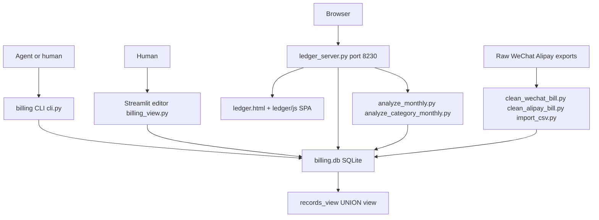
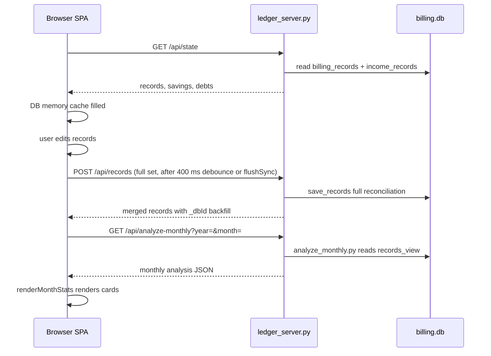

# Runtime Architecture

All four surfaces of `billing_analyze` converge on a single SQLite database, `scripts/data/billing.db`. There is no remote service and no shared daemon: the CLI runs one-shot processes, the Streamlit editor is a one-user local app, and the ledger web app is a local-only SPA whose HTTP bridge is the only long-running process.

*All four surfaces read and write one SQLite store; analysis scripts always read the `records_view` view.*

## Surface roles and entrypoints

- **billing CLI** — `scripts/billing/cli.py` dispatches to `analyze_*.py` and `save_*.py` modules. Every analysis module exposes `_run_analysis(db_path, start_date, end_date) -> dict` and a convenience wrapper `analyze_*` that uses the canonical `DB_PATH` from `common.py`. Documented in [billing-cli/overview.md](/openwiki/billing-cli/overview.md).
- **Streamlit editor** — `scripts/billing/billing_view.py` connects directly to the DB with `sqlite3` + `sqlite-utils`; it is the human review/edit path. Documented in [ledger-app/streamlit-editor.md](/openwiki/ledger-app/streamlit-editor.md).
- **Ledger web app** — `scripts/ledger_server.py` (stdlib `ThreadingHTTPServer`) serves `ledger.html` and its assets over HTTP (so the SPA can use `fetch` without CORS problems) and exposes a JSON REST API. The SPA keeps an in-memory cache and syncs the whole record set to the server, which performs full reconciliation against the DB. Documented in [ledger-app/server.md](/openwiki/ledger-app/server.md) and [ledger-app/frontend.md](/openwiki/ledger-app/frontend.md).
- **Import pipeline** — WeChat/Alipay exports are cleaned into the standard 9-column CSV format and bulk-imported. Documented in [billing-cli/records-import.md](/openwiki/billing-cli/records-import.md).

## Ledger sync flow (the one cross-surface runtime loop)

The ledger SPA and the server exchange the complete record set; the server treats each `POST /api/records` as a reconciliation of the whole DB against the sent array (update existing `_dbId` rows, insert new ones, delete DB rows absent from the array).

*The SPA always sends the complete record set; the server reconciles rather than applying incremental diffs. Analyze endpoints reuse the CLI analysis scripts instead of duplicating logic.*

## Amount sign convention (critical invariant)

- **Physical tables** store `金额` as an absolute value (>= 0); the direction lives in the `类型` column (`支出` / `收入`).
- **`records_view`** flips the sign for query: expenses are negative, income positive (`CASE WHEN 类型 = '支出' THEN -金额 ELSE 金额 END`).
- All analysis modules therefore read `records_view` and treat `金额 < 0` as expenses and `金额 > 0` as income.
- **真实收入 (real income)** = total income − `转账收款` (transfer receipts), used throughout analyses to avoid counting internal transfers as income.

## Constraint ownership (canonical vs mirror)

The category/expense-type/platform option lists are canonicalized in `scripts/billing/common.py` (see [billing-cli/common-constraints.md](/openwiki/billing-cli/common-constraints.md)) and mirrored in the ledger SPA's `scripts/ledger/js/config.js`. The mirror is **not exact**: the JS side has extra subcategories (`酒水` under 餐饮, `加油`/`停车` under 交通) while Python has `电池` (交通), `保险` (医疗), `会员续费` (通讯). The Streamlit editor, CLI saves, and import pipeline all validate against the Python lists. See [ledger-app/frontend.md](/openwiki/ledger-app/frontend.md) for the full divergence table.

## DDL duplication invariant

The exact same `CREATE TABLE` / `CREATE VIEW` statements exist in **two** places and must be kept in sync:

1. `scripts/billing/init_db.py` (standalone initializer)
2. `scripts/ledger_server.py` `get_db()` (ensures tables exist at server startup and on every request)

Any schema change must be applied to both copies or the ledger bridge will silently diverge. See [architecture/data-model.md](/openwiki/architecture/data-model.md).
