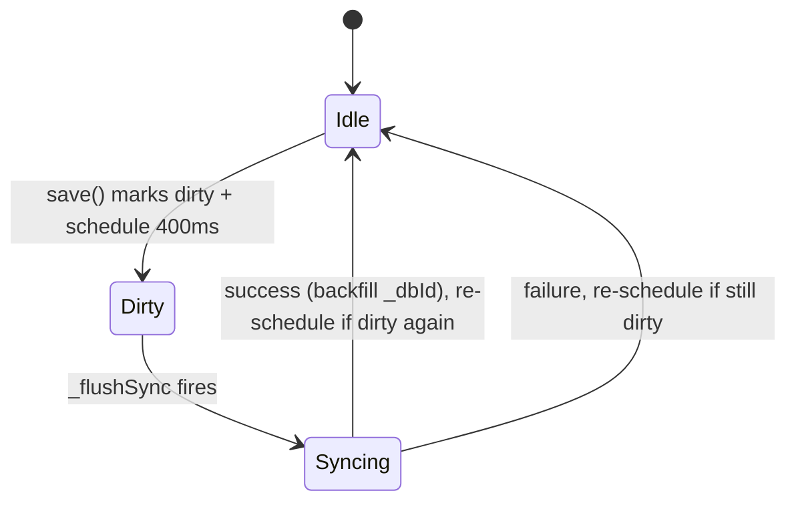

# Ledger Frontend — JS Modules and Sync Model

The SPA is plain JavaScript (no framework) loaded in a fixed order from `ledger.html` (see [ledger-app/overview.md](/openwiki/ledger-app/overview.md)). All state lives in a memory cache (`DB`) with asynchronous persistence to `ledger_server.py`.

## storage.js — data layer

- `SK` keys (`wb_ledger_records`, `wb_ledger_savings`, `wb_ledger_debts`, `wb_ledger_meta`) are **semantic only** — current code keeps everything in memory + backend, not localStorage (localStorage is only the offline fallback).
- `DB = { records: [], savings: [], debts: null, meta: null }` is the memory cache. Getters/setters keep the old interface: `getRecords/setRecords`, `getSavings/setSavings`, `getDebts/setDebts`, `getMeta/setMeta`.
- `save(key, val)` writes the cache, sets a dirty flag (`_dirtyRecords` or `_dirtySettings`), and calls `_scheduleSync()`.

### Sync state machine



- `_scheduleSync()`: `setTimeout(_flushSync, 400)` — coalesces rapid edits into one request.
- `flushSync()`: cancels any pending timer and syncs **now**; called after save/delete so the record lands in SQLite immediately.
- `_flushSync()`: guarded by `_syncing`; POSTs `DB.records` to `/api/records` and `{savings, debts}` to `/api/settings` (only the dirty ones), then backfills `DB.records` from the server response (this is how new rows learn their `_dbId`/`_src`). On failure it logs a warning and re-schedules if still dirty.
- `initFromServer()`: `GET /api/state` → fills `DB.records/savings/debts`. On failure: falls back to `localStorage` history for records, then demo data (`defaultRecords()`) if empty; demo fallback is never written back (controlled by `meta.demoLoaded`).

### Record field contract

```js
{ id: "<frontend uid>", _dbId: 123, _src: "bill"|"income", date: "YYYY-MM-DD",
  itemName: "...", category: "餐饮", subcategory: "外卖", direction: "支出"|"收入",
  expenseType: "弹性支出"|"", platform: "微信", amount: 32, note: "...", demo: false }
```

- `id` is generated by `rid()` = `Date.now().toString(36) + random` — used for SPA-level identity (delete buttons).
- `_dbId`/`_src` are **server-backfilled**; new records must not set them (see [ledger-app/server.md](/openwiki/ledger-app/server.md)).
- `demo: true` marks the offline fallback demo records; `clearDemoData()` filters them out.
- Helpers: `isExpense(r)` = `direction === "支出"`, `isIncome(r)`, `fmtMoney(n)`, `isInMonth(dateStr, y, m)`, `todayStr()`.

## config.js — static configuration

Mirrors `common.py` option lists (see [billing-cli/common-constraints.md](/openwiki/billing-cli/common-constraints.md)) plus per-category `CATS` colors/SVG icons and generic `ICON` icons. Divergences from the Python canonical lists:

| 大类 | Python `common.py` only | JS `config.js` only |
|------|------------------------|---------------------|
| 餐饮 | — | 酒水 |
| 交通 | 电池 | 加油, 停车 |
| 医疗 | 保险 | — |
| 通讯 | 会员续费 | — |

Implication: the SPA offers values (e.g. 酒水, 加油) that CLI validation rejects. If the constraint sets are ever unified, both files must change together.

## ui.js — UI primitives

- `switchPage(name)` — toggles `.page`/`.nav-item` active classes, closes the drawer sidebar, scrolls to top.
- Drawer sidebar: `openSidebar()` / `closeSidebar()` / `toggleSidebar()` add/remove the `.open` class on `#sidebar` and the `.show` class on `#drawerOverlay`; the top-bar hamburger button and the nav items drive them.
- `toast(msg)`, `showModal(title, text, iconHTML, onConfirm)` / `closeModal()` with a single `modalCallback`.
- `exportJSON()` — downloads `{exportedAt, records, savings, debts}` as `打工人小账本_YYYYMMDD.json`; `importJSON(file)` — reads the same shape back into the cache and `flushSync()`.
- `clearDemoData()` — removes `demo: true` records (modal-confirmed); `clearAllData()` — empties cache and syncs an empty state (modal-confirmed).
- `renderToolbar()` — sidebar export/import/clear-demo buttons.

## record.js — add/delete record business logic

- `initAddForm()` wires the 记一笔 form: direction toggle (`_addDir`), category → subcategory cascading selects (`refreshCategoryOptions` / `refreshSubcategoryOptions`), expense-type row hidden for income, default date = today.
- `addRecord()` validates amount > 0 / date / category, builds a record (`itemName` falls back to subcategory or category), `unshift`s it, `setRecords` + `flushSync()` (immediate persistence), toasts, clears the form, `renderAll()`.
- `deleteRecord(id)` filters the array, `setRecords` + `flushSync()` — the server reconciles the deletion (the row disappears from SQLite on the next full-set POST).

## render-home.js — home page

- `renderMonthStats(y, m)` fetches `loadMonthAnalysis(y, m)`; on success renders four stat cards — 本月收入 (with 真实收入 sub), 总支出 (sub = "固定 / 必要 / 弹性" three-tier split), 弹性支出 (sub = 负担率), 本月结余 (sub = evaluation). The old separate "支出结构（数据库）" grid was folded into the 总支出 card and removed. On failure or missing month data it falls back to `renderMonthStatsLocal(y, m)` computed from local records (labeled "本地数据"), which renders the same four-card layout from `expenseType`-based tiers.
- `renderCategoryAnalysis(y, m)` fetches `loadCategoryAnalysis(y, m)` and renders the monthly category/subcategory breakdown with expand/collapse rows.
- `renderRecentRecords()` shows the newest 4 records.
- Calendar month navigation (`calPrevMonth`/`calNextMonth` in render-calendar.js) re-triggers `renderMonthStats(calYear, calMonth)` so the overview follows the calendar.

## render-ledger.js / render-calendar.js / render-assets.js

- `renderLedger()` → `renderAllRecords()` — renders the full record list as a **sortable, filterable table** (columns: 日期 / 名称 / 收支 / 大类 / 细类 / 消费类型 / 金额 / 支付平台 / 备注 / delete). State lives in `_ledgerFilter` (keyword, dir, category, expenseType, platform, dateFrom, dateTo, sortBy, sortDir). `renderLedgerToolbar()` draws a keyword search box, four filter dropdowns (收/支, 大类, 消费类型, 支付平台), a date-range filter (起—至), and a clear button. `filterLedger(key,value)` mutates state and re-renders; `toggleSort(col)` sorts by date (default desc) or amount with asc/desc caret indicators; the count badge shows `筛选后 / 总数 条`.
- Calendar (`render-calendar.js`): draws the month grid with per-day expense/income sums (`dayStats`), highlights today and the selected day; clicking a day renders `renderDayDetail(dateStr)` with income/expense/balance totals and per-record rows (`recRowHtml`).
- Assets (`render-assets.js`): `renderAssets()` renders 净资产概览 (total balances, remaining debts, already-paid, net assets), 余额管理 list, and 欠款管理 list (type-colored badge, overdue badge when `dueDate < today`, paid-off badge when `remaining <= 0`, repayment progress bar); CRUD functions `addBalance`/`addDebt`/`deleteBalance`/`deleteDebt` mutate `getDebts()` and `flushSync()`; `repayDebt(id)` prompts for a repayment amount and decrements `remaining`; `editBalance(id)`/`editDebt(id)` open an edit modal to modify all fields of an existing record; `initAssetsForm()` fills the platform select and binds buttons.

## main.js — entrypoint

```js
init() → initFromServer() → meta.firstOpen = false → (demo fallback if not loaded)
      → bindEvents() → renderToolbar() → renderCalendar() → renderAll()
```

`renderAll()` = `renderHome() + renderLedger() + renderAssets() + drawCalendar()`, so every data mutation re-renders the whole app.

## Related pages

- [ledger-app/server.md](/openwiki/ledger-app/server.md) — the endpoints storage.js talks to
- [ledger-app/overview.md](/openwiki/ledger-app/overview.md) — module load order and pages
- [billing-cli/common-constraints.md](/openwiki/billing-cli/common-constraints.md) — the Python canonical lists that config.js mirrors
