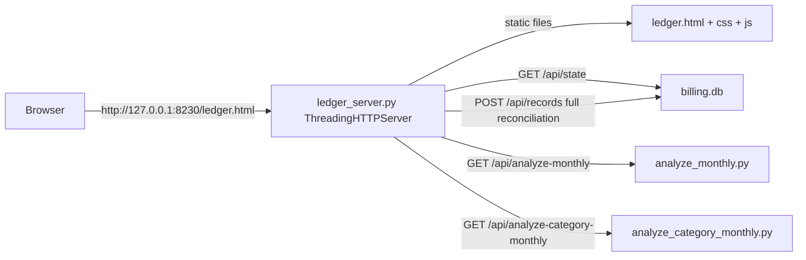

# Ledger Web App — Overview

The ledger app ("打工人小账本", "Worker's Little Ledger") is a **local-only SPA + SQLite bridge**. It is the human-friendly way to add, browse, and delete records and manage balances/debts — the counterpart to the CLI for non-agent users.



*One Python stdlib server does double duty: static file hosting (so `fetch` works) and a JSON REST bridge to the SQLite database.*

## Why HTTP and not file://

`ledger.html` uses `fetch` to talk to the bridge. Opening the file directly with `file://` blocks those requests under the browser CORS policy, so the app **must** be served by `ledger_server.py`. Start it from the `scripts/` directory:

```bash
python ledger_server.py [--port 8230]
```

Then open `http://127.0.0.1:8230/ledger.html`. On startup the server ensures the tables and `records_view` exist (re-executing the DDL from [architecture/data-model.md](/openwiki/architecture/data-model.md)) and prints the DB path, settings path, and URL.

## Pages

| Page | Section id | Contents |
|------|-----------|----------|
| 首页 (home) | `#page-home` | 收支日历 (income/expense calendar with per-day drill-down), 本月概览 (4 stat cards fed by the analyze API: 本月收入 / 总支出 / 弹性支出 / 本月结余; the 总支出 card shows the 固定/必要/弹性 three-tier split), 消费大类/细类明细 (category analysis), 最近记录 (recent 4 records) |
| 记账 (ledger) | `#page-ledger` | "记一笔" quick-add form (direction toggle, amount, date, name, cascading category/subcategory, expense type for expenses only, platform, note) + 全部记录 **filterable/sortable table** (keyword search, 收/支 / 大类 / 消费类型 / 支付平台 dropdowns, date-range filter, click-to-sort date/amount) |
| 资产负债 (assets) | `#page-assets` | 净资产概览 (total balances, remaining debts, already-paid, net assets), 余额管理 (balance accounts CRUD with inline edit), 欠款管理 (debts CRUD with type/due date, overdue badge, repayment progress bar, repay button, inline edit) |

The navigation is a **drawer sidebar** (抽屉式): a top app bar with a hamburger button slides the sidebar in from the left over a dimmed overlay; clicking the overlay, a nav item, or the toggle again closes it. There is no mobile-specific nav (the old mobile top bar and bottom tabs were removed). `switchPage(name)` closes the drawer after switching.

## JS module load order (fixed)

`ledger.html` loads the scripts in dependency order — do not reorder:

```
storage.js → config.js → ui.js → record.js → render-home.js → render-ledger.js
→ render-calendar.js → render-assets.js → main.js
```

| Layer | Module | Responsibility |
|-------|--------|----------------|
| Data | `storage.js` | In-memory `DB` cache, default data, debounced backend sync, record utilities |
| Config | `config.js` | Category/expense-type/platform option lists + SVG icons (mirror of `common.py`) |
| UI base | `ui.js` | Page switching, toast, modal, JSON export/import, clear-demo/clear-all, toolbar |
| Business | `record.js` | Add-record form init, direction switch, cascading selects, save/delete record |
| Render | `render-*.js` | Home, ledger list, calendar, assets (balances/debts) rendering |
| Entry | `main.js` | `init()` → `initFromServer()` → `bindEvents()` → `renderToolbar()` → `renderAll()` |

## Data flow at a glance

- **Load**: `main.js` calls `initFromServer()` → `GET /api/state` → fills `DB.records`, `DB.savings`, `DB.debts`; on failure falls back to localStorage history or demo data (demo data is never written back to the server).
- **Write**: `setRecords()` / `setDebts()` mutate the memory cache, mark dirty flags, and schedule a 400 ms debounced sync; `flushSync()` forces immediate sync (used after save/delete). The server reconciles the full record set (see [ledger-app/server.md](/openwiki/ledger-app/server.md)).
- **Analysis**: the home page calls `GET /api/analyze-monthly` and `GET /api/analyze-category-monthly` for the currently viewed calendar month and renders the returned JSON; if those calls fail, `renderMonthStatsLocal()` falls back to computing month stats from the local records cache.

## GUIDE.md vs current code

`scripts/ledger/GUIDE.md` is a dev guide that predates recent changes. Verified differences:

- GUIDE.md describes only two pages (首页, 记账页) and lists modules `storage, config, ui, record, render-home, render-ledger, main`; the current app has a third page 资产负债 (`render-assets.js`) plus `render-calendar.js`, and the load order includes both.
- GUIDE.md documents a free-fund ring (`renderFundRing`), savings chart (`renderSavingsChartMini`), "今天要处理" reminders, and `defaultFund`/`defaultBudget` data structures. **None of these exist in the current code** — fund/budget were fully removed (both backend `load_settings`/`save_settings` and frontend `defaultFund`/`defaultBudget`/`getFund`/`getBudget`); `ledger_settings.json` no longer contains `fund`/`budget` keys.
- GUIDE.md's five "core data structures" (fund, budget, records, savings, meta) reduce to records, savings, debts, meta in current code.

Treat GUIDE.md as historical context; the wiki pages [ledger-app/server.md](/openwiki/ledger-app/server.md) and [ledger-app/frontend.md](/openwiki/ledger-app/frontend.md) describe the code as it is.
