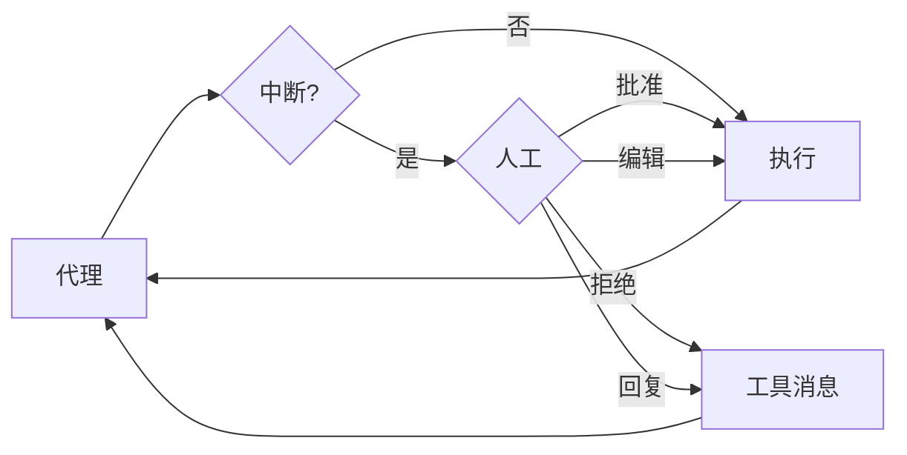

# 人机协同深度索引

> 这是 Deep Agents 人机协同系统的**概念地图**，涵盖中断配置、决策类型、多工具批量审批、子代理中断以及最佳实践。  
> 阅读本文档可一次性掌握人机协同的全部概念及其与全局框架的关联，为敏感操作构建安全闸门。

---

## 概念全景

某些工具操作可能很敏感，需要在执行前获得人工批准。Deep Agents 通过 LangGraph 的中断功能支持人机协同工作流。你可以使用 `interrupt_on` 参数配置哪些工具需要审批。



---

## 1. 基本配置

`interrupt_on` 接受一个字典，将工具名称映射到中断配置。每个工具的配置可为：

- **`True`**：使用默认行为启用中断（允许批准、编辑、拒绝、回复）
- **`False`**：禁用中断
- **`{"allowed_decisions": [...]}`**：自定义允许的决策列表

**配置示例**：
```python
agent = create_deep_agent(
    model="...",
    tools=[remove_file, fetch_file, notify_email],
    interrupt_on={
        "remove_file": True,                                    # 全部决策
        "fetch_file": False,                                    # 无中断
        "notify_email": {"allowed_decisions": ["approve", "reject"]},  # 不允许编辑
    },
    checkpointer=checkpointer,  # 必需！
)
```

### 关键约束
- **必须提供 `checkpointer`**：人机协同依赖检查点器在中断与恢复之间持久化状态。
- 恢复执行时必须使用**相同的 `thread_id`**。

---

## 2. 决策类型

`allowed_decisions` 控制人工可执行的操作：

| 决策 | 行为 |
|------|------|
| `"approve"` | 使用原始参数执行工具 |
| `"edit"` | 在执行前修改工具参数 |
| `"reject"` | 完全跳过此工具调用 |
| `"respond"` | 将人工消息直接作为工具结果返回，跳过执行（用于“询问用户”式工具） |

**按风险级别定制**：
```python
interrupt_on = {
    "delete_file": {"allowed_decisions": ["approve", "edit", "reject"]},  # 高风险：完全控制
    "write_file":  {"allowed_decisions": ["approve", "reject"]},          # 中风险：禁止编辑
    "critical_op": {"allowed_decisions": ["approve"]},                    # 必须批准
}
```

---

## 3. 处理中断

当中断触发时，代理暂停并返回控制权。开发者需检查中断、展示待审批操作，并收集决策后恢复。

**标准流程**：
1. 调用代理并检查 `result.interrupts`
2. 提取 `action_requests` 和 `review_configs`
3. 按顺序为每个 `action_request` 创建决策（类型可为 `approve`、`edit`、`reject`）
4. 通过 `Command(resume={"decisions": decisions})` 恢复执行，必须使用相同 `config`

### 编辑工具参数
当 `"edit"` 可用时，可在决策中提供修改后的参数：
```python
decisions = [{
    "type": "edit",
    "edited_action": {
        "name": action_request["name"],  # 必须包含工具名称
        "args": {"to": "team@company.com", ...}
    }
}]
```

---

## 4. 多个工具调用批量处理

当代理一次调用多个需要审批的工具时，所有中断会批量合并到**单个中断**中。开发者必须按 `action_requests` 的顺序为每个工具提供对应的决策。

```python
# 两个工具触发中断 → action_requests 长度为 2
decisions = [
    {"type": "approve"},  # 对应第一个工具
    {"type": "reject"}    # 对应第二个工具
]
```

---

## 5. 子代理中断

### 工具调用上的中断
每个子代理可拥有独立的 `interrupt_on` 配置，该配置会**覆盖**主代理的对应设置。处理方式与主代理完全一致：检查 `result.interrupts`，用 `Command` 恢复。

### 工具调用内部的中断
子代理工具可直接调用 `interrupt()` 原语暂停执行并等待人工响应，适用于动态审批场景（如“请求批准部署”）。该函数返回 `Command(resume=...)` 传入的值。

**关联提示**：子代理中断结合 `interrupt()` 可实现复杂的交互式工作流，尤其是在异步子代理中配合 `update_async_task` 进行中途干预。

---

## 6. 最佳实践速查

| 维度 | 实践 |
|------|------|
| **检查点器** | 始终提供 `checkpointer`（如 `MemorySaver`），否则中断无法恢复。 |
| **线程一致性** | 恢复时必须使用与首次调用相同的 `config`（相同 `thread_id`）。 |
| **决策顺序** | 决策列表必须与 `action_requests` 的顺序严格匹配。 |
| **风险定制** | 高风险（删除、发送邮件）→ 允许多种决策；低风险（只读）→ 设为 `False`。 |
| **子代理覆盖** | 利用子代理的 `interrupt_on` 为不同委派任务设置不同的审批策略。 |

---

## 与全局概念的关联

- **[上下文工程](index/langchain-index/deepagent/concepts/context_engineering.md)**：人机协同是上下文管理在安全维度的延伸，通过中断机制实现对工具调用的动态干预。
- **[子代理](index/langchain-index/deepagent/concepts/subagent.md)**：子代理可独立配置中断，为委派任务设置专属安全闸门；异步子代理支持中途更新，与人机协同形成交互式工作流。
- **[框架配置文件](profile.md)**：可通过 `HarnessProfile` 为特定模型或提供商批量设置 `interrupt_on` 默认值。
- **[后端](index/langchain-index/deepagent/concepts/backends.md)**：对 `FilesystemBackend` 和 `LocalShellBackend` 等高风险后端，强烈建议启用中断审查破坏性操作（如 `write_file`、`execute`）。
- **检查点器与状态**：中断依赖 LangGraph 的检查点机制，与持久化状态和 `StateBackend` 共享底层基础设施。

## 链接原文

当本索引中的概要无法满足你（例如需要完整代码实现、方法签名、罕见配置示例）时，请通过以下方式从原始文档中获取精确信息。

### 语义检索（聚焦查询）

原始文档已按 `#` 级别标题切分并向量化。构造查询时，**使用当前索引章节的标题或段落内出现的关键概念、特殊术语作为锚点**，而不是全文反复出现的通用词。有效的查询往往短而具体。

例如，当你在本索引的“子代理中断”一节需要更多细节时：

- **好的查询**：`子代理中断 interrupt_on 覆盖`、`interrupt() 原语 动态审批`、`allowed_decisions 编辑 edited_action`
- **差的查询**：`如何使用中断`（整个文档都在讲中断，无法聚焦）

将标题词和段落内的特有术语组合，可以快速锁定目标段落。

### 利用索引页提升检索精度

如果单靠关键术语检索结果仍不够集中，从本索引中提取**所在章节的标题**或**当前段落的特有表述**作为附加上下文，与你的问题组合成更完整的查询。索引页的标题本身就是高质量的语义锚点。例如：

- 想了解“批量处理多个工具调用”的决策顺序，用 `多个工具调用批量处理 决策顺序 action_requests` 组合查询。
- 想了解“在子代理工具内部调用 interrupt()”的用法，用 `子代理中断 interrupt() 原语 Command resume` 组合查询。
- 想查询“编辑工具参数”的完整示例，用 `处理中断 编辑 edited_action` 定位到 `edited_action` 使用细节。

### 标题路径兜底

语义检索返回的每个片段都携带其**原文标题和文件路径**。若需读取该章节的完整内容或进入相邻段落，可直接用返回结果中的标题坐标通过 `read_file` 精确定位——标题始终精确，因为它来自原文本身。