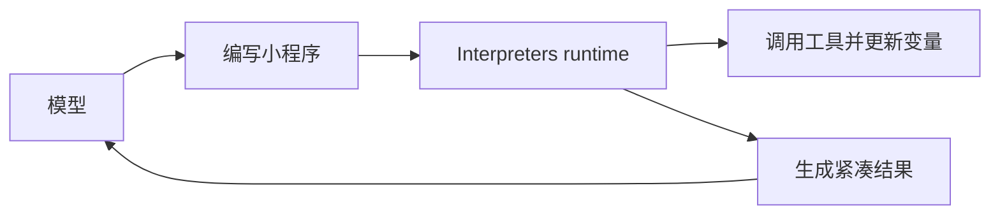

# Interpreters 深度索引

> 这是 Deep Agents Interpreters 系统的**概念地图**，涵盖轻量级代码执行、编程式工具调用、递归语言模型、状态快照与时间旅行、安全限制及与沙箱的对比。  
> 阅读本文档可一次性掌握 Interpreters 在 agent 循环内的角色、能力边界和典型应用模式。

---

## 概念全景

Interpreters 为 agent 提供一个**内存中的可编程工作区**，基于 QuickJS 运行 TypeScript/JavaScript。agent 编写小型程序来表达多步逻辑，runtime 执行代码并仅将相关结果返回模型，从而将中间状态、复杂控制流和工具编排保留在上下文之外。



### Interpreters vs 沙箱 vs 常规工具调用

| 需求 | 使用方案 |
|------|---------|
| 简单、一两个外部调用 | 常规工具调用 |
| 循环、分支、重试、聚合多步结果 | Interpreters |
| 需要从代码协调多个工具或子 agent | 编程式工具调用 (PTC) + Interpreters |
| 可复用的确定性辅助函数 | Interpreters 技能 |
| Shell 命令、包安装、测试、完整操作系统访问 | 沙箱后端 |

---

## 1. 何时使用 Interpreters

当 agent 需要以下能力时，Interpreters 比逐个工具调用更高效：

* **组合多个工具**：用代码实现循环、分支、重试、并发（`Promise.all`），在一次 eval 中完成。
* **协调子 agent**：调用 `task` 工具并行研究多个主题，在代码中拼接结果。
* **保留中间状态**：变量存于 runtime，避免每次临时结果都发回模型上下文。
* **确定性数据转换**：排序、分组、解析、验证、评分、聚合——由代码完成，不消耗模型推理。
* **探索大变量空间**：仅将选定的证据、摘要或错误返回模型，而不是整个数据集。

---

## 2. 基本用法与配置

### 添加 Interpreters
安装 `langchain-quickjs`，并在创建 agent 时添加 `CodeInterpreterMiddleware`：

```python
from deepagents import create_deep_agent
from langchain_quickjs import CodeInterpreterMiddleware

agent = create_deep_agent(
    model="openai:gpt-5.4",
    middleware=[CodeInterpreterMiddleware()],
)
```

中间件向 agent 暴露一个 `eval` 工具（名称可自定义）。agent 用 TypeScript 编写代码，捕获 `console.log`，返回最后一个表达式的值。

### 核心中间件参数

| 参数 | 默认值 | 作用 |
|------|--------|------|
| `memory_limit` | 64 MB | QuickJS 堆内存限制 |
| `timeout` | 5.0 秒 | 每次 eval 超时 |
| `max_ptc_calls` | 256 | 每次 eval 的 PTC 调用上限 |
| `max_result_chars` | 4000 | 返回结果和 stdout 的最大字符数 |
| `capture_console` | True | 是否捕获 console 输出 |
| `snapshot_between_turns` | True | 跨回合持久化 Interpreters 状态快照 |

---

## 3. 编程式工具调用 (PTC)

PTC 将选定的 agent 工具暴露为 Interpreters 内部的 `tools` 对象上的异步函数。agent 可以在代码中循环、并行或条件调用这些工具，仅在最终返回模型前处理结果。

### 启用 PTC
通过 `ptc` 允许列表指定哪些工具可被调用：

```python
agent = create_deep_agent(
    model="openai:gpt-5.4",
    middleware=[CodeInterpreterMiddleware(ptc=["task", "web_search"])],
)
```

工具名称转为驼峰命名法（如 `web_search` → `tools.webSearch(...)`），参数遵循工具原始 schema。

### 典型模式

| 模式 | 实现方式 |
|------|---------|
| 批处理 | 循环处理输入并调用工具 |
| 并行工作 | `Promise.all` 发起独立调用 |
| 条件逻辑 | 根据早期结果选择下一调用 |
| 提前终止 | 满足条件时停止调用 |
| 数据过滤 | 仅返回相关行、错误或摘要 |
| 递归编排 | 多次调用 `task`，在代码中组合子 agent 结果 |

### 示例：并行子 agent 研究

```javascript
const topics = ["检索", "记忆", "评估"];
const reports = await Promise.all(
  topics.map((topic) =>
    tools.task({
      description: `研究 Deep Agents 中的 ${topic} 并返回三个简明发现。`,
      subagent_type: "general-purpose",
    }),
  ),
);
reports.join("\n\n");
```

**重要限制**：PTC 调用绕过常规工具调用路径，因此 `interrupt_on` 人机协同审批不会对每个 PTC 调用触发。需要人工审批的场景应避免通过 PTC 调用敏感工具。

---

## 4. 递归语言模型

递归语言模型将 Interpreters 作为分解工作区。模型将大型输入或工作集保存在 runtime 变量中，编写代码拆分、检查，对较小片段调用子 agent 或工具，然后在代码中拼接结果。变量空间与模型上下文分离，只有最终综合结果返回主对话。

典型流程：过滤候选 → 并行调用子 agent 分析 → 组合报告 → 返回单一合成结果。

---

## 5. Interpreters 技能

Interpreters 技能是向 runtime 暴露代码模块的技能（通过 `SKILL.md` 的 `module` 字段）。agent 可在代码中通过 `await import("@/skills/<name>")` 导入确定性辅助函数，用于排序、分组、评分、验证等。配置时需将 `skills_backend` 传递给 `CodeInterpreterMiddleware`。

详见技能深度索引中“解释器技能”部分。

---

## 6. 快照与时间旅行

默认情况下，`CodeInterpreterMiddleware` 在每次 agent 运行后对 Interpreters 状态进行快照（序列化全局变量、变量等），并在下一次运行前恢复。这实现：

- **跨回合持久化**：agent 在对话回合间保持先前定义的变量和计算结果。
- **单次运行内连续**：同一运行中的多个 `eval` 调用共享实时上下文，中间不进行快照。
- **时间旅行**：结合 LangGraph 检查点器，恢复旧检查点可回滚 Interpreters 状态，用于调试。

**序列化限制**：函数、类等不可序列化值会恢复为不可访问的工件，访问时将报错。快照仅保留 Interpreters 内存状态，不撤销已执行的工具副作用。

通过 `snapshot_between_turns=False` 可禁用跨回合快照。

---

## 7. 安全与限制

Interpreters 运行在嵌入式 QuickJS 上下文中（非单独进程），提供**能力作用域限制**而非硬件级隔离。

| 能力 | 默认可用 | 暴露方式 |
|------|---------|---------|
| JavaScript 执行 | ✅ | 添加中间件 |
| console 捕获 | ✅ | `capture_console=True` |
| agent 工具 | ❌ | PTC 允许列表 |
| Interpreters 技能 | ❌ | 配置 `skills_backend` |
| 文件系统 | ❌ | 通过 PTC 暴露文件系统工具 |
| 网络 | ❌ | 通过 PTC 暴露网络工具 |
| 时间/日期 | ❌ | 暴露时间工具 |
| Shell、包安装 | ❌ | 使用沙箱后端 |

**安全原则**：
- 将 PTC 允许列表视为权限边界，仅暴露必要的工具。
- 对于不受信任的代码，在隔离工作进程或容器中运行 agent。
- 不将 Interpreters 当作沙箱替代品——需要完整操作系统级隔离时使用沙箱后端。

---

## 与全局概念的关联

- **[沙箱](sandboxs.md)**：Interpreters 提供轻量级、内存中的代码执行，沙箱提供完整的隔离环境与 Shell；两者互补，按需选择。
- **技能**：Interpreters 技能将可复用代码模块注入 runtime，是代码执行与技能系统的交汇点。
- **[上下文工程](index/langchain-index/deepagent/concepts/context_engineering.md)**：Interpreters 通过将中间状态排除在模型上下文外、仅返回紧凑结果，天然实现了上下文压缩。
- **[子代理](index/langchain-index/deepagent/concepts/subagent.md)**：PTC 可调用 `task` 工具并行协调子代理，是复杂多步委派的实现基础。
- **[人机协同](index/langchain-index/deepagent/concepts/Human-in-the-loop.md)**：注意 PTC 调用不触发 `interrupt_on`，需要审批的敏感操作应通过常规工具调用路径执行。
- **[后端](index/langchain-index/deepagent/concepts/backends.md)**：Interpreters 自身不依赖后端，但 PTC 工具和后端交互时，后端的权限与路由依然生效。

## 链接原文

当本索引中的概要无法满足你（例如需要完整代码实现、方法签名、罕见配置示例）时，请通过以下方式从原始文档中获取精确信息。

### 语义检索（聚焦查询）

原始文档已按 `#` 级别标题切分并向量化。构造查询时，**使用当前索引章节的标题或段落内出现的关键概念、特殊术语作为锚点**，而不是全文反复出现的通用词。有效的查询往往短而具体。

例如，当你在本索引的“编程式工具调用 (PTC)”一节需要更多细节时：

- **好的查询**：`PTC 允许列表 ptc 参数`、`并行 Promise.all 子代理 task`、`max_ptc_calls 调用上限`
- **差的查询**：`如何使用 Interpreters`（整个文档都在讲 Interpreters，无法聚焦）

将标题词和段落内的特有术语组合，可以快速锁定目标段落。

### 利用索引页提升检索精度

如果单靠关键术语检索结果仍不够集中，从本索引中提取**所在章节的标题**或**当前段落的特有表述**作为附加上下文，与你的问题组合成更完整的查询。索引页的标题本身就是高质量的语义锚点。例如：

- 想了解“跨回合持久化快照”的序列化限制，用 `快照与时间旅行 序列化限制 不可序列化值` 组合查询。
- 想了解“递归语言模型”如何将大输入保存在变量中，用 `递归语言模型 分解工作区 变量空间` 定位到具体模式。
- 想查询“安全限制”中 PTC 不触发的具体机制，用 `安全限制 PTC 绕过 interrupt_on` 找到警告说明。

### 标题路径兜底

语义检索返回的每个片段都携带其**原文标题和文件路径**。若需读取该章节的完整内容或进入相邻段落，可直接用返回结果中的标题坐标通过 `read_file` 精确定位——标题始终精确，因为它来自原文本身。