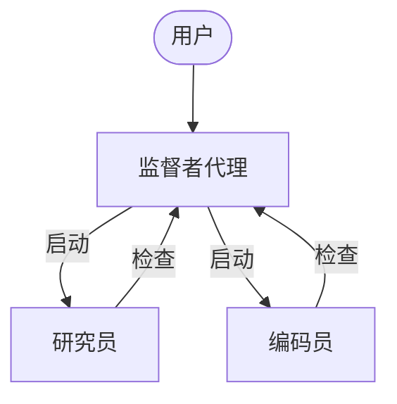
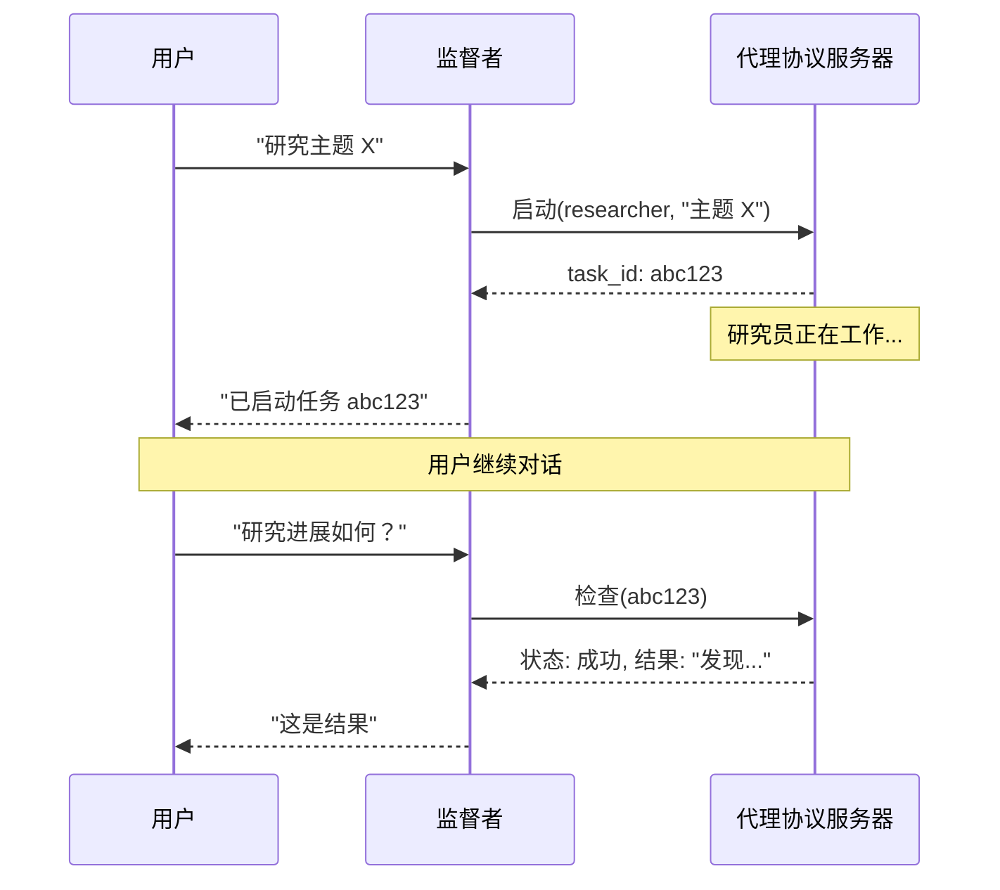

# 异步子代理深度索引

> 这是 Deep Agents 异步子代理系统的**概念地图**，涵盖后台任务启动、并发控制、状态管理、传输与部署拓扑以及全生命周期工具。  
> 阅读本文档可一次性掌握异步委派领域的全部概念及其与全局框架的关联，为长时间运行、可中断、可交互的任务提供完整参考。

---
## 概念全景

异步子代理允许监督者代理启动后台任务，立即返回任务 ID 并继续与用户交互，同时子代理并发工作。监督者可随时检查进度、发送后续指令或取消任务。它建立在同步子代理的基础上，为长时间运行或需要中途引导的任务提供非阻塞执行模型。



### 同步 vs 异步子代理

| 维度 | 同步子代理 | 异步子代理 |
|------|-----------|-----------|
| **执行模型** | 监督者阻塞直到子代理完成 | 立即返回任务 ID；监督者继续执行 |
| **并发性** | 并行但阻塞 | 并行且非阻塞 |
| **任务中途更新** | 不可能 | 通过 `update_async_task` 发送后续指令 |
| **取消** | 不可能 | 通过 `cancel_async_task` 取消正在运行的任务 |
| **状态性** | 无状态——调用之间没有持久状态 | 有状态——在跨交互的自身线程上维护状态 |
| **最适合** | 代理需要立即等待结果的任务 | 在对话中以交互方式管理的长时间运行、复杂任务 |

---

## 1. 配置异步子代理

异步子代理通过 `AsyncSubAgent` 规范列表定义，每个规范指向一个实现代理协议的服务器（通常为 LangGraph 部署）。

### 核心配置字段

| 字段 | 类型 | 描述 |
|------|------|------|
| `name` | `str` | 必需。唯一标识符，监督者启动任务时使用。 |
| `description` | `str` | 必需。具体且面向操作，决定监督者何时委派。 |
| `graph_id` | `str` | 必需。代理协议服务器上的图 ID（或助手 ID），需与 `langgraph.json` 中注册的图匹配。 |
| `url` | `str` | 可选。省略则使用 **ASGI 传输**（进程内共同部署）；提供则使用 **HTTP 传输** 连接远程服务器。 |
| `headers` | `dict[str, str]` | 可选。用于远程请求的自定义标头，适用于自托管服务器的身份验证。 |

### 配置示例

```python
from deepagents import AsyncSubAgent, create_deep_agent

async_subagents = [
    AsyncSubAgent(
        name="researcher",
        description="用于信息收集和综合的研究代理",
        graph_id="researcher",
        # 无 url → ASGI 传输（共同部署）
    ),
    AsyncSubAgent(
        name="coder",
        description="用于代码生成和审查的编码代理",
        graph_id="coder",
        # url="https://coder-deployment.langsmith.dev"  # 可选：HTTP 远程
    ),
]

agent = create_deep_agent(
    model="google_genai:gemini-3.1-pro-preview",
    subagents=async_subagents,
)
```

### 共同部署注册

使用 ASGI 传输时，所有相关图需在同一 `langgraph.json` 中注册：

```json
{
  "graphs": {
    "supervisor": "./src/supervisor.py:graph",
    "researcher": "./src/researcher.py:graph",
    "coder": "./src/coder.py:graph"
  }
}
```

---

## 2. 工具与生命周期

`AsyncSubAgentMiddleware` 为监督者提供五款工具，构成完整的异步任务管理生命周期：

| 工具 | 用途 | 返回值 |
|------|------|--------|
| `start_async_task` | 启动新的后台任务 | 任务 ID（立即返回） |
| `check_async_task` | 获取任务的当前状态和结果 | 状态 + 结果（如果完成） |
| `update_async_task` | 向正在运行的任务发送新指令 | 确认 + 更新后的状态 |
| `cancel_async_task` | 停止正在运行的任务 | 确认 |
| `list_async_tasks` | 列出所有跟踪的任务及其实时状态 | 所有任务的摘要 |

### 生命周期序列



- **启动**：在服务器创建新线程，以任务描述作为输入开始运行，返回线程 ID 作为任务 ID。监督者不轮询。
- **检查**：获取当前运行状态。成功时提取最终输出，仍在运行则报告进度。
- **更新**：使用中断多任务策略在同一线程上创建新运行，子代理用完整对话历史加新指令重启，任务 ID 不变。
- **取消**：调用 `runs.cancel()` 并标记任务为 `"cancelled"`。
- **列表**：遍历所有跟踪任务，对非终止状态的任务并行获取实时状态，终止状态从缓存返回。

---

## 3. 状态管理

任务元数据存储在监督者图的专用状态通道 `async_tasks` 中，与消息历史分离。此举至关重要：深度代理在上下文窗口填满时会压缩消息历史，若任务 ID 仅存于工具消息中将被丢失。专用通道确保监督者始终能通过 `list_async_tasks` 回忆所有任务。

每个被跟踪任务记录：任务 ID、代理名称、线程 ID、运行 ID、状态及时间戳（`created_at`、`last_checked_at`、`last_updated_at`）。

---

## 4. 传输与部署拓扑

### ASGI 传输（共同部署）
- 省略 `url` 时使用，SDK 调用通过进程内函数调用路由，零网络延迟，无需额外认证。
- 要求所有图在同一 `langgraph.json` 中注册。每个子代理仍以单独线程运行。
- **推荐默认方式**。

### HTTP 传输（远程）
- 指定 `url` 后，SDK 调用通过网络发送到远程代理协议服务器。
- 身份验证由 LangGraph SDK 使用 `LANGSMITH_API_KEY` 或 `LANGGRAPH_API_KEY` 处理；自托管服务器可能使用不同机制。
- 适用于需要独立扩展、不同资源配置或团队分离的场景。

### 部署拓扑选择

| 拓扑 | 构成 | 适用场景 |
|------|------|---------|
| **单一部署** | 所有代理通过 ASGI 共同部署 | 起步推荐，管理简单，零延迟 |
| **拆分部署** | 监督者在一个服务器，子代理通过 HTTP 在另一服务器 | 不同计算配置或独立扩展需求 |
| **混合部署** | 部分子代理 ASGI 共同部署，部分 HTTP 远程 | 兼顾本地性能与远程弹性 |

---

## 5. 最佳实践速查

| 维度 | 实践 |
|------|------|
| **工作进程池** | 使用 `langgraph dev --n-jobs-per-worker 10` 增加槽位，防止并发任务排队。活动运行数 = 1 监督者 + N 个子代理，至少分配 N+1 个槽位。 |
| **子代理描述** | 具体且面向操作：✅ “使用网络搜索进行深入研究…” / ❌ “帮忙处理事务” |
| **线程 ID 跟踪** | 异步子代理运行是标准 LangGraph 运行，在 LangSmith 中完全可见。通过线程 ID（任务 ID）将监督者的编排跟踪与子代理的执行跟踪关联。 |
| **防止立即轮询** | 中间件已注入规则，若仍发生，在监督者系统提示中强化：“启动异步子代理后，始终将控制权交还给用户。绝不要在启动后立即调用 check_async_task。” |
| **保持状态最新** | 对话历史中的状态始终是过时的；在报告状态前务必调用 `check` 或 `list`。 |

---

## 6. 故障排除

| 问题 | 原因 | 解决方案 |
|------|------|---------|
| 启动后立即轮询 | 模型未遵循等待指令 | 在系统提示中明确禁止启动后立即 `check` |
| 报告过时状态 | 模型引用了历史工具消息中的旧状态 | 强制要求在报告前调用 `check` 或 `list` |
| 任务 ID 被截断 | 模型重新格式化或缩短了 ID | 在提示中要求“始终显示完整的 task_id，永远不要截断或缩写” |
| 启动时排队而非运行 | 工作进程池耗尽 | 增加 `--n-jobs-per-worker` 值 |

---

## 与全局概念的关联

- **[同步子代理](index/langchain-index/deepagent/concepts/subagent.md)**：异步子代理是同步模型的非阻塞扩展，两者共享 `SubAgent` 配置思想，但执行模式、状态管理和工具集不同。选择取决于任务是否需要中途交互。
- **[上下文工程](index/langchain-index/deepagent/concepts/context_engineering.md)**：异步子代理的专用状态通道（`async_tasks`）是上下文管理的高级应用，确保压缩不影响任务跟踪；运行时上下文同样传播至异步子代理。
- **[后端与部署](index/langchain-index/deepagent/concepts/backends.md)**：ASGI/HTTP 传输选择直接关联 LangGraph 部署拓扑和服务器资源，与后端路由思维类似——本地性能与远程弹性权衡。
- **[人机协同](index/langchain-index/deepagent/concepts/Human-in-the-loop.md)**：异步子代理的 `update_async_task` 允许人类中途介入，构成交互式工作流的基础。
- **框架配置文件**：异步子代理的启用/禁用可通过配置文件控制，遵循统一的配置管理方式。

## 链接原文

当本索引中的概要无法满足你（例如需要完整代码实现、方法签名、迁移对照表或罕见配置示例）时，请通过以下方式从原始文档中获取精确信息。

### 语义检索（聚焦查询）

原始文档已按 `#` 级别标题切分并向量化。构造查询时，**使用当前索引章节的标题或段落内出现的专有术语**——例如类名、方法名、参数名或配置键——作为语义锚点。避免使用全文反复出现的通用词（如“代理”“任务”），因为它们无法聚焦到特定段落。

例如，当你在本索引的“工具与生命周期”一节需要了解 `start_async_task` 的更多细节时：

- **好的查询**：`start_async_task`、`AsyncSubAgentMiddleware`
- **差的查询**：`如何启动异步任务`（过于宽泛，可能匹配多个段落）

将标题词（如“工具与生命周期”）与段落内的专用术语组合，可以快速锁定目标段落。

### 利用索引页提升检索精度

如果单靠关键术语检索结果仍不够集中，可以将你当前所在章节的**完整标题**作为附加上下文，与你的问题组合成更完整的查询。索引页的标题本身就是高质量的语义锚点。

### 标题路径兜底

语义检索返回的每个片段都携带其**原文标题和文件路径**。若需读取该章节的完整内容或进入相邻段落，可直接用返回结果中的标题坐标通过 `read_file` 精确定位——标题始终精确，因为它来自原文本身。