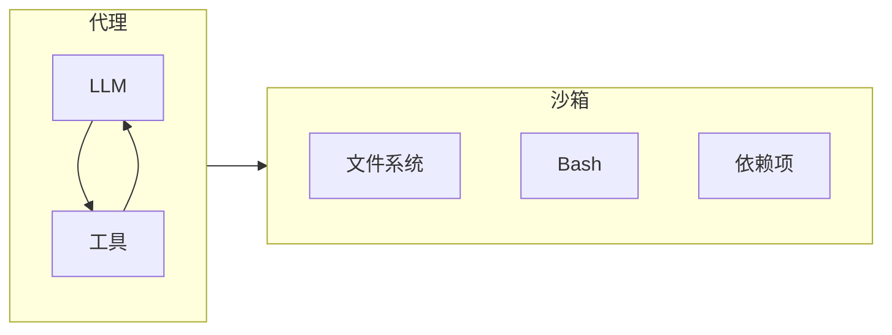

# 沙箱深度索引

> 这是 Deep Agents 沙箱后端的**概念地图**，涵盖隔离原理、执行模型、生命周期管理、文件传输、安全边界与最佳实践。  
> 阅读本文档可一次性掌握沙箱相关的全部概念及其在代理安全执行体系中的核心角色。

---
## 概念全景

agent 会生成代码、操作文件系统并运行 shell 命令。为防止其对主机系统造成意外影响，Deep Agents 通过**沙箱后端**提供隔离执行环境。沙箱是唯一同时提供**标准文件系统工具**和 **`execute` 工具**（任意 shell 命令）的后端类型，在执行环境与主机之间建立安全边界。



### 沙箱与其他后端的本质区别

| 后端类型 | 文件系统工具 | `execute` 工具 | 隔离性 | 典型用途 |
|---------|------------|---------------|--------|---------|
| State / Store / Filesystem 等 | ✅ | ❌ | 无额外隔离 | 安全数据存储与检索 |
| **沙箱后端** | ✅ | ✅ | 进程级/系统级隔离 | 任意代码执行、构建、测试 |

---

## 1. 为什么需要沙箱

- **安全隔离**：agent 在独立环境中运行，无法访问主机凭据、本地文件或其他进程。
- **任意命令执行**：agent 可安装依赖、运行测试、克隆仓库等，适用于编码 agent 或数据分析 agent。
- **确定性环境**：可预配置依赖和工具，确保执行一致性。

**沙箱不能防护的风险**：
- **上下文注入**：攻击者通过注入指令，仍可在沙箱内执行任意命令。
- **网络泄露**：除非显式阻断网络，否则被注入的 agent 可通过 HTTP/DNS 外传数据。

---

## 2. 基本用法与提供商

### 配置示例
```python
from deepagents import create_deep_agent
from langchain_modal import ModalSandbox

backend = ModalSandbox(sandbox=modal_sandbox)
agent = create_deep_agent(
    model=...,
    backend=backend,
    system_prompt="你是一个具有沙箱访问权限的 Python 编码助手。",
)
```

### 可用提供商
支持 Modal、Daytona、Deno 等，通过相应 LangChain 集成包装。未覆盖的提供商可通过实现 `BaseSandbox` 的 `execute()` 方法快速添加。

---

## 3. 生命周期与作用域

沙箱在关闭前持续消耗资源，必须管理其生命周期。常见两种作用域：

### 线程作用域（默认）
每个对话线程拥有独立沙箱。首次使用时创建，通过标签（如 `thread_id`）复用。TTL 到期或线程结束时自动销毁。适用于隔离性要求高的场景。

### 助手作用域
同一助手的所有线程共享单个沙箱。文件、安装的包、克隆的仓库在对话间持久化。需配合 TTL、快照重置或清理逻辑防止资源无限增长。

**最佳实践**：配置 `auto_delete_interval` 或等效 TTL，避免空闲沙箱持续计费。

---

## 4. 集成模式

### 模式 A：agent 在沙箱中
agent 进程运行在沙箱内部，外部通过网络与之通信。优点是与本地开发体验一致，但需管理沙箱内凭据和通信基础设施。

### 模式 B：沙箱作为工具（推荐）
agent 在主机上运行，通过后端 API 调用远程沙箱执行代码。凭据保留在沙箱外，agent 状态与执行环境分离，更新无需重建镜像，仅为执行时间付费。**生产环境推荐此模式。**

---

## 5. 工作原理

### 隔离边界
所有提供商确保主机文件系统和进程不受 agent 影响。但沙箱内部 agent 拥有完全控制权，需结合网络阻断和输出审查防范上下文注入。

### execute 方法：核心抽象
沙箱后端的架构基于单一方法 `execute(command) -> (stdout/stderr, exit_code)`。所有其他文件系统操作（`ls`、`read_file` 等）由 `BaseSandbox` 基类通过构造脚本调用 `execute()` 实现。这意味着添加新提供商只需实现 `execute()` 即可。

当 agent 调用 `execute` 工具时，输出过长会自动保存到文件，并引导 agent 使用 `read_file` 逐步读取，避免上下文溢出。

### 文件访问的双层模型

| 层级 | 使用者 | 方法 | 用途 |
|------|--------|------|------|
| 应用程序层 | 你的代码 | `upload_files()` / `download_files()` | 预填充源码、检索构建产物 |
| agent 层 | LLM | 文件系统工具 (`read_file` 等) + `execute` | 任务内读写、运行命令 |

应用程序通过提供商原生 API 高效传输文件；agent 则通过 shell 模拟文件操作，两者互不干扰。

---

## 6. 安全最佳实践

### 绝对禁止
- **绝不要将机密信息放入沙箱**（环境变量、挂载文件等）。上下文注入可导致凭据泄露。

### 推荐做法
1. **机密保留在沙箱外的工具中**：定义在主机端执行的身份认证工具，agent 只调用工具名而看不到凭据。
2. **使用网络阻断**（如 Modal 的 `blockNetwork: true`）限制不必要的出站连接。
3. **启用人机协同 (HITL)** 对所有工具调用进行审批，尤其是在沙箱内执行时。
4. **审查沙箱输出**，过滤敏感模式。
5. **将沙箱内产生的一切视为不受信输入**。

---

## 与全局概念的关联

- **[后端](index/langchain-index/deepagent/concepts/backends.md)**：沙箱是唯一提供 `execute` 工具的后端，与 `StateBackend`、`StoreBackend` 等形成互补，常通过 `CompositeBackend` 与持久存储路由结合使用。
- **[代码执行](./interpreter.md)**：解释器提供受限的 JS 执行，沙箱提供完整的 Shell 环境，两者构成代理的代码执行双路径。
- **[权限](index/langchain-index/deepagent/concepts/permissions.md)**：基于路径的 `permissions` 规则对沙箱的 `execute` 工具无效（沙箱内可绕过），需依赖后端策略钩子或网络阻断进行额外控制。
- **[人机协同](index/langchain-index/deepagent/concepts/Human-in-the-loop.md)**：强烈建议对沙箱后端的代理启用 `interrupt_on`，为破坏性操作设置人工闸门。
- **[上下文工程](index/langchain-index/deepagent/concepts/context_engineering.md)**：沙箱的 `execute` 输出自动卸载到文件，属于上下文压缩机制的一部分。
- **[子代理](index/langchain-index/deepagent/concepts/subagent.md)**：可为子代理配置独立的沙箱后端，实现不同任务的隔离执行。

## 链接原文

当本索引中的概要无法满足你（例如需要完整代码实现、方法签名、罕见配置示例）时，请通过以下方式从原始文档中获取精确信息。

### 语义检索（聚焦查询）

原始文档已按 `#` 级别标题切分并向量化。构造查询时，**使用当前索引章节的标题或段落内出现的关键概念、特殊术语作为锚点**，而不是全文反复出现的通用词。有效的查询往往短而具体。

例如，当你在本索引的“工作原理”一节需要更多细节时：

- **好的查询**：`execute 方法 核心抽象 BaseSandbox`、`双层模型 应用程序层 agent 层 upload_files`、`输出过长 自动保存到文件 引导 agent`
- **差的查询**：`沙箱怎么用`（整个文档都在讲沙箱，无法聚焦）

将标题词和段落内的特有术语组合，可以快速锁定目标段落。

### 利用索引页提升检索精度

如果单靠关键术语检索结果仍不够集中，从本索引中提取**所在章节的标题**或**当前段落的特有表述**作为附加上下文，与你的问题组合成更完整的查询。索引页的标题本身就是高质量的语义锚点。例如：

- 想了解“生命周期与作用域”中 TTL 和 `auto_delete_interval` 的配置，用 `生命周期与作用域 线程作用域 TTL auto_delete_interval` 组合查询。
- 想了解“集成模式”中模式 B 为何推荐用于生产环境，用 `集成模式 沙箱作为工具 凭据保留在沙箱外` 定位。
- 想查询“安全最佳实践”中关于网络阻断的具体配置（如 Modal 的 `blockNetwork`），用 `安全最佳实践 网络阻断 Modal blockNetwork` 找到具体说明。

### 标题路径兜底

语义检索返回的每个片段都携带其**原文标题和文件路径**。若需读取该章节的完整内容或进入相邻段落，可直接用返回结果中的标题坐标通过 `read_file` 精确定位——标题始终精确，因为它来自原文本身。