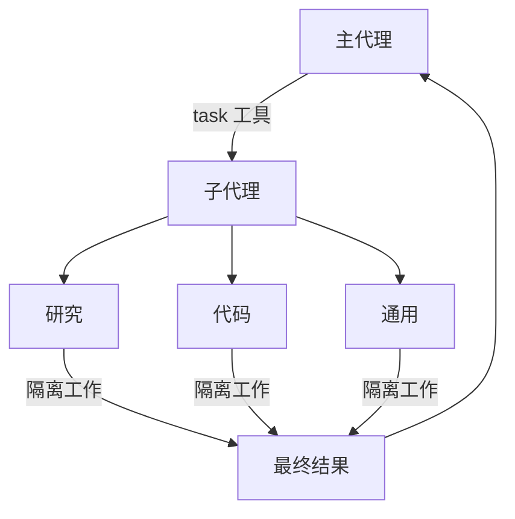

# 子代理深度索引

> 这是 Deep Agents 子代理系统的**概念地图**，涵盖上下文隔离原理、配置方式、结构化输出、上下文管理以及最佳实践。  
> 阅读本文档可一次性掌握子代理领域的全部概念及其与全局框架的关联，为委派决策和配置提供完整参考。

---
## 概念全景

子代理解决了代理系统中的**上下文膨胀问题**：当主代理使用会产生大量输出的工具（网络搜索、文件读取、数据库查询）时，上下文窗口会迅速被中间结果填满。子代理将这些繁重工作隔离到独立的上下文中，主代理仅接收最终结果，从而保持上下文干净。

### 何时使用
- ✅ 会扰乱主代理上下文的多步骤任务
- ✅ 需要自定义指令或工具的专业领域
- ✅ 需要不同模型能力的任务
- ✅ 希望主代理专注于高层协调时

### 何时不使用
- ❌ 简单的单步骤任务
- ❌ 需要保留中间上下文时
- ❌ 当委派开销大于收益时

---

## 1. 子代理类型与配置

### 1.1 默认子代理（通用子代理）

Deep Agents 自动添加一个名为 `general-purpose` 的同步子代理，除非被显式覆盖或禁用。

- **行为**：与主代理共享相同的系统提示、工具集和模型（可覆盖）
- **继承规则**：通用子代理自动继承主代理的技能；自定义子代理需显式指定
- **覆盖方式**：在 `subagents` 列表中提供一个同名字典，完全替换默认配置
- **禁用方式**：通过框架配置文件的 `GeneralPurposeSubagentProfile(enabled=False)` 关闭，**严禁**使用 `excluded_middleware` 移除 `SubAgentMiddleware`

### 1.2 自定义子代理（基于字典）

通过 `SubAgent` 字典定义专门子代理，核心字段：

| 字段 | 关键作用 |
|------|---------|
| `name` | 唯一标识符，主代理通过此名称调用，同时作为流式元数据 `lc_agent_name` 的值 |
| `description` | 决定主代理何时委派的关键——须具体、面向操作 |
| `system_prompt` | 子代理的独立指令，不从主代理继承 |
| `tools` | 保持最小化，仅提供任务必需的工具 |
| `model` | 可覆盖主代理模型，实现不同能力分配 |
| `middleware` | 不从主代理继承，可用于自定义行为或日志 |
| `interrupt_on` | 独立的人机协同配置，覆盖主代理设置 |
| `skills` | 独立技能集，与主代理完全隔离 |
| `response_format` | 结构化输出模式，使父代理收到可解析的 JSON |
| `permissions` | 文件系统权限，设置后完全替换父代理权限 |

### 1.3 编译子代理 (CompiledSubAgent)

对于复杂工作流，使用预编译的 LangGraph 图作为子代理。要求图具有 `"messages"` 状态键。

---

## 2. 上下文管理

### 2.1 运行时上下文传播

父代理的运行时上下文**自动传播到所有子代理**，子代理内的工具可通过 `ToolRuntime.context` 读取相同的上下文值（如 `user_id`、`api_key`）。

### 2.2 每子代理特定配置

通过两种方式传递子代理专属配置：
- **命名空间键**：在上下文中以子代理名称为前缀（如 `researcher:max_depth`）
- **独立字段**：在上下文类型上定义专属字段（如 `researcher_max_depth`）

### 2.3 识别调用来源

当同一工具在多个代理间共享时，可通过 `runtime.config.get("metadata", {}).get("lc_agent_name")` 判断是哪个代理发起的调用，实现差异化行为。

---

## 3. 结构化输出

通过 `response_format` 参数，子代理可将结果以结构化 JSON（而非自由文本）返回给父代理。支持 Pydantic 模型、`ToolStrategy`、`ProviderStrategy` 等。

**价值**：父代理收到可预测、可解析的数据，便于以编程方式处理结果或传递给下游工具。

---

## 4. 流式传输与可观测性

子代理名称作为 `lc_agent_name` 出现在流式元数据中，可在跟踪信息中区分数据来源。主代理和子代理均可通过 `name` 参数命名。

---

## 5. 最佳实践速查

| 维度 | 实践 |
|------|------|
| **描述** | 具体且面向操作（✅ “使用网络搜索进行深入研究并综合发现” / ❌ “做研究”） |
| **系统提示** | 详细指导工具使用、输出格式和长度限制（控制在 300-500 字） |
| **工具集** | 最小化，只给任务必需的 |
| **模型选择** | 按任务特征分配不同模型（长文档→大窗口模型，数值分析→推理型模型） |
| **结果返回** | 要求只返回摘要，避免原始数据、中间步骤和详细工具输出 |
| **大数据处理** | 写入文件系统（如 `/data/raw_results.txt`），仅返回分析摘要 |
| **委派指令** | 在主代理系统提示中明确指示使用 `task()` 工具进行委派 |

---

## 6. 常见模式

### 专业化分工链
创建多个专门子代理（如 data-collector → data-analyzer → report-writer），主代理协调流水线，每个子代理在干净上下文中专注单一任务。

### 模型差异化分配
为不同子代理配置不同模型：法律审查用大上下文模型，财务分析用数值推理模型。

---

## 7. 故障排除

| 问题 | 原因 | 解决方案 |
|------|------|---------|
| 子代理未被调用 | 描述模糊或主代理未被指示委派 | 使描述更具体；在系统提示中明确要求使用 `task()` |
| 上下文仍然膨胀 | 子代理返回了原始数据 | 指示子代理只返回摘要，用文件系统存储原始数据 |
| 选错子代理 | 描述区分度不足 | 在描述中明确区分各子代理的适用场景和边界 |

---

## 与全局概念的关联

- **[上下文工程](index/langchain-index/deepagent/concepts/context_engineering.md)**：子代理是实现上下文隔离的核心机制，与上下文压缩（卸载/摘要）共同构成上下文管理三大支柱。子代理的运行时上下文传播、命名空间配置直接依赖 Runtime 机制。
- **[人机协同](index/langchain-index/deepagent/concepts/Human-in-the-loop.md)**：子代理可独立配置 `interrupt_on`，为委派任务设置安全闸门。
- **[文件系统与后端](index/langchain-index/deepagent/concepts/backends.md)**：子代理使用 `CompositeBackend` 可继承或独立配置存储；大数据通过文件系统在主子代理间传递。
- **[技能](Skill.md)**：通用子代理继承主代理技能；自定义子代理拥有完全隔离的技能实例。
- **框架配置文件**：通过 `GeneralPurposeSubagentProfile` 控制默认子代理的启用/禁用和重命名。
- **[异步子代理](async_subagent.md)**：本索引覆盖同步子代理；长时间运行、并行工作流或需中途引导的场景请参见异步子代理文档。
