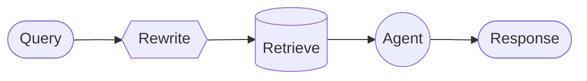

# Custom workflow

> 这是 LangGraph 多智能体系统中**自定义工作流 (Custom workflow)** 模式的胖索引，覆盖图结构设计、确定性逻辑与 Agent 行为的混合、节点类型、RAG 管道示例及最佳实践。
> 阅读本文档可一次性掌握自定义工作流的全部概念及其关联，为构建特定执行流、组合多种模式提供决策支撑。

---

## 概念全景

自定义工作流允许你通过 LangGraph 的 `StateGraph` 完全掌控执行流的结构。你可以将顺序步骤、条件分支、循环和并行执行任意组合，并在同一个图中混合纯函数、LLM 调用和完整的 Agent 节点。

| 维度               | 描述                                                         |
| ------------------ | ------------------------------------------------------------ |
| **核心机制**       | 使用 `StateGraph` 定义节点与边，每个节点可以是函数、Agent 或另一个图 |
| **混合能力**       | 确定性逻辑（如检索、数据转换）与 Agent 行为（工具调用、推理）无缝衔接 |
| **状态管理**       | 通过 State 在节点间传递数据，支持任意复杂的结构化上下文       |
| **嵌入其他模式**   | 子代理、交接、路由、技能等可作为节点嵌入自定义工作流中       |
| **编译与执行**     | `graph.compile()` 生成 `Pregel` 实例，支持检查点、流式、中断等全部运行时特性 |

核心决策点：**图结构如何映射业务逻辑、哪些步骤需要 LLM 哪些只需要代码、如何设计 State 以便各节点高效通信、是否将已有 Agent 封装为节点还是直接使用 `create_agent`**。

---

## 1. 关键特征

- **完全控制图结构**：手动定义节点和边的顺序、条件和并行分支。
- **混合执行**：节点可以是简单的 Python 函数，也可以是使用 `create_agent` 构建的完整 Agent。
- **状态驱动**：通过共享的 State 在各节点间传递查询、中间结果和最终答案。
- **模式嵌入**：可将 Router、Subagents、Handoffs 等模式作为节点嵌入，实现更高层次的复合架构。

---

## 2. 基本实现

核心思想是在 LangGraph 的节点函数内部调用 LangChain Agent，将自定义工作流的灵活性与预构建 Agent 的便利性结合：

```python
from langchain.agents import create_agent
from langgraph.graph import StateGraph, START, END

agent = create_agent(model="openai:gpt-5.4", tools=[...])

def agent_node(state: State) -> dict:
    result = agent.invoke({"messages": [{"role": "user", "content": state["query"]}]})
    return {"answer": result["messages"][-1].content}

workflow = (
    StateGraph(State)
    .add_node("agent", agent_node)
    .add_edge(START, "agent")
    .add_edge("agent", END)
    .compile()
)
```

State 的结构可自由定义，以适应工作流中需要传递的任何字段（如查询、重写查询、检索文档、最终答案等）。

---

## 3. 典型示例：RAG 管道

一个 WNBA 统计助手工作流，展示了三种节点的混合：

- **模型节点 (Rewrite)**：使用 LLM 结构化输出重写查询以优化检索。
- **确定性节点 (Retrieve)**：向量相似性搜索，不涉及 LLM。
- **Agent 节点 (Agent)**：基于检索到的上下文进行推理，并可调用新闻工具获取实时信息。



State 定义包含了 `question`、`rewritten_query`、`documents` 和 `answer` 字段，各节点按需更新。整个工作流通过 `StateGraph` 串联，编译后执行。

---

## 4. 与其他模式的关联

自定义工作流是最灵活的基底，其他多智能体模式可以嵌入其中：

- **Router**：可将路由分类步骤作为图中的一个节点，根据分类结果通过条件边分发到不同的 Agent 节点。
- **Subagents**：将主 Agent 作为一个节点，子代理作为工具在 Agent 内部调用。
- **Handoffs**：通过 `Command(goto=..., graph=Command.PARENT)` 在图节点间转移控制权。
- **Skills**：通过中间件在特定节点动态加载提示和工具，无需改变图结构。

---

## 5. 关键约束与最佳实践

- **状态设计**：State 应只包含节点间必须共享的数据，避免过于臃肿；私有数据可在节点内部处理。
- **节点粒度**：每个节点应承担单一职责；如果某段逻辑需要重试或缓存，考虑将其封装为独立节点。
- **混合使用 Agent 与函数**：确定性步骤（如检索、格式化）直接使用函数，仅将需要推理或工具调用的部分封装为 Agent 节点，以控制延迟和成本。
- **利用 LangGraph 特性**：编译时添加 checkpointer 可支持中断、人机协同和时间旅行；使用 `send` 实现动态并行。
- **测试与可视化**：`graph.get_graph().draw_mermaid_png()` 可直观展示工作流结构，便于调试和沟通。

---

## 6. 与全局概念的关联

- **图 (Graphs)**：自定义工作流直接基于 `StateGraph` 构建，掌握 Graph API 是设计工作流的前提。
- **Agent**：`create_agent` 可在节点中作为 Agent 节点使用，将工具调用和推理能力嵌入工作流。
- **持久化与检查点**：编译时传入 checkpointer 可使自定义工作流支持中断、重放和分支。
- **流式传输**：工作流可整体流式输出各节点更新和 LLM token，通过 `stream()` 方法的 `subgraphs=True` 可观察内部 Agent 的事件。
- **上下文工程**：各节点的输入输出设计、状态传递和提示构建均属于上下文工程范畴。
- **记忆**：State 提供短期记忆，Store 提供长期记忆，可在工作流节点中通过 `Runtime` 访问。

---

## 链接原文

### 语义检索（聚焦查询）

- `自定义工作流 StateGraph create_agent 节点` → 基本实现
- `RAG 管道 rewrite retrieve agent` → 混合节点示例
- `嵌入 其他模式 Router Subagents` → 模式组合
- `状态传递 State 节点间` → 上下文管理
- `compile checkpointer 中断` → 运行时特性

### 标题路径兜底

语义检索返回的片段均携带原文标题路径（如 `## 基本实现`、`## 示例：RAG 管道`），可用 `read_file` 精确定位对应章节。