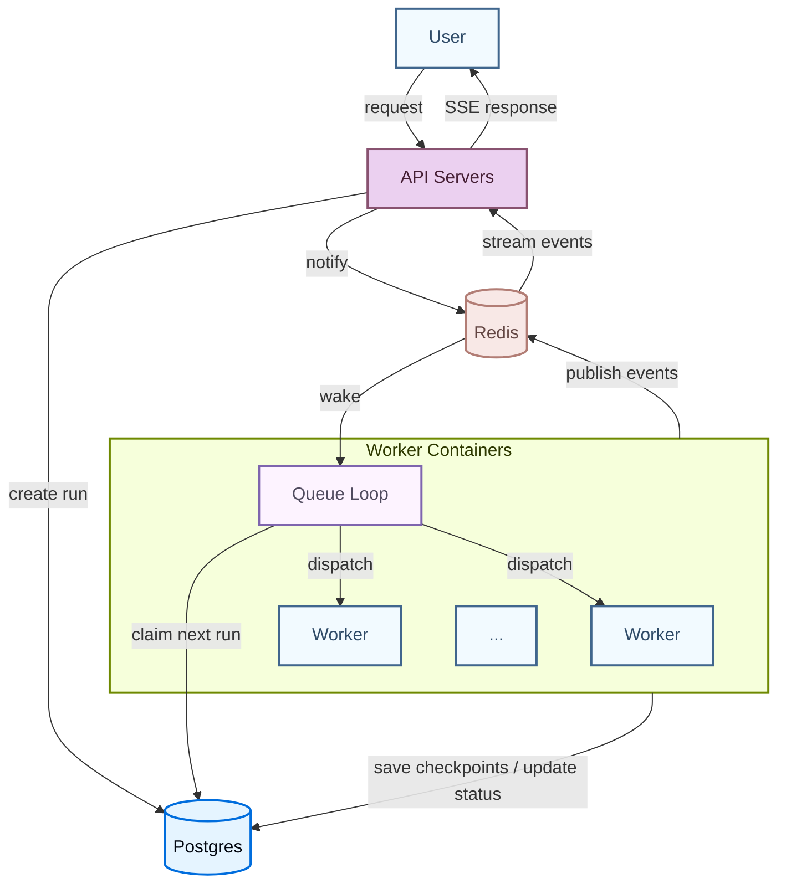

# Agent Server

LangSmith Deployment 的 **Agent Server** 提供了一套用于创建和管理基于代理（agent）的应用的 API。它基于 **assistant**（为特定任务配置的代理）这一概念构建，并内置了持久化和**任务队列**。这套通用的 API 支持广泛的代理型应用场景，从后台处理到实时交互均可覆盖。

使用 Agent Server 可以创建和管理：

助手,线程,运行,任务队列

**API 参考**
  有关 API 端点和数据模型的详细信息，请参阅 Agent Server API 参考。

## 应用结构

要部署一个 Agent Server 应用，您需要指定要部署的 Graph，以及相关配置设置（例如依赖项和环境变量）。

请阅读应用结构指南，了解如何为部署而构建您的 LangGraph 应用。

LangSmith 云平台会为您管理数据库。如果您在自己的基础设施上部署，则需要自行设置。

## 部署的组成部分

当您部署 Agent Server 时，您部署的是一个或多个 Graph、一个用于持久化的数据库，以及一个任务队列。

### Graphs

当您用 Agent Server 部署一个 Graph 时，您部署的是一个 Assistant 的“蓝图”。

一个 Graph 最常实现的是一个代理，但并非必须如此。例如，一个 Graph 可以实现一个仅支持来回对话的简单聊天机器人，而不具备影响应用控制流的能力。实际上，随着应用变得复杂，一个 Graph 往往会实现更复杂的流程，可能使用多个代理协同工作。

Graph 不一定非得用 LangGraph 编写。您也可以使用 LangGraph Functional API 部署用其他框架（如 Strands 或 Google ADK）构建的代理。详细信息请参阅部署其他框架。

#### Graph 加载与编译

Graph 如何以及何时被编译，取决于您在应用结构中如何注册它：

1. **编译好的 Graph（推荐）**：导出一个已经编译好的 `CompiledGraph` 实例。服务器在容器启动时加载它一次，并在每次运行时复用——没有每次请求的编译开销。
2. **工厂函数**：导出一个代理工厂函数，服务器每次需要 Graph 时都会调用它。仅在需要按运行自定义 Graph 时使用（例如，根据 assistant 配置选择不同的模型或工具）。请保持工厂函数轻量，因为每次调用都会执行。

除非您特别需要按运行进行自定义，否则请使用编译好的 Graph。工厂函数会在每次调用时增加开销；编译好的 Graph 则不会。

在这两种情况下，服务器都会自动注入为该部署配置的 checkpointer 和 memory store（运行时注入）。**请勿在您的 Graph 代码中配置这些组件**，因为服务器需要管理它们以支持其他操作。

### 持久化

Agent Server 持久化三种类型的数据，默认全部由 PostgreSQL 支持：

- **核心资源数据**：assistants、threads、runs 和 cron jobs。始终存储在 PostgreSQL 中。
- **Checkpoints（短期记忆）**：每一步写入的 Graph 执行状态快照。它们使运行具有持久性：如果工作进程中断，运行可以从上一个 checkpoint 恢复，而不是从头开始。Durability mode 控制 checkpoint 频率——`async`（默认）在每一步后写入；`exit` 仅存储最终状态。LangSmith 默认将此存储在 PostgreSQL 中；但您可以切换到 MongoDB 或自定义实现。详细信息请参阅配置 checkpointer 后端。
- **Store（长期记忆）**：跨 threads 持久化的记忆，使代理能够在不同对话之间保留信息。默认存储在 PostgreSQL 中，但可以替换为自定义实现。详细信息请参阅添加自定义 store。

### 任务队列

当客户端创建一个 run 时，API server 将其入队，然后一个 queue worker 将其取出执行。Workers 也可以被信号通知取消正在进行的 run，并发布输出事件，这些事件会通过开放的 `/stream` 连接实时转发给客户端。

Redis 处理 API servers 和 queue workers 之间的信令、取消和流式发布/订阅。它仅存储临时数据——用户数据或 run 数据都不会持久化在 Redis 中。Run 数据本身始终从 PostgreSQL 读取和写入。

有关如何设置和管理这些组件的更多信息，请查阅托管选项指南。

## 运行时架构

### 部署模式

Agent Server 支持三种运行时配置：

- **Single host**：API server 直接管理任务队列，没有单独的 queue workers。这是自托管部署的默认模式，适用于开发和低流量场景。
- **Split API and queue**：专用的 queue workers 在与 API server 不同的主机上处理 run 执行。对于自托管部署，通过在配置中设置 `queue.enabled: true` 来启用此模式。每一层可以独立扩展——API servers 根据请求量扩展，queue workers 根据待处理 run 数量扩展。
- **Distributed runtime**：API 和 queue 进程再次分开运行，但不是由单个 queue 进程同时处理 Graph 的编排和执行，而是使用一个进程进行编排，另一个进程进行执行。适用于具有高并发需求的大规模部署。

下文描述的容器架构和 run 生命周期适用于 single host 以及 split API and queue 配置。

### 容器架构

一个典型的部署包含两种长期运行的容器，它们都基于相同的 Docker 镜像构建（一个基础镜像，上面安装了您的项目代码）：

- **API servers** 处理客户端请求（创建 runs、读取 thread 状态、流式返回结果），但本身不执行代理代码。
- **Queue workers** 是执行引擎。它们监听持久任务队列，执行您的 Graph 代码，并写入 checkpoints。

容器是**无状态**但持久的。任何时候至少需要有 1 个 queue worker 监听任务队列，以确保没有 run 被遗弃。这些容器在其生命周期内可以服务许多 runs。

API servers 和 queue workers 是独立的容器池，可以独立扩展。

### Run 执行生命周期

当您调用一个 run 时，请求会流经多个组件：

1. 客户端向 API server 发送请求，API server 在持久任务队列中创建一个 pending run。
2. 一个 queue worker 取出该 run，获取其租约，加载相应的 Graph，然后开始执行。队列保证对于给定的 thread，同时最多只能有一个 run 在执行。
3. 在 Graph 执行过程中，worker 将 checkpoints 写入持久化层（频率取决于 durability mode），并通过配置的 pubsub provider 广播流式事件。
4. 如果客户端打开了 `/stream` 连接，API server 会订阅 pubsub channel，并通过 server-sent events 将事件实时转发给客户端。
5. 当执行完成时，worker 更新 run 的状态，并释放其槽位以供下一个 run 使用。

每个 worker 最多同时处理 `N_JOBS_PER_WORKER` 个 runs（默认值：10），因此单个 worker 容器可以并行服务多个 runs。有关调优指南，请参阅配置 Agent Server 以实现扩展。

## 了解更多

- 应用结构指南 解释了如何为部署而构建您的应用。
- API 参考 提供了有关 API 端点和数据模型的详细信息。