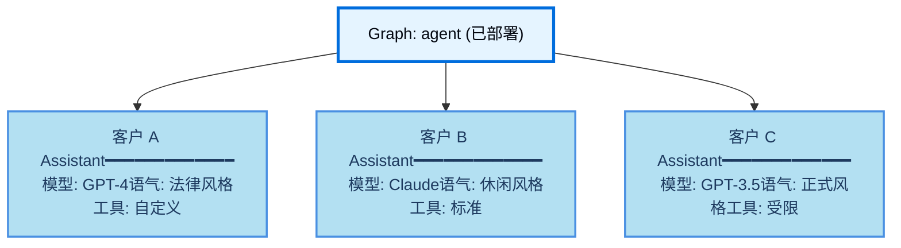
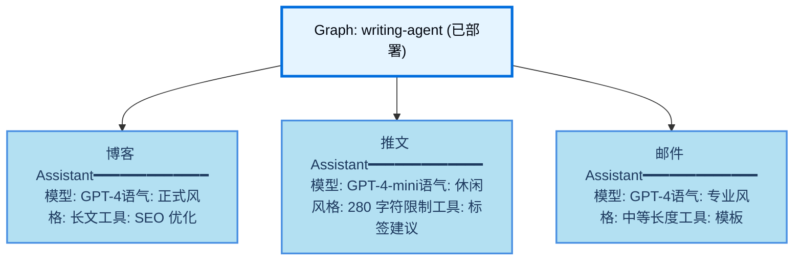

# Assistants

**Assistants** 是 Agent Server 中的一个概念，允许您将配置（例如提示词、LLM 选择、工具）与 Graph 的核心逻辑分开管理。这使得您可以在运行时为同一 Graph 架构创建多个具有不同行为的专用版本。通过配置变化（而不是修改 Graph 结构），每个 assistant 针对不同的用例进行了优化。

例如，设想一个基于通用 Graph 架构构建的通用写作代理。虽然结构保持不变，但不同的写作风格（如博客文章和推文）需要量身定制的配置以优化性能。为了支持这些变化，您可以创建多个 assistants（例如，一个用于博客，另一个用于推文），它们共享底层 Graph，但在模型选择和系统提示上有所不同。

Agent Server API 提供了多个用于创建和管理 assistants 及其版本的端点。更多详情请参阅 API 参考。

Assistants 是 LangSmith Deployment 的一个概念。它们在开源 LangGraph 库中不可用。

## 默认 assistants

当您使用 LangSmith Deployment 部署一个 Graph 时，Agent Server 会自动创建一个与该 Graph 默认配置绑定的 **default assistant**。然后，您可以为同一 Graph 创建额外的 assistants，每个都具有自己的配置。

如果您的部署在 `langgraph.json` 中定义了多个 Graph，则每个 Graph 都会获得自己的默认 assistant：

```json
{
    "graphs": {
        "graph_id_1": "path_to_graph_id_1",  // 为 graph_id_1 创建默认 assistant
        "graph_id_2": "path_to_graph_id_2"   // 为 graph_id_2 创建默认 assistant
    }
}
```

Assistants 具有几个关键特性：

- **通过 API 和 UI 管理**：使用 Agent Server/LangGraph SDKs 或 LangSmith UI 创建、列出、更新、版本化和获取 assistants。
- **一个 Graph，多个 assistants**：单个部署的 Graph 可以支持多个 assistants，每个具有不同的配置（例如提示词、模型、工具）。
- **版本化配置**：每个 assistant 通过版本控制维护自己的配置历史。编辑 assistant 会创建一个新版本，您可以提升或回滚到任何版本。
- **无需更改 Graph 即可更新配置**：通过 assistant 配置更新提示词、模型选择和其他设置，无需修改或重新部署您的 Graph 代码，从而实现快速迭代。

当调用 assistant 时，您可以在 `langgraph.json` 中指定：

- **graph ID**（`langgraph.json` 中的键，例如 `"agent"`）：使用该 Graph 的默认 assistant。
- **assistant ID**（UUID）：使用特定的 assistant 配置。

这种灵活性使您能够快速使用默认设置进行测试，或精确控制使用哪个配置。

## 配置

Assistants 建立在 LangGraph 开源概念的 configuration 之上。

虽然 configuration 在开源 LangGraph 库中可用，但 assistants 仅存在于 LangSmith Deployment 中，因为它们与您部署的 Graph 紧密耦合。在部署时，Agent Server 将使用 Graph 的默认配置设置为每个 Graph 自动创建一个默认 assistant。

在实践中，assistant 只是一个具有特定配置的 Graph **实例**。因此，多个 assistants 可以引用同一个 Graph，但可以包含不同的配置（例如提示词、模型、工具）。LangSmith Deployment API 提供了多个用于创建和管理 assistants 的端点。有关如何创建 assistants 的更多详细信息，请参阅 API 参考和此操作指南。

### 使用场景

当您需要部署具有不同配置的同一 Graph 架构时，Assistants 非常理想。常见用例包括：

- **用户级个性化**
  - 为每个用户定制模型选择、系统提示或工具可用性。
  - 存储用户偏好并将其自动应用于每次交互。
  - 使用户能够在不同的 AI 个性或专业水平之间进行选择。

- **客户或组织特定配置**
  - 为不同的客户或组织维护单独的配置。
  - 为每个客户定制行为，而无需部署单独的基础设施。
  - 将配置更改隔离到特定客户。



- **环境特定配置**
  - 为开发、预发布和生产使用不同的模型或设置。
  - 在提升到生产环境之前，在预发布环境中测试配置更改。
  - 在非生产环境中使用较小的模型降低成本。

- **A/B 测试和实验**
  - 比较不同的提示词、模型或参数设置。
  - 逐步向一部分用户推出配置更改。
  - 衡量配置变体之间的性能差异。

- **专门的任务变体**
  - 为通用代理创建特定领域的版本。
  - 针对不同语言、地区或行业优化配置。
  - 在执行细节变化的同时保持一致的 Graph 逻辑。



## Assistants 如何与部署协同工作

当您使用 LangSmith Deployment 部署一个 Graph 时，Agent Server 会自动创建一个与该 Graph 默认配置绑定的 **默认 assistant**。然后，您可以为同一 Graph 创建额外的 assistants，每个都具有自己的配置。

如果您的部署在 `langgraph.json` 中定义了多个 Graph，则每个 Graph 都会获得自己的默认 assistant：

```json
{
    "graphs": {
        "graph_id_1": "path_to_graph_id_1",  // 为 graph_id_1 创建默认 assistant
        "graph_id_2": "path_to_graph_id_2"   // 为 graph_id_2 创建默认 assistant
    }
}
```

也就是说，可以有多个默认 assistants——每个在您的部署中定义的 Graph 对应一个。

Assistants 具有几个关键特性：

- **通过 API 和 UI 管理**：使用 Agent Server/LangGraph SDKs 或 LangSmith UI 创建、列出、更新、版本化和获取 assistants。
- **一个 Graph，多个 assistants**：单个部署的 Graph 可以支持多个 assistants，每个具有不同的配置（例如提示词、模型、工具）。
- **版本化配置**：每个 assistant 通过版本控制维护自己的配置历史。编辑 assistant 会创建一个新版本，您可以提升或回滚到任何版本。
- **无需更改 Graph 即可更新配置**：通过 assistant 配置更新提示词、模型选择和其他设置，无需修改或重新部署您的 Graph 代码，从而实现快速迭代。

当调用 assistant 时，您可以在 `langgraph.json` 中指定：

- **graph ID**（例如 `"agent"`）：使用该 Graph 的默认 assistant。
- **assistant ID**（UUID）：使用特定的 assistant 配置。

这种灵活性使您能够快速使用默认设置进行测试，或精确控制使用哪个配置。

### 配置

Assistants 建立在 LangGraph 开源概念的 configuration 之上。

虽然 configuration 在开源 LangGraph 库中可用，但 assistants 仅存在于 LangSmith Deployment 中，因为它们与您部署的 Graph 紧密耦合。在部署时，Agent Server 将使用 Graph 的默认配置设置为每个 Graph 自动创建一个默认 assistant。

在实践中，assistant 只是一个具有特定配置的 Graph **实例**。因此，多个 assistants 可以引用同一个 Graph，但可以包含不同的配置（例如提示词、模型、工具）。LangSmith Deployment API 提供了多个用于创建和管理 assistants 的端点。有关如何创建 assistants 的更多详细信息，请参阅 API 参考和此操作指南。

### 版本控制

Assistants 支持版本控制以跟踪随时间的变化。一旦您创建了一个 assistant，后续编辑将自动创建新版本。

- 每次更新都会创建 assistant 的新版本。
- 您可以将任何版本提升为活动版本。
- 回滚到先前版本只需将其设置为活动版本即可。
- 所有版本都保留以供参考和回滚。

更新 assistant 时，您必须提供完整的配置负载。更新端点会从头创建新版本，不会与先前版本合并。请确保包含您希望保留的所有配置字段。

有关如何管理 assistant 版本的更多详细信息，请参阅管理 assistants 指南。