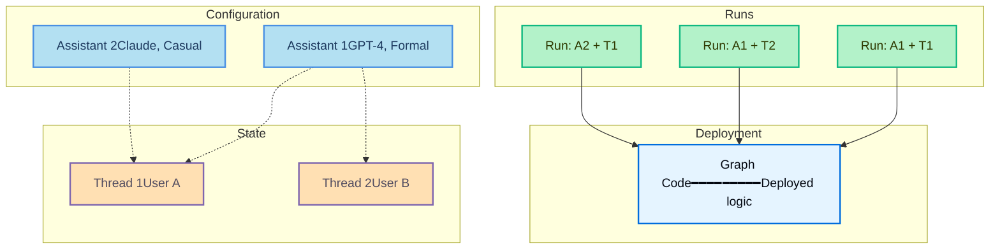

# Runs

> Agent Server 中 runs 的概述，包括如何启动后台运行、无状态运行以及取消运行。

*Run* 是对 assistant 的一次调用。当您执行一个 run 时，您需要指定使用哪个 assistant——可以通过 graph ID 使用默认 assistant，也可以通过 assistant ID 使用特定的配置。

此图展示了 **run** 如何将 assistant 与 thread 结合以执行 Graph：

- **Graph**（蓝色）：包含代理逻辑的已部署代码
- **Assistants**（浅蓝色）：配置选项（模型、提示词、工具）
- **Threads**（橙色）：对话历史的状态容器
- **Runs**（绿色）：将 assistant + thread 配对执行的调用

**组合示例：**

- **Run: A1 + T1**：Assistant 1 的配置应用于用户 A 的对话
- **Run: A1 + T2**：同一个 assistant 服务于用户 B（不同的对话）
- **Run: A2 + T1**：不同的 assistant 应用于用户 A 的对话（配置切换）

执行 run 时：

- 每个 run 可以有自己的输入、配置覆盖项和 metadata。
- Runs 可以是无状态（无 thread）或有状态（在 thread 上执行以实现对话持久化）。
- 多个 runs 可以使用同一个 assistant 配置。
- assistant 的配置会影响底层 Graph 的执行方式。

Agent Server API 提供了多个用于创建和管理 runs 的端点。更多详情请参阅 API 参考。

## 本节内容

异步运行您的代理并轮询结果。

在共享的 thread 上使用多个 assistants 以组合代理能力。

当不需要对话历史时，执行无状态运行。

通过 API 取消单个 run 或多个 runs。