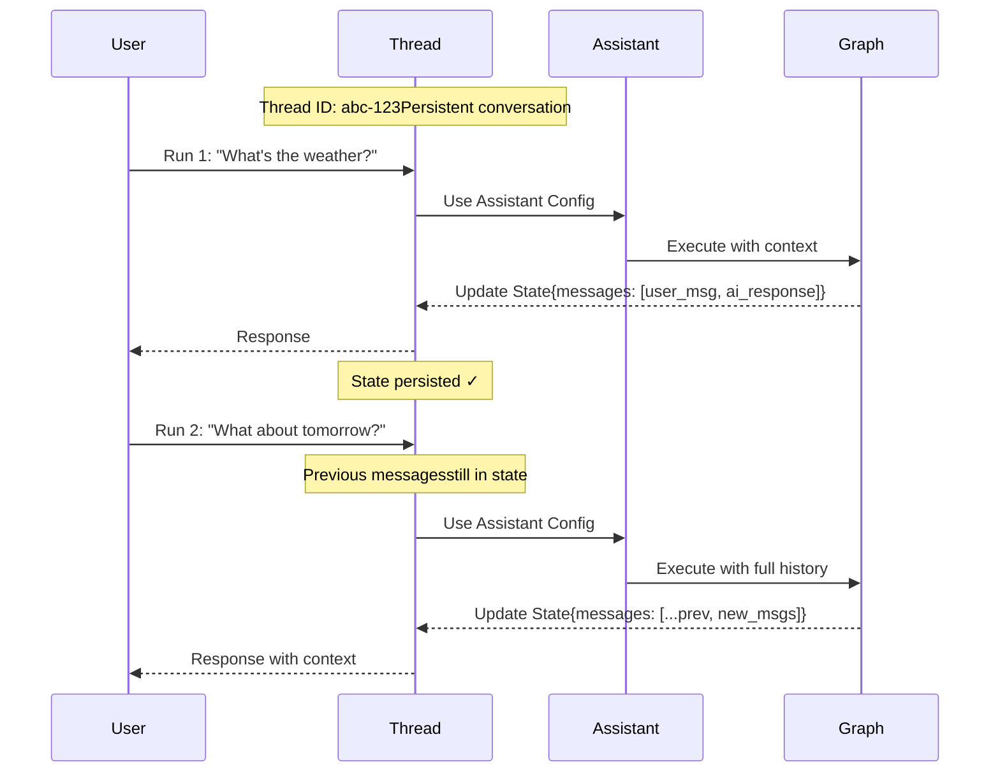

# 使用 threads

本指南向您展示如何创建、查看和检查 **threads**。Threads 与 assistants 协同工作，使您部署的 Graph 能够实现有状态的执行。

## 理解 threads

**Thread** 是一个持久的对话容器，能够在多次 runs 之间维护状态。每次您在一个 thread 上执行一次 run 时，Graph 都会使用该 thread 的当前状态处理输入，并用新信息更新该状态。

Threads 通过在 runs 之间保留对话历史和上下文来实现有状态的交互。如果没有 threads，每次 run 都将是无状态的，无法记住之前的交互。Threads 特别适用于：

- 需要助手记住之前讨论内容的多轮对话。
- 需要在多个步骤中维护上下文的长时运行任务。
- 用户特定的状态管理，其中每个用户都有自己的对话历史。

下图说明了一个 thread 如何在两次 runs 之间维护状态。第二次 run 可以访问第一次 run 的消息，从而使助手能够理解“那明天呢？”的上下文是指第一次 run 中的天气查询：



- 一个 thread 使用唯一的 thread ID 维护一个持久的对话。
- 每次 run 将 assistant 的配置应用于 Graph 执行。
- 每次 run 后状态都会更新，并持久化用于后续 runs。
- 后续的 runs 可以访问完整的对话历史。

- **Assistants** 定义了 Graph 执行的配置（模型、提示词、工具）。在创建 run 时，您可以指定 **graph ID**（例如 `"agent"`）以使用默认 assistant，或者指定 **assistant ID**（UUID）以使用特定的配置。
  - **Threads** 维护状态和对话历史。
  - **Runs** 将 assistant 和 thread 结合起来，以特定的配置和状态执行您的 Graph。

最佳实践：在跟踪一个 thread（对话）中的 runs 时，请确保所有 runs（包括父 run 和子 run）都设置了 `thread_id`。这对于 thread 过滤、token 计数和 thread 级别的评估正常工作至关重要。

## 创建 thread

要使用状态持久化运行您的 Graph，首先必须创建一个 thread：

### 空 thread

要创建一个新的 thread，请使用以下任一方法：

```python
from langgraph_sdk import get_client

# Initialize the client with your deployment URL
client = get_client(url=)

# Create an empty thread
# This creates a new thread with no initial state
thread = await client.threads.create()

print(thread)
```

更多信息请参考 Python 和 JS SDK 文档，或 REST API 参考。

输出：

```json
{
  "thread_id": "123e4567-e89b-12d3-a456-426614174000",
  "created_at": "2025-05-12T14:04:08.268Z",
  "updated_at": "2025-05-12T14:04:08.268Z",
  "metadata": {},
  "status": "idle",
  "values": {}
}
```

### 复制 thread

另外，如果您的应用中已经有一个 thread，并且您希望复制其状态，可以使用 `copy` 方法。这将创建一个独立的 thread，其历史记录与复制操作时的原始 thread 完全相同：

```python
# Copy an existing thread
# The new thread will have the same state as the original at the time of copying
copied_thread = await client.threads.copy(thread["thread_id"])
```

更多信息请参考 Python 和 JS SDK 文档，或 REST API 参考。

### 预填充状态

您可以通过向 `create` 方法提供一组 `supersteps` 来创建一个具有任意预定义状态的 thread。`supersteps` 描述了一系列状态更新，用于建立 thread 的初始状态。这在以下场景中非常有用：

* 创建具有现有对话历史的 thread。
* 从另一个系统迁移对话。
* 设置具有特定初始状态的测试场景。
* 从之前的会话恢复对话。

有关 checkpoints 和状态管理的更多信息，请参阅 LangGraph 持久化文档。

```python
from langgraph_sdk import get_client

# Initialize the client
client = get_client(url=)

# Create a thread with pre-populated conversation history
# The supersteps define a sequence of state updates that build up the initial state
thread = await client.threads.create(
  graph_id="agent",  # Specify which graph this thread is for
  supersteps=[
    {
      updates: [
        {
          values: {},
          as_node: '__input__',  # Initial input node
        },
      ],
    },
    {
      updates: [
        {
          values: {
            messages: [
              {
                type: 'human',
                content: 'hello',
              },
            ],
          },
          as_node: '__start__',  # User's first message
        },
      ],
    },
    {
      updates: [
        {
          values: {
            messages: [
              {
                content: 'Hello! How can I assist you today?',
                type: 'ai',
              },
            ],
          },
          as_node: 'call_model',  # Assistant's response
        },
      ],
    },
  ])

print(thread)
```

输出：

```json
{
  "thread_id": "f15d70a1-27d4-4793-a897-de5609920b7d",
  "created_at": "2025-05-12T15:37:08.935038+00:00",
  "updated_at": "2025-05-12T15:37:08.935046+00:00",
  "metadata": {
    "graph_id": "agent"
  },
  "status": "idle",
  "config": {},
  "values": {
    "messages": [
      {
        "content": "hello",
        "additional_kwargs": {},
        "response_metadata": {},
        "type": "human",
        "name": null,
        "id": "8701f3be-959c-4b7c-852f-c2160699b4ab",
        "example": false
      },
      {
        "content": "Hello! How can I assist you today?",
        "additional_kwargs": {},
        "response_metadata": {},
        "type": "ai",
        "name": null,
        "id": "4d8ea561-7ca1-409a-99f7-6b67af3e1aa3",
        "example": false,
        "tool_calls": [],
        "invalid_tool_calls": [],
        "usage_metadata": null
      }
    ]
  }
}
```

您也可以直接从 LangSmith UI 创建 threads：

1. 导航到您的部署。
2. 选择 **Threads** 选项卡。
3. 点击 **+ New thread**。
4. 可选地为 thread 提供 metadata 或初始状态。
5. 点击 **Create thread**。

新创建的 thread 将出现在 threads 表中，并可以立即用于 runs。

## 列出 threads

要列出 threads，请使用 `search` 方法。这将列出应用中符合所提供过滤条件的 threads：

### 按 thread 状态过滤

使用 `status` 字段根据 thread 的状态进行过滤。支持的值有 `idle`、`busy`、`interrupted` 和 `error`。例如，查看 `idle` 的 threads：

```python
# Search for idle threads
# The status filter accepts: idle, busy, interrupted, error
print(await client.threads.search(status="idle", limit=1))
```

更多信息请参考 Python 和 JS SDK 文档，或 REST API 参考。

输出：

```json
[
  {
    "thread_id": "cacf79bb-4248-4d01-aabc-938dbd60ed2c",
    "created_at": "2024-08-14T17:36:38.921660+00:00",
    "updated_at": "2024-08-14T17:36:38.921660+00:00",
    "metadata": {
      "graph_id": "agent"
    },
    "status": "idle",
    "config": {
      "configurable": {}
    }
  }
]
```

### 按 metadata 过滤

`search` 方法允许您在 metadata 上进行过滤。这对于查找与特定 graphs、用户或您添加到 threads 的自定义 metadata 关联的 threads 非常有用。

您可以过滤的常见 metadata 字段包括：

| Metadata key             | 描述                                                                                      |
| ------------------------ | ----------------------------------------------------------------------------------------- |
| `graph_id`               | thread 所属的 graph（部署）。                                                              |
| `assistant_id`           | 用于在该 thread 上创建 runs 的 assistant。                                                |
| `langgraph_auth_user_id` | 拥有该 thread 的经过身份验证的用户（使用自定义认证时自动设置）。                           |
| `cron_id`                | 在该 thread 上创建 runs 的 cron job。                                                      |

您也可以过滤在创建或更新 threads 时附加的任何自定义 metadata。

#### 按 graph 过滤

```python
print(await client.threads.search(metadata={"graph_id": "agent"}, limit=1))
```

输出：

```json
[
  {
    "thread_id": "cacf79bb-4248-4d01-aabc-938dbd60ed2c",
    "created_at": "2024-08-14T17:36:38.921660+00:00",
    "updated_at": "2024-08-14T17:36:38.921660+00:00",
    "metadata": {
      "graph_id": "agent"
    },
    "status": "idle",
    "config": {
      "configurable": {}
    }
  }
]
```

#### 按 assistant 过滤

```python
print(await client.threads.search(
    metadata={"assistant_id": "fe096781-5601-53d2-b2f6-0d3403f7e9ca"},
    limit=1,
))
```
#### 按 cron job 过滤

```python
print(await client.threads.search(
    metadata={"cron_id": "8b98a268-e49a-4228-a0d3-1a354e3a54d0"},
    limit=10,
))
```

### 排序

SDK 还支持使用 `sort_by` 和 `sort_order` 参数按 `thread_id`、`status`、`created_at` 和 `updated_at` 对 threads 进行排序。

您也可以通过 LangSmith UI 查看和管理部署中的 threads：

1. 导航到您的部署。
2. 选择 **Threads** 选项卡。

这将加载您部署中所有 threads 的表格。

**按 thread 状态过滤：** 在顶栏中选择一个状态，按 `idle`、`busy`、`interrupted` 或 `error` 过滤 threads。

**排序 threads：** 点击任何列标题上的箭头图标，即可按该属性（`thread_id`、`status`、`created_at` 或 `updated_at`）排序。

## 检查 threads

### 获取 thread

要查看给定 `thread_id` 的特定 thread，请使用 `get` 方法：

```python
# Retrieve a specific thread by its ID
# Returns the thread metadata including status, creation time, and metadata
print((await client.threads.get(thread["thread_id"])))
```
输出：

```json
{
  "thread_id": "cacf79bb-4248-4d01-aabc-938dbd60ed2c",
  "created_at": "2024-08-14T17:36:38.921660+00:00",
  "updated_at": "2024-08-14T17:36:38.921660+00:00",
  "metadata": {
    "graph_id": "agent"
  },
  "status": "idle",
  "config": {
    "configurable": {}
  }
}
```

更多信息请参考 Python 和 JS SDK 文档，或 REST API 参考。

### 检查 thread 状态

要查看给定 thread 的当前状态，请使用 `get_state` 方法。这将返回当前 values、接下来要执行的 nodes、checkpoint 信息等：

```python
# Get the current state of a thread
# Returns values, next nodes, tasks, checkpoint info, and metadata
print((await client.threads.get_state(thread["thread_id"])))
```
输出：

```json
{
  "values": {
    "messages": [
      {
        "content": "hello",
        "additional_kwargs": {},
        "response_metadata": {},
        "type": "human",
        "name": null,
        "id": "8701f3be-959c-4b7c-852f-c2160699b4ab",
        "example": false
      },
      {
        "content": "Hello! How can I assist you today?",
        "additional_kwargs": {},
        "response_metadata": {},
        "type": "ai",
        "name": null,
        "id": "4d8ea561-7ca1-409a-99f7-6b67af3e1aa3",
        "example": false,
        "tool_calls": [],
        "invalid_tool_calls": [],
        "usage_metadata": null
      }
    ]
  },
  "next": [],
  "tasks": [],
  "metadata": {
    "thread_id": "f15d70a1-27d4-4793-a897-de5609920b7d",
    "checkpoint_id": "1f02f46f-7308-616c-8000-1b158a9a6955",
    "graph_id": "agent_with_quite_a_long_name",
    "source": "update",
    "step": 1,
    "writes": {
      "call_model": {
        "messages": [
          {
            "content": "Hello! How can I assist you today?",
            "type": "ai"
          }
        ]
      }
    },
    "parents": {}
  },
  "created_at": "2025-05-12T15:37:09.008055+00:00",
  "checkpoint": {
    "checkpoint_id": "1f02f46f-733f-6b58-8001-ea90dcabb1bd",
    "thread_id": "f15d70a1-27d4-4793-a897-de5609920b7d",
    "checkpoint_ns": ""
  },
  "parent_checkpoint": {
    "checkpoint_id": "1f02f46f-7308-616c-8000-1b158a9a6955",
    "thread_id": "f15d70a1-27d4-4793-a897-de5609920b7d",
    "checkpoint_ns": ""
  },
  "checkpoint_id": "1f02f46f-733f-6b58-8001-ea90dcabb1bd",
  "parent_checkpoint_id": "1f02f46f-7308-616c-8000-1b158a9a6955"
}
```

更多信息请参考 Python 和 JS SDK 文档，或 REST API 参考。

可选地，要查看给定 checkpoint 处的 thread 状态，请传入 checkpoint ID。这对于检查 thread 在其执行历史中特定点的状态非常有用。

首先，从 thread 的历史中获取 checkpoint ID：

```python
# Get the thread history to find checkpoint IDs
history = await client.threads.get_history(thread_id=thread["thread_id"])
checkpoint_id = history[0]["checkpoint_id"]  # Get the most recent checkpoint
```
然后使用 checkpoint ID 获取该特定点的状态：

```python
# Get thread state at a specific checkpoint
# Useful for inspecting historical state or debugging
thread_state = await client.threads.get_state(
  thread_id=thread["thread_id"],
  checkpoint_id=checkpoint_id
)
```

### 检查完整的 thread 历史

要查看 thread 的历史，请使用 `get_history` 方法。这将返回 thread 经历过的每个状态的列表，使您能够追踪完整的执行路径：

```python
# Get the full history of a thread
# Returns a list of all state snapshots from the thread's execution
history = await client.threads.get_history(
  thread_id=thread["thread_id"],
  limit=10  # Optional: limit the number of states returned
)

for state in history:
    print(f"Checkpoint: {state['checkpoint_id']}")
    print(f"Step: {state['metadata']['step']}")
```

此方法特别适用于：

* 通过查看状态如何演变来调试执行流程。
* 理解 Graph 执行中的决策点。
* 审计对话历史和状态变化。
* 重放或分析过去的交互。

更多信息请参考 Python 和 JS SDK 文档，或 REST API 参考。

您也可以在 LangSmith UI 中查看和检查 threads：

1. 导航到您的部署。
2. 选择 **Threads** 选项卡以查看所有 threads。
3. 点击一个 thread 以检查其当前状态。

要查看完整的 thread 历史并进行详细的调试，请点击 **Open in Studio** 在 Studio 中打开该 thread。Studio 提供了一个可视化界面，用于探索 thread 的执行历史、状态变化和 checkpoint 详细信息。