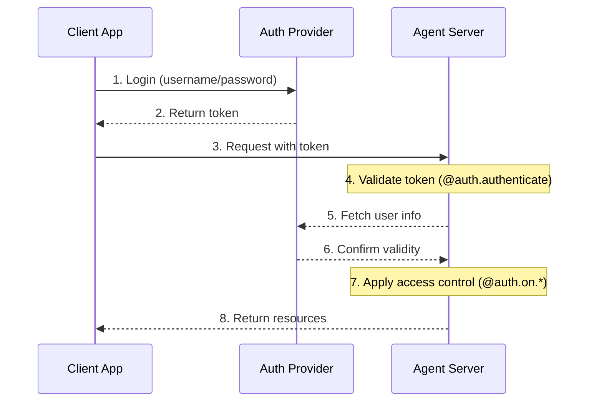
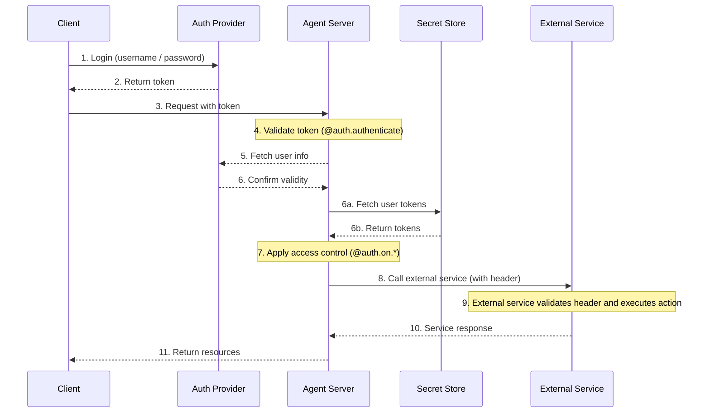

# 认证与访问控制

LangSmith 提供了一个灵活的认证和授权系统，可以与大多数认证方案集成。

## 核心概念

### 认证与授权

虽然这两个术语经常互换使用，但它们代表了不同的安全概念：

- **认证** 验证 *你是谁*。它作为每个请求的中间件运行。
- **授权** 确定 *你能做什么*。它基于每个资源验证用户的权限和角色。

在 LangSmith 中，认证由您的 `@auth.authenticate` 处理程序处理，授权由您的 `@auth.on` 处理程序处理。

## 默认安全模型

LangSmith 提供不同的安全默认设置：

### LangSmith

- 默认使用 LangSmith API 密钥
- 需要在 `x-api-key` header 中包含有效的 API 密钥
- 可以使用您的认证处理程序进行自定义

**自定义认证**
  LangSmith 中所有计划 **均支持** 自定义认证。

### 自托管

- 无默认认证
- 完全灵活地实现您的安全模型
- 您控制认证和授权的所有方面

## 系统架构

一个典型的认证设置涉及三个主要组件：

1. **认证提供者**（身份提供者/IdP）
   - 管理用户身份和凭据的专用服务
   - 处理用户注册、登录、密码重置等
   - 成功认证后颁发令牌（JWT、会话令牌等）
   - 示例：Auth0、Supabase Auth、Okta 或您自己的认证服务器
2. **Agent Server**（资源服务器）
   - 您的代理或 LangGraph 应用，包含业务逻辑和受保护资源
   - 使用认证提供者验证令牌
   - 基于用户身份和权限强制执行访问控制
   - 不直接存储用户凭据
3. **客户端应用**（前端）
   - Web 应用、移动应用或 API 客户端
   - 收集用户凭据并发送给认证提供者
   - 从认证提供者接收令牌
   - 在对 Agent Server 的请求中包含这些令牌

以下是这些组件典型的交互方式：



您在 LangGraph 中的 `@auth.authenticate` 处理程序处理步骤 4-6，而您的 `@auth.on` 处理程序实现步骤 7。

## 认证

LangGraph 中的认证作为每个请求的中间件运行。您的 `@auth.authenticate` 处理程序接收请求信息，并应该：

1. 验证凭据
2. 如果有效，返回包含用户身份和用户信息的用户信息
3. 如果无效，则引发 HTTP 异常或 AssertionError

```python
from langgraph_sdk import Auth

auth = Auth()

@auth.authenticate
async def authenticate(headers: dict) -> Auth.types.MinimalUserDict:
    # Validate credentials (e.g., API key, JWT token)
    api_key = headers.get(b"x-api-key")
    if not api_key or not is_valid_key(api_key):
        raise Auth.exceptions.HTTPException(
            status_code=401,
            detail="Invalid API key"
        )

    # Return user info - only identity and is_authenticated are required
    # Add any additional fields you need for authorization
    return {
        "identity": "user-123",        # Required: unique user identifier
        "is_authenticated": True,      # Optional: assumed True by default
        "permissions": ["read", "write"], # Optional: for permission-based auth
        # You can add more custom fields if you want to implement other auth patterns
        "role": "admin",
        "org_id": "org-456"

    }
```

返回的用户信息可用于：

- 通过 `ctx.user` 提供给您的授权处理程序
- 在您的应用中通过 `config["configuration"]["langgraph_auth_user"]` 访问

`@auth.authenticate` 处理程序可以按名称接受以下任何参数：

  - request (Request): 原始 ASGI 请求对象
  - path (str): 请求路径，例如 `"/threads/abcd-1234-abcd-1234/runs/abcd-1234-abcd-1234/stream"`
  - method (str): HTTP 方法，例如 `"GET"`
  - path_params (dict[str, str]): URL 路径参数，例如 `{"thread_id": "abcd-1234-abcd-1234", "run_id": "abcd-1234-abcd-1234"}`
  - query_params (dict[str, str]): URL 查询参数，例如 `{"stream": "true"}`
  - headers (dict[bytes, bytes]): 请求 headers
  - authorization (str | None): Authorization header 的值（例如 `"Bearer "`）

  在我们的许多教程中，为了简洁起见，我们只展示 "authorization" 参数，但您可以根据需要选择接受更多信息来实现自定义认证方案。

### 代理认证

自定义认证允许委派访问。您在 `@auth.authenticate` 中返回的值将被添加到运行上下文中，为代理提供用户范围的凭据，使其能够代表用户访问资源。



认证后，平台会创建一个特殊的配置对象，该对象通过可配置上下文传递给您的 graph 和所有节点。此对象包含有关当前用户的信息，包括您从 `@auth.authenticate` 处理程序返回的任何自定义字段。

要使代理能够代表用户执行操作，请使用自定义认证中间件。这将允许代理代表用户与外部系统（如 MCP 服务器、外部数据库，甚至其他代理）进行交互。

更多信息请参阅使用自定义认证指南。

### 使用 MCP 的代理认证

有关如何将代理认证到 MCP 服务器的信息，请参阅 MCP 概念指南。

## 授权

认证之后，LangGraph 会调用您的 `@auth.on` 处理程序来控制对特定资源（例如 threads、assistants、crons）的访问。这些处理程序可以：

1. 通过在资源创建期间直接修改 `value["metadata"]` 字典来添加要保存的元数据。有关每个操作的 `value` 可以采用的类型列表，请参阅支持的操作表。
2. 在搜索/列表或读取操作期间，通过返回一个过滤器字典来按元数据过滤资源。
3. 如果访问被拒绝，则引发 HTTP 异常。

如果您只想实现简单的用户范围访问控制，您可以为所有资源和操作使用一个 `@auth.on` 处理程序。如果您希望根据资源和操作有不同的控制，您可以使用特定于资源的处理程序。有关支持访问控制的资源的完整列表，请参阅支持的资源部分。

```python
@auth.on
async def add_owner(
    ctx: Auth.types.AuthContext,
    value: dict  # The payload being sent to this access method
) -> dict:  # Returns a filter dict that restricts access to resources
    """Authorize all access to threads, runs, crons, and assistants.

    This handler does two things:
        - Adds a value to resource metadata (to persist with the resource so it can be filtered later)
        - Returns a filter (to restrict access to existing resources)

    Args:
        ctx: Authentication context containing user info, permissions, the path, and
        value: The request payload sent to the endpoint. For creation
              operations, this contains the resource parameters. For read
              operations, this contains the resource being accessed.

    Returns:
        A filter dictionary that LangGraph uses to restrict access to resources.
        See Filter Operations for supported operators.
    """
    # Create filter to restrict access to just this user's resources
    filters = {"owner": ctx.user.identity}

    # Get or create the metadata dictionary in the payload
    # This is where we store persistent info about the resource
    metadata = value.setdefault("metadata", {})

    # Add owner to metadata - if this is a create or update operation,
    # this information will be saved with the resource
    # So we can filter by it later in read operations
    metadata.update(filters)

    # Return filters to restrict access
    # These filters are applied to ALL operations (create, read, update, search, etc.)
    # to ensure users can only access their own resources
    return filters
```

### 特定资源处理程序

您可以通过使用 `@auth.on` 装饰器链式连接资源和操作名称为特定资源和操作注册处理程序。当收到请求时，将调用与该资源和操作匹配的最具体的处理程序。以下是如何为特定资源和操作注册处理程序的示例。对于以下设置：

1. 认证用户能够创建 threads、读取 threads 以及在 threads 上创建 runs
2. 只有具有 "assistants:create" 权限的用户才被允许创建新的 assistants
3. 所有其他端点（例如，删除 assistant、crons、store）对所有用户禁用。

**支持的处理程序**
  有关支持的资源和操作的完整列表，请参阅下面的支持的资源部分。

```python
# Generic / global handler catches calls that aren't handled by more specific handlers
@auth.on
async def reject_unhandled_requests(ctx: Auth.types.AuthContext, value: Any) -> False:
    print(f"Request to {ctx.path} by {ctx.user.identity}")
    raise Auth.exceptions.HTTPException(
        status_code=403,
        detail="Forbidden"
    )

# Matches the "thread" resource and all actions - create, read, update, delete, search
# Since this is **more specific** than the generic @auth.on handler, it will take precedence
# over the generic handler for all actions on the "threads" resource
@auth.on.threads
async def on_thread(
    ctx: Auth.types.AuthContext,
    value: Auth.types.threads.create.value
):
    # Setting metadata on the thread being created
    # will ensure that the resource contains an "owner" field
    # Then any time a user tries to access this thread or runs within the thread,
    # we can filter by owner
    metadata = value.setdefault("metadata", {})
    metadata["owner"] = ctx.user.identity
    return {"owner": ctx.user.identity}

# Thread creation. This will match only on thread create actions
# Since this is **more specific** than both the generic @auth.on handler and the @auth.on.threads handler,
# it will take precedence for any "create" actions on the "threads" resources
@auth.on.threads.create
async def on_thread_create(
    ctx: Auth.types.AuthContext,
    value: Auth.types.threads.create.value
):
    # Reject if the user does not have write access
    if "write" not in ctx.permissions:
        raise Auth.exceptions.HTTPException(
            status_code=403,
            detail="User lacks the required permissions."
        )
    # Setting metadata on the thread being created
    # will ensure that the resource contains an "owner" field
    # Then any time a user tries to access this thread or runs within the thread,
    # we can filter by owner
    metadata = value.setdefault("metadata", {})
    metadata["owner"] = ctx.user.identity
    return {"owner": ctx.user.identity}

# Reading a thread. Since this is also more specific than the generic @auth.on handler, and the @auth.on.threads handler,
# it will take precedence for any "read" actions on the "threads" resource
@auth.on.threads.read
async def on_thread_read(
    ctx: Auth.types.AuthContext,
    value: Auth.types.threads.read.value
):
    # Since we are reading (and not creating) a thread,
    # we don't need to set metadata. We just need to
    # return a filter to ensure users can only see their own threads
    return {"owner": ctx.user.identity}

# Run creation, streaming, updates, etc.
# This takes precedenceover the generic @auth.on handler and the @auth.on.threads handler
@auth.on.threads.create_run
async def on_run_create(
    ctx: Auth.types.AuthContext,
    value: Auth.types.threads.create_run.value
):
    metadata = value.setdefault("metadata", {})
    metadata["owner"] = ctx.user.identity
    # Inherit thread's access control
    return {"owner": ctx.user.identity}

# Assistant creation
@auth.on.assistants.create
async def on_assistant_create(
    ctx: Auth.types.AuthContext,
    value: Auth.types.assistants.create.value
):
    if "assistants:create" not in ctx.permissions:
        raise Auth.exceptions.HTTPException(
            status_code=403,
            detail="User lacks the required permissions."
        )
```

请注意，在上面的示例中，我们混合使用了全局和特定资源处理程序。由于每个请求由最具体的处理程序处理，创建 `thread` 的请求将匹配 `on_thread_create` 处理程序，而 **不** 会匹配 `reject_unhandled_requests` 处理程序。然而，`更新` thread 的请求将由全局处理程序处理，因为我们没有针对该资源和操作的更具体的处理程序。

### 过滤操作

授权处理程序可以返回 `None`、一个布尔值或一个过滤器字典。

- `None` 和 `True` 表示“授权访问所有底层资源”
- `False` 表示“拒绝访问所有底层资源（引发 403 异常）”
- 元数据过滤器字典将限制对资源的访问

过滤器字典是一个键与资源元数据匹配的字典。它支持三个操作符：

- 默认值是精确匹配的简写，即下面的 `$eq`。例如，`{"owner": user_id}` 将仅包含元数据包含 `{"owner": user_id}` 的资源
- `$eq`：精确匹配（例如 `{"owner": {"$eq": user_id}}`）- 这等同于上面的简写 `{"owner": user_id}`
- `$contains`：列表成员关系（例如 `{"allowed_users": {"$contains": user_id}}`）或列表包含关系（例如 `{"allowed_users": {"$contains": [user_id_1, user_id_2]}}`）。这里的值必须分别是列表的一个元素或列表元素的子集。存储资源中的元数据必须是列表/容器类型。

具有多个键的字典被视为逻辑 `AND` 过滤器。例如，`{"owner": org_id, "allowed_users": {"$contains": user_id}}` 将仅匹配元数据的 "owner" 为 `org_id` 且 "allowed_users" 列表包含 `user_id` 的资源。
有关更多信息，请参阅参考 `Auth`。

## 常见访问模式

以下是一些典型的授权模式：

### 单一所有者资源

这种常见模式允许您将所有 threads、assistants、crons 和 runs 限定给单个用户。它适用于常见的单用户用例，例如常规的聊天机器人风格的应用。

```python
@auth.on
async def owner_only(ctx: Auth.types.AuthContext, value: dict):
    metadata = value.setdefault("metadata", {})
    metadata["owner"] = ctx.user.identity
    return {"owner": ctx.user.identity}
```

### 基于权限的访问

此模式允许您根据 **权限** 控制访问。如果您希望某些角色对资源具有更广泛或更受限的访问权限，这将非常有用。

```python
# In your auth handler:
@auth.authenticate
async def authenticate(headers: dict) -> Auth.types.MinimalUserDict:
    ...
    return {
        "identity": "user-123",
        "is_authenticated": True,
        "permissions": ["threads:write", "threads:read"]  # Define permissions in auth
    }

def _default(ctx: Auth.types.AuthContext, value: dict):
    metadata = value.setdefault("metadata", {})
    metadata["owner"] = ctx.user.identity
    return {"owner": ctx.user.identity}

@auth.on.threads.create
async def create_thread(ctx: Auth.types.AuthContext, value: dict):
    if "threads:write" not in ctx.permissions:
        raise Auth.exceptions.HTTPException(
            status_code=403,
            detail="Unauthorized"
        )
    return _default(ctx, value)

@auth.on.threads.read
async def rbac_create(ctx: Auth.types.AuthContext, value: dict):
    if "threads:read" not in ctx.permissions and "threads:write" not in ctx.permissions:
        raise Auth.exceptions.HTTPException(
            status_code=403,
            detail="Unauthorized"
        )
    return _default(ctx, value)
```

## 支持的资源

LangGraph 提供三个级别的授权处理程序，从最通用到最具体：

1. **全局处理程序** (`@auth.on`)：匹配所有资源和操作
2. **资源处理程序**（例如 `@auth.on.threads`、`@auth.on.assistants`、`@auth.on.crons`）：匹配特定资源的所有操作
3. **操作处理程序**（例如 `@auth.on.threads.create`、`@auth.on.threads.read`）：匹配特定资源上的特定操作

将使用最具体的匹配处理程序。例如，`@auth.on.threads.create` 在创建 thread 时优先于 `@auth.on.threads`。
如果注册了更具体的处理程序，则不会为该资源和操作调用更通用的处理程序。

“类型安全”
  每个处理程序在其 `value` 参数上都有可用的类型提示，位于 `Auth.types.on...value`。例如：

```python
@auth.on.threads.create
async def on_thread_create(
ctx: Auth.types.AuthContext,
value: Auth.types.on.threads.create.value  # Specific type for thread creation
):
...

@auth.on.threads
async def on_threads(
ctx: Auth.types.AuthContext,
value: Auth.types.on.threads.value  # Union type of all thread actions
):
...

@auth.on
async def on_all(
ctx: Auth.types.AuthContext,
value: dict  # Union type of all possible actions
):
...
```

  更具体的处理程序提供更好的类型提示，因为它们处理的操作类型更少。

#### 支持的操作和类型

以下是所有支持的操作处理程序：

| Resource       | Handler                       | Description                | Value Type                                                                                             |
| -------------- | ----------------------------- | -------------------------- | ------------------------------------------------------------------------------------------------------ |
| **Threads**    | `@auth.on.threads.create`     | Thread creation            | `ThreadsCreate`       |
|                | `@auth.on.threads.read`       | Thread retrieval           | `ThreadsRead`           |
|                | `@auth.on.threads.update`     | Thread updates             | `ThreadsUpdate`       |
|                | `@auth.on.threads.delete`     | Thread deletion            | `ThreadsDelete`       |
|                | `@auth.on.threads.search`     | Listing threads            | `ThreadsSearch`       |
|                | `@auth.on.threads.create_run` | Creating or updating a run | `RunsCreate`             |
| **Assistants** | `@auth.on.assistants.create`  | Assistant creation         | `AssistantsCreate` |
|                | `@auth.on.assistants.read`    | Assistant retrieval        | `AssistantsRead`     |
|                | `@auth.on.assistants.update`  | Assistant updates          | `AssistantsUpdate` |
|                | `@auth.on.assistants.delete`  | Assistant deletion         | `AssistantsDelete` |
|                | `@auth.on.assistants.search`  | Listing assistants         | `AssistantsSearch` |
| **Crons**      | `@auth.on.crons.create`       | Cron job creation          | `CronsCreate`           |
|                | `@auth.on.crons.read`         | Cron job retrieval         | `CronsRead`               |
|                | `@auth.on.crons.update`       | Cron job updates           | `CronsUpdate`           |
|                | `@auth.on.crons.delete`       | Cron job deletion          | `CronsDelete`           |
|                | `@auth.on.crons.search`       | Listing cron jobs          | `CronsSearch`           |

“关于 Runs”

  Runs 的作用域限定为其父 thread 以进行访问控制。这意味着权限通常从 thread 继承，反映了数据模型的对话性质。除了创建之外的所有运行操作（读取、列出）都由 thread 的处理程序控制。
  有一个特定的 `create_run` 处理程序用于创建新的 runs，因为它有更多参数，您可以在处理程序中查看。

## 后续步骤

有关实现细节：

- 查看关于设置认证的介绍性教程
- 查看关于实现自定义认证处理程序的操作指南