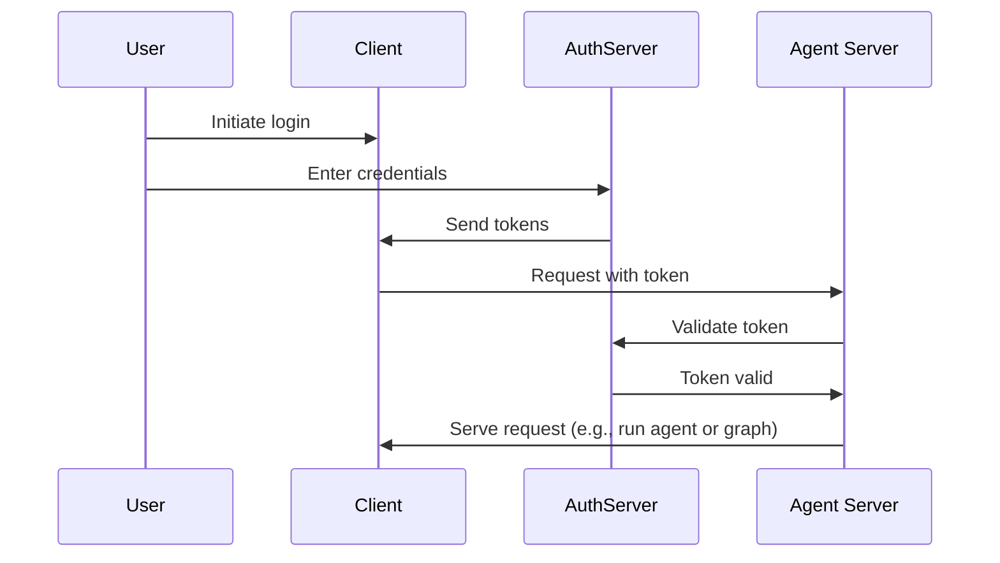

# 连接认证提供者

在上一篇教程中，您添加了资源授权，为用户提供私有对话。但是，您仍然使用硬编码的令牌进行认证，这不安全。现在，您将使用 OAuth2 将这些令牌替换为真实的用户账户。

您将保留相同的 `Auth` 对象和资源级访问控制，但将认证升级为使用 Supabase 作为身份提供者。虽然本教程中使用 Supabase，但这些概念适用于任何 OAuth2 提供者。您将学习如何：

1. 将测试令牌替换为真实的 JWT 令牌
2. 与 OAuth2 提供者集成以实现安全的用户认证
3. 处理用户会话和元数据，同时保持现有的授权逻辑

## 背景

OAuth2 涉及三个主要角色：

1. **授权服务器**：身份提供者（例如 Supabase、Auth0、Google），负责处理用户认证并颁发令牌
2. **应用后端**：您的 LangGraph 应用。它验证令牌并提供受保护的资源（对话数据）
3. **客户端应用**：用户与您的服务交互的 Web 或移动应用

标准的 OAuth2 流程大致如下：



## 前提条件

在开始本教程之前，请确保您具备：

- 能够无错误运行第二个教程中的机器人。
- 一个 Supabase 项目，用于其认证服务器。

## 1. 安装依赖

安装所需的依赖。从您的 `custom-auth` 目录开始，并确保已安装 `langgraph-cli`：

```bash
cd custom-auth
uv add "langgraph-cli[inmem]"
```

## 2. 设置认证提供者

接下来，获取您的认证服务器的 URL 和用于认证的私钥。由于您使用的是 Supabase，您可以在 Supabase 仪表板中执行此操作：

1. 在左侧边栏中，点击 ⚙️ "Project Settings"，然后点击 "API"
2. 复制您的项目 URL 并将其添加到您的 `.env` 文件中

```shell
echo "SUPABASE_URL=your-project-url" >> .env
```

3. 复制您的服务角色密钥并将其添加到您的 `.env` 文件中：

```shell
echo "SUPABASE_SERVICE_KEY=your-service-role-key" >> .env
```

4. 复制您的 "anon public" 密钥并记下来。稍后在设置客户端代码时将使用它。

```bash
SUPABASE_URL=your-project-url
SUPABASE_SERVICE_KEY=your-service-role-key
```

## 3. 实现令牌验证

在前面的教程中，您使用 `Auth` 对象来验证硬编码的令牌并添加资源所有权。

现在，您将升级认证以验证来自 Supabase 的真实 JWT 令牌。主要更改都将位于 `@auth.authenticate` 装饰的函数中：

- 您将不再检查硬编码的令牌列表，而是向 Supabase 发出 HTTP 请求以验证令牌。
- 您将从验证后的令牌中提取真实的用户信息（ID、电子邮件）。
- 现有的资源授权逻辑保持不变。

更新 `src/security/auth.py` 以实现此功能：

```python
import os
import httpx
from langgraph_sdk import Auth

auth = Auth()

# This is loaded from the `.env` file you created above
SUPABASE_URL = os.environ["SUPABASE_URL"]
SUPABASE_SERVICE_KEY = os.environ["SUPABASE_SERVICE_KEY"]

@auth.authenticate
async def get_current_user(authorization: str | None):
    """Validate JWT tokens and extract user information."""
    assert authorization
    scheme, token = authorization.split()
    assert scheme.lower() == "bearer"

    try:
        # Verify token with auth provider
        async with httpx.AsyncClient() as client:
            response = await client.get(
                f"{SUPABASE_URL}/auth/v1/user",
                headers={
                    "Authorization": authorization,
                    "apiKey": SUPABASE_SERVICE_KEY,
                },
            )
            assert response.status_code == 200
            user = response.json()
            return {
                "identity": user["id"],  # Unique user identifier
                "email": user["email"],
                "is_authenticated": True,
            }
    except Exception as e:
        raise Auth.exceptions.HTTPException(status_code=401, detail=str(e))

# ... the rest is the same as before

# Keep our resource authorization from the previous tutorial
@auth.on
async def add_owner(ctx, value):
    """Make resources private to their creator using resource metadata."""
    filters = {"owner": ctx.user.identity}
    metadata = value.setdefault("metadata", {})
    metadata.update(filters)
    return filters
```

最重要的变化是，我们现在使用真实的认证服务器来验证令牌。我们的认证处理程序拥有 Supabase 项目的私钥，我们可以使用它来验证用户的令牌并提取其信息。

## 4. 测试认证流程

让我们测试新的认证流程。您可以在文件或笔记本中运行以下代码。您需要提供：

- 一个有效的电子邮件地址
- 一个 Supabase 项目 URL（来自上面）
- 一个 Supabase anon **公钥**（也来自上面）

```python
import os
import httpx
from getpass import getpass
from langgraph_sdk import get_client

# Get email from command line
email = getpass("Enter your email: ")
base_email = email.split("@")
password = "secure-password"  # CHANGEME
email1 = f"{base_email[0]}+1@{base_email[1]}"
email2 = f"{base_email[0]}+2@{base_email[1]}"

SUPABASE_URL = os.environ.get("SUPABASE_URL")
if not SUPABASE_URL:
    SUPABASE_URL = getpass("Enter your Supabase project URL: ")

# This is your PUBLIC anon key (which is safe to use client-side)
# Do NOT mistake this for the secret service role key
SUPABASE_ANON_KEY = os.environ.get("SUPABASE_ANON_KEY")
if not SUPABASE_ANON_KEY:
    SUPABASE_ANON_KEY = getpass("Enter your public Supabase anon  key: ")

async def sign_up(email: str, password: str):
    """Create a new user account."""
    async with httpx.AsyncClient() as client:
        response = await client.post(
            f"{SUPABASE_URL}/auth/v1/signup",
            json={"email": email, "password": password},
            headers={"apiKey": SUPABASE_ANON_KEY},
        )
        assert response.status_code == 200
        return response.json()

# Create two test users
print(f"Creating test users: {email1} and {email2}")
await sign_up(email1, password)
await sign_up(email2, password)
```

⚠️ 继续之前：检查您的电子邮件并点击两个确认链接。Supabase 将拒绝 `/login` 请求，直到您确认了用户的电子邮件。

现在测试用户是否只能看到自己的数据。继续之前请确保服务器正在运行（运行 `langgraph dev`）。以下代码片段需要您之前在设置认证提供者时从 Supabase 仪表板复制的 "anon public" 密钥。

```python
async def login(email: str, password: str):
    """Get an access token for an existing user."""
    async with httpx.AsyncClient() as client:
        response = await client.post(
            f"{SUPABASE_URL}/auth/v1/token?grant_type=password",
            json={
                "email": email,
                "password": password
            },
            headers={
                "apikey": SUPABASE_ANON_KEY,
                "Content-Type": "application/json"
            },
        )
        assert response.status_code == 200
        return response.json()["access_token"]

# Log in as user 1
user1_token = await login(email1, password)
user1_client = get_client(
    url="http://localhost:2024", headers={"Authorization": f"Bearer {user1_token}"}
)

# Create a thread as user 1
thread = await user1_client.threads.create()
print(f"✅ User 1 created thread: {thread['thread_id']}")

# Try to access without a token
unauthenticated_client = get_client(url="http://localhost:2024")
try:
    await unauthenticated_client.threads.create()
    print("❌ Unauthenticated access should fail!")
except Exception as e:
    print("✅ Unauthenticated access blocked:", e)

# Try to access user 1's thread as user 2
user2_token = await login(email2, password)
user2_client = get_client(
    url="http://localhost:2024", headers={"Authorization": f"Bearer {user2_token}"}
)

try:
    await user2_client.threads.get(thread["thread_id"])
    print("❌ User 2 shouldn't see User 1's thread!")
except Exception as e:
    print("✅ User 2 blocked from User 1's thread:", e)
```

输出应如下所示：

```shell
✅ User 1 created thread: d6af3754-95df-4176-aa10-dbd8dca40f1a
✅ Unauthenticated access blocked: Client error '403 Forbidden' for url 'http://localhost:2024/threads'
✅ User 2 blocked from User 1's thread: Client error '404 Not Found' for url 'http://localhost:2024/threads/d6af3754-95df-4176-aa10-dbd8dca40f1a'
```

您的认证和授权正在协同工作：

1. 用户必须登录才能访问机器人
2. 每个用户只能看到自己的 threads

所有用户都由 Supabase 认证提供者管理，因此您不需要实现任何额外的用户管理逻辑。

## 后续步骤

您已成功为您的 LangGraph 应用构建了一个生产就绪的认证系统！让我们回顾一下您完成的工作：

1. 设置了一个认证提供者（本例中为 Supabase）
2. 添加了带有电子邮件/密码认证的真实用户账户
3. 将 JWT 令牌验证集成到您的 Agent Server 中
4. 实现了正确的授权，确保用户只能访问自己的数据
5. 创建了一个准备处理下一个认证挑战的基础

现在您已经有了生产认证，您可以考虑：

1. 使用您偏好的框架构建一个 Web UI（请参阅自定义认证模板获取示例）
2. 在认证概念指南中了解更多关于认证和授权的其他方面。
3. 阅读参考文档后进一步自定义您的处理程序和设置。