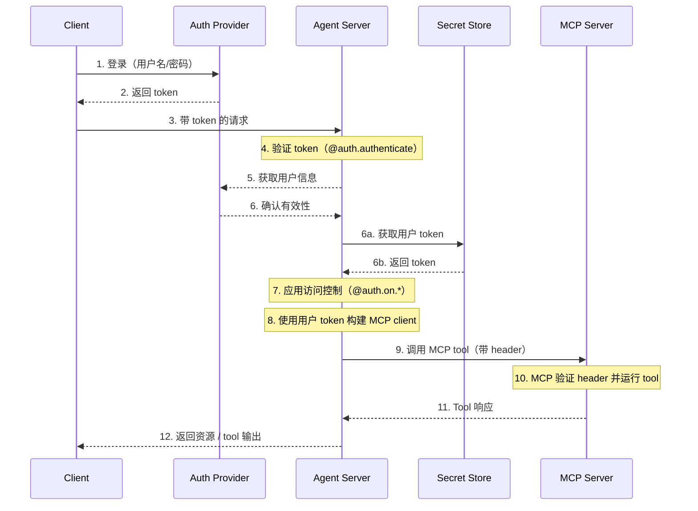

# Agent Server 中的 MCP 端点

模型上下文协议（Model Context Protocol, MCP）是一个开放协议，用于以模型无关的格式描述工具和数据源，使 LLM 能够通过结构化 API 发现并使用它们。

Agent Server 使用 Streamable HTTP 传输方式实现 MCP。这允许将 LangGraph **agent** 暴露为 **MCP tools**，使它们能够与任何支持 Streamable HTTP 且兼容 MCP 的客户端一起使用。

MCP 端点在 Agent Server 上的路径为 `/mcp`。

您可以设置自定义认证中间件，使用 MCP 服务器对用户进行身份验证，从而在 LangSmith 部署中获取用户作用域内的工具。

此流程的示例架构如下：



## 要求

要使用 MCP，请确保安装以下依赖项：

* `langgraph-api >= 0.2.3`
* `langgraph-sdk >= 0.1.61`

使用以下命令安装：

```bash
uv add "langgraph-api>=0.2.3" "langgraph-sdk>=0.1.61"
```

## 使用概览

启用 MCP：

* 升级使用 `langgraph-api>=0.2.3`。如果您正在部署 LangSmith，创建新的 revision 时将自动为您完成此操作。
* MCP tools（即 agent）将自动暴露。
* 使用任何支持 Streamable HTTP 且兼容 MCP 的客户端进行连接。

### 客户端

使用兼容 MCP 的客户端连接到 Agent Server。以下示例展示了如何使用不同编程语言进行连接。

使用以下命令安装适配器：

```bash
pip install langchain-mcp-adapters
```
以下是如何连接到远程 MCP 端点并将 agent 用作工具的示例：

```python
# 为 stdio 连接创建服务器参数
from mcp import ClientSession
from mcp.client.streamable_http import streamablehttp_client
import asyncio

from langchain_mcp_adapters.tools import load_mcp_tools
from langchain.agents import create_agent

server_params = {
    "url": "https://mcp-finance-agent.xxx.us.langgraph.app/mcp",
    "headers": {
        "X-Api-Key":"lsv2_pt_your_api_key"
    }
}

async def main():
    async with streamablehttp_client(**server_params) as (read, write, _):
        async with ClientSession(read, write) as session:
            # 初始化连接
            await session.initialize()

            # 加载远程 graph，就像加载工具一样
            tools = await load_mcp_tools(session)

            # 创建并运行一个使用这些工具的 react agent
            agent = create_agent("gpt-5.4", tools)

            # 调用 agent 并传入消息
            agent_response = await agent.ainvoke({"messages": "金融 agent 能为我做什么？"})
            print(agent_response)

if __name__ == "__main__":
    asyncio.run(main())
```

## 将 agent 暴露为 MCP tool

部署后，您的 agent 将在 MCP 端点中作为一个工具出现，具有以下配置：

* **Tool 名称**：agent 的名称。
* **Tool 描述**：agent 的描述。
* **Tool 输入 schema**：agent 的输入 schema。

### 设置名称和描述

您可以在 `langgraph.json` 中设置 agent 的名称和描述：

```json
{
    "graphs": {
        "my_agent": {
            "path": "./my_agent/agent.py:graph",
            "description": "A description of what the agent does"
        }
    },
    "env": ".env"
}
```

部署后，您可以使用 LangGraph SDK 更新名称和描述。

### Schema

定义清晰、最简的输入和输出 schema，避免将不必要的内部复杂性暴露给 LLM。

默认的 `MessagesState` 使用 `AnyMessage`，它支持多种消息类型，但对于直接暴露给 LLM 来说过于通用。

相反，请**定义自定义的 agent 或工作流**，使用明确类型的输入和输出结构。

例如，一个回答文档问题的 workflow 可能如下所示：

```python
from langgraph.graph import StateGraph, START, END
from typing_extensions import TypedDict

# 定义输入 schema
class InputState(TypedDict):
    question: str

# 定义输出 schema
class OutputState(TypedDict):
    answer: str

# 合并输入和输出
class OverallState(InputState, OutputState):
    pass

# 定义处理节点
def answer_node(state: InputState):
    # 替换为实际逻辑并执行有用操作
    return {"answer": "bye", "question": state["question"]}

# 使用明确的 schema 构建 graph
builder = StateGraph(OverallState, input_schema=InputState, output_schema=OutputState)
builder.add_node(answer_node)
builder.add_edge(START, "answer_node")
builder.add_edge("answer_node", END)
graph = builder.compile()

# 运行 graph
print(graph.invoke({"question": "hi"}))
```

更多详情，请参阅底层概念指南。

## 在部署中使用用户作用域的 MCP tools

**前提条件**
您已添加自定义认证中间件，该中间件会填充 `langgraph_auth_user` 对象，使其能够通过可配置上下文（configurable context）在 graph 的每个 node 中被访问。

要使作用域为用户（user-scoped）的工具在您的 LangSmith 部署中可用，请先实现类似下面的代码片段：

```python
from langchain_mcp_adapters.client import MultiServerMCPClient

def mcp_tools_node(state, config):
    user = config["configurable"].get("langgraph_auth_user")
         # user["github_token"], user["email"], 等.

    client = MultiServerMCPClient({
        "github": {
            "transport": "streamable_http", # (1)
            "url": "https://my-github-mcp-server/mcp", # (2)
            "headers": {
                "Authorization": f"Bearer {user['github_token']}"
            }
        }
    })
    tools = await client.get_tools() # (3)

    # 您的工具调用逻辑

    tool_messages = ...
    return {"messages": tool_messages}
```

1. MCP 仅支持向 `streamable_http` 和 `sse` 传输方式的服务器发出的请求添加 headers。
2. 您的 MCP server URL。
3. 从您的 MCP server 获取可用的 tools。

*这也可以通过运行时重建 graph 以对新运行使用不同配置来实现。*

## 会话行为

当前 LangGraph MCP 实现不支持会话。每个 `/mcp` 请求都是无状态且独立的。

## 认证

`/mcp` 端点使用与 LangGraph API 其余部分相同的认证方式。有关设置详情，请参阅认证指南。

## 禁用 MCP

要禁用 MCP 端点，请在 `langgraph.json` 配置文件中将 `disable_mcp` 设置为 `true`：

```json
{
  "$schema": "https://langgra.ph/schema.json",
  "http": {
    "disable_mcp": true
  }
}
```

这将阻止服务器暴露 `/mcp` 端点。