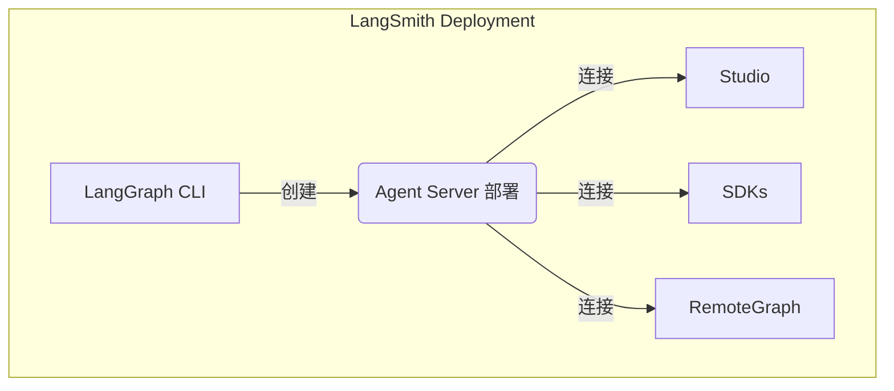

# LangSmith Deployment 组件

> Agent Server、LangGraph CLI、Studio、SDK、RemoteGraph、control plane 和 data plane 组件概述。

在自托管 LangSmith Deployment 时，您的安装包含几个关键组件。这些工具和服务共同提供了一个完整的解决方案，用于在您自己的基础设施中构建、部署和管理 **graph**（包括 agentic 应用）：

* **Agent Server**：定义了一套有观点的 API 和运行时，用于部署 **graph** 和 agent。它处理执行、状态管理和持久化，使您可以专注于构建业务逻辑，而不是服务器基础设施。
* **LangGraph CLI**：一个命令行界面，用于在本地构建、打包和交互 **graph**，并为部署做好准备。
* **Studio**：一个专门用于可视化、交互和调试的 IDE。连接到本地 Agent Server 以开发和测试您的 **graph**。
* **Python/JS SDK**：Python/JS SDK 提供了一种编程方式，用于从您的应用程序与已部署的 **graph** 和 agent 进行交互。
* **RemoteGraph**：允许您像在本地运行一样与已部署的 **graph** 进行交互。
* **Control Plane**：用于创建、更新和管理 Agent Server 部署的 UI 和 API。
* **Data plane**：执行 **graph** 的运行时层，包括 Agent Server、它们的支持服务（PostgreSQL、Redis 等），以及用于从 control plane 协调状态的监听器。