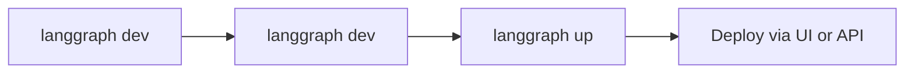

# 本地开发与测试

> 比较 `langgraph dev` 和 `langgraph up` 在 Agent Server 应用的本地开发和生产级测试中的用法。

本指南介绍如何在本地开发和测试 Agent Server 应用。LangGraph CLI 提供了两个用于本地开发的命令，分别针对工作流的不同阶段进行了优化：

- `langgraph dev`：轻量级开发服务器，用于快速迭代。
- `langgraph up`：类生产环境的测试服务器，用于验证。

| 特性                     | `langgraph dev`                                                        | `langgraph up`                                                                                |
| ------------------------ | ---------------------------------------------------------------------- | --------------------------------------------------------------------------------------------- |
| **需要 Docker**          | 否                                                                     | 是                                                                                            |
| **安装方式**             | `pip install langgraph-cli[inmem]`                                     | `pip install langgraph-cli`                                                                   |
| **主要用途**             | 快速开发与测试                                                          | 类生产环境的验证                                                                               |
| **状态持久化**           | 内存存储 + 本地目录 pickle                                             | PostgreSQL                                                                                    |
| **热重载**               | 是（默认）                                                              | 可选（`--watch` 标志）                                                                        |
| **默认端口**             | `2024`                                                                 | `8123`                                                                                        |
| **资源占用**             | 轻量                                                                   | 较重（构建并运行多个独立的 Docker 容器：服务器、PostgreSQL、Redis）                              |
| **IDE 调试**             | 内置 DAP 支持                                                          | 常规容器调试                                                                                  |
| **自定义认证**           | 是                                                                     | 是（需要 license key）                                                                        |

完整的参考信息请查阅 LangGraph CLI 参考页面。

## 开发流程

以下是构建应用时的典型工作流：



| 阶段                     | 工具                         | 目的                                   |
| ------------------------ | ---------------------------- | -------------------------------------- |
| **开发与本地测试**        | `langgraph dev`              | 编写和迭代 graph，支持热重载             |
| **验证**                 | `langgraph up`               | 测试类生产环境的行为，使用完整技术栈       |
| **部署**                 | `langgraph deploy`           | 有信心地部署到生产环境                   |

### 推荐工作流

1. **日常开发**：使用 `langgraph dev` 进行快速迭代。
2. **定期验证**：对重大更改使用 `langgraph up` 进行测试。
3. **部署前检查**：运行 `langgraph up --recreate` 进行全新构建。
4. **部署**：通过 LangSmith UI 或 Control Plane API 推送到生产环境。

## `langgraph dev`

`langgraph dev` 命令直接在您的环境中运行一个轻量级服务器，专为活跃开发时的速度和便利性而设计。主要特性包括：

- **无需 Docker**：直接在您的环境中运行。
- **热重载**：代码更改时自动重载。
- **启动快速**：几秒钟内就绪。
- **内置调试适配器协议（DAP）支持**：将 IDE 调试器附加到服务器，实现行级断点和调试。
- **本地存储**：状态持久化到本地目录。

`dev` 服务器使用与生产环境相同的集成测试套件进行测试，确保在开发期间使用最少资源的同时行为一致。

**使用langgraph dev 启动服务器**

开始之前，请确保您已具备：

- LangSmith 的 API 密钥（免费注册）。
- Python 使用 `uv`，TypeScript 使用 `npx`。
1. 创建 langgraph 应用：
使用 `new-langgraph-project-python` 模板或 `new-langgraph-project-js` 模板创建一个新应用。该模板展示了一个单节点应用，您可以基于它扩展自己的逻辑。

```shell
uvx --from langgraph-cli@latest langgraph new path/to/your/app --template new-langgraph-project-python
```

**其他模板**
    如果在 `langgraph new` 时不指定模板，将会出现交互式菜单，允许您从可用模板列表中选择。
2. 安装依赖：
```shell
cd path/to/your/app
uv sync --dev -U
```
3. 启动服务器：
```shell
uv run langgraph dev
```

示例输出：

```
>    Ready!
>
>    - API: http://localhost:2024
>
>    - Docs: http://localhost:2024/docs
>
>    - Studio Web UI: https://smith.langchain.com/studio/?baseUrl=http://127.0.0.1:2024

```
4. 测试 api：
异步调用：
    1. 安装 LangGraph Python SDK：

    ```shell
    pip install langgraph-sdk
    ```

    2. 向助手发送消息（无线程运行）：

    ```python
    from langgraph_sdk import get_client
    import asyncio

    client = get_client(url="http://localhost:2024")

    async def main():
        async for chunk in client.runs.stream(
            None,  # Threadless run
            "agent", # Name of assistant. Defined in langgraph.json.
            input={
            "messages": [{
                "role": "human",
                "content": "What is LangGraph?",
                }],
            },
        ):
            print(f"Receiving new event of type: {chunk.event}...")
            print(chunk.data)
            print("\n\n")

    asyncio.run(main())
    ```
同步调用：
    1. 安装 LangGraph Python SDK：

    ```shell
    pip install langgraph-sdk
    ```

    2. 向助手发送消息（无线程运行）：

    ```python
    from langgraph_sdk import get_sync_client

    client = get_sync_client(url="http://localhost:2024")

    for chunk in client.runs.stream(
        None,  # Threadless run
        "agent", # Name of assistant. Defined in langgraph.json.
        input={
            "messages": [{
                "role": "human",
                "content": "What is LangGraph?",
            }],
        },
        stream_mode="messages-tuple",
    ):
        print(f"Receiving new event of type: {chunk.event}...")
        print(chunk.data)
        print("\n\n")
    ```
### 使用场景

将 `langgraph dev` 作为主要开发工具，用于：

- **日常功能开发**：更改代码后服务器自动重载。无需重建容器即可立即测试——非常适合快速迭代周期。

- **快速原型和实验**：几秒内启动服务器，无需 Docker 设置开销即可测试想法。

- **没有 Docker 的环境**：在 CI/CD 管道或轻量级虚拟机中，Docker 不可用时：
```bash
langgraph dev --no-browser
```

- **调试器附加**：使用 `--debug-port` 将 IDE 调试器附加到服务器，在开发过程中进行单步调试。

## `langgraph up`

`langgraph up` 命令编排一个完整的基于 Docker 的技术栈，镜像生产基础设施，帮助在生产之前发现部署问题。主要特性包括：

- **验证构建和依赖**：测试构建过程和依赖项。
- **隔离的网络**：真实的容器网络。
- **生产验证**：验证部署就绪状态。

**使用langgraph up 启动服务器：**
```bash
# 确保 Docker 正在运行
docker ps

# 启动类生产环境的技术栈
langgraph up
```

您的服务器将在 `http://localhost:8123` 启动，具有完整的持久化存储。

### 使用场景

使用 `langgraph up` 进行验证和生产就绪性测试：

- **部署前验证**：在部署到生产环境之前，使用全新构建进行最终检查，确保所有依赖项都正确指定。

```bash
langgraph up --recreate
```

这可以捕获与容器内依赖解析相关的任何问题，以及其他构建过程中的问题。

- **重大功能验证**：在实现重大更改后，定期使用完整生产技术栈进行测试，确保在容器化环境中一切正常。

- **Docker 故障排除**：调试仅在生产环境中出现的容器特定问题、网络问题或环境变量配置时。

## 部署前检查清单

在部署应用之前，使用 `langgraph up` 验证以下事项：

- 所有依赖项在容器内正确安装。
- 应用启动无错误。
- Graph 成功执行。
- 所有环境变量正常工作。
- 认证/授权按预期工作。

## 依赖项配置

`langgraph dev` 和 `langgraph up` 都从配置文件中读取应用的依赖项，但它们在不同的环境中运行：

- **`langgraph dev`** 直接在本地环境（Python 或 Node.js）中运行代码，无需 Docker。
- **`langgraph up`** 构建一个 Docker 容器，并在该隔离容器内运行代码。

正确配置依赖项可确保两个命令都能正常工作，并且本地测试的内容与部署到生产环境的内容匹配。

### `langgraph.json` 文件

`dependencies` 字段告诉 CLI **在哪里**查找应用代码。`dependencies` 字段可以指向：

- **包含包配置文件的目录**（包含 `pyproject.toml`、`setup.py`、`requirements.txt` 或 `package.json`）
- **特定的子目录**：`"dependencies": ["./my_agent"]`
- **特定的包**：`"dependencies": ["my-package==1.0.0"]`（Python）或 `"dependencies": ["my-package@1.0.0"]`（JavaScript）

```json
{
    "dependencies": ["."],
    "graphs": {
    "my_agent": "./my_agent/agent.py:graph"
    },
    "env": "./.env"
}
```

### 包依赖文件

这些文件定义了应用**需要**哪些包：

**pyproject.toml 示例：**

```toml
[project]
name = "my-agent"
version = "0.1.0"
dependencies = [
    "langchain-openai",
    "langchain-anthropic",
    "langgraph",
]
```

**requirements.txt 示例：**

```
langchain-openai
langchain-anthropic
langgraph
```

### 依赖项解析过程

当您运行 `langgraph up` 时，CLI 会按照以下步骤安装应用的依赖项：

1. `langgraph.json` 告诉 CLI **在哪里**查找应用代码。`dependencies: ["."]` 字段指向当前目录。
2. **查找包配置文件**：CLI 在该目录中查找包配置文件（`pyproject.toml`、`requirements.txt` 或 `package.json`）。
3. **读取依赖项列表**：CLI 从配置文件中读取包列表。
4. **安装包**：CLI 使用适合您语言的包管理器（Python 使用 `uv` 或 `pip`，JavaScript 使用 `npm`）安装所有包。

这种双文件方法分离了关注点：**`langgraph.json` 处理应用结构和位置，而`pyproject.toml`等文件处理特定语言的包依赖项。**

有关安装程序的更多信息，请参阅 CLI 配置文件。

### 故障排除

如果遇到依赖项安装问题，请尝试切换到 `pip`：

```json
{
  "dependencies": ["."],
  "pip_installer": "pip"
}
```

然后重新构建：

```bash
langgraph up --recreate
```

## 调试本地 Docker 设置

即使 `langgraph up` 在本地计算机上失败，生产部署也可能成功。这是因为生产环境使用托管基础设施，而 `langgraph up` 在本地计算机上运行完整技术栈。

以下是常见的本地环境问题，它们不会影响生产环境。

### Docker 配置问题

`langgraph up` 需要在本地有 Docker：

```bash
# 检查 Docker 是否正在运行
docker ps
```

云部署不使用您本地的 Docker。

**解决方案**：安装 Docker，或者使用 `langgraph dev` 进行本地测试。

### 端口冲突

`langgraph up` 使用的端口 `8123`、`5432` 和 `6379` 可能已被占用：

```bash
# 检查冲突
lsof -i :8123  # API server
lsof -i :5432  # PostgreSQL
lsof -i :6379  # Redis
```

**解决方案**：停止冲突的服务，或使用 `--port` 标志。

### 资源限制

`langgraph up` 需要更多 RAM 和磁盘空间用于：

- PostgreSQL 容器
- Redis 容器
- API 服务器容器

**解决方案**：释放资源或使用 `langgraph dev`。

### 网络配置

VPN 连接、防火墙规则或公司代理设置可能影响本地 Docker 网络。

**解决方案**：使用 `langgraph dev` 进行测试，或暂时禁用 VPN/防火墙以隔离问题。

## 后续步骤

现在您已经在本地运行了一个 LangGraph 应用，可以准备部署它：

**为 LangSmith 选择托管选项：**

- **云**：最快设置，完全托管（推荐）。
- **自托管**：在您的基础设施中完全控制。

更多详情，请参阅 Platform 设置对比。

**然后部署您的应用：**

- 部署到云快速入门：快速设置指南。
- 完整的云设置指南：全面的部署文档。

**探索功能：**

- **Studio**：使用 Studio UI 可视化、交互和调试您的应用。尝试 Studio 快速入门。
- **API 参考**：LangSmith Deployment API、Python SDK、JS/TS SDK

## 相关资源

- CLI 参考：所有 CLI 命令的详细文档
- 应用结构：如何构建您的 LangGraph 应用
- 故障排除：常见问题与解决方案
- 使用 pyproject.toml 进行设置：配置 Python 依赖项
- 使用 requirements.txt 进行设置：替代依赖项配置