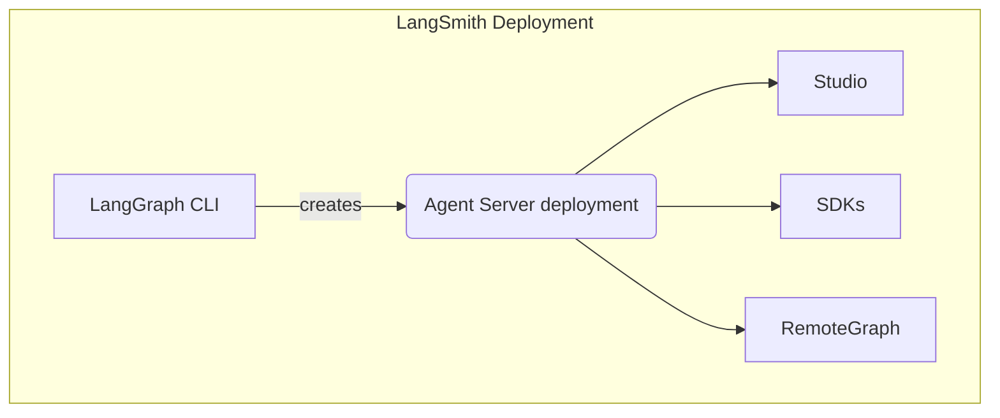

# LangSmith Studio

**前置要求**

- LangSmith
- Agent Server
- LangGraph CLI

Studio 是一个专门的代理 IDE，能够可视化、交互和调试实现了 Agent Server API 协议的代理系统。Studio 还与跟踪、评估和 prompt 工程集成。

## 功能

Studio 的主要功能：

- 可视化您的 graph 架构
- 运行并与您的代理交互
- 管理 assistants
- 管理 threads
- 迭代 prompts
- 在 dataset 上运行实验
- 管理长期记忆
- 通过 time travel 调试代理状态
- 一键部署到 LangSmith Cloud

Studio 适用于部署在 LangSmith 上的 graphs，也适用于通过 Agent Server 本地运行的 graphs。

Studio 支持两种模式：

### Graph 模式

Graph 模式暴露完整的功能集，当您希望获得有关代理执行的大量详细信息（包括遍历的节点、中间状态和 LangSmith 集成（例如添加到 dataset 和 playground））时非常有用。

### Chat 模式

Chat 模式是一个更简单的 UI，用于迭代和测试特定于聊天的代理。它适用于业务用户以及希望测试整体代理行为的用户。Chat 模式仅适用于状态包含或扩展 `MessagesState` 的 graph。

## 从 Studio 部署

直接从 Studio 将本地测试的 graphs 一键部署到 LangSmith Cloud。您可以使用它为快速原型创建全新的部署，或者重新部署现有部署。

## 了解更多

- 请参阅此指南以开始使用 Studio。

