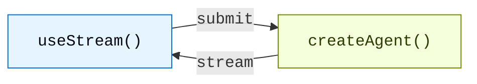

# Overview

> Build generative UIs with real-time streaming from LangChain agents

Build rich, interactive frontends for agents created with `createAgent`. These patterns cover everything from basic message rendering to advanced workflows like human-in-the-loop approval and time travel debugging.

## Architecture

Every pattern follows the same architecture: a `createAgent` backend streams state to a frontend via the `useStream` hook.



On the backend, `createAgent` produces a compiled LangGraph graph that exposes a streaming API. On the frontend, the `useStream` hook connects to that API and provides reactive state — messages, tool calls, interrupts, history, and more — that you render with any framework.

<CodeGroup>
  ```python agent.py theme={"theme":{"light":"catppuccin-latte","dark":"catppuccin-mocha"}}
  from langchain import create_agent
  from langgraph.checkpoint.memory import MemorySaver

  agent = create_agent(
      model="openai:gpt-5.4",
      tools=[get_weather, search_web],
      checkpointer=MemorySaver(),
  )
  ```

  ```ts types.ts theme={"theme":{"light":"catppuccin-latte","dark":"catppuccin-mocha"}}
  export interface GraphState {
    messages: BaseMessage[];
  }
  ```

  ```tsx Chat.tsx theme={"theme":{"light":"catppuccin-latte","dark":"catppuccin-mocha"}}
  import { useStream } from "@langchain/react";
  import type { GraphState } from "./types";

  function Chat() {
    const stream = useStream<GraphState>({
      apiUrl: "http://localhost:2024",
      assistantId: "agent",
    });

    return (
      <div>
        {stream.messages.map((msg) => (
          <Message key={msg.id} message={msg} />
        ))}
      </div>
    );
  }
  ```
</CodeGroup>

`useStream` is available for React, Vue, Svelte, and Angular:

```ts theme={"theme":{"light":"catppuccin-latte","dark":"catppuccin-mocha"}}
import { useStream } from "@langchain/react";   // React
import { useStream } from "@langchain/vue";      // Vue
import { useStream } from "@langchain/svelte";   // Svelte
import { useStream } from "@langchain/angular";  // Angular
```

## Patterns

### Render messages and output

<CardGroup cols={3}>
  <Card title="Markdown messages" icon="markdown" href="/oss/python/langchain/frontend/markdown-messages">
    Parse and render streamed markdown with proper formatting and code highlighting.
  </Card>

  <Card title="Structured output" icon="layout-grid" href="/oss/python/langchain/frontend/structured-output">
    Render typed agent responses as custom UI components instead of plain text.
  </Card>

  <Card title="Reasoning tokens" icon="brain" href="/oss/python/langchain/frontend/reasoning-tokens">
    Display model thinking processes in collapsible blocks.
  </Card>

  <Card title="Generative UI" icon="wand" href="/oss/python/langchain/frontend/generative-ui">
    Render AI-generated user interfaces from natural language prompts using json-render.
  </Card>
</CardGroup>

### Display agent actions

<CardGroup cols={3}>
  <Card title="Tool calling" icon="tool" href="/oss/python/langchain/frontend/tool-calling">
    Show tool calls as rich, type-safe UI cards with loading and error states.
  </Card>

  <Card title="Human-in-the-loop" icon="user-check" href="/oss/python/langchain/frontend/human-in-the-loop">
    Pause the agent for human review with approve, reject, and edit workflows.
  </Card>
</CardGroup>

### Manage conversations

<CardGroup cols={3}>
  <Card title="Branching chat" icon="git-branch" href="/oss/python/langchain/frontend/branching-chat">
    Edit messages, regenerate responses, and navigate conversation branches.
  </Card>

  <Card title="Message queues" icon="list-check" href="/oss/python/langchain/frontend/message-queues">
    Queue multiple messages while the agent processes them sequentially.
  </Card>
</CardGroup>

### Advanced streaming

<CardGroup cols={3}>
  <Card title="Join & rejoin streams" icon="plug-connected" href="/oss/python/langchain/frontend/join-rejoin">
    Disconnect from and reconnect to running agent streams without losing progress.
  </Card>

  <Card title="Time travel" icon="clock" href="/oss/python/langchain/frontend/time-travel">
    Inspect, navigate, and resume from any checkpoint in the conversation history.
  </Card>
</CardGroup>

## Integrations

`useStream` is UI-agnostic. Use it to any component library or generative UI framework.

<CardGroup cols={3}>
  <Card title="AI Elements" icon="package" href="/oss/python/langchain/frontend/integrations/ai-elements">
    Composable shadcn/ui components for AI chat: `Conversation`, `Message`, `Tool`, `Reasoning`.
  </Card>

  <Card title="assistant-ui" icon="package" href="/oss/python/langchain/frontend/integrations/assistant-ui">
    Headless React framework with built-in thread management, branching, and attachment support.
  </Card>

  <Card title="OpenUI" icon="package" href="/oss/python/langchain/frontend/integrations/openui">
    Generative UI library for data-rich reports and dashboards using the openui-lang component DSL.
  </Card>
</CardGroup>

***
