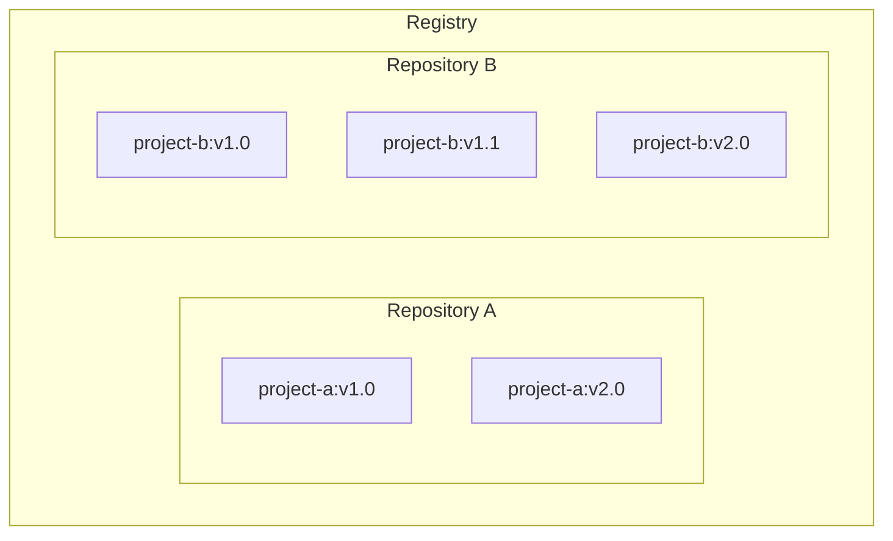

# What is a registry?（什么是 Registry？）

## 解释

现在你已经知道了什么是 Container Image 以及它是如何工作的，你可能会想——这些 Image 应该存储在哪里？

你可以将 Container Image 存储在本地计算机系统上，但如果你想与朋友分享，或者在另一台机器上使用它们呢？这时候就需要 Image Registry（镜像仓库）了。

**Image Registry** 是一个用于存储和共享 Container Image 的中心化位置。它可以是公共的（public）或私有的（private）。[Docker Hub](https://hub.docker.com) 是一个任何人都可以使用的公共 Registry，也是默认的 Registry。

虽然 Docker Hub 是一个流行的选择，但如今还有许多其他可用的 Container Registry，包括 [Amazon Elastic Container Registry (ECR)](https://aws.amazon.com/ecr/)、[Azure Container Registry (ACR)](https://azure.microsoft.com/en-in/products/container-registry) 和 [Google Container Registry (GCR)](https://cloud.google.com/artifact-registry)。你甚至可以在本地系统或组织内部运行自己的私有 Registry，例如 Harbor、JFrog Artifactory、GitLab Container Registry 等。

### Registry 与 Repository 的区别

在使用 Registry 时，你可能会听到 _registry_ 和 _repository_ 这两个词被混用。尽管它们相关，但并不完全相同。

**Registry** 是存储和管理 Container Image 的中心化位置，而 **Repository** 是 Registry 中一组相关的 Container Image 的集合。可以把它看作是一个文件夹，你根据项目来组织你的 Image。每个 Repository 包含一个或多个 Container Image。

下图展示了 Registry、Repository 和 Image 之间的关系。



> [!TIP]
>
> Docker Personal 计划提供一个私有 Repository 和无限个公共 Repository。要获得无限私有 Repository，请升级到 [Docker Team 计划](https://www.docker.com/pricing?ref=Docs&refAction=DocsConceptsRegistry)。

## 动手试一试

在本动手环节中，你将学习如何构建一个 Docker Image 并将其推送到 Docker Hub Repository。

### 注册一个免费的 Docker 账户

1. 如果你还没有创建账户，请前往 [Docker Hub](https://hub.docker.com) 页面注册一个新的 Docker 账户。请务必完成发送到你的电子邮件的验证步骤。

   你可以使用 Google 或 GitHub 账户进行身份验证。

### 创建你的第一个 Repository

1. 登录 [Docker Hub](https://hub.docker.com)。
2. 选择右上角的 **Create repository** 按钮。
3. 选择你的命名空间（很可能就是你的用户名），并输入 `docker-quickstart` 作为 Repository 名称。
4. 将可见性设置为 **Public**。
5. 选择 **Create** 按钮来创建 Repository。

就这样。你已经成功创建了你的第一个 Repository。🎉

这个 Repository 目前是空的。现在你将通过推送一个 Image 来解决这个问题。

### 登录 Docker Desktop

1. 如果尚未安装，请[下载并安装](https://www.docker.com/products/docker-desktop/) Docker Desktop。
2. 在 Docker Desktop GUI 中，选择右上角的 **Sign in** 按钮。

### 克隆示例 Node.js 代码

为了创建一个 Image，你首先需要有一个项目。为了让你快速上手，你将使用一个位于 [github.com/dockersamples/helloworld-demo-node](https://github.com/dockersamples/helloworld-demo-node) 的示例 Node.js 项目。这个仓库包含一个预构建的 Dockerfile，用于构建 Docker Image。

不用担心 Dockerfile 的具体细节，你将在后面的部分中学习到这些。

1. 使用以下命令克隆 GitHub 仓库：

   ```console
   git clone https://github.com/dockersamples/helloworld-demo-node
   ```

2. 进入新创建的目录：

   ```console
   cd helloworld-demo-node
   ```

3. 运行以下命令来构建一个 Docker Image，将 `<YOUR_DOCKER_USERNAME>` 替换为你的用户名：

   ```console
   docker build -t <YOUR_DOCKER_USERNAME>/docker-quickstart .
   ```

   > [!NOTE]
   >
   > 确保在 `docker build` 命令的末尾包含点号（.）。这告诉 Docker 在哪里找到 Dockerfile。

4. 运行以下命令列出新创建的 Docker Image：

   ```console
   docker images
   ```

   你会看到类似下面的输出：

   ```console
   REPOSITORY                                 TAG       IMAGE ID       CREATED         SIZE
   <YOUR_DOCKER_USERNAME>/docker-quickstart   latest    476de364f70e   2 minutes ago   170MB
   ```

5. 通过运行以下命令启动一个 Container 来测试该 Image（将用户名替换为你自己的用户名）：

   ```console
   docker run -d -p 8080:8080 <YOUR_DOCKER_USERNAME>/docker-quickstart
   ```

   你可以通过浏览器访问 [http://localhost:8080](http://localhost:8080) 来验证 Container 是否正常工作。

6. 使用 [`docker tag`](/reference/cli/docker/image/tag/) 命令为 Docker Image 打标签。Docker 标签允许你为 Image 添加标签和版本。

   ```console
   docker tag <YOUR_DOCKER_USERNAME>/docker-quickstart <YOUR_DOCKER_USERNAME>/docker-quickstart:1.0
   ```

7. 最后，使用 [`docker push`](/reference/cli/docker/image/push/) 命令将新构建的 Image 推送到你的 Docker Hub Repository：

   ```console
   docker push <YOUR_DOCKER_USERNAME>/docker-quickstart:1.0
   ```

8. 打开 [Docker Hub](https://hub.docker.com) 并导航到你的 Repository。导航到 **Tags** 部分，查看你新推送的 Image。

在本演练中，你注册了一个 Docker 账户，创建了你的第一个 Docker Hub Repository，并构建、打标签和推送了一个 Container Image 到你的 Docker Hub Repository。
