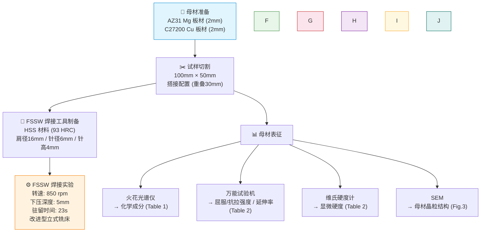

```mermaid
%%{init: {
  'theme': 'base',
  'themeVariables': {
    'background': '#181c26',        /* 画布底色：深蓝灰 */
    'primaryColor': '#293241',      /* 节点底色 */
    'primaryBorderColor': '#5e86bd',/* 节点边框色（浅蓝） */
    'primaryTextColor': '#dce6f0',  /* 节点内文字颜色 */
    'lineColor': '#5e86bd',         /* 连线颜色 */
    'fontFamily': 'sans-serif'
  },
  'flowchart': {
    'curve': 'step'                 /* 强制直角连线 (stepBefore/stepAfter 也可以尝试) */
  }
}}%% 
flowchart TB
    A["🔬 母材准备<br/>AZ31 Mg 板材 (2mm)<br/>C27200 Cu 板材 (2mm)"] --> B["✂️ 试样切割<br/>100mm × 50mm<br/>搭接配置 (重叠30mm)"]

    B --> C["🔧 FSSW 焊接工具制备<br/>HSS 材料 (93 HRC)<br/>肩径16mm / 针径6mm / 针高4mm"]

    B --> D["📊 母材表征"]

    D --> D1["火花光谱仪<br/>→ 化学成分 (Table 1)"]
    D --> D2["万能试验机<br/>→ 屈服/抗拉强度 / 延伸率<br/>(Table 2)"]
    D --> D3["维氏硬度计<br/>→ 显微硬度 (Table 2)"]
    D --> D4["SEM<br/>→ 母材晶粒结构 (Fig.3)"]

    C --> E["⚙️ FSSW 焊接实验<br/>转速: 850 rpm<br/>下压深度: 5mm<br/>驻留时间: 23s<br/>改进型立式铣床"]

    
    style A fill:#e1f5fe,stroke:#0288d1
    style E fill:#fff3e0,stroke:#f57c00
    style F fill:#e8f5e9,stroke:#388e3c
    style G fill:#fce4ec,stroke:#c62828
    style H fill:#f3e5f5,stroke:#7b1fa2
    style I fill:#fff8e1,stroke:#f9a825
    style J fill:#e0f2f1,stroke:#00695c
```