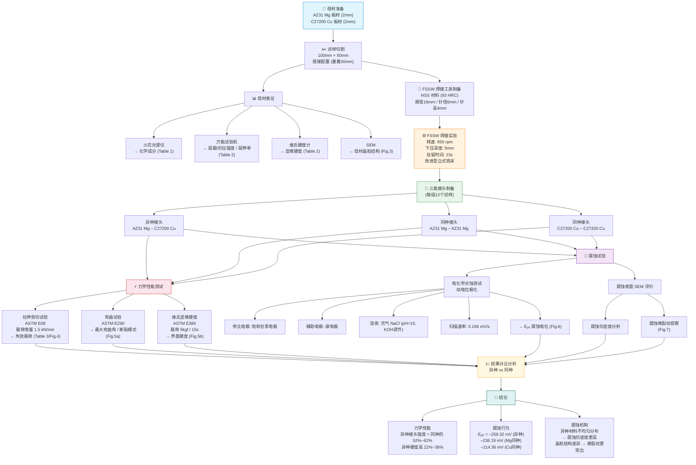

```mermaid
%%{init: {
  'theme': 'base',
  'themeVariables': {
    'background': '#181c26',        /* 画布底色：深蓝灰 */
    'primaryColor': '#293241',      /* 节点底色 */
    'primaryBorderColor': '#5e86bd',/* 节点边框色（浅蓝） */
    'primaryTextColor': '#dce6f0',  /* 节点内文字颜色 */
    'lineColor': '#5e86bd',         /* 连线颜色 */
    'fontFamily': 'sans-serif'
  },
  'flowchart': {
    'curve': 'step'                 /* 强制直角连线 (stepBefore/stepAfter 也可以尝试) */
  }
}}%% 
flowchart TB
    A["🔬 母材准备<br/>AZ31 Mg 板材 (2mm)<br/>C27200 Cu 板材 (2mm)"] --> B["✂️ 试样切割<br/>100mm × 50mm<br/>搭接配置 (重叠30mm)"]

    B --> C["🔧 FSSW 焊接工具制备<br/>HSS 材料 (93 HRC)<br/>肩径16mm / 针径6mm / 针高4mm"]

    B --> D["📊 母材表征"]

    D --> D1["火花光谱仪<br/>→ 化学成分 (Table 1)"]
    D --> D2["万能试验机<br/>→ 屈服/抗拉强度 / 延伸率<br/>(Table 2)"]
    D --> D3["维氏硬度计<br/>→ 显微硬度 (Table 2)"]
    D --> D4["SEM<br/>→ 母材晶粒结构 (Fig.3)"]

    C --> E["⚙️ FSSW 焊接实验<br/>转速: 850 rpm<br/>下压深度: 5mm<br/>驻留时间: 23s<br/>改进型立式铣床"]

    E --> F["🔗 三类接头制备<br/>(每组12个试样)"]

    F --> F1["异种接头<br/>AZ31 Mg – C27200 Cu"]
    F --> F2["同种接头<br/>AZ31 Mg – AZ31 Mg"]
    F --> F3["同种接头<br/>C27200 Cu – C27200 Cu"]

    F1 & F2 & F3 --> G["⚡ 力学性能测试"]

    G --> G1["拉伸剪切试验<br/>ASTM E08<br/>载荷增量 1.5 kN/min<br/>→ 失效载荷 (Table 3/Fig.4)"]
    G --> G2["弯曲试验<br/>ASTM E290<br/>→ 最大弯曲角 / 断裂模式<br/>(Fig.5a)"]
    G --> G3["维氏显微硬度<br/>ASTM E384<br/>载荷 5kgf / 15s<br/>→ 界面硬度 (Fig.5b)"]

    F1 & F2 & F3 --> H["🧪 腐蚀试验"]

    H --> H1["电化学点蚀测试<br/>动电位极化"]
    H1 --> H1a["参比电极: 饱和甘汞电极"]
    H1 --> H1b["辅助电极: 碳电极"]
    H1 --> H1c["溶液: 充气 NaCl (pH=10, KOH调节)"]
    H1 --> H1d["扫描速率: 0.166 mV/s"]
    H1 --> H1e["→ Eₚᵢₜ 腐蚀电位 (Fig.6)"]

    H --> H2["腐蚀表面 SEM 评价"]
    H2 --> H2a["腐蚀坑密度分析"]
    H2 --> H2b["腐蚀微裂纹观察<br/>(Fig.7)"]

    G1 & G2 & G3 & H1e & H2a & H2b --> I["📈 结果对比分析<br/>异种 vs 同种"]

    I --> J["🎯 结论"]

    J --> J1["力学性能<br/>异种接头强度 ≈ 同种的 52%~62%<br/>异种硬度高 22%~36%"]
    J --> J2["腐蚀行为<br/>Eₚᵢₜ = –259.32 mV (异种)<br/>–236.19 mV (Mg同种)<br/>–214.36 mV (Cu同种)"]
    J --> J3["腐蚀机制<br/>异种材料不均匀分布<br/>→ 腐蚀坑密度更高<br/>晶粒结构差异 → 微裂纹更突出"]

    style A fill:#e1f5fe,stroke:#0288d1
    style E fill:#fff3e0,stroke:#f57c00
    style F fill:#e8f5e9,stroke:#388e3c
    style G fill:#fce4ec,stroke:#c62828
    style H fill:#f3e5f5,stroke:#7b1fa2
    style I fill:#fff8e1,stroke:#f9a825
    style J fill:#e0f2f1,stroke:#00695c
```