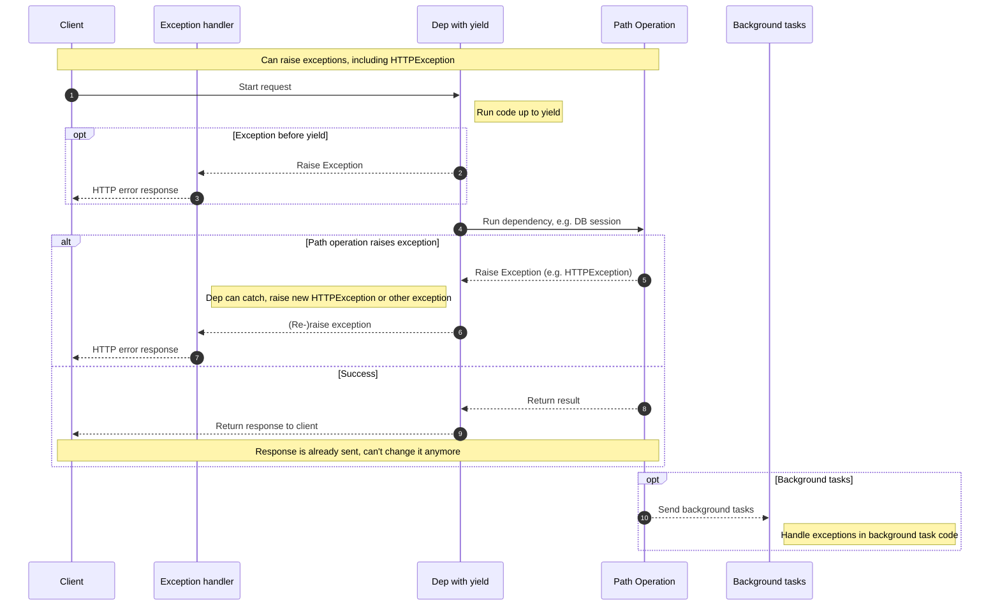

# 使用 yield 的依赖项

FastAPI 支持那些在完成后执行一些额外步骤的依赖项。

为此，使用 `yield` 而不是 `return`，并把这些额外步骤（代码）写在后面。
***
提示

确保在每个依赖里只使用一次 `yield`。

技术细节

任何可以与以下装饰器一起使用的函数：

- `@contextlib.contextmanager` 或
- `@contextlib.asynccontextmanager`

都可以作为 **FastAPI** 的依赖项。

实际上，FastAPI 在内部就是用的这两个装饰器。
***
## 使用 `yield` 的数据库依赖项

例如，你可以用这种方式创建一个数据库会话，并在完成后将其关闭。

在创建响应之前，只会执行 `yield` 语句及其之前的代码：

```python
async def get_db():
    db = DBSession()
    try:
        yield db
    finally:
        db.close()
```

`yield` 产生的值会注入到 _路径操作_ 和其他依赖项中：

```python
async def get_db():
    db = DBSession()
    try:
        yield db
    finally:
        db.close()
```

`yield` 语句后面的代码会在响应之后执行：
```python
async def get_db():
    db = DBSession()
    try:
        yield db
    finally:
        db.close()
```
***
提示

你可以使用 `async` 或普通函数。

**FastAPI** 会像处理普通依赖一样对它们进行正确处理。
***
## 同时使用 `yield` 和 `try` 的依赖项

如果你在带有 `yield` 的依赖中使用了 `try` 代码块，那么当使用该依赖时抛出的任何异常你都会收到。

例如，如果在中间的某处代码中（在另一个依赖或在某个 _路径操作_ 中）发生了数据库事务“回滚”或产生了其他异常，你会在你的依赖中收到这个异常。

因此，你可以在该依赖中用 `except SomeException` 来捕获这个特定异常。

同样地，你可以使用 `finally` 来确保退出步骤一定会被执行，无论是否发生异常。

```python
async def get_db():
    db = DBSession()
    try:
        yield db
    finally:
        db.close()
```

## 使用 `yield` 的子依赖项

你可以声明任意大小和形状的子依赖及其“树”，其中任意一个或全部都可以使用 `yield`。

**FastAPI** 会确保每个带有 `yield` 的依赖中的“退出代码”按正确的顺序运行。

例如，`dependency_c` 可以依赖 `dependency_b`，而 `dependency_b` 则依赖 `dependency_a`：

```python
from typing import Annotated
from fastapi import Depends

async def dependency_a():
    dep_a = generate_dep_a()
    try:
        yield dep_a
    finally:
        dep_a.close()

async def dependency_b(dep_a: Annotated[DepA, Depends(dependency_a)]):
    dep_b = generate_dep_b()
    try:
        yield dep_b
    finally:
        dep_b.close(dep_a)

async def dependency_c(dep_b: Annotated[DepB, Depends(dependency_b)]):
    dep_c = generate_dep_c()
    try:
        yield dep_c
    finally:
        dep_c.close(dep_b)
```

并且它们都可以使用 `yield`。

在这种情况下，`dependency_c` 在执行其退出代码时需要 `dependency_b`（此处命名为 `dep_b`）的值仍然可用。

而 `dependency_b` 又需要 `dependency_a`（此处命名为 `dep_a`）的值在其退出代码中可用。
```python
from typing import Annotated

from fastapi import Depends


async def dependency_a():
    dep_a = generate_dep_a()
    try:
        yield dep_a
    finally:
        dep_a.close()


async def dependency_b(dep_a: Annotated[DepA, Depends(dependency_a)]):
    dep_b = generate_dep_b()
    try:
        yield dep_b
    finally:
        dep_b.close(dep_a)


async def dependency_c(dep_b: Annotated[DepB, Depends(dependency_b)]):
    dep_c = generate_dep_c()
    try:
        yield dep_c
    finally:
        dep_c.close(dep_b)
```

同样地，你可以将一些依赖用 `yield`，另一些用 `return`，并让其中一些依赖依赖于另一些。

你也可以有一个依赖需要多个带有 `yield` 的依赖，等等。

你可以拥有任何你想要的依赖组合。

**FastAPI** 将确保一切都按正确的顺序运行。
***
技术细节

这要归功于 Python 的上下文管理器。

**FastAPI** 在内部使用它们来实现这一点。
***
## 同时使用 `yield` 和 `HTTPException` 的依赖项

你已经看到可以在带有 `yield` 的依赖中使用 `try` 块尝试执行一些代码，然后在 `finally` 之后运行一些退出代码。

你也可以使用 `except` 来捕获引发的异常并对其进行处理。

例如，你可以抛出一个不同的异常，如 `HTTPException`。
***
提示

这是一种相对高级的技巧，在大多数情况下你并不需要使用它，因为你可以在应用的其他代码中（例如在 _路径操作函数_ 里）抛出异常（包括 `HTTPException`）。

但是如果你需要，它就在这里。🤓
***

```python
from typing import Annotated
from fastapi import Depends, FastAPI, HTTPException

app = FastAPI()

data = {
    "plumbus": {"description": "Freshly pickled plumbus", "owner": "Morty"},
    "portal-gun": {"description": "Gun to create portals", "owner": "Rick"},
}

class OwnerError(Exception):
    pass

def get_username():
    try:
        yield "Rick"
    except OwnerError as e:
        raise HTTPException(status_code=400, detail=f"Owner error: {e}")

@app.get("/items/{item_id}")
def get_item(item_id: str, username: Annotated[str, Depends(get_username)]):
    if item_id not in data:
        raise HTTPException(status_code=404, detail="Item not found")
    item = data[item_id]
    if item["owner"] != username:
        raise OwnerError(username)
    return item
```

如果你想捕获异常并基于它创建一个自定义响应，请创建一个自定义异常处理器。

## 同时使用 `yield` 和 `except` 的依赖项

如果你在带有 `yield` 的依赖中使用 `except` 捕获了一个异常，并且你没有再次抛出它（或抛出一个新异常），FastAPI 将无法察觉发生过异常，就像普通的 Python 代码那样：
```python
from typing import Annotated
from fastapi import Depends, FastAPI, HTTPException

app = FastAPI()

class InternalError(Exception):
    pass

def get_username():
    try:
        yield "Rick"
    except InternalError:
        print("Oops, we didn't raise again, Britney 😱")

@app.get("/items/{item_id}")
def get_item(item_id: str, username: Annotated[str, Depends(get_username)]):
    if item_id == "portal-gun":
        raise InternalError(
            f"The portal gun is too dangerous to be owned by {username}"
        )
    if item_id != "plumbus":
        raise HTTPException(
            status_code=404, detail="Item not found, there's only a plumbus here"
        )
    return item_id
```

在这种情况下，客户端会像预期那样看到一个 _HTTP 500 Internal Server Error_ 响应，因为我们没有抛出 `HTTPException` 或类似异常，但服务器将**没有任何日志**或其他关于错误是什么的提示。😱

### 在带有 `yield` 和 `except` 的依赖中务必 `raise`

如果你在带有 `yield` 的依赖中捕获到了一个异常，除非你抛出另一个 `HTTPException` 或类似异常，**否则你应该重新抛出原始异常**。

你可以使用 `raise` 重新抛出同一个异常：
```python

```

现在客户端仍会得到同样的 _HTTP 500 Internal Server Error_ 响应，但服务器日志中会有我们自定义的 `InternalError`。😎

## 使用 `yield` 的依赖项的执行

执行顺序大致如下图所示。时间轴从上到下，每一列都代表交互或执行代码的一部分。

***
信息

只会向客户端发送**一次响应**。它可能是某个错误响应，或者是来自 _路径操作_ 的响应。

在其中一个响应发送之后，就不能再发送其他响应了。

提示

如果你在 _路径操作函数_ 的代码中引发任何异常，它都会被传递给带有 `yield` 的依赖项，包括 `HTTPException`。在大多数情况下，你会希望在带有 `yield` 的依赖中重新抛出相同的异常或一个新的异常，以确保它被正确处理。
***
## 提前退出与 `scope`

通常，带有 `yield` 的依赖的退出代码会在响应发送给客户端**之后**执行。

但如果你知道在从 _路径操作函数_ 返回之后不再需要使用该依赖，你可以使用 `Depends(scope="function")` 告诉 FastAPI：应当在 _路径操作函数_ 返回后、但在**响应发送之前**关闭该依赖。

```python
from typing import Annotated

from fastapi import Depends, FastAPI

app = FastAPI()


def get_username():
    try:
        yield "Rick"
    finally:
        print("Cleanup up before response is sent")


@app.get("/users/me")
def get_user_me(username: Annotated[str, Depends(get_username, scope="function")]):
    return username
```

`Depends()` 接收一个 `scope` 参数，可为：

- `"function"`：在处理请求的 _路径操作函数_ 之前启动依赖，在 _路径操作函数_ 结束后结束依赖，但在响应发送给客户端**之前**。因此，依赖函数将围绕这个_路径操作函数_执行。
- `"request"`：在处理请求的 _路径操作函数_ 之前启动依赖（与使用 `"function"` 时类似），但在响应发送给客户端**之后**结束。因此，依赖函数将围绕这个**请求**与响应周期执行。

如果未指定且依赖包含 `yield`，则默认 `scope` 为 `"request"`。

### 子依赖的 `scope`

当你声明一个 `scope="request"`（默认）的依赖时，任何子依赖也需要有 `"request"` 的 `scope`。

但一个 `scope` 为 `"function"` 的依赖可以有 `scope` 为 `"function"` 和 `"request"` 的子依赖。

这是因为任何依赖都需要能够在子依赖之前运行其退出代码，因为它的退出代码中可能还需要使用这些子依赖。
```python

```

## 包含 `yield`、`HTTPException`、`except` 和后台任务的依赖项

带有 `yield` 的依赖项随着时间演进以涵盖不同的用例并修复了一些问题。

如果你想了解在不同 FastAPI 版本中发生了哪些变化，可以在进阶指南中阅读更多：高级依赖项 —— 包含 `yield`、`HTTPException`、`except` 和后台任务的依赖项。

## 上下文管理器

### 什么是“上下文管理器”

“上下文管理器”是你可以在 `with` 语句中使用的任意 Python 对象。

例如，你可以用 `with` 来读取文件：
```python
with open("./somefile.txt") as f:
    contents = f.read()
    print(contents)
```

在底层，`open("./somefile.txt")` 会创建一个“上下文管理器”对象。

当 `with` 代码块结束时，它会确保文件被关闭，即使期间发生了异常。

当你用 `yield` 创建一个依赖时，**FastAPI** 会在内部为它创建一个上下文管理器，并与其他相关工具结合使用。

### 在带有 `yield` 的依赖中使用上下文管理器
***
警告

这算是一个“高级”概念。

如果你刚开始使用 **FastAPI**，现在可以先跳过。
***
在 Python 中，你可以通过创建一个带有 `__enter__()` 和 `__exit__()` 方法的类来创建上下文管理器。

你也可以在 **FastAPI** 的带有 `yield` 的依赖中，使用依赖函数内部的 `with` 或 `async with` 语句来使用它们：

```python
class MySuperContextManager:
    def __init__(self):
        self.db = DBSession()

    def __enter__(self):
        return self.db

    def __exit__(self, exc_type, exc_value, traceback):
        self.db.close()


async def get_db():
    with MySuperContextManager() as db:
        yield db
```
***
提示

另一种创建上下文管理器的方式是：

- `@contextlib.contextmanager` 或
- `@contextlib.asynccontextmanager`

用它们去装饰一个只包含单个 `yield` 的函数。

这正是 **FastAPI** 在内部处理带有 `yield` 的依赖时所使用的方式。

但你不需要（也不应该）为 FastAPI 的依赖去使用这些装饰器。FastAPI 会在内部为你处理好。