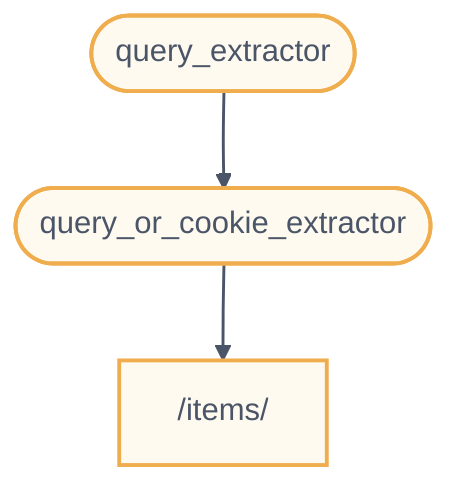

# 子依赖项

FastAPI 支持创建含**子依赖项**的依赖项。

并且，可以按需声明任意**深度**的子依赖项嵌套层级。

**FastAPI** 负责处理解析不同深度的子依赖项。

## 第一层依赖项 “dependable”

你可以创建一个第一层依赖项（“dependable”），如下：
```python
from typing import Annotated

from fastapi import Cookie, Depends, FastAPI

app = FastAPI()


def query_extractor(q: str | None = None):
    return q


def query_or_cookie_extractor(
    q: Annotated[str, Depends(query_extractor)],
    last_query: Annotated[str | None, Cookie()] = None,
):
    if not q:
        return last_query
    return q


@app.get("/items/")
async def read_query(
    query_or_default: Annotated[str, Depends(query_or_cookie_extractor)],
):
    return {"q_or_cookie": query_or_default}
```

这段代码声明了类型为 `str` 的可选查询参数 `q`，然后返回这个查询参数。

这个函数很简单（不过也没什么用），但却有助于让我们专注于了解子依赖项的工作方式。

## 第二层依赖项，“dependable”和“dependant”

接下来，创建另一个依赖项函数（一个“dependable”），并同时为它自身再声明一个依赖项（因此它同时也是一个“dependant”）：

```python
from typing import Annotated

from fastapi import Cookie, Depends, FastAPI

app = FastAPI()


def query_extractor(q: str | None = None):
    return q


def query_or_cookie_extractor(
    q: Annotated[str, Depends(query_extractor)],
    last_query: Annotated[str | None, Cookie()] = None,
):
    if not q:
        return last_query
    return q


@app.get("/items/")
async def read_query(
    query_or_default: Annotated[str, Depends(query_or_cookie_extractor)],
):
    return {"q_or_cookie": query_or_default}
```

这里重点说明一下声明的参数：

- 尽管该函数自身是依赖项（“dependable”），但还声明了另一个依赖项（它“依赖”于其他对象）
    - 该函数依赖 `query_extractor`, 并把 `query_extractor` 的返回值赋给参数 `q`
- 同时，该函数还声明了类型是 `str` 的可选 cookie（`last_query`）
    - 用户未提供查询参数 `q` 时，则使用上次使用后保存在 cookie 中的查询

## 使用依赖项

接下来，就可以使用依赖项：
```python
from typing import Annotated

from fastapi import Cookie, Depends, FastAPI

app = FastAPI()


def query_extractor(q: str | None = None):
    return q


def query_or_cookie_extractor(
    q: Annotated[str, Depends(query_extractor)],
    last_query: Annotated[str | None, Cookie()] = None,
):
    if not q:
        return last_query
    return q


@app.get("/items/")
async def read_query(
    query_or_default: Annotated[str, Depends(query_or_cookie_extractor)],
):
    return {"q_or_cookie": query_or_default}
```
***
信息

注意，这里在_路径操作函数_中只声明了一个依赖项，即 `query_or_cookie_extractor` 。

但 **FastAPI** 必须先处理 `query_extractor`，以便在调用 `query_or_cookie_extractor` 时使用 `query_extractor` 返回的结果。
***

## 多次使用同一个依赖项

如果在同一个_路径操作_ 多次声明了同一个依赖项，例如，多个依赖项共用一个子依赖项，**FastAPI** 在处理同一请求时，只调用一次该子依赖项。

FastAPI 不会为同一个请求多次调用同一个依赖项，而是把依赖项的返回值进行「缓存」，并把它传递给同一请求中所有需要使用该返回值的「依赖项」。

在高级使用场景中，如果不想使用「缓存」值，而是为需要在同一请求的每一步操作（多次）中都实际调用依赖项，可以把 `Depends` 的参数 `use_cache` 的值设置为 `False`:

```python
async def needy_dependency(fresh_value: Annotated[str, Depends(get_value, use_cache=False)]):
    return {"fresh_value": fresh_value}
```
## 小结

千万别被本章里这些花里胡哨的词藻吓倒了，其实**依赖注入**系统非常简单。

**依赖注入无非是与_路径操作函数_一样的函数罢了。**

但它依然非常强大，能够声明任意嵌套深度的「图」或树状的依赖结构。
***
提示

这些简单的例子现在看上去虽然没有什么实用价值，

但在**安全**一章中，您会了解到这些例子的用途，

以及这些例子所能节省的代码量。