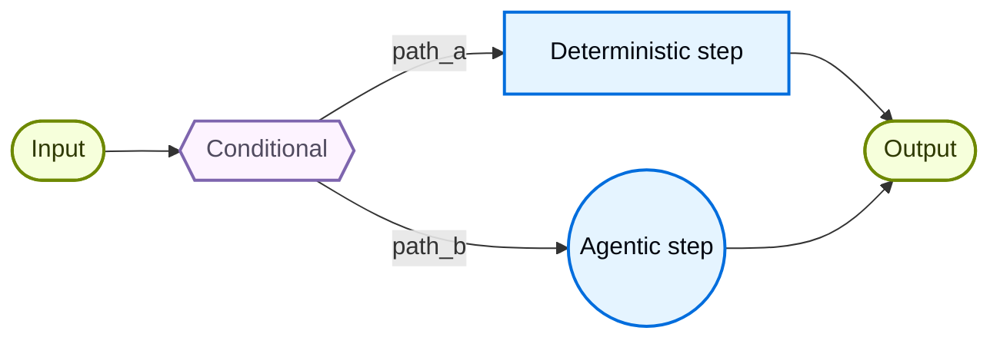
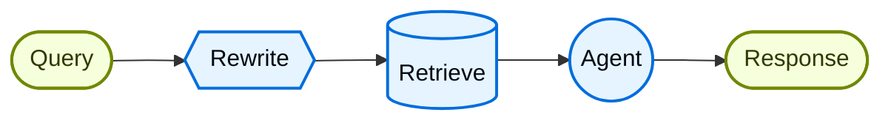

# 自定义工作流 (Custom workflow)

在**自定义工作流**架构中，您可以使用 LangGraph 定义自己的特定执行流。您可以完全控制图结构——包括顺序步骤、条件分支、循环和并行执行。



## 关键特征

* 完全控制图结构
* 混合确定性逻辑与 agent 行为
* 支持顺序步骤、条件分支、循环和并行执行
* 将其他模式作为工作流中的节点嵌入

## 何时使用

当标准模式（子代理、技能等）不满足您的要求时，当您需要混合确定性逻辑与 agent 行为时，或者您的用例需要复杂的路由或多阶段处理时，请使用自定义工作流。

工作流中的每个节点可以是一个简单函数、一个 LLM 调用，或者一个带有工具的完整 agent。您还可以在自定义工作流中组合其他架构——例如，将多 agent 系统作为单个节点嵌入。

有关自定义工作流的完整示例，请参见下面的教程。

路由器 (router) 模式是自定义工作流的一个示例。本教程将引导您构建一个并行查询 GitHub、Notion 和 Slack，然后综合结果的路由器。

## 基本实现

核心思想是您可以直接在任何 LangGraph 节点内部调用 LangChain agent，将自定义工作流的灵活性与预构建 agent 的便利性结合起来：

```python
from langchain.agents import create_agent
from langgraph.graph import StateGraph, START, END

agent = create_agent(model="openai:gpt-5.4", tools=[...])

def agent_node(state: State) -> dict:
    """调用 LangChain agent 的 LangGraph 节点。"""
    result = agent.invoke({
        "messages": [{"role": "user", "content": state["query"]}]
    })
    return {"answer": result["messages"][-1].content}

# 构建一个简单的工作流
workflow = (
    StateGraph(State)
    .add_node("agent", agent_node)
    .add_edge(START, "agent")
    .add_edge("agent", END)
    .compile()
)
```

## 示例：RAG 管道

一个常见的用例是将检索与 agent 相结合。此示例构建了一个 WNBA 统计助手，可以从知识库中检索，并能够获取实时新闻。

该工作流演示了三种类型的节点：

  * **模型节点 (Rewrite)**：使用结构化输出重写用户查询以获得更好的检索效果。
  * **确定性节点 (Retrieve)**：执行向量相似性搜索——不涉及 LLM。
  * **Agent 节点 (Agent)**：基于检索到的上下文进行推理，并可以通过工具获取额外信息。



您可以使用 LangGraph 状态在工作流步骤之间传递信息。这允许工作流的每个部分读取和更新结构化字段，从而轻松地在节点之间共享数据和上下文。

```python
  from typing import TypedDict
  from pydantic import BaseModel
  from langgraph.graph import StateGraph, START, END
  from langchain.agents import create_agent
  from langchain.tools import tool
  from langchain_openai import ChatOpenAI, OpenAIEmbeddings
  from langchain_core.vectorstores import InMemoryVectorStore

  class State(TypedDict):
      question: str
      rewritten_query: str
      documents: list[str]
      answer: str

  # WNBA 知识库，包含名单、比赛结果和球员数据
  embeddings = OpenAIEmbeddings()
  vector_store = InMemoryVectorStore(embeddings)
  vector_store.add_texts([
      # 名单
      "New York Liberty 2024 roster: Breanna Stewart, Sabrina Ionescu, Jonquel Jones, Courtney Vandersloot.",
      "Las Vegas Aces 2024 roster: A'ja Wilson, Kelsey Plum, Jackie Young, Chelsea Gray.",
      "Indiana Fever 2024 roster: Caitlin Clark, Aliyah Boston, Kelsey Mitchell, NaLyssa Smith.",
      # 比赛结果
      "2024 WNBA Finals: New York Liberty defeated Minnesota Lynx 3-2 to win the championship.",
      "June 15, 2024: Indiana Fever 85, Chicago Sky 79. Caitlin Clark had 23 points and 8 assists.",
      "August 20, 2024: Las Vegas Aces 92, Phoenix Mercury 84. A'ja Wilson scored 35 points.",
      # 球员数据
      "A'ja Wilson 2024 season stats: 26.9 PPG, 11.9 RPG, 2.6 BPG. Won MVP award.",
      "Caitlin Clark 2024 rookie stats: 19.2 PPG, 8.4 APG, 5.7 RPG. Won Rookie of the Year.",
      "Breanna Stewart 2024 stats: 20.4 PPG, 8.5 RPG, 3.5 APG.",
  ])
  retriever = vector_store.as_retriever(search_kwargs={"k": 5})

  @tool
  def get_latest_news(query: str) -> str:
      """获取最新的 WNBA 新闻和更新。"""
      # 这里放置您的新闻 API
      return "Latest: The WNBA announced expanded playoff format for 2025..."

  agent = create_agent(
      model="openai:gpt-5.4",
      tools=[get_latest_news],
  )

  model = ChatOpenAI(model="gpt-5.4")

  class RewrittenQuery(BaseModel):
      query: str

  def rewrite_query(state: State) -> dict:
      """为了更好的检索效果，重写用户查询。"""
      system_prompt = """Rewrite this query to retrieve relevant WNBA information.
  The knowledge base contains: team rosters, game results with scores, and player statistics (PPG, RPG, APG).
  Focus on specific player names, team names, or stat categories mentioned."""
      response = model.with_structured_output(RewrittenQuery).invoke([
          {"role": "system", "content": system_prompt},
          {"role": "user", "content": state["question"]}
      ])
      return {"rewritten_query": response.query}

  def retrieve(state: State) -> dict:
      """基于重写后的查询检索文档。"""
      docs = retriever.invoke(state["rewritten_query"])
      return {"documents": [doc.page_content for doc in docs]}

  def call_agent(state: State) -> dict:
      """使用检索到的上下文生成答案。"""
      context = "\n\n".join(state["documents"])
      prompt = f"Context:\n{context}\n\nQuestion: {state['question']}"
      response = agent.invoke({"messages": [{"role": "user", "content": prompt}]})
      return {"answer": response["messages"][-1].content_blocks}

  workflow = (
      StateGraph(State)
      .add_node("rewrite", rewrite_query)
      .add_node("retrieve", retrieve)
      .add_node("agent", call_agent)
      .add_edge(START, "rewrite")
      .add_edge("rewrite", "retrieve")
      .add_edge("retrieve", "agent")
      .add_edge("agent", END)
      .compile()
  )

  result = workflow.invoke({"question": "Who won the 2024 WNBA Championship?"})
  print(result["answer"])
  ```