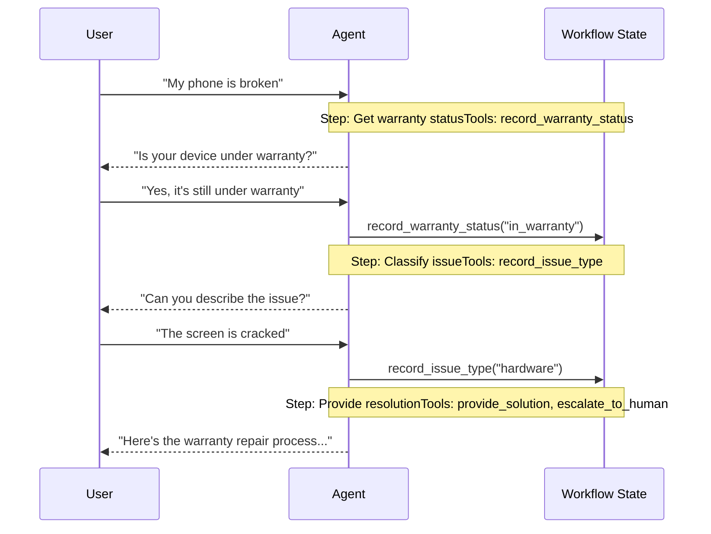

# Handoffs

在 **handoffs** 架构中，行为根据状态动态变化。其核心机制是：工具更新一个跨轮次持久化的状态变量（例如 `current_step` 或 `active_agent`），系统读取该变量以调整行为——要么应用不同的配置（系统提示、工具），要么路由到不同的 agent。这种模式既支持不同 agents 之间的交接，也支持单个 agent 内部的动态配置更改。

术语 **handoffs** 由 OpenAI 创造，用于描述使用工具调用（例如 `transfer_to_sales_agent`）在 agents 或状态之间转移控制权。



## 关键特征

* 状态驱动行为：行为基于状态变量（例如 `current_step` 或 `active_agent`）改变
* 基于工具的转换：工具更新状态变量以在状态之间移动
* 直接用户交互：每个状态的配置直接处理用户消息
* 持久化状态：状态在对话轮次之间得以保留

## 何时使用

当您需要强制执行顺序约束（仅当满足前置条件后才解锁能力）、agent 需要在不同状态下直接与用户对话，或者您正在构建多阶段对话流时，请使用交接模式。此模式对于需要按特定顺序收集信息的客户支持场景尤其有价值——例如，在处理退款之前收集保修 ID。

## 基本实现

核心机制是一个返回 `Command` 来更新状态的工具，从而触发到新步骤或 agent 的转换：

```python
from langchain.tools import tool
from langchain.messages import ToolMessage
from langgraph.types import Command

@tool
def transfer_to_specialist(runtime) -> Command:
    """Transfer to the specialist agent."""
    return Command(
        update={
            "messages": [
                ToolMessage(  
                    content="Transferred to specialist",
                    tool_call_id=runtime.tool_call_id  
                )
            ],
            "current_step": "specialist"  # Triggers behavior change
        }
    )
```

**为什么包含 `ToolMessage`？** 当 LLM 调用一个工具时，它期望得到一个响应。具有匹配 `tool_call_id` 的 `ToolMessage` 完成了这个请求-响应循环——没有它，对话历史就会变得畸形。无论何时您的交接工具更新消息，这都是必需的。

有关完整实现，请参见下面的教程。

学习如何使用交接模式构建一个客户支持 agent，其中单个 agent 在不同的配置之间转换。

## 实现方法

有两种实现交接的方法：**带中间件的单个 agent**（一个具有动态配置的 agent）或 **多 agent 子图**（将不同的 agents 作为图节点）。

### 带中间件的单个 agent

单个 agent 根据状态改变其行为。中间件拦截每个模型调用，并动态调整系统提示和可用工具。工具更新状态变量以触发转换：

```python
from langchain.tools import ToolRuntime, tool
from langchain.messages import ToolMessage
from langgraph.types import Command

@tool
def record_warranty_status(
    status: str,
    runtime: ToolRuntime[None, SupportState]
) -> Command:
    """Record warranty status and transition to next step."""
    return Command(
        update={
            "messages": [
                ToolMessage(
                    content=f"Warranty status recorded: {status}",
                    tool_call_id=runtime.tool_call_id
                )
            ],
            "warranty_status": status,
            "current_step": "specialist"  # Update state to trigger transition
        }
    )
```

```python
from langchain.agents import AgentState, create_agent
from langchain.agents.middleware import wrap_model_call, ModelRequest, ModelResponse
from langchain.tools import tool, ToolRuntime
from langchain.messages import ToolMessage
from langgraph.types import Command
from typing import Callable

# 1. 定义带有 current_step 追踪器的状态
class SupportState(AgentState):  
  """Track which step is currently active."""
  current_step: str = "triage"  
  warranty_status: str | None = None

# 2. 工具通过 Command 更新 current_step
@tool
def record_warranty_status(
  status: str,
  runtime: ToolRuntime[None, SupportState]
) -> Command:  
  """Record warranty status and transition to next step."""
  return Command(update={  
	  "messages": [  
		  ToolMessage(
			  content=f"Warranty status recorded: {status}",
			  tool_call_id=runtime.tool_call_id
		  )
	  ],
	  "warranty_status": status,
	  # 转换到下一步
	  "current_step": "specialist"    
  })

# 3. 中间件基于 current_step 应用动态配置
@wrap_model_call  
def apply_step_config(
  request: ModelRequest,
  handler: Callable[[ModelRequest], ModelResponse]
) -> ModelResponse:
  """Configure agent behavior based on current_step."""
  step = request.state.get("current_step", "triage")  

  # 将步骤映射到其配置
  configs = {
	  "triage": {
		  "prompt": "Collect warranty information...",
		  "tools": [record_warranty_status]
	  },
	  "specialist": {
		  "prompt": "Provide solutions based on warranty: {warranty_status}",
		  "tools": [provide_solution, escalate]
	  }
  }

  config = configs[step]
  request = request.override(  
	  system_prompt=config["prompt"].format(**request.state),  
	  tools=config["tools"]  
  )
  return handler(request)

# 4. 创建带有中间件的 agent
agent = create_agent(
  model,
  tools=[record_warranty_status, provide_solution, escalate],
  state_schema=SupportState,
  middleware=[apply_step_config],  
  checkpointer=InMemorySaver()  # 跨轮次持久化状态
)
```

### 多 agent 子图

多个不同的 agents 作为图中的独立节点存在。交接工具使用 `Command.PARENT` 在 agent 节点之间导航，以指定接下来执行哪个节点。

子图交接需要仔细的**上下文工程**。与单 agent 中间件（消息历史自然流动）不同，您必须明确决定在 agents 之间传递哪些消息。如果处理不当，agents 将接收到格式错误的对话历史或膨胀的上下文。请参见下面的上下文工程。

```python
from langchain.messages import AIMessage, ToolMessage
from langchain.tools import tool, ToolRuntime
from langgraph.types import Command

@tool
def transfer_to_sales(
    runtime: ToolRuntime,
) -> Command:
    """Transfer to the sales agent."""
    last_ai_message = next(  
        msg for msg in reversed(runtime.state["messages"]) if isinstance(msg, AIMessage)  
    )  
    transfer_message = ToolMessage(  
        content="Transferred to sales agent",  
        tool_call_id=runtime.tool_call_id,  
    )  
    return Command(
        goto="sales_agent",
        update={
            "active_agent": "sales_agent",
            "messages": [last_ai_message, transfer_message],  
        },
        graph=Command.PARENT
    )
```

此示例展示了一个多 agent 系统，其中包含独立的销售和支持 agents。每个 agent 是一个独立的图节点，交接工具允许 agents 相互转移对话。

```python
from typing import Literal

from langchain.agents import AgentState, create_agent
from langchain.messages import AIMessage, ToolMessage
from langchain.tools import tool, ToolRuntime
from langgraph.graph import StateGraph, START, END
from langgraph.types import Command
from typing_extensions import NotRequired

# 1. 定义带有 active_agent 追踪器的状态
class MultiAgentState(AgentState):
  active_agent: NotRequired[str]

# 2. 创建交接工具
@tool
def transfer_to_sales(
  runtime: ToolRuntime,
) -> Command:
  """Transfer to the sales agent."""
  last_ai_message = next(  
	  msg for msg in reversed(runtime.state["messages"]) if isinstance(msg, AIMessage)  
  )  
  transfer_message = ToolMessage(  
	  content="Transferred to sales agent from support agent",  
	  tool_call_id=runtime.tool_call_id,  
  )  
  return Command(
	  goto="sales_agent",
	  update={
		  "active_agent": "sales_agent",
		  "messages": [last_ai_message, transfer_message],  
	  },
	  graph=Command.PARENT,
  )

@tool
def transfer_to_support(
  runtime: ToolRuntime,
) -> Command:
  """Transfer to the support agent."""
  last_ai_message = next(  
	  msg for msg in reversed(runtime.state["messages"]) if isinstance(msg, AIMessage)  
  )  
  transfer_message = ToolMessage(  
	  content="Transferred to support agent from sales agent",  
	  tool_call_id=runtime.tool_call_id,  
  )  
  return Command(
	  goto="support_agent",
	  update={
		  "active_agent": "support_agent",
		  "messages": [last_ai_message, transfer_message],  
	  },
	  graph=Command.PARENT,
  )

# 3. 创建带有交接工具的 agents
sales_agent = create_agent(
  model="google_genai:gemini-3.1-pro-preview",
  tools=[transfer_to_support],
  system_prompt="You are a sales agent. Help with sales inquiries. If asked about technical issues or support, transfer to the support agent.",
)

support_agent = create_agent(
  model="google_genai:gemini-3.1-pro-preview",
  tools=[transfer_to_sales],
  system_prompt="You are a support agent. Help with technical issues. If asked about pricing or purchasing, transfer to the sales agent.",
)

# 4. 创建调用 agents 的节点
def call_sales_agent(state: MultiAgentState) -> Command:
  """Node that calls the sales agent."""
  response = sales_agent.invoke(state)
  return response

def call_support_agent(state: MultiAgentState) -> Command:
  """Node that calls the support agent."""
  response = support_agent.invoke(state)
  return response

# 5. 创建路由器，检查是否应结束或继续
def route_after_agent(
  state: MultiAgentState,
) -> Literal["sales_agent", "support_agent", "__end__"]:
  """Route based on active_agent, or END if the agent finished without handoff."""
  messages = state.get("messages", [])

  # 检查最后一条消息 - 如果它是没有工具调用的 AIMessage，则结束
  if messages:
	  last_msg = messages[-1]
	  if isinstance(last_msg, AIMessage) and not last_msg.tool_calls:  
		  return "__end__"  

  # 否则路由到活动的 agent
  active = state.get("active_agent", "sales_agent")
  return active if active else "sales_agent"

def route_initial(
  state: MultiAgentState,
) -> Literal["sales_agent", "support_agent"]:
  """Route to the active agent based on state, default to sales agent."""
  return state.get("active_agent") or "sales_agent"

# 6. 构建图
builder = StateGraph(MultiAgentState)
builder.add_node("sales_agent", call_sales_agent)
builder.add_node("support_agent", call_support_agent)

# 基于初始 active_agent 的条件启动
builder.add_conditional_edges(START, route_initial, ["sales_agent", "support_agent"])

# 在每个 agent 之后，检查是结束还是路由到另一个 agent
builder.add_conditional_edges(
  "sales_agent", route_after_agent, ["sales_agent", "support_agent", END]
)
builder.add_conditional_edges(
  "support_agent", route_after_agent, ["sales_agent", "support_agent", END]
)

graph = builder.compile()
result = graph.invoke(
	{
	  "messages": [
		  {
			  "role": "user",
			  "content": "Hi, I'm having trouble with my account login. Can you help?",
		  }
	  ]
	}
	)

for msg in result["messages"]:
	msg.pretty_print()
```

对于大多数交接用例，**带中间件的单个 agent** 更为简单。仅当您需要定制化的 agent 实现（例如，一个本身就是带有反思或检索步骤的复杂图的节点）时，才使用**多 agent 子图**。

#### 上下文工程

使用子图交接时，您需要精确控制 agents 之间流动的消息。这种精确性对于维护有效的对话历史和避免可能使下游 agents 混淆的上下文膨胀至关重要。有关此主题的更多信息，请参见上下文工程。

**交接期间的上下文处理**

在 agents 之间交接时，您需要确保对话历史保持有效。LLM 期望工具调用与其响应成对出现，因此当使用 `Command.PARENT` 交接给另一个 agent 时，您必须同时包含：

1.  **包含工具调用的 `AIMessage`**（触发交接的消息）
2.  **一个确认交接的 `ToolMessage`**（对该工具调用的人工响应）

如果没有这种配对，接收 agent 将看到一个不完整的对话，并可能产生错误或意外行为。

下面的示例假设只调用了交接工具（没有并行工具调用）：

```python
@tool
def transfer_to_sales(runtime: ToolRuntime) -> Command:
    # 获取触发此次交接的 AI 消息
    last_ai_message = runtime.state["messages"][-1]

    # 创建一个人工工具响应以完成配对
    transfer_message = ToolMessage(
        content="Transferred to sales agent",
        tool_call_id=runtime.tool_call_id,
    )

    return Command(
        goto="sales_agent",
        update={
            "active_agent": "sales_agent",
            # 仅传递这两条消息，而不是完整的子 agent 历史
            "messages": [last_ai_message, transfer_message],
        },
        graph=Command.PARENT,
    )
```

**为什么不传递所有子 agent 消息？** 尽管您可以在交接中包含完整的子 agent 对话，但这通常会产生问题。接收 agent 可能会被无关的内部推理搞糊涂，并且 token 成本也会不必要地增加。仅传递交接对可以将父图的上下文集中在高层协调上。如果接收 agent 需要额外的上下文，请考虑在 `ToolMessage` 内容中总结子 agent 的工作，而不是传递原始消息历史。

**将控制权返回给用户**

当将控制权返回给用户（结束 agent 的轮次）时，请确保最终消息是 `AIMessage`。这可以维护有效的对话历史，并向用户界面发出 agent 已完成其工作的信号。

## 实现考虑

在设计您的多 agent 系统时，请考虑：

* **上下文过滤策略**：每个 agent 将接收完整的对话历史、过滤后的部分还是摘要？不同的 agents 根据其角色可能需要不同的上下文。
* **工具语义**：明确交接工具是仅更新路由状态还是也执行副作用。例如，`transfer_to_sales()` 是否也应该创建支持工单，或者这应该是一个单独的操作？
* **Token 效率**：在上下文完整性和 token 成本之间取得平衡。随着对话变得更长，总结和选择性上下文传递变得更加重要。