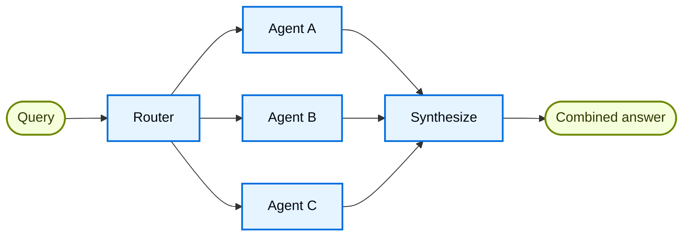

# Router

在 **router** 架构中，路由步骤对输入进行分类并将其导向专门的 agents。当您有明确的**垂直领域**（每个都需要自己 agent 的独立知识域）时，这非常有用。



## 关键特征

* Router 分解查询
* 零个或多个专门的 agents 被并行调用
* 结果被综合成一个连贯的响应

## 何时使用

当您有明确的垂直领域（每个都需要自己 agent 的独立知识域）、需要并行查询多个源、并希望将结果综合成一个组合响应时，请使用 router 模式。

## 基本实现

Router 对查询进行分类，并将其导向合适的 agent(s)。对单 agent 路由使用 `Command`，对并行扇出到多个 agents 使用 `Send`。

使用 `Command` 路由到一个专门的 agent：

```python
from langgraph.types import Command

def classify_query(query: str) -> str:
	"""使用 LLM 对查询进行分类，并确定合适的 agent。"""
	# 分类逻辑在这里
	...

def route_query(state: State) -> Command:
	"""基于查询分类路由到合适的 agent。"""
	active_agent = classify_query(state["query"])

	# 路由到选中的 agent
	return Command(goto=active_agent)
```

使用 `Send` 并行扇出到多个专门的 agents：

```python
from typing import TypedDict
from langgraph.types import Send

class ClassificationResult(TypedDict):
	query: str
	agent: str

def classify_query(query: str) -> list[ClassificationResult]:
	"""使用 LLM 对查询进行分类，并确定要调用哪些 agents。"""
	# 分类逻辑在这里
	...

def route_query(state: State):
	"""基于查询分类路由到相关的 agents。"""
	classifications = classify_query(state["query"])

	# 并行扇出到选中的 agents
	return [
		Send(c["agent"], {"query": c["query"]})
		for c in classifications
	]
```

有关完整实现，请参见下面的教程。

构建一个路由器，并行查询 GitHub、Notion 和 Slack，然后将结果综合成一个连贯的答案。涵盖状态定义、专门的 agents、使用 `Send` 的并行执行以及结果综合。

## 无状态 vs. 有状态

两种方法：

* **无状态 routers** 独立处理每个请求
* **有状态 routers** 跨请求维护对话历史

## 无状态

每个请求被独立路由——调用之间没有记忆。对于多轮对话，请参见有状态 routers。

**Router 与 Subagents**：两种模式都可以将工作分派给多个 agents，但它们在路由决策的方式上有所不同：

  * **Router**：一个专门的路由步骤（通常是一个 LLM 调用或基于规则的逻辑），它对输入进行分类并分派给 agents。router 本身通常不维护对话历史或执行多轮编排——它是一个预处理步骤。
  * **Subagents**：一个主监督 agent 动态决定在正在进行的对话中调用哪些子 agents。主 agent 维护上下文，可以在多轮中调用多个子 agents，并编排复杂的多步骤工作流。

  当您有明确的输入类别并希望进行确定性或轻量级分类时，请使用 **router**。当您需要灵活的、对话感知的编排，其中 LLM 根据不断变化的上下文决定下一步做什么时，请使用 **supervisor**。

## 有状态

对于多轮对话，您需要跨调用维护上下文。

### 工具包装器

最简单的方法：将无状态 router 包装成一个对话 agent 可以调用的工具。对话 agent 处理记忆和上下文；router 保持无状态。这避免了跨多个并行 agents 管理对话历史的复杂性。

```python
@tool
def search_docs(query: str) -> str:
    """跨多个文档源搜索。"""
    result = workflow.invoke({"query": query})  
    return result["final_answer"]

# 对话 agent 将 router 用作一个工具
conversational_agent = create_agent(
    model,
    tools=[search_docs],
    prompt="You are a helpful assistant. Use search_docs to answer questions."
)
```

### 完全持久化

如果您需要 router 本身维护状态，请使用持久化来存储消息历史。当路由到某个 agent 时，从状态中获取先前的消息，并有选择地将它们包含在 agent 的上下文中——这是上下文工程的一个杠杆。

**有状态 routers 需要自定义历史管理。** 如果 router 在多轮之间切换 agents，当 agents 具有不同的语气或提示时，最终用户可能不会感到对话流畅。对于并行调用，您将需要在 router 级别维护历史（输入和综合输出），并在路由逻辑中利用此历史。请考虑使用交接模式或子 agents 模式——两者都为多轮对话提供了更清晰的语义。