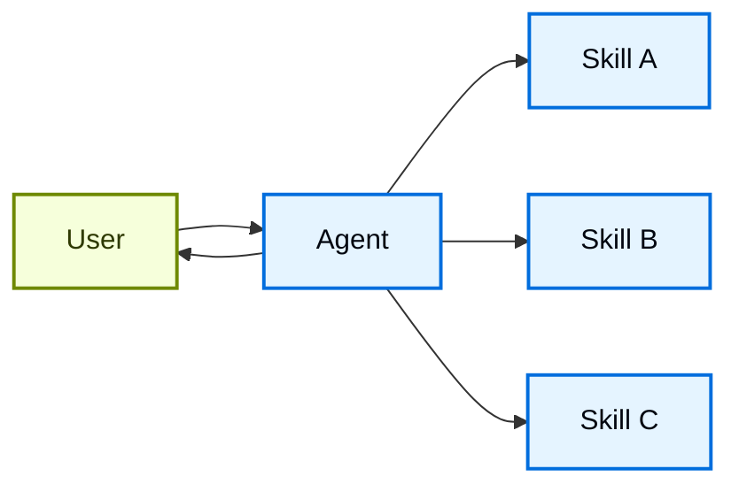

# Skills

在 **skills** 架构中，专门的能力被打包成可调用的“skills”，用于增强 agent 的行为。Skills 主要是提示驱动的特化，agent 可以按需调用。
有关内置 skill 支持，请参见 Deep Agents。

此模式在概念上与 Agent Skills 和 `llms.txt`（由 Jeremy Howard 引入）相同，后者使用工具调用来实现文档的渐进式披露。Skills 模式将渐进式披露应用于专门的提示和领域知识，而不仅仅是文档页面。

  有关可提高您的 agent 在 LangChain 生态系统任务上性能的现成 skills，请参见 LangChain Skills 仓库。



## 关键特征

* 提示驱动的特化：Skills 主要由专门的提示定义
* 渐进式披露：Skills 根据上下文或用户需求变得可用
* 团队分布：不同的团队可以独立开发和维护 skills
* 轻量级组合：Skills 比完整的子 agents 更简单
* 引用感知：Skills 可以引用脚本、模板和其他资源

## 何时使用

当您希望一个 agent 拥有许多可能的特化功能、不需要在不同 skills 之间强制执行特定约束，或者不同团队需要独立开发能力时，请使用 skills 模式。常见示例包括编码助手（针对不同语言或任务的 skills）、知识库（针对不同领域的 skills）和创意助手（针对不同格式的 skills）。

## 基本实现

```python
from langchain.tools import tool
from langchain.agents import create_agent

@tool
def load_skill(skill_name: str) -> str:
    """Load a specialized skill prompt.

    Available skills:
    - write_sql: SQL query writing expert
    - review_legal_doc: Legal document reviewer

    Returns the skill's prompt and context.
    """
    # Load skill content from file/database
    ...

agent = create_agent(
    model="gpt-5.4",
    tools=[load_skill],
    system_prompt=(
        "You are a helpful assistant. "
        "You have access to two skills: "
        "write_sql and review_legal_doc. "
        "Use load_skill to access them."
    ),
)
```

有关完整实现，请参见下面的教程。

学习如何实现具有渐进式披露的 skills，其中 agent 按需加载专门的提示和模式，而不是预先加载所有内容。

## 扩展模式

在编写自定义实现时，您可以通过多种方式扩展基本 skills 模式：

* **动态工具注册**：将渐进式披露与状态管理相结合，在 skills 加载时注册新工具。例如，加载一个 "database_admin" skill 既可以添加专门的上下文，也可以注册数据库特定的工具（备份、恢复、迁移）。这使用了多 agent 模式中相同的工具和状态机制——工具更新状态以动态更改 agent 的能力。

* **层次化 skills**：Skills 可以在树形结构中定义其他 skills，从而创建嵌套的特化。例如，加载一个 "data_science" skill 可能会使诸如 "pandas_expert"、"visualization" 和 "statistical_analysis" 等子 skills 变得可用。每个子 skill 可以根据需要独立加载，从而允许领域知识的细粒度渐进式披露。这种层次化方法通过将能力组织成逻辑分组来帮助管理大型知识库，这些分组可以根据需要被发现和按需加载。

* **引用感知**：虽然每个 skill 只有一个提示，但这个提示可以引用其他资源的存储位置，并提供有关 agent 应何时使用这些资源的信息。当这些资源变得相关时，agent 将知道这些文件存在，并根据需要将它们读入内存以完成任务。这也遵循了渐进式披露模式，并限制了上下文窗口中的信息量。