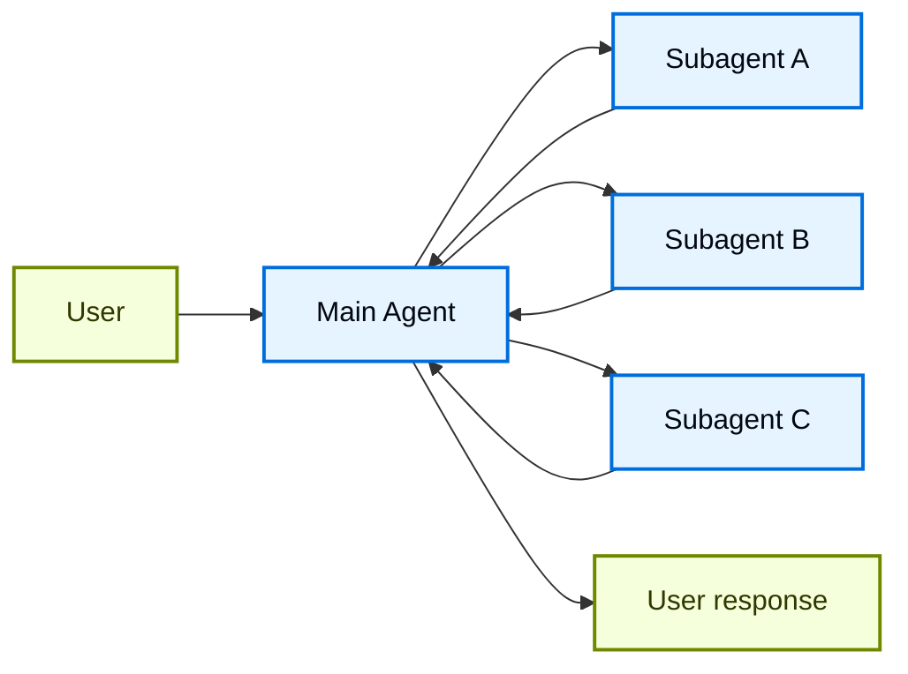
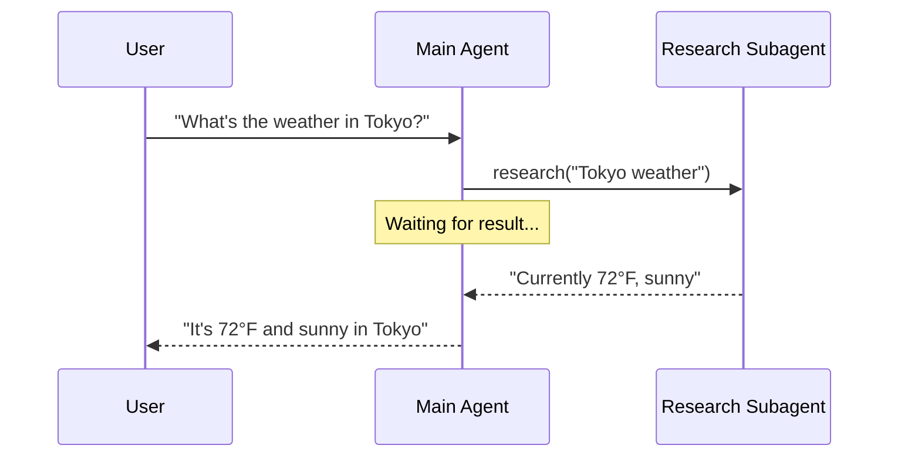
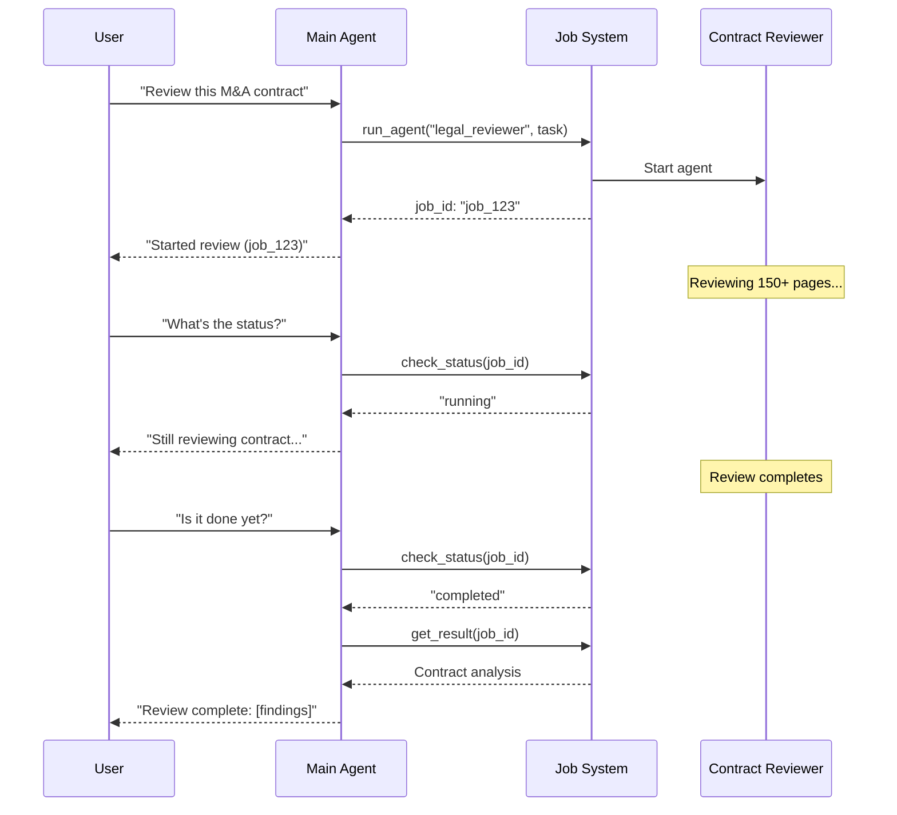
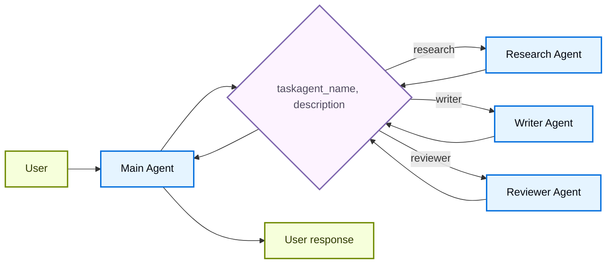

# Subagents

在 **subagents** 架构中，一个中央主 agent（通常称为 **supervisor**）通过将子代理作为工具调用来协调它们。主 agent 决定调用哪个子代理、提供什么输入以及如何组合结果。Subagents 是无状态的——它们不记得过去的交互，所有对话记忆由主 agent 维护。这提供了上下文隔离：每次子代理调用都在一个干净的上下文窗口中工作，防止主对话中的上下文膨胀。

对于内置的子代理支持，请参见 Deep Agents。



## 关键特征

* 集中控制：所有路由都通过主 agent
* 没有直接的用户交互：子代理将结果返回给主 agent，而不是用户（尽管您可以在子代理中使用中断来允许用户交互）
* 通过工具调用子代理：子代理通过工具被调用
* 并行执行：主 agent 可以在单轮中调用多个子代理

**Supervisor vs. Router**：监督者 agent（此模式）与路由器不同。监督者是一个完整的 agent，它维护对话上下文并动态决定在多个轮次中调用哪些子代理。路由器通常是一个单一的分类步骤，将任务分派给 agents，而不维护持续的对话状态。

## 何时使用

当您有多个不同的领域（例如，日历、电子邮件、CRM、数据库），子代理不需要直接与用户对话，或者您希望集中工作流控制时，请使用子代理模式。对于只有几个工具的简单情况，请使用单个 agent。

**需要在子代理中进行用户交互吗？** 虽然子代理通常将结果返回给主 agent 而不是直接与用户对话，但您可以在子代理中使用中断来暂停执行并收集用户输入。当子代理需要澄清或批准才能继续时，这非常有用。主 agent 仍然是协调者，但子代理可以在任务中间从用户那里收集信息。

## 基本实现

核心机制是将子代理包装成主 agent 可以调用的工具：

```python
from langchain.tools import tool
from langchain.agents import create_agent

# Create a subagent
subagent = create_agent(model="google_genai:gemini-3.1-pro-preview", tools=[...])

# Wrap it as a tool
@tool("research", description="Research a topic and return findings")
def call_research_agent(query: str):
    result = subagent.invoke({"messages": [{"role": "user", "content": query}]})
    return result["messages"][-1].content

# Main agent with subagent as a tool
main_agent = create_agent(model="google_genai:gemini-3.1-pro-preview", tools=[call_research_agent])
```

学习如何使用子代理模式构建一个个人助理，其中中央主 agent（监督者）协调专门的工人 agents。

## 设计决策

在实现子代理模式时，您将做出几个关键的设计选择。此表格总结了选项——每个选项在下面的章节中都有详细介绍。

| 决策                                  | 选项                                                                                |
| ----------------------------------------- | -------------------------------------------------------------------------------------- |
| **同步 vs. 异步**      | 同步（阻塞） vs. 异步（后台）                                                 |
| **工具模式**       | 每个 agent 一个工具 vs. 单个分发工具                                                |
| **子代理规格**     | 系统提示 vs. 枚举约束 vs. 基于工具发现（仅限单个分发工具） |
| **子代理输入**   | 仅查询 vs. 完整上下文                                                            |
| **子代理输出** | 子代理结果 vs. 完整对话历史                                           |

## 同步 vs. 异步

子代理执行可以是**同步**（阻塞）或**异步**（后台）。您的选择取决于主 agent 是否需要结果才能继续。

| 模式      | 主 agent 行为                         | 最适合                               | 权衡                            |
| --------- | ------------------------------------------- | -------------------------------------- | ----------------------------------- |
| **同步**  | 等待子代理完成              | 主 agent 需要结果才能继续    | 简单，但会阻塞对话 |
| **异步** | 子代理在后台运行时主 agent 继续 | 独立任务，用户不应等待 | 响应迅速，但更复杂        |

不要与 Python 的 `async`/`await` 混淆。在这里，“异步”意味着主 agent 启动一个后台作业（通常在单独的进程或服务中）并在不阻塞的情况下继续。

### 同步（默认）

默认情况下，子代理调用是**同步**的：主 agent 在继续之前等待每个子代理完成。当主 agent 的下一个操作依赖于子代理的结果时，请使用同步。



**何时使用同步：**

* 主 agent 需要子代理的结果来制定其响应
* 任务具有顺序依赖性（例如，获取数据 → 分析 → 响应）
* 子代理失败应阻止主 agent 的响应

**权衡：**

* 实现简单——只需调用并等待
* 在所有子代理完成之前，用户看不到响应
* 长时间运行的任务会冻结对话

### 异步

当子代理的工作是独立的——主 agent 不需要结果来继续与用户对话时，请使用**异步执行**。主 agent 启动一个后台作业并保持响应。



**何时使用异步：**

* 子代理的工作独立于主对话流
* 用户应该能够在工作进行时继续聊天
* 您想要并行运行多个独立任务

**三工具模式：**

1.  **启动作业**：启动后台任务，返回作业 ID
2.  **检查状态**：返回当前状态（待处理、运行中、已完成、失败）
3.  **获取结果**：检索完成的结果

**处理作业完成：** 当作业完成时，您的应用程序需要通知用户。一种方法是显示一个通知，当点击时，发送一条 `HumanMessage`，例如“检查 job\_123 并总结结果。”

## 工具模式

有两种主要的方式将子代理暴露为工具：

| 模式                                           | 最适合                                                      | 权衡                                         |
| ------------------------------------------------- | ------------------------------------------------------------- | ------------------------------------------------- |
| **每个 agent 一个工具**             | 对每个子代理的输入/输出进行细粒度控制        | 更多设置，但更多定制                |
| **单个分发工具** | 许多 agents，分布式团队，约定优于配置 | 更简单的组合，更少的每个 agent 定制 |

### 每个 agent 一个工具


关键思想是将子代理包装成主 agent 可以调用的工具：

```python
from langchain.tools import tool
from langchain.agents import create_agent

# Create a sub-agent
subagent = create_agent(model="...", tools=[...])  

# Wrap it as a tool  
@tool("subagent_name", description="subagent_description")  
def call_subagent(query: str):  
    result = subagent.invoke({"messages": [{"role": "user", "content": query}]})
    return result["messages"][-1].content

# Main agent with subagent as a tool  
main_agent = create_agent(model="...", tools=[call_subagent])  
```

当主 agent 决定任务与子代理的描述匹配时，它会调用子代理工具，接收结果，并继续协调。有关细粒度控制，请参见上下文工程。

### 单个分发工具

另一种方法使用一个参数化的工具来为独立任务调用临时的子代理。与每个 agent 一个工具的方法（每个子代理被包装为单独的工具）不同，这使用了一种基于约定的方法，使用一个单一的 `task` 工具：任务描述作为人类消息传递给子代理，子代理的最后一条消息作为工具结果返回。

当您希望将 agent 开发分发给多个团队、需要将复杂任务隔离到单独的上下文窗口中、需要一种可扩展的方式来添加新 agent 而无需修改协调器，或者更喜欢约定优于定制时，请使用此方法。这种方法以上下文工程的灵活性换取代理组合的简单性和强上下文隔离。



**关键特征：**

* 单个任务工具：一个参数化的工具，可以通过名称调用任何已注册的子代理
* 基于约定的调用：按名称选择 agent，任务作为人类消息传递，最后一条消息作为工具结果返回
* 团队分布：不同的团队可以独立开发和部署 agents
* Agent 发现：子代理可以通过系统提示（列出可用的 agents）或通过渐进式披露（通过工具按需加载 agent 信息）被发现

这种方法的一个有趣方面是，子代理可能具有与主 agent 完全相同的能力。在这种情况下，调用子代理的**真正原因实际上是上下文隔离**——允许复杂的多步骤任务在隔离的上下文窗口中运行，而不会使主 agent 的对话历史膨胀。子代理自主完成其工作，仅返回一个简洁的摘要，使主线程保持专注和高效。

```python
from langchain.tools import tool
from langchain.agents import create_agent

# Sub-agents developed by different teams
research_agent = create_agent(
  model="gpt-5.4",
  prompt="You are a research specialist..."
)

writer_agent = create_agent(
  model="gpt-5.4",
  prompt="You are a writing specialist..."
)

# Registry of available sub-agents
SUBAGENTS = {
  "research": research_agent,
  "writer": writer_agent,
}

@tool
def task(
  agent_name: str,
  description: str
) -> str:
  """Launch an ephemeral subagent for a task.

  Available agents:
  - research: Research and fact-finding
  - writer: Content creation and editing
  """
  agent = SUBAGENTS[agent_name]
  result = agent.invoke({
	  "messages": [
		  {"role": "user", "content": description}
	  ]
  })
  return result["messages"][-1].content

# Main coordinator agent
main_agent = create_agent(
  model="gpt-5.4",
  tools=[task],
  system_prompt=(
	  "You coordinate specialized sub-agents. "
	  "Available: research (fact-finding), "
	  "writer (content creation). "
	  "Use the task tool to delegate work."
  ),
)
```

## 上下文工程

控制上下文在主 agent 及其子代理之间的流动：

| 类别                                  | 目的                                                  | 影响                      |
| ----------------------------------------- | -------------------------------------------------------- | ---------------------------- |
| **子代理规格**     | 确保子代理在应该被调用时被调用         | 主 agent 路由决策 |
| **子代理输入**   | 确保子代理能够使用优化的上下文良好执行 | 子代理性能         |
| **子代理输出** | 确保监督者能够根据子代理结果采取行动        | 主 agent 性能         |

另请参见我们关于 agents 上下文工程的综合指南。

### 子代理规格

与子代理关联的**名称**和**描述**是主 agent 知道要调用哪些子代理的主要方式。这些是提示杠杆——请谨慎选择。

* **名称**：主 agent 引用子代理的方式。保持清晰且以行动为导向（例如 `research_agent`、`code_reviewer`）。
* **描述**：主 agent 对子代理能力的了解。具体说明它处理哪些任务以及何时使用它。

对于单个分发工具设计，您必须额外为主 agent 提供关于它可以调用的子代理的信息。
您可以根据 agent 的数量以及您的注册表是静态还是动态，以不同的方式提供此信息：

| 方法                        | 最适合                                 | 权衡                                                             |
| ----------------------------- | ---------------------------------------- | -------------------------------------------------------------------- |
| **系统提示枚举** | 小的、静态的 agent 列表（< 10 agents） | 简单，但当 agents 更改时需要更新提示               |
| **枚举约束**           | 小的、静态的 agent 列表（< 10 agents） | 类型安全且明确，但当 agents 更改时需要更改代码 |
| **基于工具发现**      | 大型或动态的 agent 注册表        | 灵活且可扩展，但增加了复杂性                           |

#### 系统提示枚举

直接在主 agent 的系统提示中列出可用的 agents。主 agent 将 agents 列表及其描述视为其指令的一部分。

**何时使用：**

* 您有一个小的、固定的 agents 集合（< 10）
* Agent 注册表很少更改
* 您想要最简单的实现

**示例：**

```python
main_agent = create_agent(
    model="...",
    tools=[task],
    system_prompt=(
        "You coordinate specialized sub-agents. "
        "Available agents:\n"
        "- research: Research and fact-finding\n"
        "- writer: Content creation and editing\n"
        "- reviewer: Code and document review\n"
        "Use the task tool to delegate work."
    ),
)
```

#### 分发工具上的枚举约束

在您的分发工具中为 `agent_name` 参数添加一个枚举约束。这提供了类型安全性，并使可用的 agents 在工具模式中显式化。

**何时使用：**

* 您有一个小的、固定的 agents 集合（< 10）
* 您想要类型安全和显式的 agent 名称
* 您更喜欢基于模式的验证而不是基于提示的指导

**示例：**

```python
from enum import Enum

class AgentName(str, Enum):
    RESEARCH = "research"
    WRITER = "writer"
    REVIEWER = "reviewer"

@tool
def task(
    agent_name: AgentName,  # Enum constraint
    description: str
) -> str:
    """Launch an ephemeral subagent for a task."""
    # ...
```

#### 基于工具发现

提供一个单独的工具（例如 `list_agents` 或 `search_agents`），主 agent 可以调用它来按需发现可用的 agents。这支持渐进式披露，并支持动态注册表。

**何时使用：**

* 您有很多 agents（> 10）或一个不断增长的注册表
* Agent 注册表经常更改或是动态的
* 您想要减少提示大小和 token 使用量
* 不同的团队独立管理不同的 agents

**示例：**

```python
@tool
def list_agents(query: str = "") -> str:
    """List available subagents, optionally filtered by query."""
    agents = search_agent_registry(query)
    return format_agent_list(agents)

@tool
def task(agent_name: str, description: str) -> str:
    """Launch an ephemeral subagent for a task."""
    # ...

main_agent = create_agent(
    model="...",
    tools=[task, list_agents],
    system_prompt="Use list_agents to discover available subagents, then use task to invoke them."
)
```

### 子代理输入

自定义子代理接收的上下文以执行其任务。通过从 agent 的状态中拉取信息，添加在静态提示中捕获不切实际的输入——完整的消息历史、先前的结果或任务元数据。

```python
from langchain.agents import AgentState
from langchain.tools import tool, ToolRuntime

class CustomState(AgentState):
    example_state_key: str

@tool(
    "subagent1_name",
    description="subagent1_description"
)
def call_subagent1(query: str, runtime: ToolRuntime[None, CustomState]):
    # Apply any logic needed to transform the messages into a suitable input
    subagent_input = some_logic(query, runtime.state["messages"])
    result = subagent1.invoke({
        "messages": subagent_input,
        # You could also pass other state keys here as needed.
        # Make sure to define these in both the main and subagent's
        # state schemas.
        "example_state_key": runtime.state["example_state_key"]
    })
    return result["messages"][-1].content
```

### 子代理输出

自定义主 agent 接收到的内容，以便它可以做出好的决策。两种策略：

1.  **提示子代理**：精确指定应返回的内容。一个常见的失败模式是子代理执行了工具调用或推理，但未在其最终消息中包含结果——提醒它监督者只看到最终输出。
2.  **在代码中格式化**：在返回响应之前调整或丰富响应。例如，使用 `Command` 在返回最终文本的同时传递特定的状态键。

```python
from typing import Annotated
from langchain.agents import AgentState
from langchain.tools import InjectedToolCallId
from langgraph.types import Command

@tool(
    "subagent1_name",
    description="subagent1_description"
)
def call_subagent1(
    query: str,
    tool_call_id: Annotated[str, InjectedToolCallId],
) -> Command:
    result = subagent1.invoke({
        "messages": [{"role": "user", "content": query}]
    })
    return Command(update={
        # Pass back additional state from the subagent
        "example_state_key": result["example_state_key"],
        "messages": [
            ToolMessage(
                content=result["messages"][-1].content,
                tool_call_id=tool_call_id
            )
        ]
    })
```

## 检查点和状态检查

默认情况下，子代理使用**继承的 checkpointer** 模式——每次调用都以全新的状态开始，支持中断，并安全地并行运行。如果您需要子代理在多次调用中维护其自己的持久对话历史，请使用 `checkpointer=True` 编译它（延续模式）。有关模式的完整比较，请参见子图持久化。

由于子代理在工具函数内部被调用，LangGraph 无法静态发现它们。这意味着使用 `subgraphs` 的 `get_state` 将不会返回子代理状态。如果您需要读取嵌套图状态（例如，在中断期间），请改为在自定义图的节点函数中调用子代理。有关每种模式如何影响状态可见性的详细信息，请参见子图持久化。