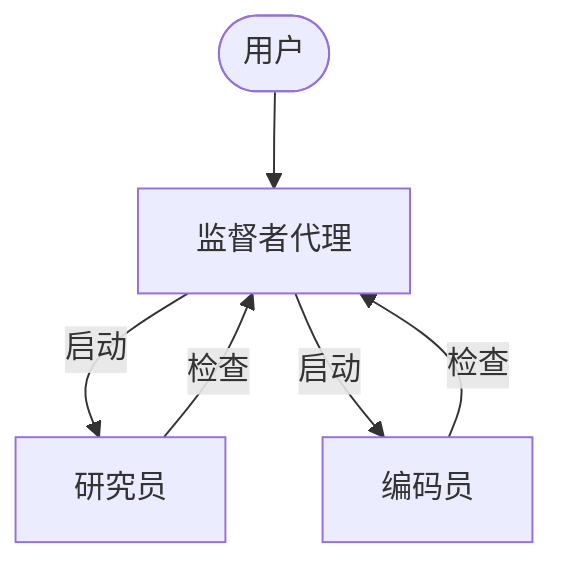
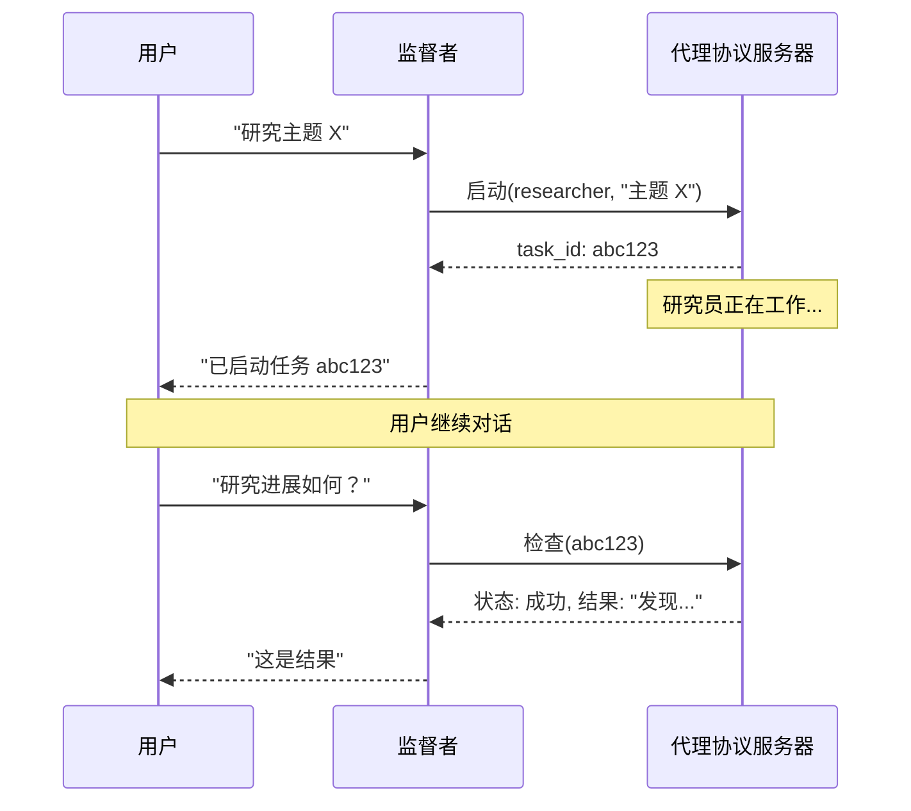

# 异步子代理

> 启动后台子代理，使其并发运行，同时监督者可以继续与用户交互

异步子代理允许监督者代理启动可立即返回的后台任务，因此监督者可以在子代理并发工作的同时继续与用户交互。监督者可以随时检查进度、发送后续指令或取消任务。

这建立在子代理的基础上，后者同步运行并在完成前阻塞监督者。当任务长时间运行、可并行化或需要中途引导时，可使用异步子代理。

异步子代理是 `deepagents` 0.5.0 中提供的一项预览功能。预览功能仍在积极开发中，API 可能会发生变化。



异步子代理可与任何实现了代理协议的服务器通信。你可以使用 LangSmith Deployments，或自行托管任何兼容代理协议的服务器。每个子代理独立于监督者运行，监督者通过 SDK 对其进行控制，以启动、检查、更新和取消。

## 何时使用异步子代理

| 维度                 | 同步子代理                                                      | 异步子代理                                                   |
| -------------------- | --------------------------------------------------------------- | ------------------------------------------------------------ |
| **执行模型**         | 监督者阻塞直到子代理完成                                        | 立即返回任务 ID；监督者继续执行                              |
| **并发性**           | 并行但阻塞                                                      | 并行且非阻塞                                                 |
| **任务中途更新**     | 不可能                                                          | 通过 `update_async_task` 发送后续指令                        |
| **取消**             | 不可能                                                          | 通过 `cancel_async_task` 取消正在运行的任务                  |
| **状态性**           | 无状态——调用之间没有持久状态                                    | 有状态——在跨交互的自身线程上维护状态                         |
| **最适合**           | 代理在继续之前需要等待结果的任务                                | 在聊天中以交互方式管理的长时间运行、复杂任务                 |

## 配置异步子代理

将异步子代理定义为一个 `AsyncSubAgent` 规范列表，每个规范都指向一个代理协议服务器：

```python
from deepagents import AsyncSubAgent, create_deep_agent

async_subagents = [
    AsyncSubAgent(
        name="researcher",
        description="用于信息收集和综合的研究代理",
        graph_id="researcher",
        # 无 url → ASGI 传输（在同一部署中共同部署）
    ),
    AsyncSubAgent(
        name="coder",
        description="用于代码生成和审查的编码代理",
        graph_id="coder",
        # url="https://coder-deployment.langsmith.dev"  # 可选：用于远程的 HTTP 传输
    ),
]

agent = create_deep_agent(
    model="google_genai:gemini-3.1-pro-preview",
    subagents=async_subagents,
)
```

| 字段          | 类型             | 描述                                                                                                                                           |
| ------------- | ---------------- | ---------------------------------------------------------------------------------------------------------------------------------------------- |
| `name`        | `str`            | 必需。唯一标识符。监督者在启动任务时使用。                                                                                                     |
| `description` | `str`            | 必需。此子代理的功能。监督者使用此信息来决定委派给哪个代理。                                                                                   |
| `graph_id`    | `str`            | 必需。代理协议服务器上的图 ID（或助手 ID）。对于基于 LangGraph 的部署，这必须与 `langgraph.json` 中注册的图匹配。                                 |
| `url`         | `str`            | 可选。省略时，使用 ASGI 传输（进程内）。设置时，使用 HTTP 传输连接到远程代理协议服务器。                                                       |
| `headers`     | `dict[str, str]` | 可选。用于对远程服务器请求的额外标头。用于自托管代理协议服务器的自定义身份验证。                                                              |

对于基于 LangGraph 的部署，在同一个 `langgraph.json` 中注册所有图以进行共同部署设置：

```json
{
  "graphs": {
    "supervisor": "./src/supervisor.py:graph",
    "researcher": "./src/researcher.py:graph",
    "coder": "./src/coder.py:graph"
  }
}
```

## 使用异步子代理工具

`AsyncSubAgentMiddleware` 为监督者提供了五个工具：

| 工具                | 用途                                       | 返回值                       |
| ------------------- | ----------------------------------------- | ----------------------------- |
| `start_async_task`  | 启动新的后台任务                           | 任务 ID（立即返回）             |
| `check_async_task`  | 获取任务的当前状态和结果                   | 状态 + 结果（如果完成）        |
| `update_async_task` | 向正在运行的任务发送新指令                 | 确认 + 更新后的状态            |
| `cancel_async_task` | 停止正在运行的任务                         | 确认                          |
| `list_async_tasks`  | 列出所有跟踪的任务及其实时状态             | 所有任务的摘要                |

监督者的大语言模型像调用其他工具一样调用这些工具。中间件会自动处理线程创建、运行管理和状态持久化。

### 理解生命周期

一个典型的交互遵循以下顺序：



* **启动** 在服务器上创建一个新线程，以任务描述作为输入开始一次运行，并将线程 ID 作为任务 ID 返回。监督者将此 ID 报告给用户，不会轮询是否完成。
* **检查** 获取当前运行状态。如果运行成功，它会检索线程状态以提取子代理的最终输出。如果仍在运行，它会向用户报告。
* **更新** 使用中断多任务策略在同一线程上创建一次新运行。前一次运行被中断，子代理使用完整的对话历史加上新指令重新启动。任务 ID 保持不变。
* **取消** 在服务器上调用 `runs.cancel()` 并将任务标记为 `"cancelled"`。
* **列表** 遍历所有跟踪的任务。对于非终止状态的任务，它会并行地从服务器获取实时状态。终止状态（`success`、`error`、`cancelled`）则从缓存中返回。

## 理解状态管理

任务元数据存储在监督者图上的专用状态通道（`async_tasks`）中，与消息历史分开。这一点至关重要，因为深度代理会在上下文窗口被填满时压缩其消息历史。如果任务 ID 仅存在于工具消息中，它们将在压缩过程中丢失。专用通道确保监督者即使在多轮摘要之后，也始终可以通过 `list_async_tasks` 回忆其任务。

每个被跟踪的任务都会记录任务 ID、代理名称、线程 ID、运行 ID、状态和时间戳（`created_at`、`last_checked_at`、`last_updated_at`）。

## 选择传输方式

### ASGI 传输（共同部署）

当子代理规范省略 `url` 字段时，LangGraph SDK 使用 ASGI 传输——SDK 调用通过进程内函数调用而非 HTTP 进行路由。对于基于 LangGraph 的部署，这要求两个图都在同一个 `langgraph.json` 中注册。

ASGI 传输消除了网络延迟，并且不需要额外的身份验证配置。子代理仍然作为具有自身状态的单独线程运行。这是推荐的默认方式。

### HTTP 传输（远程）

添加 `url` 字段以切换到 HTTP 传输，此时 SDK 调用通过网络发送到远程代理协议服务器：

```python
AsyncSubAgent(
    name="researcher",
    description="研究代理",
    graph_id="researcher",
    url="https://my-research-deployment.langsmith.dev",
)
```

对于 LangGraph 部署，身份验证由 LangGraph SDK 使用环境变量中的 `LANGSMITH_API_KEY`（或 `LANGGRAPH_API_KEY`）处理。自托管的代理协议服务器可能使用不同的身份验证机制。

当子代理需要独立扩展、不同的资源配置文件或由不同团队维护时，可使用 HTTP 传输。

## 选择部署拓扑

### 单一部署

单一部署意味着所有代理都使用 ASGI 传输在同一服务器上共同部署。对于基于 LangGraph 的部署，将所有图注册在一个 `langgraph.json` 中。这是推荐的起点——只需管理一个服务器，代理之间网络延迟为零。

### 拆分部署

监督者在一个服务器上，子代理通过 HTTP 传输在另一个服务器上。当子代理需要不同的计算配置文件或独立扩展时使用。

### 混合部署

在混合部署中，一些子代理通过 ASGI 共同部署，另一些通过 HTTP 远程部署：

```python
async_subagents = [
    AsyncSubAgent(
        name="researcher",
        description="研究代理",
        graph_id="researcher",
        # 无 url → ASGI（共同部署）
    ),
    AsyncSubAgent(
        name="coder",
        description="编码代理",
        graph_id="coder",
        url="https://coder-deployment.langsmith.dev",
        # 有 url → HTTP（远程）
    ),
]
```

## 最佳实践

### 为本地开发调整工作进程池大小

当使用 `langgraph dev` 在本地运行时，增加工作进程池以容纳并发的子代理运行。每次活动运行都会占用一个工作进程槽位。一个有 3 个并发子代理任务的监督者需要 4 个槽位（1 个监督者 + 3 个子代理）。配置不足会导致启动排队。

```bash
langgraph dev --n-jobs-per-worker 10
```

### 编写清晰的子代理描述

监督者使用描述来决定启动哪个子代理。描述要具体且面向操作：

```python
# 好
AsyncSubAgent(
    name="researcher",
    description="使用网络搜索进行深入研究。用于需要多次搜索和综合的问题。",
    graph_id="researcher",
)

# 不好
AsyncSubAgent(
    name="helper",
    description="帮忙处理事务",
    graph_id="helper",
)
```

### 使用线程 ID 进行跟踪

当使用基于 LangGraph 的部署时，每次异步子代理运行都是一次标准的 LangGraph 运行，在 LangSmith 中完全可见。监督者的跟踪显示了针对 `launch`、`check`、`update`、`cancel` 和 `list` 的工具调用。每次子代理运行都显示为一个单独的跟踪，通过线程 ID 关联。使用线程 ID（任务 ID）将监督者的编排跟踪与子代理的执行跟踪关联起来。

## 故障排除

### 监督者在启动后立即轮询

**问题**：监督者在启动后立即循环调用 `check`，将异步执行变成了阻塞。

**解决方案**：中间件注入了系统提示规则来防止这种情况。如果轮询仍然存在，请在监督者的系统提示中强化此行为：

```python
agent = create_deep_agent(
    model="google_genai:gemini-3.1-pro-preview",
    system_prompt="""...你的指令...

    启动异步子代理后，始终将控制权交还给用户。
    绝不要在启动后立即调用 check_async_task。""",
    subagents=async_subagents,
)
```

### 监督者报告过时的状态

**问题**：监督者引用了对话历史中早期的任务状态，而不是发起新的 `check` 调用。

**解决方案**：中间件提示指示模型“对话历史中的任务状态始终是过时的”。如果这种情况仍然发生，请添加明确的指令，在报告状态之前始终调用 `check` 或 `list`。

### 任务 ID 查找失败

**问题**：监督者截断或重新格式化了任务 ID，导致 `check` 或 `cancel` 失败。

**解决方案**：中间件提示指示模型始终使用完整的任务 ID。如果截断仍然存在，这通常是一个特定于模型的问题——请尝试使用不同的模型，或在系统提示中添加“始终显示完整的 task_id，永远不要截断或缩写它”。

### 子代理启动时排队而不是运行

**问题**：启动子代理时挂起或需要很长时间才能开始。

**解决方案**：工作进程池可能已耗尽。使用 `--n-jobs-per-worker` 增加池大小。请参阅调整工作进程池大小。
