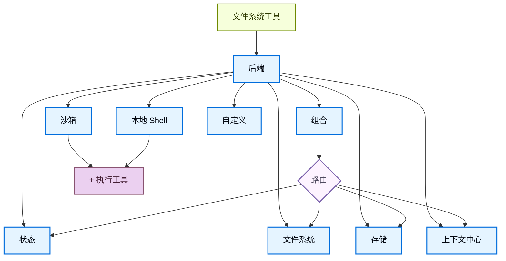

# 后端

> 为 Deep Agents 选择和配置文件系统后端。你可以将不同路径路由到不同的后端、实现虚拟文件系统并强制执行策略。

## 概念全景

Deep Agents 通过 `ls`、`read_file`、`write_file`、`edit_file`、`glob` 和 `grep` 等工具向代理暴露文件系统接口。这些工具通过可插拔的后端运行。`read_file` 工具在所有后端中原生支持图像文件（`.png`、`.jpg`、`.jpeg`、`.gif`、`.webp`），并将其作为多模态内容块返回。沙箱和 `LocalShellBackend` 还提供 `execute` 工具。

| 工具           | 描述                                                       |
| ------------ | -------------------------------------------------------- |
| `ls`         | 列出目录中的文件及元数据（大小、修改时间）                                    |
| `read_file`  | 读取带行号的文件内容，支持对大文件进行偏移/限制。还支持为非文本文件（图像、视频、音频和文档）返回多模态内容块。 |
| `write_file` | 创建新文件                                                    |
| `edit_file`  | 在文件中执行精确的字符串替换（支持全局替换模式）                                 |
| `glob`       | 查找匹配模式的文件（例如 `**/*.py`）                                  |
| `grep`       | 搜索文件内容，支持多种输出模式（仅文件名、带上下文的内容或计数）                         |
| `execute`    | 在环境中运行 shell 命令（仅在沙箱后端可用）                                |

以下是几个你可以与深度代理一起使用的预构建文件系统后端：

| 内置后端                   | 描述                                                                                                                                                                                                       |
| ---------------------- | -------------------------------------------------------------------------------------------------------------------------------------------------------------------------------------------------------- |
| 默认                     | `agent = create_deep_agent(model="google_genai:gemini-3.1-pro-preview")`  线程作用域。代理的默认文件系统后端存储在 `langgraph` 状态中。文件在同一线程内的多个回合之间持久化（通过你的检查点器），并且不会跨线程共享。                                                   |
| 本地文件系统持久化              | `agent = create_deep_agent(model="google_genai:gemini-3.1-pro-preview", backend=FilesystemBackend(root_dir="/Users/nh/Desktop/"))`  这使深度代理能够访问你本地机器的文件系统。你可以指定代理有权访问的根目录。请注意，提供的任何 `root_dir` 必须是绝对路径。   |
| 持久化存储（LangGraph Store） | `agent = create_deep_agent(model="google_genai:gemini-3.1-pro-preview", backend=StoreBackend())`  这使代理能够访问*跨线程持久化*的长期存储。这对于存储较长期的记忆或适用于代理多次执行的指令非常有用。                                                    |
| 上下文中心                  | `agent = create_deep_agent(model="google_genai:gemini-3.1-pro-preview", backend=ContextHubBackend("my-agent"))`  将文件持久存储在 LangSmith Hub 仓库中，无需另外配置 LangGraph Store。                                      |
| 沙箱                     | `agent = create_deep_agent(model="google_genai:gemini-3.1-pro-preview", backend=sandbox)`  在隔离环境中执行代码。沙箱提供文件系统工具以及用于运行 shell 命令的 `execute` 工具。从 Modal、Daytona、Deno 或本地 VFS 中选择。                          |
| 本地 Shell               | `agent = create_deep_agent(model="google_genai:gemini-3.1-pro-preview", backend=LocalShellBackend(root_dir=".", env={"PATH": "/usr/bin:/bin"}))`  直接在主机上进行文件系统和 shell 执行。无隔离——仅在受控的开发环境中使用。请参阅下面的安全注意事项。 |
| 组合                     | 默认线程作用域，`/memories/` 跨线程持久化。组合后端具有最大的灵活性。你可以在文件系统中指定不同的路由指向不同的后端。请参阅下面的组合路由以获取即用示例。                                                                                                                      |



## 内置后端

### StateBackend

```python
from deepagents import create_deep_agent
from deepagents.backends import StateBackend

# 默认情况下，我们提供一个 StateBackend
agent = create_deep_agent(model="google_genai:gemini-3.1-pro-preview")

# 在底层，它看起来像这样
agent2 = create_deep_agent(
    model="google_genai:gemini-3.1-pro-preview",
    backend=StateBackend(),
)
```

**工作原理：**

- 通过 `StateBackend` 将文件存储在 LangGraph 代理状态中，用于当前线程。
- 通过检查点在同一线程的多个代理回合之间持久化。文件不会跨线程共享。

设计用于在图中使用。在图运行之外调用后端方法（例如 `state_backend.upload_files(...)`）将不会生效，直到图执行为止。

**最适合：**

- 作为代理写入中间结果的暂存器。
- 自动清除大的工具输出，然后代理可以逐块读回。

请注意，此后端在监督者代理和子代理之间共享，子代理写入的任何文件将保留在 LangGraph 代理状态中，
即使在子代理执行完成之后也是如此。这些文件将继续对监督者代理和其他子代理可用。

### FilesystemBackend（本地磁盘）

`FilesystemBackend` 在可配置的根目录下读写真实文件。
**<span style="color: red; font-weight: bold;">注意</span>**
此后端授予代理直接的文件系统读/写访问权限。
请谨慎使用，并且仅在适当的环境中使用。

**适当的用例：**

- 本地开发 CLI（编码助手、开发工具）
- CI/CD 流水线（请参阅下面的安全注意事项）

**不适当的用例：**

- Web 服务器或 HTTP API —— 改用 `StateBackend`、`StoreBackend` 或沙箱后端

**安全风险：**

- 代理可以读取任何可访问的文件，包括机密信息（API 密钥、凭据、`.env` 文件）
- 与网络工具结合使用时，机密信息可能通过 SSRF 攻击被泄露
- 文件修改是永久且不可逆的

**建议的保护措施：**

1. 启用人机协同（HITL）中间件以审查敏感操作。
2. 从可访问的文件系统路径中排除机密信息（尤其是在 CI/CD 中）。
3. 对于需要文件系统交互的生产环境，请使用沙箱后端。
4. **始终**结合 `root_dir` 使用 `virtual_mode=True` 以启用基于路径的访问限制（阻止 `..`、`~` 和根目录外的绝对路径）。
   请注意，即使设置了 `root_dir`，默认值（`virtual_mode=False`）也不提供任何安全性。

```python
from deepagents import create_deep_agent
from deepagents.backends import FilesystemBackend

agent = create_deep_agent(
    model="google_genai:gemini-3.1-pro-preview",
    backend=FilesystemBackend(root_dir=".", virtual_mode=True),
)
```

**工作原理：**

- 在可配置的 `root_dir` 下读/写真实文件。
- 你可以选择设置 `virtual_mode=True` 来沙箱化并规范化 `root_dir` 下的路径。
- 使用安全的路径解析，尽可能防止不安全的符号链接遍历，可以使用 ripgrep 实现快速的 `grep`。

**最适合：**

- 你机器上的本地项目
- CI 沙箱
- 挂载的持久卷

### LocalShellBackend（本地 Shell）

此后端授予代理直接的文件系统读/写访问权限**以及**在主机上不受限制的 Shell 执行能力。
请极其谨慎地使用，并且仅在适当的环境中使用。
**<span style="color: red; font-weight: bold;">注意</span>**
**适当的用例：**

- 本地开发 CLI（编码助手、开发工具）
- 你信任代理代码的个人开发环境
- 具有适当机密管理的 CI/CD 流水线

**不适当的用例：**

- 生产环境（例如 Web 服务器、API、多租户系统）
- 处理不受信任的用户输入或执行不受信任的代码

**安全风险：**

- 代理可以使用你的用户权限执行**任意 Shell 命令**
- 代理可以读取任何可访问的文件，包括机密信息（API 密钥、凭据、`.env` 文件）
- 机密信息可能被泄露
- 文件修改和命令执行是**永久且不可逆的**
- 命令直接在你的主机系统上运行
- 命令可能消耗无限的 CPU、内存、磁盘

**建议的保护措施：**

1. 启用人机协同（HITL）中间件，以便在执行前审查和批准操作。**强烈建议**这样做。
2. 仅在专用的开发环境中运行。切勿在共享或生产系统上使用。
3. 对于需要 Shell 执行的生产环境，请使用沙箱后端。

**注意：** 启用 Shell 访问后，`virtual_mode=True` 不提供任何安全性，因为命令可以访问系统上的任何路径。

```python
from deepagents import create_deep_agent
from deepagents.backends import LocalShellBackend

agent = create_deep_agent(
    model="google_genai:gemini-3.1-pro-preview",
    backend=LocalShellBackend(root_dir=".", virtual_mode=True, env={"PATH": "/usr/bin:/bin"}),
)
```

**工作原理：**

- 扩展 `FilesystemBackend`，添加了在主机上运行 Shell 命令的 `execute` 工具。
- 命令使用 `subprocess.run(shell=True)` 直接在你的机器上运行，无沙箱。
- 支持 `timeout`（默认 120 秒）、`max_output_bytes`（默认 100,000）、`env` 和 `inherit_env` 用于环境变量。
- Shell 命令使用 `root_dir` 作为工作目录，但可以访问系统上的任何路径。

**最适合：**

- 本地编码助手和开发工具
- 在你信任代理的情况下，在开发过程中快速迭代

### StoreBackend（LangGraph Store）

```python
from deepagents import create_deep_agent
from deepagents.backends import StoreBackend
from langgraph.store.memory import InMemoryStore

agent = create_deep_agent(
    model="google_genai:gemini-3.1-pro-preview",
    backend=StoreBackend(
        namespace=lambda rt: (rt.server_info.user.identity,),
    ),
    store=InMemoryStore(),  # 适用于本地开发；部署到 LangSmith 时省略
)
```

`namespace` 参数控制数据隔离。对于多用户部署，请始终设置命名空间工厂以按用户或租户隔离数据。

**工作原理：**

- `StoreBackend` 将文件存储在运行时提供的 LangGraph `BaseStore` 中，从而实现跨线程的持久存储。

**最适合：**

- 当你已经运行并配置了 LangGraph Store（例如 Redis、Postgres 或 `BaseStore` 背后的云实现）时。
- 当你通过 LangSmith Deployment 部署代理时（会为你的代理自动配置存储）。

#### 命名空间工厂

命名空间工厂控制 `StoreBackend` 读写数据的位置。它接收一个 LangGraph `Runtime` 并返回一个用作存储命名空间的字符串元组。使用命名空间工厂来隔离用户、租户或助手之间的数据。

在构造 `StoreBackend` 时，将命名空间工厂传递给 `namespace` 参数：

```python
NamespaceFactory = Callable[[Runtime], tuple[str, ...]]
```

`Runtime` 提供：

- `rt.context` — 用户提供的上下文，通过 LangGraph 的上下文模式传递（例如 `user_id`）
- `rt.server_info` — 在 LangGraph Server 上运行时的服务器特定元数据（助手 ID、图 ID、已认证用户）
- `rt.execution_info` — 执行身份信息（线程 ID、运行 ID、检查点 ID）

`Runtime` 参数在 `deepagents>=0.5.2` 中可用。早期的 0.5.x 版本改为传递 `BackendContext` — 请参阅下面的从 `BackendContext` 迁移。`rt.server_info` 和 `rt.execution_info` 需要 `deepagents>=0.5.0`。

**常见的命名空间模式：**

```python
from deepagents.backends import StoreBackend

# 按用户：每个用户获得自己的隔离存储
backend = StoreBackend(
    namespace=lambda rt: (rt.server_info.user.identity,),
)

# 按助手：同一助手的所有用户共享存储
backend = StoreBackend(
    namespace=lambda rt: (
        rt.server_info.assistant_id,
    ),
)

# 按线程：存储限定于单个对话
backend = StoreBackend(
    namespace=lambda rt: (
        rt.execution_info.thread_id,
    ),
)
```

你可以组合多个组件来创建更具体的作用域——例如，使用 `(user_id, thread_id)` 实现按用户、按对话的隔离，或者附加一个后缀如 `"filesystem"` 来在相同作用域使用多个存储命名空间时消除歧义。

命名空间组件只能包含字母数字字符、连字符、下划线、点、`@`、`+`、冒号和波浪号。通配符（`*`、`?`）被拒绝以防止 glob 注入。

当未提供命名空间工厂时，旧版默认使用来自 LangGraph 配置元数据的 `assistant_id`。这意味着同一助手的所有用户共享相同的存储。对于要投入生产的多用户环境，请始终提供命名空间工厂。

### ContextHubBackend

```python
from deepagents import create_deep_agent
from deepagents.backends import ContextHubBackend

agent = create_deep_agent(
    model="google_genai:gemini-3.1-pro-preview",
    backend=ContextHubBackend("my-agent"),
)
```

`ContextHubBackend` 将文件存储在 LangSmith Hub 仓库中。使用 `owner/name` 或 `name` 格式的仓库标识符构造它。

在使用 `ContextHubBackend` 之前，请设置 `LANGSMITH_API_KEY`。

**工作原理：**

- 在首次使用时惰性拉取 Hub 仓库树，然后从内存缓存中提供读取。
- 将写入和编辑持久化为 Hub 提交，并在成功提交后更新缓存。
- 使用乐观的父提交写入（`parent_commit`）：每次推送都针对最新的已知提交哈希。

**行为和限制：**

- 如果仓库不存在，首次拉取被视为空；首次成功写入可以创建仓库。
- 如果另一个写入者先推进了仓库，你过时的父提交写入可能会失败。发生冲突时重新拉取并重试。
- `upload_files()` 接受 UTF-8 文本。非 UTF-8 文件会按路径被拒绝，并标记为 `invalid_path`。

**最适合：**

- LangSmith 原生的持久文件系统持久化，无需单独连接 LangGraph `BaseStore`。
- 受益于文件系统更改的 Hub 提交历史的工作流程。

### CompositeBackend（路由器）

```python
from deepagents import create_deep_agent
from deepagents.backends import CompositeBackend, StateBackend, StoreBackend
from langgraph.store.memory import InMemoryStore

agent = create_deep_agent(
    model="google_genai:gemini-3.1-pro-preview",
    backend=CompositeBackend(
        default=StateBackend(),
        routes={
            "/memories/": StoreBackend(namespace=lambda _rt: ("memories",)),
        },
    ),
    store=InMemoryStore(),  # Store 传递给 create_deep_agent，而不是后端
)
```

**工作原理：**

- `CompositeBackend` 根据路径前缀将文件操作路由到不同的后端。
- 在列表和搜索结果中保留原始路径前缀。

**最适合：**

- 当你想为你的代理同时提供线程作用域和跨线程存储时，`CompositeBackend` 允许你同时提供 `StateBackend` 和 `StoreBackend`
- 当你有多个信息源，并希望将它们作为单个文件系统的一部分提供给代理时。
  - 例如，你将长期记忆存储在某个存储的 `/memories/` 下，同时还有一个自定义后端，可在 `/docs/` 处访问文档。

## 指定后端

- 将后端实例传递给 `create_deep_agent(model=..., backend=...)`。文件系统中间件将其用于所有工具。
- 后端必须实现 `BackendProtocol`（例如 `StateBackend()`,`FilesystemBackend(root_dir=".")`、`StoreBackend()`、`ContextHubBackend("my-agent")`）。
- 如果省略，默认为 `StateBackend()`。

## 路由到不同的后端

将命名空间的部分路由到不同的后端。通常用于将 `/memories/*` 跨线程持久化，而保持其他所有内容限定于线程作用域。

```python
from deepagents import create_deep_agent
from deepagents.backends import CompositeBackend, StateBackend, FilesystemBackend

agent = create_deep_agent(
    model="google_genai:gemini-3.1-pro-preview",
    backend=CompositeBackend(
        default=StateBackend(),
        routes={
            "/memories/": FilesystemBackend(root_dir="/deepagents/myagent", virtual_mode=True),
        },
    )
)
```

行为：

- `/workspace/plan.md` → `StateBackend`（线程作用域）
- `/memories/agent.md` → `FilesystemBackend`，位于 `/deepagents/myagent` 下
- `ls`、`glob`、`grep` 聚合结果并显示原始路径前缀。

注意：

- 更长的前缀优先（例如，路由 `"/memories/projects/"` 可以覆盖 `"/memories/"`）。
- 对于 StoreBackend 路由，请确保通过 `create_deep_agent(model=..., store=...)` 提供了存储，或者由平台配置。

## 构建自定义后端

**构建自定义后端，将远程或数据库文件系统（例如 S3 或 Postgres）投影到工具命名空间中**。

设计指南：

- 路径是绝对的（`/x/y.txt`）。决定如何将它们映射到你的存储键/行。
- 高效地实现 `ls` 和 `glob`（尽可能进行服务器端过滤，否则进行本地过滤）。
- 对于外部持久化（S3、Postgres 等），在写入/编辑结果中返回 `files_update=None`（Python）或省略 `filesUpdate`（JS）——只有内存状态后端需要返回文件更新字典。
- 使用 `ls` 和 `glob` 作为方法名称。
- 返回带有 `error` 字段的结构化结果类型，用于处理缺失文件或无效模式（不要抛出异常）。

S3 风格概述：

```python
from deepagents.backends.protocol import (
    BackendProtocol, WriteResult, EditResult, LsResult, ReadResult, GrepResult, GlobResult,
)

class S3Backend(BackendProtocol):
    def __init__(self, bucket: str, prefix: str = ""):
        self.bucket = bucket
        self.prefix = prefix.rstrip("/")

    def _key(self, path: str) -> str:
        return f"{self.prefix}{path}"

    def ls(self, path: str) -> LsResult:
        # 列出 _key(path) 下的对象；构建 FileInfo 条目（path、size、modified_at）
        ...

    def read(self, file_path: str, offset: int = 0, limit: int = 2000) -> ReadResult:
        # 获取对象；返回 ReadResult(file_data=...) 或 ReadResult(error=...)
        ...

    def grep(self, pattern: str, path: str | None = None, glob: str | None = None) -> GrepResult:
        # 可选地在服务器端过滤；否则列出并扫描内容
        ...

    def glob(self, pattern: str, path: str = "/") -> GlobResult:
        # 相对于 path 跨键应用 glob
        ...

    def write(self, file_path: str, content: str) -> WriteResult:
        # 强制执行仅创建语义；返回 WriteResult(path=file_path, files_update=None)
        ...

    def edit(self, file_path: str, old_string: str, new_string: str, replace_all: bool = False) -> EditResult:
        # 读取 → 替换（尊重唯一性与 replace_all）→ 写入 → 返回匹配次数
        ...
```

Postgres 风格概述：

- 表 `files(path text primary key, content text, created_at timestamptz, modified_at timestamptz)`
- 将工具操作映射到 SQL：
  - `ls` 使用 `WHERE path LIKE $1 || '%'`
  - `glob` 在 SQL 中过滤或获取后在 Python 中应用 glob
  - `grep` 可以通过扩展名或最后修改时间获取候选行，然后扫描行

## 权限

使用权限声明式地控制代理可以读取或写入哪些文件和目录。权限应用于内置文件系统工具，并在调用后端之前进行评估。

```python
from deepagents import create_deep_agent, FilesystemPermission

agent = create_deep_agent(
    model="google_genai:gemini-3.1-pro-preview",
    backend=CompositeBackend(
        default=StateBackend(),
        routes={
            "/memories/": StoreBackend(
                namespace=lambda rt: (rt.server_info.user.identity,),
            ),
            "/policies/": StoreBackend(
                namespace=lambda rt: (rt.context.org_id,),
            ),
        },
    ),
    permissions=[
        FilesystemPermission(
            operations=["write"],
            paths=["/policies/**"],
            mode="deny",
        ),
    ],
)
```

有关包括规则排序、子代理权限和组合后端交互在内的全部选项，请参阅权限指南。

## 添加策略钩子

**Add policy hooks（添加策略钩子 是 Deep Agents 后端的一种扩展机制，让你能在文件系统操作前后插入自定义的验证/管控逻辑，实现比“路径白名单/黑名单”更复杂的规则。**

对于超出基于路径的允许/拒绝规则的自定义验证逻辑（速率限制、审计日志、内容检查），可以通过子类化或包装后端来执行企业规则。

阻止在选定前缀下进行写入/编辑（子类）：

```python
from deepagents.backends.filesystem import FilesystemBackend
from deepagents.backends.protocol import WriteResult, EditResult

class GuardedBackend(FilesystemBackend):
    def __init__(self, *, deny_prefixes: list[str], **kwargs):
        super().__init__(**kwargs)
        self.deny_prefixes = [p if p.endswith("/") else p + "/" for p in deny_prefixes]

    def write(self, file_path: str, content: str) -> WriteResult:
        if any(file_path.startswith(p) for p in self.deny_prefixes):
            return WriteResult(error=f"不允许在 {file_path} 下进行写入")
        return super().write(file_path, content)

    def edit(self, file_path: str, old_string: str, new_string: str, replace_all: bool = False) -> EditResult:
        if any(file_path.startswith(p) for p in self.deny_prefixes):
            return EditResult(error=f"不允许在 {file_path} 下进行编辑")
        return super().edit(file_path, old_string, new_string, replace_all)
```

通用包装器（适用于任何后端）：

```python
from deepagents.backends.protocol import (
    BackendProtocol, WriteResult, EditResult, LsResult, ReadResult, GrepResult, GlobResult,
)

class PolicyWrapper(BackendProtocol):
    def __init__(self, inner: BackendProtocol, deny_prefixes: list[str] | None = None):
        self.inner = inner
        self.deny_prefixes = [p if p.endswith("/") else p + "/" for p in (deny_prefixes or [])]

    def _deny(self, path: str) -> bool:
        return any(path.startswith(p) for p in self.deny_prefixes)

    def ls(self, path: str) -> LsResult:
        return self.inner.ls(path)

    def read(self, file_path: str, offset: int = 0, limit: int = 2000) -> ReadResult:
        return self.inner.read(file_path, offset=offset, limit=limit)
    def grep(self, pattern: str, path: str | None = None, glob: str | None = None) -> GrepResult:
        return self.inner.grep(pattern, path, glob)
    def glob(self, pattern: str, path: str = "/") -> GlobResult:
        return self.inner.glob(pattern, path)
    def write(self, file_path: str, content: str) -> WriteResult:
        if self._deny(file_path):
            return WriteResult(error=f"不允许在 {file_path} 下进行写入")
        return self.inner.write(file_path, content)
    def edit(self, file_path: str, old_string: str, new_string: str, replace_all: bool = False) -> EditResult:
        if self._deny(file_path):
            return EditResult(error=f"不允许在 {file_path} 下进行编辑")
        return self.inner.edit(file_path, old_string, new_string, replace_all)
```

## 协议参考

后端必须实现 `BackendProtocol`。

必需的方法：

- `ls(path: str) -> LsResult`
  - 返回至少包含 `path` 的条目。在可用时包含 `is_dir`、`size`、`modified_at`。按 `path` 排序以获得确定性输出。
- `read(file_path: str, offset: int = 0, limit: int = 2000) -> ReadResult`
  - 成功时返回文件数据。如果文件缺失，返回 `ReadResult(error="Error: File '/x' not found")`。
- `grep(pattern: str, path: Optional[str] = None, glob: Optional[str] = None) -> GrepResult`
  - 返回结构化的匹配项。发生错误时，返回 `GrepResult(error="...")`（不要抛出异常）。
- `glob(pattern: str, path: str = "/") -> GlobResult`
  - 返回匹配的文件作为 `FileInfo` 条目（如果没有，则为空列表）。
- `write(file_path: str, content: str) -> WriteResult`
  - 仅创建。如果冲突，返回 `WriteResult(error=...)`。成功时，设置 `path`，对于状态后端，设置 `files_update={...}`；外部后端应使用 `files_update=None`。
- `edit(file_path: str, old_string: str, new_string: str, replace_all: bool = False) -> EditResult`
  - 强制执行 `old_string` 的唯一性，除非 `replace_all=True`。如果未找到，返回错误。成功时包含 `occurrences`。

支持类型：

- `LsResult(error, entries)` — `entries` 在成功时为 `list[FileInfo]`，失败时为 `None`。
- `ReadResult(error, file_data)` — `file_data` 在成功时为 `FileData` 字典，失败时为 `None`。
- `GrepResult(error, matches)` — `matches` 在成功时为 `list[GrepMatch]`，失败时为 `None`。
- `GlobResult(error, matches)` — `matches` 在成功时为 `list[FileInfo]`，失败时为 `None`。
- `WriteResult(error, path, files_update)`
- `EditResult(error, path, files_update, occurrences)`
- `FileInfo`，包含字段：`path`（必需），可选 `is_dir`、`size`、`modified_at`。
- `GrepMatch`，包含字段：`path`、`line`、`text`。
- `FileData`，包含字段：`content`（字符串）、`encoding`（`"utf-8"` 或 `"base64"`）、`created_at`、`modified_at`。

