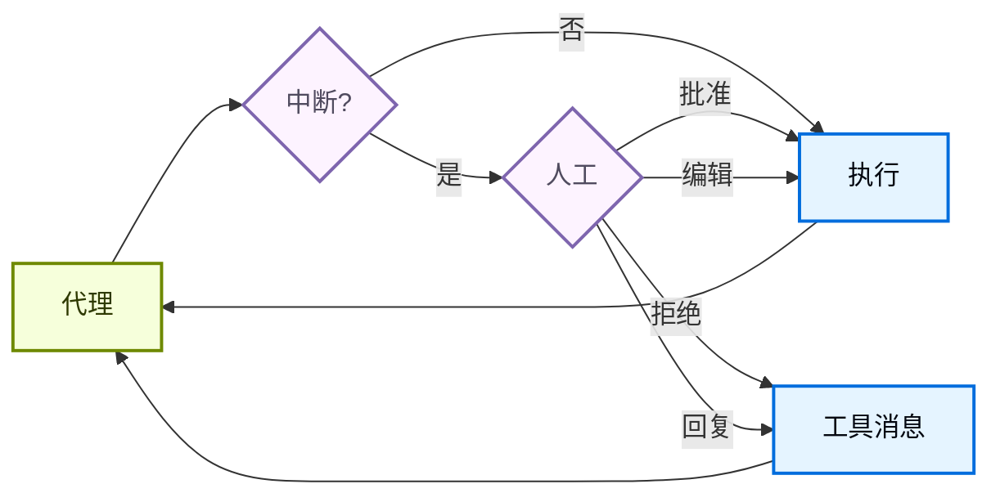

# 人机协同

> 了解如何为敏感的工具操作配置人工审批

某些工具操作可能很敏感，需要在执行前获得人工批准。Deep Agents 通过 LangGraph 的中断功能支持人机协同工作流。你可以使用 `interrupt_on` 参数配置哪些工具需要审批。



## 基本配置

`interrupt_on` 参数接受一个字典，将工具名称映射到中断配置。每个工具可以配置为：

* **`True`**：使用默认行为启用中断（允许批准、编辑、拒绝、回复）
* **`False`**：禁用对此工具的中断
* **`{"allowed_decisions": [...]}`**：具有特定允许决策的自定义配置

```python
from langchain.tools import tool
from deepagents import create_deep_agent
from langgraph.checkpoint.memory import MemorySaver

@tool
def remove_file(path: str) -> str:
    """从文件系统中删除文件。"""
    return f"已删除 {path}"

@tool
def fetch_file(path: str) -> str:
    """从文件系统中读取文件。"""
    return f"{path} 的内容"

@tool
def notify_email(to: str, subject: str, body: str) -> str:
    """发送电子邮件。"""
    return f"已发送电子邮件至 {to}"

# 人机协同需要检查点器
checkpointer = MemorySaver()

agent = create_deep_agent(
    model="google_genai:gemini-3.1-pro-preview",
    tools=[remove_file, fetch_file, notify_email],
    interrupt_on={
        "remove_file": True,  # 默认：允许批准、编辑、拒绝、回复
        "fetch_file": False,  # 不需要中断
        "notify_email": {"allowed_decisions": ["approve", "reject"]},  # 不允许编辑
    },
    checkpointer=checkpointer,  # 必需！
)
```

## 决策类型

`allowed_decisions` 列表控制人工在审查工具调用时可以采取的操作：

* **`"approve"`**：使用代理建议的原始参数执行工具
* **`"edit"`**：在执行前修改工具参数
* **`"reject"`**：完全跳过此工具调用
* **`"respond"`**：将人工的消息直接作为工具结果返回，跳过执行——用于“询问用户”风格的工具

你可以自定义每个工具有哪些决策可用：

```python
interrupt_on = {
    # 敏感操作：允许所有选项
    "delete_file": {"allowed_decisions": ["approve", "edit", "reject"]},

    # 中等风险：仅允许批准或拒绝
    "write_file": {"allowed_decisions": ["approve", "reject"]},

    # 必须批准（不允许拒绝）
    "critical_operation": {"allowed_decisions": ["approve"]},
}
```

## 处理中断

当中断被触发时，代理会暂停执行并返回控制权。检查结果中的中断并进行相应处理。

```python
from langchain_core.utils.uuid import uuid7
from langgraph.types import Command

# 创建带有 thread_id 的配置以实现状态持久化
config = {"configurable": {"thread_id": str(uuid7())}}

# 调用代理
result = agent.invoke(
    {"messages": [{"role": "user", "content": "删除文件 temp.txt"}]},
    config=config,
    version="v2",  
)

# 检查执行是否被中断
if result.interrupts:  
    # 提取中断信息
    interrupt_value = result.interrupts[0].value  
    action_requests = interrupt_value["action_requests"]
    review_configs = interrupt_value["review_configs"]

    # 创建从工具名称到审查配置的查找映射
    config_map = {cfg["action_name"]: cfg for cfg in review_configs}

    # 向用户显示待处理的操作
    for action in action_requests:
        review_config = config_map[action["name"]]
        print(f"工具: {action['name']}")
        print(f"参数: {action['args']}")
        print(f"允许的决策: {review_config['allowed_decisions']}")

    # 获取用户决策（每个 action_request 一个，按顺序）
    decisions = [
        {"type": "approve"}  # 用户批准了删除操作
    ]

    # 使用决策恢复执行
    result = agent.invoke(
        Command(resume={"decisions": decisions}),
        config=config,  # 必须使用相同的配置！
        version="v2",
    )

# 处理最终结果
print(result.value["messages"][-1].content)  
```

## 多个工具调用

当代理调用多个需要批准的工具时，所有中断会批量合并到一个中断中。你必须按顺序为每个工具提供决策。

```python
config = {"configurable": {"thread_id": str(uuid7())}}

result = agent.invoke(
    {"messages": [{
        "role": "user",
        "content": "删除 temp.txt 并发送电子邮件至 admin@example.com"
    }]},
    config=config,
    version="v2",  
)

if result.interrupts:  
    interrupt_value = result.interrupts[0].value  
    action_requests = interrupt_value["action_requests"]

    # 两个工具需要批准
    assert len(action_requests) == 2

    # 按照 action_requests 的顺序提供决策
    decisions = [
        {"type": "approve"},  # 第一个工具：delete_file
        {"type": "reject"}    # 第二个工具：send_email
    ]

    result = agent.invoke(
        Command(resume={"decisions": decisions}),
        config=config,
        version="v2",
    )
```

## 编辑工具参数

当 `"edit"` 在允许的决策中时，你可以在执行前修改工具参数：

```python
if result.interrupts:  
    interrupt_value = result.interrupts[0].value  
    action_request = interrupt_value["action_requests"][0]

    # 代理建议的原始参数
    print(action_request["args"])  # {"to": "everyone@company.com", ...}

    # 用户决定编辑收件人
    decisions = [{
        "type": "edit",
        "edited_action": {
            "name": action_request["name"],  # 必须包含工具名称
            "args": {"to": "team@company.com", "subject": "...", "body": "..."}
        }
    }]

    result = agent.invoke(
        Command(resume={"decisions": decisions}),
        config=config,
        version="v2",
    )
```

## 子代理中断

使用子代理时，你可以在工具调用中和工具调用内部使用中断。

### 工具调用上的中断

每个子代理可以有自己的 `interrupt_on` 配置，该配置会覆盖主代理的设置：

```python
agent = create_deep_agent(
    model="google_genai:gemini-3.1-pro-preview",
    tools=[delete_file, read_file],
    interrupt_on={
        "delete_file": True,
        "read_file": False,
    },
    subagents=[{
        "name": "file-manager",
        "description": "管理文件操作",
        "system_prompt": "你是一名文件管理助手。",
        "tools": [delete_file, read_file],
        "interrupt_on": {
            # 覆盖：在此子代理中，读取也需要批准
            "delete_file": True,
            "read_file": True,  # 与主代理不同！
        }
    }],
    checkpointer=checkpointer
)
```

当子代理触发中断时，处理方式相同——检查结果中的 `interrupts`，并使用 `Command` 恢复。

### 工具调用内部的中断

子代理工具可以直接调用 `interrupt()` 来暂停执行并等待批准：

```python
from langchain.agents import create_agent
from langchain_anthropic import ChatAnthropic
from langchain.messages import HumanMessage
from langchain.tools import tool
from langgraph.checkpoint.memory import InMemorySaver
from langgraph.types import Command, interrupt

from deepagents.graph import create_deep_agent
from deepagents.middleware.subagents import CompiledSubAgent

@tool(description="在执行操作前请求人工批准。")
def request_approval(action_description: str) -> str:
    """使用 interrupt() 原语请求人工批准。"""
    # interrupt() 暂停执行并返回传递给 Command(resume=...) 的值
    approval = interrupt({
        "type": "approval_request",
        "action": action_description,
        "message": f"请批准或拒绝: {action_description}",
    })

    if approval.get("approved"):
        return f"操作 '{action_description}' 已批准。继续..."
    else:
        return f"操作 '{action_description}' 已拒绝。原因: {approval.get('reason', '未提供原因')}"

def main():
    checkpointer = InMemorySaver()
    model = ChatAnthropic(
        model_name="claude-sonnet-4-6",
        max_tokens=4096,
    )

    compiled_subagent = create_agent(
        model=model,
        tools=[request_approval],
        name="approval-agent",
    )

    parent_agent = create_deep_agent(
        model="google_genai:gemini-3.1-pro-preview",
        checkpointer=checkpointer,
        subagents=[
            CompiledSubAgent(
                name="approval-agent",
                description="可以请求批准的代理",
                runnable=compiled_subagent,
            )
        ],
    )

    thread_id = "test_interrupt_directly"
    config = {"configurable": {"thread_id": thread_id}}

    print("调用代理 - 子代理将使用 request_approval 工具...")

    result = parent_agent.invoke(
        {
            "messages": [
                HumanMessage(
                    content="使用 task 工具启动 approval-agent 子代理。"
                    "告诉它使用 request_approval 工具请求批准 '部署到生产环境'。"
                )
            ]
        },
        config=config,
        version="v2",  
    )

    # 检查是否有中断
    if result.interrupts:  
        interrupt_value = result.interrupts[0].value  
        print(f"\n收到中断！")
        print(f"  类型: {interrupt_value.get('type')}")
        print(f"  操作: {interrupt_value.get('action')}")
        print(f"  消息: {interrupt_value.get('message')}")

        print("\n使用 Command(resume={'approved': True}) 恢复...")
        result2 = parent_agent.invoke(
            Command(resume={"approved": True}),
            config=config,
            version="v2",  
        )

        if not result2.interrupts:  
            print("\n执行完成！")
            # 查找工具响应
            tool_msgs = [m for m in result2.value.get("messages", []) if m.type == "tool"]  
            if tool_msgs:
                print(f"  工具结果: {tool_msgs[-1].content}")
        else:
            print("\n发生了另一个中断")
    else:
        print("\n  没有中断 - 模型可能没有调用 request_approval")

if __name__ == "__main__":
    main()
```

运行时，将产生以下输出：

```python
调用代理 - 子代理将使用 request_approval 工具...

收到中断！
  类型: approval_request
  操作: 部署到生产环境
  消息: 请批准或拒绝: 部署到生产环境

使用 Command(resume={'approved': True}) 恢复...

执行完成！
  工具结果: 太好了！批准请求已处理。操作 **"部署到生产环境"** 已**批准**。你现在可以继续生产环境部署。
```

## 最佳实践

### 始终使用检查点器

人机协同需要一个检查点器来在中断和恢复之间持久化代理状态：

```python
from langgraph.checkpoint.memory import MemorySaver

checkpointer = MemorySaver()
agent = create_deep_agent(
    model="google_genai:gemini-3.1-pro-preview",
    tools=[...],
    interrupt_on={...},
    checkpointer=checkpointer  # HITL 必需
)
```

### 使用相同的线程 ID

恢复时，你必须使用带有相同 `thread_id` 的相同配置：

```python
# 首次调用
config = {"configurable": {"thread_id": "my-thread"}}
result = agent.invoke(input, config=config, version="v2")

# 恢复（使用相同的配置）
result = agent.invoke(Command(resume={...}), config=config, version="v2")
```

### 将决策顺序与操作匹配

决策列表必须与 `action_requests` 的顺序匹配：

```python
if result.interrupts:  
    interrupt_value = result.interrupts[0].value  
    action_requests = interrupt_value["action_requests"]

    # 按顺序为每个操作创建一个决策
    decisions = []
    for action in action_requests:
        decision = get_user_decision(action)  # 你的逻辑
        decisions.append(decision)

    result = agent.invoke(
        Command(resume={"decisions": decisions}),
        config=config,
        version="v2",
    )
```

### 根据风险定制配置

根据不同工具的风险级别配置它们：

```python
interrupt_on = {
    # 高风险：完全控制（批准、编辑、拒绝）
    "delete_file": {"allowed_decisions": ["approve", "edit", "reject"]},
    "send_email": {"allowed_decisions": ["approve", "edit", "reject"]},

    # 中等风险：不允许编辑
    "write_file": {"allowed_decisions": ["approve", "reject"]},

    # 低风险：无中断
    "read_file": False,
    "list_files": False,
}
```