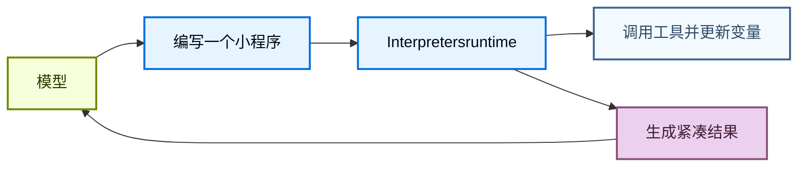
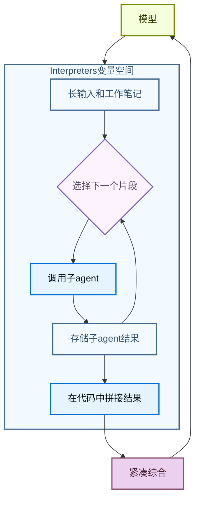

# Interpreters

> 在 Deep Agents 中运行轻量级代码，以**组合工具、编排子agent并转换结构化数据**

Interpreters为agent提供了一个可编程的工作区，让它们可以探索数据、协调工具调用，并将中间工作排除在模型上下文之外。agent编写代码来表达其意图，然后**内存中**的runtime执行该代码并返回相关结果。

沙箱是作用于环境的一种代码优先的方式（例如运行命令、安装依赖项和编辑文件），而**Interpreters是在agent循环内部进行操作的一种代码优先的方式：组合工具、保留状态，并决定哪些信息应返回给模型。**

## 何时使用Interpreters

大多数agent工作在模型推理和工具执行之间交替进行。这对于简单操作是可行的，但当agent需要组合多个步骤、对结构化数据进行推理或管理中间状态时，就会变得笨拙。

Interpreters为agent提供了一个用于此类工作的runtime。agent无需要求模型一次一个工具调用地选择每一个下一步，而是可以编写一个小程序来运行控制流、调用列入允许列表的工具、存储变量，并向模型返回一个紧凑的结果。

**当agent需要执行以下操作时使用Interpreters**：

* 使用代码组合多个工具调用，包括循环、分支、重试和并发。
* 从代码中协调子agent，将工作拆分为专注的调用，存储它们的结果，并将这些结果拼接成最终的合成。
* 将中间值保留在runtime状态中，而不是将每个临时结果都发回模型上下文。
* 确定性转换结构化数据，例如排序、分组、解析、验证、评分或聚合。
* 探索大的变量空间，并仅将选定的证据、摘要或输出返回给模型。



这是通过基于 **QuickJS** 运行代码来实现的，QuickJS 是一个专为嵌入式执行设计的轻量级 JavaScript runtime。该runtime为agent提供了一个评估代码的场所，默认情况下不暴露主机文件系统、网络、shell、包或时钟 API。

QuickJS 是Interpreters代码的执行边界。显式的桥接，例如编程式工具调用，决定了代码可以访问哪些能力。

## 选择正确的执行路径

| 需求                                                                  | 使用                                                                                         |
| --------------------------------------------------------------------- | ------------------------------------------------------------------------------------------- |
| 一两个简单的外部调用                                      | 常规工具调用                                                                         |
| 一个循环、分支、重试或聚合结果的小程序  | Interpreters                                                                                 |
| 许多应从代码运行的选定工具调用                    | 带有编程式工具调用的Interpreters                                                  |
| 跨线程使用的可复用助手                                  | 带有Interpreters技能的Interpreters |
| Shell 命令、包安装、测试或完整的操作系统文件系统访问 | 沙箱                                               |

## 向agent添加Interpreters

安装 QuickJS 中间件包，然后在创建agent时添加中间件。

```python
from deepagents import create_deep_agent
from langchain_quickjs import CodeInterpreterMiddleware

agent = create_deep_agent(
    model="openai:gpt-5.4",
    middleware=[CodeInterpreterMiddleware()],
)
```

## 在Interpreters中运行代码

该中间件向agent添加了一个 `eval` 工具。该工具在持久化上下文中运行 TypeScript，捕获 `console.log`，并返回最后一个表达式的结果。

agent可以编写如下代码：

```javascript
const rows = [
  { team: "alpha", score: 8 },
  { team: "beta", score: 13 },
  { team: "alpha", score: 21 },
];

const totals = rows.reduce((acc, row) => {
  acc[row.team] = (acc[row.team] ?? 0) + row.score;
  console.log(`${row.team} score: ${acc[row.team]}`)
  return acc;
}, {});

totals;
```

默认情况下，Interpreters状态也会在同一线程的多个回合之间持久化，方法是在每次agent运行后对工作状态进行快照，并在下一次运行之前恢复它。

## 编程式工具调用

编程式工具调用（PTC）将选定的agent工具暴露在Interpreters内部的全局 `tools` 命名空间下。agent无需要求模型发出一个工具调用，等待结果，然后决定下一个调用，而是可以编写代码在循环、分支、重试或并行批处理中调用工具。

当**中间工具结果只是下一步的输入时，这很有用**。Interpreters可以在任何内容返回模型上下文之前处理、过滤或聚合这些结果，这可以使多工具/多步骤工作流更具令牌效率。

PTC 在 Deep Agents 中是模型无关的。它由中间件实现，而非提供商特定的代码执行或工具调用 API。

### 工作原理

1. 你使用 `ptc` 允许列表选择Interpreters可以调用哪些工具。
2. 中间件将这些工具作为异步 JavaScript 函数暴露在 `tools` 下。
3. agent编写Interpreters代码，使用 `await` 调用这些函数。
4. Interpreters运行工具桥接，接收工具结果，并继续执行代码。
5. 模型接收最终的Interpreters输出，而非每个中间值。

每个列入允许列表的工具都成为一个异步函数。工具名称转换为驼峰命名法，但输入对象仍然遵循工具的模式。例如，名为 `web_search` 的工具变为 `tools.webSearch(...)`：

```typescript
const result: string = await tools.webSearch({
  query: "deepagents Interpreters",
});
```

### 有用的模式

| **模式**             | **Interpreters可以做什么**                                         |
| ----------------------- | ----------------------------------------------------------------------- |
| 批处理        | 循环处理许多输入并为每个输入调用工具。                     |
| 并行工作           | 对独立的调用使用 `Promise.all`。                                |
| 条件逻辑       | 基于较早的结果选择下一个工具调用。                     |
| 提前终止       | 一旦满足成功条件就停止调用工具。                     |
| 数据过滤          | 仅将相关行、片段、错误或摘要返回给模型。 |
| 递归编排 | 重复调用 `task`，然后在代码中组合子agent结果。          |

### 启用 PTC

使用显式允许列表启用 PTC：

```python
from deepagents import create_deep_agent
from langchain_quickjs import CodeInterpreterMiddleware

agent = create_deep_agent(
    model="openai:gpt-5.4",
    middleware=[CodeInterpreterMiddleware(ptc=["task"])],
)
```

启用 PTC 后，agent可以从Interpreters代码中调用列入允许列表的工具。此示例并行启动多个子agent，并在返回模型之前组合它们的最终报告：

```javascript
const topics = ["检索", "记忆", "评估"];

const reports = await Promise.all(
  topics.map((topic) =>
    tools.task({
      description: `在 Deep Agents 中研究 ${topic} 并返回三个简明的发现。`,
      subagent_type: "general-purpose",
    }),
  ),
);

reports.join("\n\n");
```

因为这是代码，agent也可以在本地处理失败：

```javascript
try {
  const report = await tools.task({
    description: "检查迁移说明并返回破坏性更改。",
    subagent_type: "general-purpose",
  });
  console.log(report);
} catch (error) {
  console.log(`子agent失败: ${error.message}`);
}
```

PTC 调用目前通过Interpreters桥接执行，不经过常规的工具调用路径。因此，`interrupt_on` 审批工作流不会针对每个 PTC 调用的工具调用强制执行。

## 递归语言模型

递归语言模型使用Interpreters作为分解的工作区。模型将大的输入或工作集保存在runtime变量中，编写代码来检查和拆分它，对较小的片段调用子agent或其他模型工具，然后在代码中将返回的结果拼接在一起。

这将变量空间与agent的上下文分开。变量空间是存储在Interpreters中的信息，agent的上下文是模型在下一次模型调用中实际处理的内容。模型可以决定哪些片段成为子agent任务，哪些结果需要再次处理，以及最终的综合内容应返回给主对话。



有关此模式的背景，请参阅递归语言模型论文。

在 Deep Agents 中，递归调用通常是通过编程式工具调用暴露的 `task` 工具。Interpreters可以在许多片段上调用子agent，组合它们的答案，并返回一个单一的综合结果：

```javascript
const candidates = notes
  .filter((note) => note.includes("迁移"))
  .slice(0, 5);

const riskReports = await Promise.all(
  candidates.map((note) =>
    tools.task({
      description: `分析此迁移说明的发布风险。返回风险、受影响的用户和建议的后续步骤:\n\n${note}`,
      subagent_type: "general-purpose",
    }),
  ),
);

const releaseSummary = riskReports
  .map((report, index) => `## 候选项 ${index + 1}\n${report}`)
  .join("\n\n");

releaseSummary;
```

## Interpreters技能

Interpreters技能是向Interpreters暴露代码模块的技能。当配置了Interpreters中间件时，agent可以从代码中导入这些模块，并将其用于确定性辅助逻辑。

当agent需要可复用的辅助函数来处理结构化数据工作流（例如排序、分组、评分、解析、验证或聚合数据）时，Interpreters技能很有用。有关设置详细信息，请参阅Interpreters技能。

## 快照与时间旅行

默认情况下，`CodeInterpreterMiddleware` 在每次agent运行后对Interpreters状态进行快照，并在下一次运行之前恢复它。快照是Interpreters内存中 JavaScript 状态的序列化副本，包括agent完成运行代码时存在的全局变量、变量、函数和导入的模块。

跨对话回合的生命周期是：

1. 一个回合开始，`CodeInterpreterMiddleware` 恢复该线程的最新Interpreters快照。
2. agent调用 `eval`，代码可以读取或修改Interpreters变量。
3. agent运行完成，中间件将更新后的Interpreters状态快照到图状态中。
4. 下一个回合从该恢复的Interpreters状态开始，而不是一个空的runtime。

在单个agent运行中，重复的 `eval` 调用使用实时的Interpreters上下文对象。中间件不会在这些调用之间进行快照和恢复；当运行完成时，它会对上下文进行快照，以便稍后在后续回合或检查点重放时恢复。

在对话回合之间，快照仅保留可以合理序列化的值。将它们用于数据，而不是实时runtime对象。函数、类和其他不可序列化的值将作为不可访问的工件恢复。如果Interpreters代码在恢复后访问其中一个，`eval` 工具将抛出错误，例如 `Value for 'fn' was not restored because it is not serializable (type: function).`

快照保留Interpreters内存，而不是外部世界的影响。如果Interpreters代码通过 PTC 调用工具，恢复先前的Interpreters快照不会撤消该工具调用的副作用。它仅恢复记录或处理了结果的Interpreters变量。

当图使用检查点器时，这与 LangGraph 时间旅行配对。恢复图检查点可以恢复存储在图状态中的Interpreters快照，因此你可以在调试或重放时返回到较早的agent上下文和Interpreters状态。

```python
from deepagents import create_deep_agent
from langchain_quickjs import CodeInterpreterMiddleware
from langgraph.checkpoint.memory import MemorySaver

checkpointer = MemorySaver()

agent = create_deep_agent(
    model="openai:gpt-5.4",
    checkpointer=checkpointer,
    middleware=[
        CodeInterpreterMiddleware(
            snapshot_between_turns=True,  # 默认值
        )
    ],
)
```

你可以使用 `snapshot_between_turns=False` 禁用跨回合快照。

## 安全与限制

Interpreters使用 QuickJS 运行不受信任的 JavaScript，并具有严格的默认隔离。将其视为一个作用域限定的Interpreters runtime，而不是一个完整的生产沙箱后端。

你通过 PTC 暴露的每个工具都是Interpreters代码可以使用的外部能力。将 PTC 允许列表视为一个权限边界：仅暴露agent需要的工具，并避免桥接可以访问敏感系统、花钱、更改数据或调用不受限制网络的宽泛工具，除非该行为是有意为之。

| 能力                                                  | 默认情况下可用 | 如何暴露它                                                                                                    |
| ----------------------------------------------------------- | -------------------- | ------------------------------------------------------------------------------------------------------------------- |
| JavaScript 执行                                        | 是                  | 添加Interpreters中间件                                                                                          |
| 顶层 `await`                                           | 是                  | 在Interpreters代码中使用 promise                                                                                    |
| `console.log` 捕获                                       | 是                  | 使用 `capture_console=False` 禁用                                                                                |
| agent工具                                                 | 否                   | 添加 PTC 允许列表                                                                                                 |
| Interpreters技能模块                                   | 否                   | 添加 `module` 条目并配置 `skills_backend` 或 `skillsBackend`                                              |
| 文件系统访问                                           | 否                   | 通过 PTC 允许列表添加内置文件系统工具 |
| 网络访问                                              | 否                   | 通过 PTC 暴露特定的网络工具                                                                          |
| 挂钟或日期时间访问                               | 否                   | 如果需要，暴露显式的时间工具                                                                              |
| Shell 命令、包安装、测试、操作系统级执行 | 否                   | 使用沙箱后端                                                           |

**代码执行方式**

  Interpreters代码在嵌入式 QuickJS 上下文中运行，而不是在单独的 VM 或进程中运行。在 Python 中，此runtime由 `quickjs-rs` 提供，该库在其安全指南中记录了同一进程的执行边界。

  将Interpreters视为一个能力作用域限定的执行层，而非主机内存隔离边界。对于不受信任或半受信任的代码，在隔离的工作进程或容器中运行agent，并保持 PTC 允许列表较窄。
## 中间件选项

`CodeInterpreterMiddleware` 接受以下选项：

| 关键字参数                    | 默认值                        | 用途                                                      |
| ------------------------ | -------------------------- | ------------------------------------------------------- |
| `memory_limit`           | `64 * 1024 * 1024` (64 MB) | QuickJS 堆内存限制，以字节为单位。                                   |
| `timeout`                | `5.0`                      | 每次 eval 超时，以秒为单位。                                       |
| `max_ptc_calls`          | `256`                      | 每次 eval 的最大 `tools.*` 调用次数。仅在受信任环境中使用 `None`。           |
| `tool_name`              | `"eval"`                   | 暴露给模型的Interpreters工具名称。                                 |
| `max_result_chars`       | `4000`                     | 从结果和 stdout 块返回的最大字符数。                                  |
| `capture_console`        | `True`                     | 是否捕获 `console.log`、`console.warn` 和 `console.error` 输出。 |
| `ptc`                    | `None`                     | PTC 允许列表：工具名称或 `BaseTool` 实例的列表。                        |
| `skills_backend`         | `None`                     | 用于解析Interpreters技能模块的后端。                                |
| `snapshot_between_turns` | `True`                     | Interpreters状态快照是否在agent回合之间持久化。                        |
| `max_snapshot_bytes`     | `None`                     | 最大序列化快照大小。默认为 `memory_limit`。                           |
