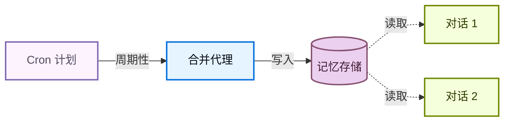

# 记忆

> 为使用 Deep Agents 构建的代理添加持久记忆，使其跨对话进行学习和改进

记忆让你的代理能够跨对话进行学习和改进。Deep Agents 将记忆作为一等公民，并提供文件系统支持的记忆：代理以文件形式读写记忆，你可以使用后端控制这些文件的存储位置。

## 记忆的工作原理

1. **将代理指向记忆文件。** 创建代理时，将文件路径传递给 `memory=`。你还可以通过 `skills=` 传递技能以获取程序性记忆（告诉代理*如何*执行任务的可重用指令）。后端控制文件的存储位置以及谁可以访问它们。
2. **代理读取记忆。** 代理可以在启动时将记忆文件加载到系统提示中，或在对话期间按需读取。
	例如，技能使用按需加载：代理在启动时仅读取技能描述，然后仅在匹配任务时才读取完整的技能文件。
	这会在需要某项能力之前保持上下文精简。
3. **代理更新记忆（可选）。** 当代理学到新信息时，它可以使用的内置 `edit_file` 工具来更新记忆文件。更新可以在对话期间（默认）或在对话之间通过后台合并进行。更改会被持久化，并在下一次对话中可用。
	并非所有记忆都是可写的：开发者定义的技能和组织策略通常是只读的。有关详细信息，请参阅只读与可写记忆。

最常见的两种模式是代理作用域记忆（在所有用户间共享）和用户作用域记忆（按用户隔离）。

## 作用域记忆

代理记忆可以设置作用域，使得同一记忆文件对所有使用该代理的人都可以访问，或者记忆文件可以针对每个用户单独隔离。

### 代理作用域记忆

赋予代理其自己的持久身份，使其随时间演变。代理作用域记忆在所有用户间共享，因此代理通过每次对话积累起自己的角色、累积知识和学到的偏好。随着与用户的互动，它会发展专业知识，改进其方法，并记住有效的方法。当它具有写访问权限时，它还可以学习和更新技能。

关键在于后端命名空间：将其设置为 `(assistant_id,)` 意味着此代理的每次对话都会读写同一个记忆文件。

访问 `rt.server_info` 需要 `deepagents>=0.5.0`。在较旧版本中，请改为从 `get_config()["metadata"]["assistant_id"]` 读取助手 ID。

```python
from deepagents import create_deep_agent
from deepagents.backends import CompositeBackend, StateBackend, StoreBackend

agent = create_deep_agent(
    model="google_genai:gemini-3.1-pro-preview",
    memory=["/memories/AGENTS.md"],
    skills=["/skills/"],
    backend=CompositeBackend(
        default=StateBackend(),
        routes={
            "/memories/": StoreBackend(
                namespace=lambda rt: (
                    rt.server_info.assistant_id,  
                ),
            ),
            "/skills/": StoreBackend(
                namespace=lambda rt: (
                    rt.server_info.assistant_id,  
                ),
            ),
        },
    ),
)
```

用初始记忆填充存储，然后跨两个线程调用代理，观察它记住并更新所学内容。

  ```python
  from langchain_core.utils.uuid import uuid7

  from deepagents import create_deep_agent
  from deepagents.backends import CompositeBackend, StateBackend, StoreBackend
  from deepagents.backends.utils import create_file_data
  from langgraph.store.memory import InMemoryStore

  store = InMemoryStore()  # 部署到 LangSmith 时使用平台存储

  # 填充记忆文件
  store.put(
      ("my-agent",),
      "/memories/AGENTS.md",
      create_file_data("""## 回复风格
  - 保持回复简洁
  - 在可能的情况下使用代码示例
  """),
  )

  # 填充一项技能
  store.put(
      ("my-agent",),
      "/skills/langgraph-docs/SKILL.md",
      create_file_data("""---
  name: langgraph-docs
  description: 获取相关的 LangGraph 文档以提供准确指导。
  ---

  # langgraph-docs

  使用 fetch_url 工具读取 https://docs.langchain.com/llms.txt，然后获取相关页面。
  """),
  )

  agent = create_deep_agent(
      model="google_genai:gemini-3.1-pro-preview",
      memory=["/memories/AGENTS.md"],
      skills=["/skills/"],
      backend=lambda rt: CompositeBackend(
          default=StateBackend(rt),
          routes={
              "/memories/": StoreBackend(
                  rt, namespace=lambda rt: ("my-agent",)
              ),
              "/skills/": StoreBackend(
                  rt, namespace=lambda rt: ("my-agent",)
              ),
          },
      ),
      store=store,
  )

  # 线程 1：代理学会一个新偏好并将其保存到记忆中
  config1 = {"configurable": {"thread_id": str(uuid7())}}
  agent.invoke(
      {"messages": [{"role": "user", "content": "我更喜欢详细的解释。记住这一点。"}]},
      config=config1,
  )

  # 线程 2：代理读取记忆并应用该偏好
  config2 = {"configurable": {"thread_id": str(uuid7())}}
  agent.invoke(
      {"messages": [{"role": "user", "content": "解释一下 transformers 是如何工作的。"}]},
      config=config2,
  )
  ```

### 用户作用域记忆

为每个用户提供其自己的记忆文件。代理会记住每个用户的偏好、上下文和历史，而核心代理指令保持不变。如果存储在用户作用域的后端中，用户也可以拥有每用户技能。

命名空间使用 `(user_id,)`，因此每个用户会获得一份隔离的记忆文件副本。用户 A 的偏好绝不会泄漏到用户 B 的对话中。

```python
from deepagents import create_deep_agent
from deepagents.backends import CompositeBackend, StateBackend, StoreBackend

agent = create_deep_agent(
    model="google_genai:gemini-3.1-pro-preview",
    memory=["/memories/preferences.md"],
    skills=["/skills/"],
    backend=CompositeBackend(
        default=StateBackend(),
        routes={
            "/memories/": StoreBackend(
                namespace=lambda rt: (rt.server_info.user.identity,),
            ),
            "/skills/": StoreBackend(
                namespace=lambda rt: (rt.server_info.user.identity,),
            ),
        },
    ),
)
```

为每个用户填充记忆，并以两个不同用户的身份调用代理。每个用户只能看到自己的偏好。

  ```python
  from langchain_core.utils.uuid import uuid7

  from deepagents import create_deep_agent
  from deepagents.backends import CompositeBackend, StateBackend, StoreBackend
  from deepagents.backends.utils import create_file_data
  from langgraph.store.memory import InMemoryStore

store = InMemoryStore()  # 部署到 LangSmith 时使用平台存储

  # 为两个用户填充偏好
  store.put(
      ("user-alice",),
      "/memories/preferences.md",
      create_file_data("""## 偏好
  - 喜欢简洁的要点
  - 偏好 Python 示例
  """),
  )
  store.put(
      ("user-bob",),
      "/memories/preferences.md",
      create_file_data("""## 偏好
  - 喜欢详细的解释
  - 偏好 TypeScript 示例
  """),
  )

  # 为 Alice 填充一项技能
  store.put(
      ("user-alice",),
      "/skills/langgraph-docs/SKILL.md",
      create_file_data("""---
  name: langgraph-docs
  description: 获取相关的 LangGraph 文档以提供准确指导。
  ---

  # langgraph-docs

  使用 fetch_url 工具读取 https://docs.langchain.com/llms.txt，然后获取相关页面。
  """),
  )

  agent = create_deep_agent(
      model="google_genai:gemini-3.1-pro-preview",
      memory=["/memories/preferences.md"],
      skills=["/skills/"],
      backend=lambda rt: CompositeBackend(
          default=StateBackend(rt),
          routes={
              "/memories/": StoreBackend(
                  rt,
                  namespace=lambda rt: (rt.server_info.user.identity,),
              ),
              "/skills/": StoreBackend(
                  rt,
                  namespace=lambda rt: (rt.server_info.user.identity,),
              ),
          },
      ),
      store=store,
  )

  # 部署后，每个已认证的请求会将
  # `rt.server_info.user.identity` 解析为调用用户，因此 Alice 和 Bob
  # 会自动只看到自己的偏好。
  agent.invoke(
      {"messages": [{"role": "user", "content": "如何读取 CSV 文件？"}]},
      config={"configurable": {"thread_id": str(uuid7())}},
  )
  ```

## 高级用法

除了记忆路径和作用域的基本配置选项外，你还可以为记忆配置更高级的参数：

| 维度                 | 它回答的问题                       | 选项                                                                                                                                                                                    |
| -------------------- | ---------------------------------- | ------------------------------------------------------------------------------------------------------------------------------------------------------------------------------------------ |
| **持续时间**         | 它持续多久？                       | 短期（单次对话）或长期（跨对话）                                                       |
| **信息类型**         | 它是哪种信息？                     | 情景（过往经历）、程序性（指令和技能）或语义（事实） |
| **作用域**           | 谁可以查看和修改它？               | 用户、代理或组织                                                                                  |
| **更新策略**         | 记忆是何时写入的？                 | 对话期间（默认）或对话之间                                                                                                        |
| **检索**             | 记忆是如何读取的？                 | 加载到提示中（默认）或按需（例如技能）                                                                                                  |
| **代理权限**         | 代理可以写入记忆吗？               | 可读写（默认）或只读（用于共享策略）                                                                  |

### 情景记忆

情景记忆存储过往经历的记录：发生了什么、顺序如何、结果是什么。与语义记忆（存储在 `AGENTS.md` 等文件中的事实和偏好）不同，情景记忆保留了完整的对话上下文，因此代理可以回忆起*如何*解决了某个问题，而不仅仅是*从中学到了什么*。

Deep Agents 已经使用了检查点器，这是支持情景记忆的机制：每次对话都作为一个已检查点的线程持久化。

要使过去的对话可搜索，请将线程搜索包装在一个工具中。`user_id` 从运行时上下文中获取，而不是作为参数传递：

```python
from langgraph_sdk import get_client
from langchain.tools import tool, ToolRuntime

client = get_client(url="")

@tool
async def search_past_conversations(query: str, runtime: ToolRuntime) -> str:
    """搜索过去的对话以获取相关上下文。"""
    user_id = runtime.server_info.user.identity  
    threads = await client.threads.search(
        metadata={"user_id": user_id},
        limit=5,
    )
    results = []
    for thread in threads:
        history = await client.threads.get_history(thread_id=thread["thread_id"])
        results.append(history)
    return str(results)
```

你可以通过调整元数据过滤器来按用户或组织限定线程搜索的范围：

```python
# 搜索特定用户的对话
threads = await client.threads.search(
    metadata={"user_id": user_id},
    limit=5,
)

# 跨组织搜索对话
threads = await client.threads.search(
    metadata={"org_id": org_id},
    limit=5,
)
```

这对于执行复杂、多步骤任务的代理很有用。例如，一个编码代理可以回顾过去的调试会话，并直接跳转到可能的根本原因。

### 组织级记忆

组织级记忆遵循与用户作用域记忆相同的模式，但使用的是组织范围内的命名空间，而不是每用户命名空间。将其用于应应用于组织中所有用户和代理的策略或知识。

组织记忆通常是**只读的**，以防止通过共享状态进行提示注入。有关详细信息，请参阅只读与可写记忆。

```python
from deepagents import create_deep_agent
from deepagents.backends import CompositeBackend, StateBackend, StoreBackend

agent = create_deep_agent(
    model="google_genai:gemini-3.1-pro-preview",
    memory=[
        "/memories/preferences.md",
        "/policies/compliance.md",
    ],
    backend=CompositeBackend(
        default=StateBackend(),
        routes={
            "/memories/": StoreBackend(
                namespace=lambda rt: (rt.server_info.user.identity,),
            ),
            "/policies/": StoreBackend(
                namespace=lambda rt: (rt.context.org_id,),
            ),
        },
    ),
)
```

从你的应用程序代码填充组织记忆：

```python
from langgraph_sdk import get_client
from deepagents.backends.utils import create_file_data

client = get_client(url="")

await client.store.put_item(
    (org_id,),
    "/compliance.md",
    create_file_data("""## 合规策略
- 绝不要泄露内部定价
- 始终在财务建议中包含免责声明
"""),
)
```

使用权限强制组织级记忆为只读，或使用策略钩子进行自定义验证逻辑。

### 后台合并

默认情况下，代理在对话期间（热路径）写入记忆。另一种方法是在**对话之间**将记忆作为后台任务来处理，有时称为**睡眠时间计算**。一个独立的深度代理审查最近的对话，提取关键事实，并将其与现有记忆合并。

| 方法                                   | 优点                                                                  | 缺点                                                                   |
| -------------------------------------- | -------------------------------------------------------------------- | ----------------------------------------------------------------------- |
| **热路径**（对话期间）                 | 记忆立即可用，对用户透明                                             | 增加延迟，代理必须多任务处理                                            |
| **后台**（对话之间）                   | 无用户感知延迟，可以跨多个对话进行综合                               | 记忆在下次对话之前不可用，需要第二个代理                                  |

对于大多数应用程序，热路径就足够了。当你需要减少延迟或提高跨多个对话的记忆质量时，添加后台合并。

推荐的模式是部署一个**合并代理**与你的主代理并排运行——一个深度代理，它读取最近的对话历史，提取关键事实，并将它们合并到记忆存储中——并按 cron 计划触发它。选择反映用户实际与代理交互频率的节奏：一个具有稳定每日流量的聊天产品可能每几小时合并一次，而每周仅使用几次的工具只需要每晚或每周运行一次。比用户对话频率高得多的合并只会浪费令牌在无操作的运行上。

#### 合并代理

合并代理读取最近的对话历史，并将关键事实合并到记忆存储中。在 `langgraph.json` 中将其与主代理并排注册：

```python
from datetime import datetime, timedelta, timezone

from deepagents import create_deep_agent
from langchain.tools import tool, ToolRuntime
from langgraph_sdk import get_client

sdk_client = get_client(url="")

@tool
async def search_recent_conversations(query: str, runtime: ToolRuntime) -> str:
    """搜索此用户在过去 6 小时内更新的对话。"""
    user_id = runtime.server_info.user.identity  

    since = datetime.now(timezone.utc) - timedelta(hours=6)
    threads = await sdk_client.threads.search(
        metadata={"user_id": user_id},
        updated_after=since.isoformat(),
        limit=20,
    )
    conversations = []
    for thread in threads:
        history = await sdk_client.threads.get_history(
            thread_id=thread["thread_id"]
        )
        conversations.append(history["values"]["messages"])
    return str(conversations)

agent = create_deep_agent(
    model="google_genai:gemini-3.1-pro-preview",
    system_prompt="""审查最近的对话并更新用户的记忆文件。
合并新事实，删除过时信息，并保持其简洁。""",
    tools=[search_recent_conversations],
)
```

```json
{
  "dependencies": ["."],
  "graphs": {
    "agent": "./agent.py:agent",
    "consolidation_agent": "./consolidation_agent.py:agent"
  },
  "env": ".env"
}
```

#### 定时任务

一个 cron 作业按固定计划运行合并代理。该代理搜索最近的对话并将其综合到记忆中。将计划与你的使用模式匹配，以便合并运行大致跟踪真实活动。



使用 cron 作业调度合并代理：

```python
from langgraph_sdk import get_client

client = get_client(url="")

cron_job = await client.crons.create(
    assistant_id="consolidation_agent",
    schedule="0 */6 * * *",
    input={"messages": [{"role": "user", "content": "合并最近的记忆。"}]},
)
```

所有 cron 计划都以 **UTC** 解释。有关管理和删除 cron 作业的详细信息，请参阅 cron 作业。

cron 间隔必须与合并代理内部的回溯窗口匹配。上面的示例每 6 小时运行一次（`0 */6 * * *`），代理的 `search_recent_conversations` 工具回溯 `timedelta(hours=6)`——保持这些同步。如果 cron 运行频率高于回溯频率，你将重新处理相同的对话；如果运行频率较低，你将丢失落在窗口之外的记忆。

有关部署带有后台进程的代理的更多信息，请参阅投入生产。

### 只读与可写记忆

默认情况下，代理既可以读取也可以写入记忆文件。对于组织策略或合规规则等共享状态，你可能希望将记忆设置为**只读**，以便代理可以引用它但不能修改它。这可以防止通过共享记忆进行提示注入，并确保只有你的应用程序代码控制文件中的内容。

| 权限               | 用例                                                                                                                   | 工作原理                                                                                                                                                                                                                                                        |
| ------------------------ | -------------------------------------------------------------------------------------------------------------------------- | ------------------------------------------------------------------------------------------------------------------------------------------------------------------------------------------------------------------------------------------------------------------- |
| **可读写**（默认） | 用户偏好、代理自我改进、学到的技能                                  | 代理通过 `edit_file` 工具更新文件                                                                                                                                                                                                                            |
| **只读**            | 组织策略、合规规则、共享知识库、开发者定义的技能 | 通过应用程序代码或 Store API 填充。使用权限拒绝写入特定路径，或使用策略钩子进行自定义验证逻辑。 |

**安全注意事项：** 如果一个用户可以写入另一个用户读取的记忆，则恶意用户可能会将指令注入共享状态。为降低此风险：

* **默认使用用户作用域** `(user_id)`，除非你有特定的理由要共享
* 对共享策略使用**只读记忆**（通过应用程序代码而非代理填充）
* 在代理写入共享记忆之前添加**人机协同**验证。使用中断要求对写入敏感路径进行人工批准。

要强制实施只读记忆，请使用权限以声明方式拒绝写入特定路径。对于自定义验证逻辑（速率限制、审计日志、内容检查），请使用后端策略钩子。

### 并发写入

多个线程可以并行写入记忆，但并发写入**同一文件**可能导致最后写入获胜的冲突。对于用户作用域记忆，这很少见，因为用户通常一次只有一个活动对话。对于代理作用域或组织作用域记忆，请考虑使用后台合并来序列化写入，或将记忆构建为每个主题单独的文件以减少争用。

在实践中，如果写入因冲突而失败，大语言模型通常足够智能，可以重试或优雅地恢复，因此一次丢失的写入不是灾难性的。

### 同一部署中的多个代理

要在共享部署中为每个代理提供其自己的记忆，请将 `assistant_id` 添加到命名空间：

```python
StoreBackend(
    namespace=lambda rt: (
        rt.server_info.assistant_id,  
        rt.server_info.user.identity,
    ),
)
```

如果只需要每代理隔离而不需要每用户作用域，则单独使用 `assistant_id`。