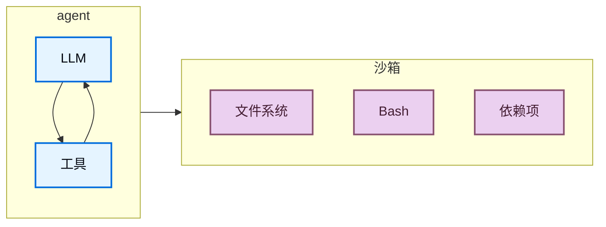
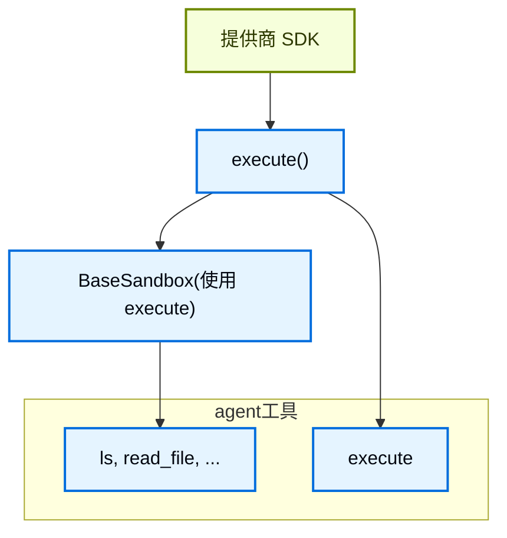
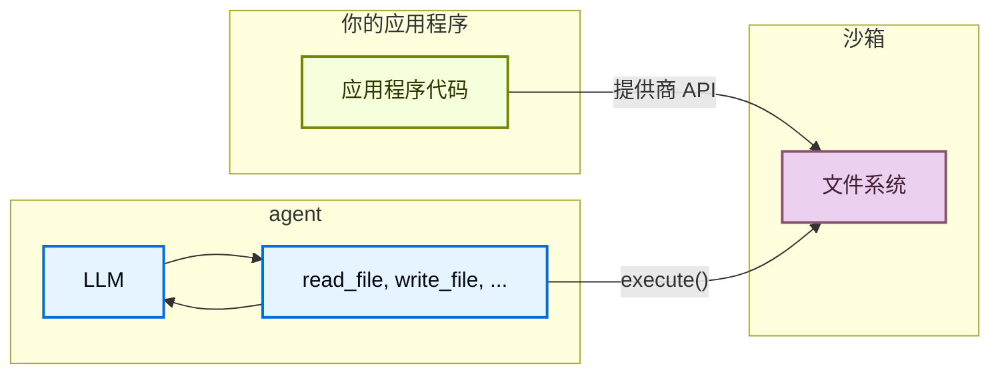

# 沙箱

> 使用沙箱后端在隔离环境中执行代码

agent会生成代码，与文件系统交互，并运行 shell 命令。因为我们无法预测agent可能做什么，所以其环境必须是隔离的，这样它就无法访问凭据、文件或网络。沙箱通过在agent的执行环境和你的主机系统之间创建边界来提供这种隔离。

在 Deep Agents 中，**沙箱是后端**，它定义了agent运行的环境。与其他仅暴露文件操作的后端（State、Filesystem、Store）不同，沙箱后端还为agent提供了用于运行 shell 命令的 `execute` 工具。当你配置沙箱后端时，agent会获得：

* 所有标准文件系统工具（`ls`、`read_file`、`write_file`、`edit_file`、`glob`、`grep`）
* 用于在沙箱中运行任意 shell 命令的 `execute` 工具
* 保护你主机系统的安全边界



## 为什么使用沙箱？

沙箱用于安全目的。
它们让agent可以执行任意代码、访问文件和使用网络，而不会危及你的凭据、本地文件或主机系统。
当agent自主运行时，这种隔离至关重要。

沙箱尤其适用于：

* 编码agent：自主运行的agent可以使用 shell、git、克隆仓库（许多提供商提供原生 git API，例如 Daytona 的 git 操作），以及运行 Docker-in-Docker 进行构建和测试流水线
* 数据分析agent——加载文件，安装数据分析库（pandas、numpy 等），运行统计计算，并在安全、隔离的环境中创建 PowerPoint 演示文稿等输出
## 基本用法

这些示例假设你已经使用提供商的 SDK 创建了一个沙箱/devbox，并已设置了凭据。有关注册、身份验证和提供商特定的生命周期详细信息，请参阅可用的提供商。

```python
import modal
from deepagents import create_deep_agent
from langchain_anthropic import ChatAnthropic
from langchain_modal import ModalSandbox

app = modal.App.lookup("your-app")
modal_sandbox = modal.Sandbox.create(app=app)
backend = ModalSandbox(sandbox=modal_sandbox)

agent = create_deep_agent(
	model=ChatAnthropic(model="claude-sonnet-4-6"),
	system_prompt="你是一个具有沙箱访问权限的 Python 编码助手。",
	backend=backend,
)
try:
	result = agent.invoke(
		{
			"messages": [
				{
					"role": "user",
					"content": "创建一个小的 Python 包并运行 pytest",
				}
			]
		}
	)
finally:
	modal_sandbox.terminate()
```

## 可用的提供商

有关提供商特定的设置、身份验证和生命周期详细信息，请参阅沙箱集成。
没看到你的提供商？你可以实现自己的沙箱后端。请参阅贡献沙箱集成。

## 生命周期和作用域

大多数应用程序选择每个线程一个沙箱（线程作用域）或同一个助手的所有线程共享一个沙箱（助手作用域）。

沙箱在被关闭之前会消耗资源并产生费用。请确保在不再使用时关闭沙箱。

有关完整的生命周期表、异步图工厂说明、TTL 行为、LangGraph 部署接线和客户端示例，请参阅投入生产中的沙箱生命周期。

### 线程作用域（默认）

每个对话获得自己的沙箱。首次运行创建它；同一线程上的后续回合重用它。当线程结束或沙箱 TTL 过期时，环境消失。如下例所示，使用提供商标签或元数据存储映射，以便每次运行都解析到同一个沙箱。

当用户可能在空闲一段时间后返回时，在沙箱上配置 TTL，以便提供商自动删除或归档空闲环境。

```python
from daytona import CreateSandboxFromSnapshotParams, Daytona
from deepagents import create_deep_agent
from langchain_core.runnables import RunnableConfig
from langchain_daytona import DaytonaSandbox

client = Daytona()

async def agent(config: RunnableConfig):
	thread_id = config["configurable"]["thread_id"]  
	try:
		sandbox = await client.find_one(labels={"thread_id": thread_id})
	except Exception:
		sandbox = await client.create(
			CreateSandboxFromSnapshotParams(
				labels={"thread_id": thread_id},
				auto_delete_interval=3600,  # TTL：空闲时清理
			)
		)
	return create_deep_agent(
		model="google_genai:gemini-3.1-pro-preview",
		backend=DaytonaSandbox(sandbox=sandbox)
	)
```
### 助手作用域

同一助手上的每个线程重用一个沙箱。文件、已安装的包和克隆的仓库在对话间持久化。

助手作用域的沙箱会随时间累积沙箱内状态。向你的沙箱提供商配置 TTL，使用快照定期重置，或实现清理逻辑，以免磁盘和内存无限增长。

```python
from daytona import CreateSandboxFromSnapshotParams, Daytona
from deepagents import create_deep_agent
from langchain_core.runnables import RunnableConfig
from langchain_daytona import DaytonaSandbox

client = Daytona()

async def agent(config: RunnableConfig):
	assistant_id = config["configurable"]["assistant_id"]  
	try:
		sandbox = await client.find_one(labels={"assistant_id": assistant_id})
	except Exception:
		sandbox = await client.create(
			CreateSandboxFromSnapshotParams(labels={"assistant_id": assistant_id})
		)
	return create_deep_agent(
		model="google_genai:gemini-3.1-pro-preview",
		backend=DaytonaSandbox(sandbox=sandbox)
	)
```

## 集成模式

基于agent的运行位置，有两种将agent与沙箱集成的架构模式。

### agent在沙箱中模式

agent在沙箱内部运行，你通过网络与之通信。你构建一个预装了agent框架的 Docker 或 VM 镜像，在沙箱内运行它，然后从外部连接以发送消息。

优点：

* ✅ 紧密镜像本地开发。
* ✅ agent与环境之间紧密耦合。

权衡：

* 🔴 API 密钥必须位于沙箱内部（安全风险）。
* 🔴 更新需要重新构建镜像。
* 🔴 需要通信基础设施（WebSocket 或 HTTP 层）。

要在沙箱中运行agent，请构建一个镜像并在其上安装 deepagents。

```dockerfile
FROM python:3.11
RUN pip install deepagents-cli
```

然后在沙箱内运行agent。要使用沙箱内的agent，你必须添加额外的基础设施来处理你的应用程序与沙箱内agent之间的通信。

### 沙箱作为工具模式

agent在你的机器或服务器上运行。当它需要执行代码时，它会调用沙箱工具（例如 `execute`、`read_file` 或 `write_file`），这些工具会调用提供商的 API 在远程沙箱中运行操作。

优点：

* ✅ 无需重新构建镜像即可即时更新agent代码。
* ✅ agent状态和执行之间更清晰的分离。
  * API 密钥留在沙箱外部。
  * 沙箱故障不会丢失agent状态。
  * 可选择在多个沙箱中并行运行任务。
* ✅ 仅为执行时间付费。

权衡：

* 🔴 每次执行调用都有网络延迟。

```python
from daytona import Daytona
from deepagents import create_deep_agent
from dotenv import load_dotenv
from langchain_daytona import DaytonaSandbox

load_dotenv()

# 也可以使用 AgentCore、E2B、Runloop、Modal 执行此操作
sandbox = Daytona().create()
backend = DaytonaSandbox(sandbox=sandbox)

agent = create_deep_agent(
    model="google_genai:gemini-3.1-pro-preview",
    backend=backend,
    system_prompt="你是一个具有沙箱访问权限的编码助手。你可以在沙箱中创建和运行代码。",
)

try:
    result = agent.invoke(
        {
            "messages": [
                {
                    "role": "user",
                    "content": "创建一个 hello world Python 脚本并运行它",
                }
            ]
        }
    )
    print(result["messages"][-1].content)
except Exception:
    # 可选：在异常时主动删除沙箱
    sandbox.stop()
    raise
```

本文档中的示例使用沙箱作为工具模式。当你的提供商的 SDK 处理通信层，并且你希望生产环境镜像本地开发时，选择agent在沙箱中模式。当你需要快速迭代agent逻辑、将 API 密钥保持在沙箱之外，或偏好更清晰的关注点分离时，选择沙箱作为工具模式。

## 沙箱如何工作

### 隔离边界

所有沙箱提供商都保护你的主机系统免受agent的文件系统和 shell 操作的影响。agent无法读取你的本地文件、访问你机器上的环境变量或干扰其他进程。但是，沙箱本身**不能**防护：

* **上下文注入**：控制agent部分输入的 attacker 可以指示其在沙箱内运行任意命令。沙箱是隔离的，但agent在其中拥有完全控制权。
* **网络泄露**：除非网络访问被阻止，否则被上下文注入的agent可以通过 HTTP 或 DNS 将数据发送出沙箱。一些提供商支持阻止网络访问（例如 Modal 上的 `blockNetwork: true`）。

有关如何处理机密信息以及减轻这些风险，请参阅安全注意事项。

### `execute` 方法

沙箱后端有一个简单的架构：提供商必须实现的唯一方法是 `execute()`，它运行一个 shell 命令并返回其输出。每个其他文件系统操作（`read`、`write`、`edit`、`ls`、`glob`、`grep`）都由 `BaseSandbox` 基类建立在 `execute()` 之上，该基类构造脚本并通过 `execute()` 在沙箱内运行它们。



这种设计意味着：

* **添加新的提供商很简单。** 实现 `execute()`——基类处理其他一切。
* **`execute` 工具是条件性可用的。** 在每次模型调用时，框架检查后端是否实现了 `SandboxBackendProtocol`。如果没有，该工具被过滤掉，agent永远不会看到它。

当agent调用 `execute` 工具时，它提供一个 `command` 字符串，并返回组合的 stdout/stderr、退出代码以及如果输出过大的截断通知。

你还可以在你的应用程序代码中直接调用后端 `execute()` 方法。

```bash
pip install langchain-daytona
```

```python
from daytona import Daytona

from langchain_daytona import DaytonaSandbox

sandbox = Daytona().create()
backend = DaytonaSandbox(sandbox=sandbox)

result = backend.execute("python --version")
print(result.output)
```

例如：
```
4
[命令成功，退出代码为 0]
```

```
bash: foobar: command not found
[命令失败，退出代码为 127]
```

如果命令产生非常大的输出，结果会自动保存到文件中，并指示agent使用 `read_file` 逐步访问它。这可以防止上下文窗口溢出。

### 文件访问的两个层面

文件进出沙箱有两种不同的方式，理解何时使用每种方式很重要：

**agent文件系统工具**：`read_file`、`write_file`、`edit_file`、`ls`、`glob`、`grep` 和 `execute` 是 LLM 在执行期间调用的工具。这些通过沙箱内的 `execute()` 进行。agent使用它们来读取代码、写入文件和运行命令，作为其任务的一部分。

**文件传输 API**：你的应用程序代码调用的 `uploadFiles()` 和 `downloadFiles()` 方法。这些使用提供商的原生文件传输 API（而非 shell 命令），旨在在你的主机环境和沙箱之间移动文件。使用它们来：

* **预填充沙箱**，在agent运行之前将源代码、配置或数据放入沙箱
* **检索工件**（生成的代码、构建输出、报告），在agent完成后获取
* **预填充agent需要的依赖项**



## 处理文件

deepagents 沙箱后端支持文件传输 API，用于在你的应用程序和沙箱之间移动文件。

### 预填充沙箱

在agent运行之前，使用 `upload_files()` 填充沙箱。路径必须是绝对路径，内容为 `bytes`：

```python
from daytona import Daytona

from langchain_daytona import DaytonaSandbox

sandbox = Daytona().create()
backend = DaytonaSandbox(sandbox=sandbox)

backend.upload_files(
	[
		("/src/index.py", b"print('Hello')\n"),
		("/pyproject.toml", b"[project]\nname = 'my-app'\n"),
	]
)
```

### 检索工件

在agent完成后，使用 `download_files()` 从沙箱检索文件：

```python
from daytona import Daytona

from langchain_daytona import DaytonaSandbox

sandbox = Daytona().create()
backend = DaytonaSandbox(sandbox=sandbox)

results = backend.download_files(["/src/index.py", "/output.txt"])
for result in results:
	if result.content is not None:
		print(f"{result.path}: {result.content.decode()}")
	else:
		print(f"下载 {result.path} 失败: {result.error}")
```

在沙箱内部，agent使用文件系统工具（`read_file`、`write_file`）。`upload_files` 和 `download_files` 方法是供你的应用程序代码使用的，用于在你的主机和沙箱之间移动文件。

## 安全注意事项

沙箱将代码执行与你的主机系统隔离，但它们不能防护**上下文注入**。控制agent部分输入的 attacker 可以指示其从沙箱内读取文件、运行命令或泄露数据。这使得沙箱内的凭据尤其危险。

**绝不要将机密信息放入沙箱。** 注入沙箱的 API 密钥、令牌、数据库凭据和其他机密信息（通过环境变量、挂载的文件或 `secrets` 选项）可以被上下文注入的agent读取和泄露。这甚至适用于短期或有作用域的凭据——如果agent可以访问它们，attacker 也可以。

### 安全地处理机密信息

如果你的agent需要调用经过身份验证的 API 或访问受保护的资源，你有两个选择：

1. **将机密信息保留在沙箱外的工具中。** 定义在你的主机环境（而非沙箱内）中运行的工具，并在那里处理身份验证。agent按名称调用这些工具，但永远不会看到凭据。这是推荐的方法。

2. **使用注入凭据的网络agent。** 一些沙箱提供商支持agent，这些agent拦截来自沙箱的传出 HTTP 请求，并在转发之前附加凭据（例如 `Authorization` 标头）。agent永远不会看到机密信息——它只是向 URL 发出普通请求。这种方法尚未在各提供商中广泛可用。

如果必须将机密信息注入沙箱（不推荐），请采取以下预防措施：

  * 对**所有**工具调用启用人机协同批准，而不仅仅是敏感的工具调用
  * 阻止或限制来自沙箱的网络访问，以限制泄露路径
  * 使用尽可能窄的凭据作用域和尽可能短的生命周期
  * 监控沙箱网络流量，以发现意外的出站请求

  即使有了这些保护措施，这仍然是一种不安全的方法。足够有创造力的上下文注入攻击可以绕过输出过滤和人机协同审查。

### 一般最佳实践

* 在应用程序中对沙箱输出采取行动之前进行审查
* 在不需要时阻止沙箱网络访问
* 使用中间件过滤或编辑工具输出中的敏感模式
* 将沙箱内产生的所有内容视为不受信任的输入