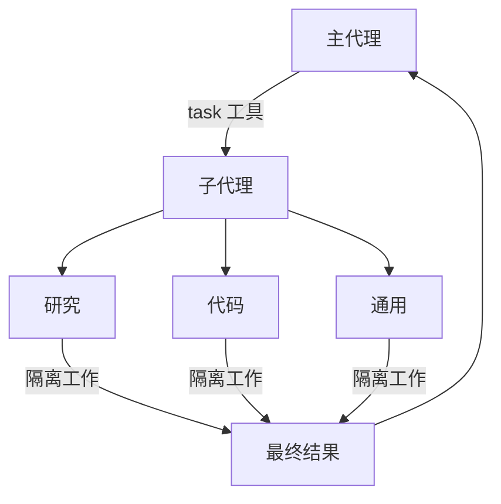

# 子代理

> 了解如何使用子代理委派工作并保持上下文干净

深度代理可以创建子代理来委派工作。你可以在 `subagents` 参数中指定自定义子代理。子代理对于上下文隔离（保持主代理的上下文干净）和提供专门指令非常有用。

本页涵盖**同步**子代理，即监督者在子代理完成之前保持阻塞。对于长时间运行的任务、并行工作流或需要中途引导和取消的情况，请参阅异步子代理。



## 为什么使用子代理？

子代理解决了**上下文膨胀问题**。当代理使用会产生大量输出的工具（网络搜索、文件读取、数据库查询）时，上下文窗口会很快被中间结果填满。子代理隔离了这些详细的工作——主代理仅接收最终结果，而不是生成这些结果的数十个工具调用。

**何时使用子代理：**

* ✅ 会扰乱主代理上下文的多步骤任务
* ✅ 需要自定义指令或工具的专业领域
* ✅ 需要不同模型能力的任务
* ✅ 当你希望主代理专注于高层协调时

**何时不使用子代理：**

* ❌ 简单的单步骤任务
* ❌ 需要保留中间上下文时
* ❌ 当开销大于收益时

## 配置

`subagents` 应该是一个包含字典或 `CompiledSubAgent` 对象的列表。有两种类型：

### 默认子代理

Deep Agents 会自动添加一个同步的 `general-purpose`（通用）子代理，除非你已经提供了一个同名的同步子代理。

`general-purpose` 子代理默认拥有文件系统工具，并且可以通过额外的工具/中间件进行自定义。

* 要替换它，传入你自己的名为 `general-purpose` 的子代理。
* 要重命名或重新提示自动添加的版本，请在活动的框架配置文件上设置 `general_purpose_subagent=GeneralPurposeSubagentProfile(...)`。
* 要禁用它，请参阅下面的“在没有子代理的情况下运行”。

### 在没有子代理的情况下运行

要在没有 `task` 工具的情况下运行代理，需要做两件事：

1. 在活动的框架配置文件上设置 `general_purpose_subagent=GeneralPurposeSubagentProfile(enabled=False)`。
2. 在 `create_deep_agent` 上通过 `subagents=` 不传递任何同步子代理。

仅当至少存在一个同步子代理时，Deep Agents 才会附加 `SubAgentMiddleware`（以及 `task` 工具）。既没有默认子代理也没有调用者提供的子代理时，代理将在没有委派的情况下运行。

异步子代理不受影响——它们通过自己的中间件和工具运行，如异步子代理中所述。

不要在这里使用 `excluded_middleware`——`SubAgentMiddleware` 是必需的脚手架，将其列入会引发 `ValueError`。`general_purpose_subagent.enabled = False` 开关是受支持的路径。

## 自定义子代理

你可以通过使用 `subagents` 参数来定义具有特定工具的专门子代理。例如，用作代码审查员、网络研究员或测试运行器。

对于大多数用例，将子代理定义为包含 SubAgent 字典的字典。对于复杂的工作流程，使用 `CompiledSubAgent`：
    
## SubAgent（基于字典）

根据 `SubAgent` 规范将子代理定义为字典，包含以下字段：

| 字段             | 类型                         | 描述                                                                                                                                                                                                                                                                                                                                                                                                                                                                                                                                                                                                                                                          |
| ---------------- | ---------------------------- | ------------------------------------------------------------------------------------------------------------------------------------------------------------------------------------------------------------------------------------------------------------------------------------------------------------------------------------------------------------------------------------------------------------------------------------------------------------------------------------------------------------------------------------------------------------------------------------------------------------------------------------------------------------- |
| `name`           | `str`                        | 必需。子代理的唯一标识符。主代理在调用 `task()` 工具时使用此名称。子代理名称成为 `AIMessage` 和流的元数据，有助于区分不同的代理。                                                                                                                                                                                                                                                                                                                                                                                                                                                                            |
| `description`    | `str`                        | 必需。描述此子代理的功能。要具体且面向操作。主代理使用此信息来决定何时委派。                                                                                                                                                                                                                                                                                                                                                                                                                                                                                                                              |
| `system_prompt`  | `str`                        | 必需。子代理的指令。自定义子代理必须定义自己的指令。包括工具使用指导和输出格式要求。不会从主代理继承。                                                                                                                                                                                                                                                                                                                                                                                                                                                                                         |
| `tools`          | `list[Callable]`             | 可选。子代理可以使用的工具。保持最小化，仅包含所需的内容。默认情况下从主代理继承。指定后，完全覆盖继承的工具。                                                                                                                                                                                                                                                                                                                                                                                                                                                                                        |
| `model`          | `str` \| `BaseChatModel`     | 可选。覆盖主代理的模型。省略则使用主代理的模型。默认情况下从主代理继承。你可以传递模型标识符字符串，如 `'openai:gpt-5.4'`（使用 `'provider:model'` 格式）或 LangChain 聊天模型对象（`init_chat_model("gpt-5.4")` 或 `ChatOpenAI(model="gpt-5.4")`）。                                                                                                                                                                                                                                                                                                                                           |
| `middleware`     | `list[Middleware]`           | 可选。用于自定义行为、日志记录或速率限制的额外中间件。不会从主代理继承。                                                                                                                                                                                                                                                                                                                                                                                                                                                                                                                                               |
| `interrupt_on`   | `dict[str, bool]`            | 可选。为特定工具配置人机协同。子代理的值覆盖主代理。需要检查点器。默认情况下从主代理继承。子代理的值覆盖默认值。                                                                                                                                                                                                                                                                                                                                                                                                                                                                                 |
| `skills`         | `list[str]`                  | 可选。技能源路径。指定后，子代理将从这些目录加载技能（例如 `["/skills/research/", "/skills/web-search/"]`）。这允许子代理拥有与主代理不同的技能集。不会从主代理继承。只有通用子代理继承主代理的技能。当子代理拥有技能时，它会运行自己的独立 `SkillsMiddleware` 实例。技能状态是完全隔离的——子代理加载的技能对父代理不可见，反之亦然。 |
| `response_format`| `ResponseFormat`             | 可选。子代理的结构化输出模式。设置后，父代理将以 JSON 形式接收子代理的结果，而不是自由格式的文本。接受 Pydantic 模型、`ToolStrategy(...)`、`ProviderStrategy(...)` 或原始模式类型。请参阅结构化输出。                                                                                                                                                                                                                                                                                                                                                  |
| `permissions`    | `list[FilesystemPermission]` | 可选。子代理的文件系统权限规则。设置后，**完全替换**父代理的权限。默认情况下从主代理继承。                                                                                                                                                                                                                                                                                                                                                                                                                                                              |

## CompiledSubAgent

对于复杂的工作流程，使用预构建的 LangGraph 图作为 `CompiledSubAgent`：

| 字段          | 类型       | 描述                                                                                       |
| ------------- | ---------- | ------------------------------------------------------------------------------------------ |
| `name`        | `str`      | 必需。子代理的唯一标识符。子代理名称成为 `AIMessage` 和流的元数据，有助于区分不同的代理。 |
| `description` | `str`      | 必需。描述此子代理的功能。                                                                  |
| `runnable`    | `Runnable` | 必需。一个已编译的 LangGraph 图（必须先调用 `.compile()`）。                                  |

## 使用 SubAgent

```python
import os
from typing import Literal

from deepagents import create_deep_agent
from tavily import TavilyClient

tavily_client = TavilyClient(api_key=os.environ["TAVILY_API_KEY"])

def internet_search(
    query: str,
    max_results: int = 5,
    topic: Literal["general", "news", "finance"] = "general",
    include_raw_content: bool = False,
):
    """运行网络搜索"""
    return tavily_client.search(
        query,
        max_results=max_results,
        include_raw_content=include_raw_content,
        topic=topic,
    )

research_subagent = {
    "name": "research-agent",
    "description": "用于研究更深入的问题",
    "system_prompt": "你是一位出色的研究员",
    "tools": [internet_search],
    "model": "openai:gpt-5.4",  # 可选覆盖，默认使用主代理模型
}
subagents = [research_subagent]

agent = create_deep_agent(
    model="google_genai:gemini-3.1-pro-preview",
    subagents=subagents,
)
```

## 使用 CompiledSubAgent

对于更复杂的用例，你可以使用 `CompiledSubAgent` 提供自定义子代理。
你可以使用 LangChain 的 `create_agent` 创建自定义子代理，或者使用图 API 创建自定义 LangGraph 图。

如果你正在创建自定义 LangGraph 图，请确保图有一个名为 `"messages"` 的状态键：

```python
from deepagents import create_deep_agent, CompiledSubAgent
from langchain.agents import create_agent

# 创建一个自定义代理图
custom_graph = create_agent(
    model=your_model,
    tools=specialized_tools,
    prompt="你是一个专门用于数据分析的代理..."
)

# 将其用作自定义子代理
custom_subagent = CompiledSubAgent(
    name="data-analyzer",
    description="用于复杂数据分析任务的专门代理",
    runnable=custom_graph
)

subagents = [custom_subagent]

agent = create_deep_agent(
    model="google_genai:gemini-3.1-pro-preview",
    tools=[internet_search],
    system_prompt=research_instructions,
    subagents=subagents
)
```

## 流式传输

在流式跟踪信息中，代理的名称作为 `lc_agent_name` 在元数据中可用。在查看跟踪信息时，你可以使用此元数据来区分数据来自哪个代理。

以下示例创建一个名为 `main-agent` 的深度代理和一个名为 `research-agent` 的子代理：

```python
import os
from typing import Literal
from tavily import TavilyClient
from deepagents import create_deep_agent

tavily_client = TavilyClient(api_key=os.environ["TAVILY_API_KEY"])

def internet_search(
    query: str,
    max_results: int = 5,
    topic: Literal["general", "news", "finance"] = "general",
    include_raw_content: bool = False,
):
    """运行网络搜索"""
    return tavily_client.search(
        query,
        max_results=max_results,
        include_raw_content=include_raw_content,
        topic=topic,
    )

research_subagent = {
    "name": "research-agent",
    "description": "用于研究更深入的问题",
    "system_prompt": "你是一位出色的研究员",
    "tools": [internet_search],
    "model": "google_genai:gemini-3.1-pro-preview",  # 可选覆盖，默认使用主代理模型
}
subagents = [research_subagent]

agent = create_deep_agent(
    model="google_genai:gemini-3.1-pro-preview",
    subagents=subagents,
    name="main-agent"
)
```

当你向深度代理发出提示时，由子代理或深度代理执行的所有代理运行都将在其元数据中包含代理名称。在这种情况下，名为 `"research-agent"` 的子代理将在任何关联的代理运行元数据中包含 `{'lc_agent_name': 'research-agent'}`：

## 结构化输出

子代理支持结构化输出，因此父代理会收到可预测、可解析的 JSON，而不是自由格式的文本。

在子代理配置上传递 `response_format`。当子代理完成时，其结构化响应将被 JSON 序列化，并作为 `ToolMessage` 内容返回给父代理。模式接受 `create_agent` 支持的任何内容：Pydantic 模型、`ToolStrategy(...)`、`ProviderStrategy(...)` 或原始模式类型。

```python
from pydantic import BaseModel, Field

from deepagents import create_deep_agent

class ResearchFindings(BaseModel):
    """研究任务的结构化发现。"""
    summary: str = Field(description="发现摘要")
    confidence: float = Field(description="置信度分数，从0到1")
    sources: list[str] = Field(description="来源URL列表")

research_subagent = {
    "name": "researcher",
    "description": "研究主题并返回结构化发现",
    "system_prompt": "彻底研究给定主题。返回你的发现。",
    "tools": [web_search],
    "response_format": ResearchFindings,
}

agent = create_deep_agent(
    model="claude-sonnet-4-6",
    subagents=[research_subagent],
)

result = await agent.ainvoke(
    {"messages": [{"role": "user", "content": "研究量子计算的最新进展"}]}
)

# 父代理的ToolMessage包含JSON序列化的结构化数据：
# '{"summary": "...", "confidence": 0.87, "sources": ["https://..."]}'
```

如果没有 `response_format`，父代理会按原样接收子代理的最后一条消息文本。有了它，父代理总是能得到匹配模式的合法 JSON，这在父代理需要以编程方式处理结果或将其传递给下游工具时非常有用。

有关模式类型和策略（工具调用与提供商原生）的完整详细信息，请参阅结构化输出。

## 通用子代理

除了任何用户定义的子代理之外，每个深度代理在任何时候都可以访问一个 `general-purpose`（通用）子代理。此子代理：

* 拥有与主代理相同的系统提示
* 可以访问所有相同的工具
* 使用相同的模型（除非被覆盖）
* 从主代理继承技能（当配置了技能时）

### 覆盖通用子代理

在你的 `subagents` 列表中包含一个 `name="general-purpose"` 的子代理以替换默认值。使用它来为通用子代理配置不同的模型、工具或系统提示：

```python
from deepagents import create_deep_agent

# 主代理使用Gemini；通用子代理使用GPT
agent = create_deep_agent(
    model="google_genai:gemini-3.1-pro-preview",
    tools=[internet_search],
    subagents=[
        {
            "name": "general-purpose",
            "description": "用于研究和多步骤任务的通用代理",
            "system_prompt": "你是一个通用助手。",
            "tools": [internet_search],
            "model": "openai:gpt-5.4",  # 为委派任务使用不同的模型
        },
    ],
)
```

当你提供具有通用名称的子代理时，默认的通用子代理不会被添加。你的规范会完全替换它。

要完全移除内置的通用子代理而不是替换它，请将活动框架配置文件的通用子代理 `enabled` 标志设置为 `False`。

### 何时使用它

**通用子代理非常适合  不需要专门行为的上下文隔离**。主代理可以将复杂的多步骤任务委派给此子代理，并得到一个简洁的结果，而不会因中间工具调用而膨胀。

与其让主代理进行10次网络搜索并用结果填满其上下文，不如委派给通用子代理：`task(name="general-purpose", task="研究量子计算趋势")`。子代理在内部执行所有搜索，并仅返回摘要。

### 技能继承

在配置 `create_deep_agent` 的技能时：

* **通用子代理**：自动从主代理继承技能
* **自定义子代理**：默认情况下不继承技能——使用 `skills` 参数为其赋予自己的技能

只有配置了技能的子代理才会获得 `SkillsMiddleware` 实例——没有 `skills` 参数的自定义子代理则不会。当存在时，技能状态在两个方向上完全隔离：父级的技能对子级不可见，子级的技能也不会传播回父级。

```python
from deepagents import create_deep_agent

# 拥有自己技能的研究子代理
research_subagent = {
    "name": "researcher",
    "description": "具有专门技能的研究助手",
    "system_prompt": "你是一名研究员。",
    "tools": [web_search],
    "skills": ["/skills/research/", "/skills/web-search/"],  # 子代理特定技能
}

agent = create_deep_agent(
    model="google_genai:gemini-3.1-pro-preview",
    skills=["/skills/main/"],  # 主代理和通用子代理获得这些技能
    subagents=[research_subagent],  # 仅获得 /skills/research/ 和 /skills/web-search/
)
```

## 最佳实践

### 编写清晰的描述

主代理使用描述来决定调用哪个子代理。要具体：

✅ **好：** `"分析财务数据并生成带有置信度分数的投资见解"`

❌ **不好：** `"做财务方面的事情"`

### 保持系统提示详细

包含关于如何使用工具和格式化输出的具体指导：

```python
research_subagent = {
    "name": "research-agent",
    "description": "使用网络搜索进行深入研究并综合发现",
    "system_prompt": """你是一位细致的研究员。你的工作是：

    1. 将研究问题分解为可搜索的查询
    2. 使用 internet_search 查找相关信息
    3. 将发现综合成全面但简洁的摘要
    4. 在提出主张时引用来源

    输出格式：
    - 摘要（2-3段）
    - 关键发现（要点）
    - 来源（附带URL）

    将回复控制在500字以内，以保持上下文干净。""",
    "tools": [internet_search],
}
```

### 最小化工具集

只给子代理所需的工具。这样可以提高专注度和安全性：

```python
# ✅ 好：专注的工具集
email_agent = {
    "name": "email-sender",
    "tools": [send_email, validate_email],  # 仅与邮件相关
}

# ❌ 不好：工具太多
email_agent = {
    "name": "email-sender",
    "tools": [send_email, web_search, database_query, file_upload],  # 不专注
}
```

### 按任务选择模型

不同模型擅长不同任务：

```python
subagents = [
    {
        "name": "contract-reviewer",
        "description": "审查法律文件和合同",
        "system_prompt": "你是一位专业的法律审查员...",
        "tools": [read_document, analyze_contract],
        "model": "google_genai:gemini-3.1-pro-preview",  # 大上下文用于长文档
    },
    {
        "name": "financial-analyst",
        "description": "分析财务数据和市场趋势",
        "system_prompt": "你是一位专业的财务分析师...",
        "tools": [get_stock_price, analyze_fundamentals],
        "model": "openai:gpt-5.4",  # 更擅长数值分析
    },
]
```

### 返回简洁的结果

指示子代理返回摘要，而不是原始数据：

```python
data_analyst = {
    "system_prompt": """分析数据并返回：
    1. 关键见解（3-5个要点）
    2. 总体置信度分数
    3. 推荐的下一步行动

    不要包含：
    - 原始数据
    - 中间计算步骤
    - 详细的工具输出

    将回复控制在300字以内。"""
}
```

## 常见模式

### 多个专门的子代理

为不同领域创建专门的子代理：

```python
from deepagents import create_deep_agent

subagents = [
    {
        "name": "data-collector",
        "description": "从各种来源收集原始数据",
        "system_prompt": "收集有关该主题的全面数据",
        "tools": [web_search, api_call, database_query],
    },
    {
        "name": "data-analyzer",
        "description": "分析收集到的数据以获取见解",
        "system_prompt": "分析数据并提取关键见解",
        "tools": [statistical_analysis],
    },
    {
        "name": "report-writer",
        "description": "根据分析撰写精美的报告",
        "system_prompt": "根据见解创建专业的报告",
        "tools": [format_document],
    },
]

agent = create_deep_agent(
    model="google_genai:gemini-3.1-pro-preview",
    system_prompt="你协调数据分析和报告。对于专门任务，请使用子代理。",
    subagents=subagents
)
```

**工作流程：**

1. 主代理创建高层计划
2. 将数据收集委派给 data-collector
3. 将结果传递给 data-analyzer
4. 将见解发送给 report-writer
5. 编译最终输出

每个子代理只在专注于其任务的干净上下文中工作。

## 上下文管理

当你使用运行时上下文调用父代理时，该上下文会自动传播到所有子代理。每个子代理运行都会接收你在父级 `invoke` / `ainvoke` 调用中传递的相同运行时上下文。

这意味着在任何子代理中运行的工具都可以访问你提供给父级的相同上下文值：

```python
from dataclasses import dataclass

from deepagents import create_deep_agent
from langchain.messages import HumanMessage
from langchain.tools import tool, ToolRuntime

@dataclass
class Context:
    user_id: str
    session_id: str

@tool
def get_user_data(query: str, runtime: ToolRuntime[Context]) -> str:
    """获取当前用户的数据。"""
    user_id = runtime.context.user_id
    return f"用户 {user_id} 的数据: {query}"

research_subagent = {
    "name": "researcher",
    "description": "为当前用户进行研究",
    "system_prompt": "你是一名研究助手。",
    "tools": [get_user_data],
}

agent = create_deep_agent(
    model="google_genai:gemini-3.1-pro-preview",
    subagents=[research_subagent],
    context_schema=Context,
)

# 上下文自动流向研究员子代理及其工具
result = await agent.invoke(
    {"messages": [HumanMessage("查找我最近的活动")]},
    context=Context(user_id="user-123", session_id="abc"),
)
```

## 每个子代理的上下文

所有子代理都接收相同的父级上下文。要传递特定于某个子代理的配置，可以在扁平的 `context` 映射中使用**带命名空间的键**（以子代理名称作为键前缀，例如 `researcher:max_depth`），**或者**将这些设置建模为上下文类型上的单独字段：

```python
from dataclasses import dataclass

from langchain.messages import HumanMessage
from langchain.tools import tool, ToolRuntime

@dataclass
class Context:
    user_id: str
    researcher_max_depth: int | None = None
    fact_checker_strict_mode: bool | None = None

result = await agent.invoke(
    {"messages": [HumanMessage("研究这个并核实声明")]},
    context=Context(
        user_id="user-123",
        researcher_max_depth=3,
        fact_checker_strict_mode=True,
    ),
)

@tool
def verify_claim(claim: str, runtime: ToolRuntime[Context]) -> str:
    """验证一个事实声明。"""
    strict_mode = runtime.context.fact_checker_strict_mode or False
    if strict_mode:
        return strict_verification(claim)
    return basic_verification(claim)
```

## 识别是哪个子代理调用了工具

当相同的工具在父代理和多个子代理之间共享时，你可以使用 `lc_agent_name` 元数据（与流式传输中使用的值相同）来确定是哪个代理发起了调用：

```python
from langchain.tools import tool, ToolRuntime

@tool
def shared_lookup(query: str, runtime: ToolRuntime) -> str:
    """查找信息。"""
    agent_name = runtime.config.get("metadata", {}).get("lc_agent_name")
    if agent_name == "fact-checker":
        return strict_lookup(query)
    return general_lookup(query)
```

你可以结合两种模式——当分支工具行为时，从 `runtime.context` 读取特定于代理的设置，并从 `runtime.config` 元数据读取 `lc_agent_name`。

```python
from langchain.tools import tool, ToolRuntime

@tool
def flexible_search(query: str, runtime: ToolRuntime[Context]) -> str:
    """使用特定于代理的设置进行搜索。"""
    agent_name = runtime.config.get("metadata", {}).get("lc_agent_name", "unknown")
    ctx = runtime.context
    if agent_name == "researcher":
        max_results = ctx.researcher_max_depth or 5
    else:
        max_results = 5
    include_raw = False

    return perform_search(query, max_results=max_results, include_raw=include_raw)
```

## 故障排除

### 子代理未被调用

**问题**：主代理试图自己完成工作，而不是委派。

**解决方案**：

1. **使描述更具体：**

   ```python
   # ✅ 好
   {"name": "research-specialist", "description": "使用网络搜索对特定主题进行深入研究。当你需要需要多次搜索才能获取的详细信息时使用。"}

   # ❌ 不好
   {"name": "helper", "description": "帮助处理事务"}
   ```

2. **指示主代理进行委派：**

   ```python
   agent = create_deep_agent(
       model="google_genai:gemini-3.1-pro-preview",
       system_prompt="""...你的指令...

       重要：对于复杂任务，使用 task() 工具委派给你的子代理。
       这可以保持你的上下文干净并改善结果。""",
       subagents=[...]
   )
   ```

### 上下文仍然膨胀

**问题**：尽管使用了子代理，上下文还是填满了。

**解决方案**：

1. **指示子代理返回简洁的结果：**

   ```python
   system_prompt="""...

   重要：仅返回必要的摘要。
   不要包含原始数据、中间搜索结果或详细的工具输出。
   你的回复应在500字以内。"""
   ```

2. **对大数据使用文件系统：**

   ```python
   system_prompt="""当你收集大量数据时：
   1. 将原始数据保存到 /data/raw_results.txt
   2. 处理和分析数据
   3. 仅返回分析摘要

   这样可以保持上下文干净。"""
   ```

### 选择了错误的子代理

**问题**：主代理为任务调用了不合适的子代理。

**解决方案**：在描述中明确区分子代理：

```python
subagents = [
    {
        "name": "quick-researcher",
        "description": "用于简单的、只需要1-2次搜索的快速研究问题。当你需要基本事实或定义时使用。",
    },
    {
        "name": "deep-researcher",
        "description": "用于复杂的、需要多次搜索、综合和分析的深入研究。用于综合报告。",
    }
]
```