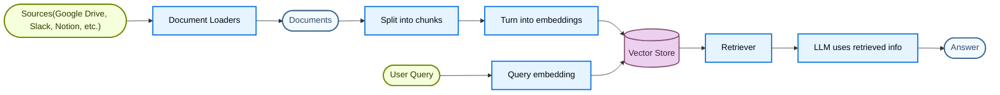
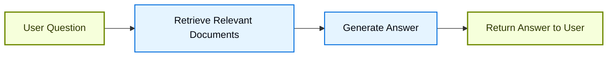
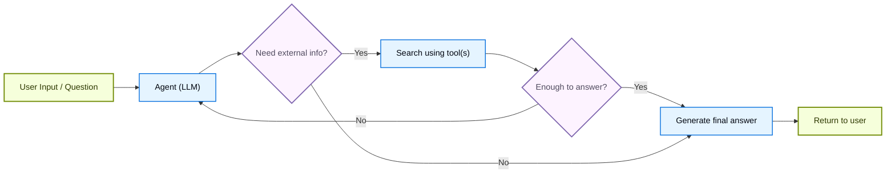
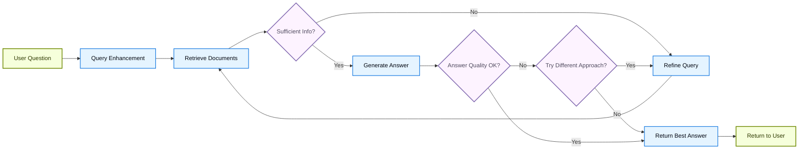

# Retrieval

大型语言模型 (LLMs) 功能强大，但它们有两个关键限制：

* **有限的上下文** — 无法一次性消化整个语料库。
* **静态知识** — 它们的训练数据在某个时间点之后是固定的。

检索通过在查询时获取相关的外部知识来解决这些问题。这是**检索增强生成 (RAG)** 的基础：用上下文特定的信息来增强 LLM 的答案。

## 构建知识库

**知识库** 是在检索过程中使用的文档或结构化数据的存储库。

如果您需要一个自定义的知识库，您可以使用 LangChain 的文档加载器和向量存储来从您自己的数据构建一个。

如果您已经有一个知识库（例如，一个 SQL 数据库、CRM 或内部文档系统），您**无需**重新构建它。您可以：

  * 将其作为 **工具** 连接到 Agentic RAG 中的 agent。
  * 查询它，并将检索到的内容作为上下文提供给 LLM（2步 RAG）。

请参阅以下教程，构建一个可搜索的知识库和最小 RAG 工作流：

学习如何使用 LangChain 的文档加载器、嵌入和向量存储从您自己的数据创建一个可搜索的知识库。
在本教程中，您将在一个 PDF 上构建一个搜索引擎，能够检索与查询相关的段落。您还将在该引擎之上实现一个最小的 RAG 工作流，以了解外部知识如何被集成到 LLM 推理中。

### 从检索到 RAG

检索允许 LLM 在运行时访问相关上下文。但大多数实际应用更进一步：它们**将检索与生成集成**，以产生有依据的、上下文感知的答案。

这就是**检索增强生成 (RAG)** 背后的核心思想。检索管道成为一个更广泛系统的基础，该系统结合了搜索和生成。

### 检索管道

一个典型的检索工作流如下所示：



每个组件都是模块化的：您可以交换加载器、分割器、嵌入或向量存储，而无需重写应用程序的逻辑。

### 构建块

从外部源（Google Drive、Slack、Notion 等）摄取数据，返回标准化的 `Document` 对象。

将大型文档拆分成较小的块，以便可以单独检索并适合模型的上下文窗口。

嵌入模型将文本转换为数字向量，以便具有相似含义的文本在该向量空间中彼此接近。

用于存储和搜索嵌入的专用数据库。

一个检索器是一个接口，它根据非结构化查询返回文档。

## RAG 架构

RAG 可以通过多种方式实现，具体取决于您系统的需求。我们在下面的章节中概述每种类型。

| 架构          | 描述                                                               | 控制性   | 灵活性 | 延迟       | 示例用例                                  |
| ------------- | ------------------------------------------------------------------ | -------- | ------ | ---------- | ----------------------------------------- |
| **2步 RAG**   | 检索总是在生成之前发生。简单且可预测。                             | ✅ 高     | ❌ 低   | ⚡ 快速     | 常见问题解答、文档机器人                  |
| **Agentic RAG** | 一个由 LLM 驱动的 agent 在推理过程中决定*何时*以及*如何*检索       | ❌ 低     | ✅ 高   | ⏳ 可变    | 可以访问多个工具的研究助手                |
| **混合型**    | 结合了两种方法的特点，并带有验证步骤                               | ⚖️ 中等 | ⚖️ 中等 | ⏳ 可变    | 具有质量验证的特定领域 Q&A                |

**延迟**：在 **2步 RAG** 中，延迟通常更**可预测**，因为 LLM 调用的最大数量是已知且有上限的。这种可预测性假设 LLM 推理时间是主要因素。然而，实际延迟也可能受到检索步骤性能的影响——例如 API 响应时间、网络延迟或数据库查询——这些可能因所使用的工具和基础设施而异。

### 2步 RAG

在 **2步 RAG** 中，检索步骤总是在生成步骤之前执行。这种架构简单且可预测，适用于许多应用，其中检索相关文档是生成答案的明确先决条件。



查看如何构建一个可以使用检索增强生成来回答基于您数据的问题的 Q&A 聊天机器人。
  本教程介绍了两种方法：

  * 一个使用灵活工具进行搜索的 **RAG agent**——非常适合通用用途。
  * 一个每次查询只需要一次 LLM 调用的 **2步 RAG** 链——对于较简单的任务来说快速且高效。

### Agentic RAG

**Agentic Retrieval-Augmented Generation (RAG)** 结合了检索增强生成的优势和基于代理的推理。agent（由 LLM 驱动）不会在回答之前检索文档，而是逐步推理，并在交互过程中决定**何时**以及**如何**检索信息。

agent 启用 RAG 行为所需的唯一条件是能够访问一个或多个可以获取外部知识的**工具**——例如文档加载器、Web API 或数据库查询。



```python
import requests
from langchain.tools import tool
from langchain.chat_models import init_chat_model
from langchain.agents import create_agent

@tool
def fetch_url(url: str) -> str:
    """从 URL 获取文本内容"""
    response = requests.get(url, timeout=10.0)
    response.raise_for_status()
    return response.text

system_prompt = """\
当你需要从网页获取信息时使用 fetch_url；引用相关的片段。
"""

agent = create_agent(
    model="claude-sonnet-4-6",
    tools=[fetch_url], # 用于检索的工具 [!code highlight]
    system_prompt=system_prompt,
)
```

这个示例实现了一个 **Agentic RAG 系统**来帮助用户查询 LangGraph 文档。agent 首先加载 llms.txt，其中列出了可用的文档 URL，然后可以根据用户的问题动态使用 `fetch_documentation` 工具来检索和处理相关内容。

  ```python
  import requests
  from langchain.agents import create_agent
  from langchain.messages import HumanMessage
  from langchain.tools import tool
  from markdownify import markdownify

ALLOWED_DOMAINS = ["https://langchain-ai.github.io/"]
  LLMS_TXT = 'https://langchain-ai.github.io/langgraph/llms.txt'

@tool
  def fetch_documentation(url: str) -> str:  
      """从 URL 获取并转换文档"""
      if not any(url.startswith(domain) for domain in ALLOWED_DOMAINS):
          return (
              "Error: URL not allowed. "
              f"Must start with one of: {', '.join(ALLOWED_DOMAINS)}"
          )
      response = requests.get(url, timeout=10.0)
      response.raise_for_status()
      return markdownify(response.text)

# 我们将获取 llms.txt 的内容，这样可以
  # 提前完成，无需 LLM 请求。
  llms_txt_content = requests.get(LLMS_TXT).text

  # Agent 的系统提示
  system_prompt = f"""
  你是一位 Python 开发专家和技术助理。
  你的主要角色是帮助用户解决有关 LangGraph 及相关工具的问题。

  指令：

  1. 如果用户问了一个你不确定的问题——或者可能涉及 API 使用、
     行为或配置——你必须使用 `fetch_documentation` 工具查阅相关文档。
  2. 引用文档时，要清晰地总结，并包含内容中的相关上下文。
  3. 不要使用允许域之外的任何 URL。
  4. 如果文档获取失败，请告知用户，并根据你最好的专家理解继续。

  你可以从以下批准的来源访问官方文档：

  {llms_txt_content}

  在回答用户关于 LangGraph 的问题之前，你必须查阅文档以获取最新的文档。

  你的答案应该清晰、简洁且技术准确。
  """

  tools = [fetch_documentation]

  model = init_chat_model("claude-sonnet-4-0", max_tokens=32_000)

  agent = create_agent(
      model=model,
      tools=tools,  
      system_prompt=system_prompt,  
      name="Agentic RAG",
  )

  response = agent.invoke({
      'messages': [
          HumanMessage(content=(
              "写一个使用预构建 create_react_agent 的 langgraph agent 的简短示例。"
              "该 agent 应该能够查找股票价格信息。"
          ))
      ]
  })

  print(response['messages'][-1].content)
  ```

查看如何构建一个可以使用检索增强生成来回答基于您数据的问题的 Q&A 聊天机器人。
  本教程介绍了两种方法：

  * 一个使用灵活工具进行搜索的 **RAG agent**——非常适合通用用途。
  * 一个每次查询只需要一次 LLM 调用的 **2步 RAG** 链——对于较简单的任务来说快速且高效。

### 混合型 RAG

混合型 RAG 结合了 2步 RAG 和 Agentic RAG 的特点。它引入了中间步骤，例如查询预处理、检索验证和生成后检查。这些系统比固定管道提供了更多的灵活性，同时保持了对执行的一定控制。

典型组件包括：

* **查询增强**：修改输入问题以提高检索质量。这可能涉及重写模糊的查询、生成多个变体，或用额外的上下文扩展查询。
* **检索验证**：评估检索到的文档是否相关且足够。如果不足，系统可能会优化查询并再次检索。
* **答案验证**：检查生成的答案的准确性、完整性以及与源内容的一致性。如果需要，系统可以重新生成或修改答案。

该架构通常支持这些步骤之间的多次迭代：



这种架构适用于：

* 具有模糊或未明确指定查询的应用程序
* 需要验证或质量控制步骤的系统
* 涉及多个来源或迭代优化的工作流

一个结合了 agentic 推理、检索和自我修正的**混合型 RAG** 示例。