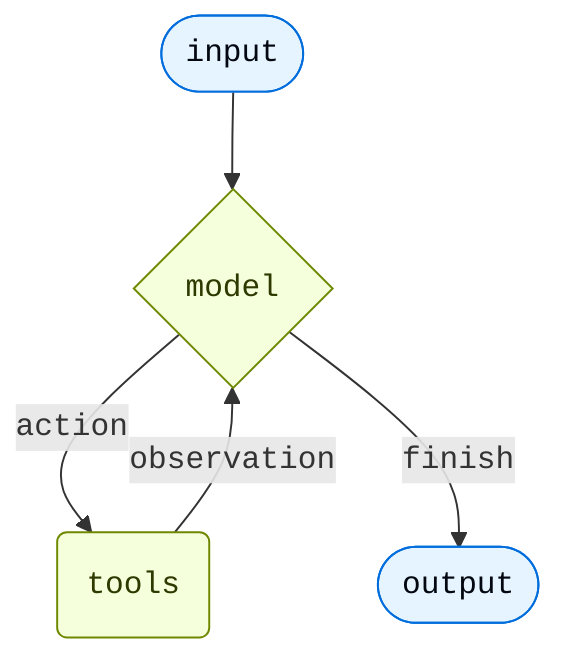

# Agents

Agents 将语言模型与工具相结合，构建出能够对任务进行推理、决定使用哪些工具，并迭代式地朝着解决方案前进的系统。

`create_agent` 提供了一个可用于生产环境的 agent 实现。

LLM Agent 在一个循环中运行工具以实现目标。
Agent 会一直运行直到满足停止条件，例如模型发出最终输出或达到迭代次数限制。



`create_agent` 使用 LangGraph 构建了一个基于**图**的 agent 运行时。图由节点（步骤）和边（连接）组成，定义了 agent 处理信息的方式。Agent 在图中的节点间移动，执行诸如模型节点（调用模型）、工具节点（执行工具）或中间件等。
## 核心组件

### Model

Model 是 agent 的推理引擎。它可以通过多种方式指定，既支持静态模型选择，也支持动态模型选择。

#### 静态 model

静态 model 在创建 agent 时配置一次，并在整个执行过程中保持不变。这是最常用、最直接的方法。

从 model 标识符字符串初始化静态 model：

```python
from langchain.agents import create_agent

agent = create_agent("openai:gpt-5.4", tools=tools)
```

Model 标识符字符串支持自动推断（例如 `"gpt-5.4"` 会被推断为 `"openai:gpt-5.4"`）。请参阅参考文档以查看完整的 model 标识符字符串映射列表。

为了对 model 配置进行更精细的控制，可以直接使用 provider 包初始化一个 model 实例。在此示例中，我们使用 `ChatOpenAI`。查看 Chat models 以了解其他可用的 chat model 类。

```python
from langchain.agents import create_agent
from langchain_openai import ChatOpenAI

model = ChatOpenAI(
    model="gpt-5.4",
    temperature=0.1,
    max_tokens=1000,
    timeout=30
    # ... (其他参数)
)
agent = create_agent(model, tools=tools)
```

Model 实例使您能够完全控制配置。当您需要设置特定参数（如 `temperature`、`max_tokens`、`timeouts`、`base_url` 以及其他 provider 特定设置）时，请使用它们。请参阅参考文档以了解您的 model 上可用的参数和方法。

#### 动态 model

动态 model 在运行时根据当前状态和上下文进行选择。这可以实现复杂的路由逻辑和成本优化。

要使用动态 model，需要创建使用 `@wrap_model_call` 装饰器的 middleware，该 middleware 会修改请求中的 model：

```python
from langchain_openai import ChatOpenAI
from langchain.agents import create_agent
from langchain.agents.middleware import wrap_model_call, ModelRequest, ModelResponse

basic_model = ChatOpenAI(model="gpt-5.4-mini")
advanced_model = ChatOpenAI(model="gpt-5.4")

@wrap_model_call
def dynamic_model_selection(request: ModelRequest, handler) -> ModelResponse:
    """根据对话复杂度选择 model。"""
    message_count = len(request.state["messages"])

    if message_count > 10:
        # 对于较长的对话使用高级 model
        model = advanced_model
    else:
        model = basic_model

    return handler(request.override(model=model))

agent = create_agent(
    model=basic_model,  # 默认 model
    tools=tools,
    middleware=[dynamic_model_selection]
)
```

当使用结构化输出时，不支持预绑定的 model（即已经调用过 `bind_tools` 的 model）。如果您需要结合结构化输出的动态 model 选择，请确保传递给 middleware 的 model 不是预绑定的。

有关 model 配置的详细信息，请参阅 Models。有关动态 model 选择模式，请参阅 middleware 中的 Dynamic model。

### Tools

Tools 赋予 agent 采取行动的能力。Agents 不仅仅是简单的模型+工具绑定，它们还能促进：

- 多步工具调用（由单个提示触发）
- 适当时的并行工具调用
- 基于先前结果的动态工具选择
- 工具重试逻辑和错误处理
- 跨工具调用的状态持久化

更多信息请参阅 Tools。

#### 静态 tools

静态 tools 在创建 agent 时定义，并在整个执行过程中保持不变。这是最常用、最直接的方法。

要定义一个带有静态 tools 的 agent，只需将工具列表传递给 agent。

Tools 可以是普通的 Python 函数或协程。

可以使用 tool 装饰器来自定义工具名称、描述、参数模式和其他属性。

```python
from langchain.tools import tool
from langchain.agents import create_agent

@tool
def search(query: str) -> str:
    """搜索信息。"""
    return f"Results for: {query}"

@tool
def get_weather(location: str) -> str:
    """获取某个位置的天气信息。"""
    return f"Weather in {location}: Sunny, 72°F"

agent = create_agent(model, tools=[search, get_weather])
```

如果提供空的工具列表，agent 将仅包含一个 LLM 节点，不具备调用工具的能力。

#### 动态 tools

使用动态 tools 时，agent 可用的工具集是在运行时修改的，而不是事先全部定义好。并非每个工具都适用于所有场景。工具过多可能会使模型不堪重负（上下文过载）并增加错误；工具过少则会限制能力。动态工具选择使得能够根据身份验证状态、用户权限、功能标志或对话阶段来调整可用的工具集。

有两种方法，具体取决于工具是否事先已知：

当所有可能的工具在 agent 创建时都已经知道时，您可以预先注册它们，并根据状态、权限或上下文动态筛选暴露给模型的工具。

只有在达到某些对话里程碑后才启用高级工具：

```python
from langchain.agents import create_agent
from langchain.agents.middleware import wrap_model_call, ModelRequest, ModelResponse
from typing import Callable

@wrap_model_call
def state_based_tools(
    request: ModelRequest,
    handler: Callable[[ModelRequest], ModelResponse]
) -> ModelResponse:
    """根据对话状态筛选 tools。"""
    # 从 State 中读取：检查用户是否已认证
    state = request.state
    is_authenticated = state.get("authenticated", False)
    message_count = len(state["messages"])

    # 仅在认证后启用敏感工具
    if not is_authenticated:
        tools = [t for t in request.tools if t.name.startswith("public_")]
        request = request.override(tools=tools)
    elif message_count < 5:
        # 对话早期限制工具
        tools = [t for t in request.tools if t.name != "advanced_search"]
        request = request.override(tools=tools)

    return handler(request)

agent = create_agent(
    model="gpt-5.4",
    tools=[public_search, private_search, advanced_search],
    middleware=[state_based_tools]
)
```

根据 Store 中的用户偏好或功能标志筛选工具：

```python
from dataclasses import dataclass
from langchain.agents import create_agent
from langchain.agents.middleware import wrap_model_call, ModelRequest, ModelResponse
from typing import Callable
from langgraph.store.memory import InMemoryStore

@dataclass
class Context:
    user_id: str

@wrap_model_call
def store_based_tools(
    request: ModelRequest,
    handler: Callable[[ModelRequest], ModelResponse]
) -> ModelResponse:
    """根据 Store 中的偏好筛选 tools。"""
    user_id = request.runtime.context.user_id

    # 从 Store 中读取：获取用户启用的功能
    store = request.runtime.store
    feature_flags = store.get(("features",), user_id)

    if feature_flags:
        enabled_features = feature_flags.value.get("enabled_tools", [])
        # 仅包含该用户启用的工具
        tools = [t for t in request.tools if t.name in enabled_features]
        request = request.override(tools=tools)

    return handler(request)

agent = create_agent(
    model="gpt-5.4",
    tools=[search_tool, analysis_tool, export_tool],
    middleware=[store_based_tools],
    context_schema=Context,
    store=InMemoryStore()
)
```

根据 Runtime Context 中的用户权限筛选工具：

```python
from dataclasses import dataclass
from langchain.agents import create_agent
from langchain.agents.middleware import wrap_model_call, ModelRequest, ModelResponse
from typing import Callable

@dataclass
class Context:
    user_role: str

@wrap_model_call
def context_based_tools(
    request: ModelRequest,
    handler: Callable[[ModelRequest], ModelResponse]
) -> ModelResponse:
    """根据 Runtime Context 权限筛选 tools。"""
    # 从 Runtime Context 中读取：获取用户角色
    if request.runtime is None or request.runtime.context is None:
        # 如果没有提供 context，默认为 viewer（权限最低）
        user_role = "viewer"
    else:
        user_role = request.runtime.context.user_role

    if user_role == "admin":
        # 管理员拥有所有工具
        pass
    elif user_role == "editor":
        # 编辑者无法删除
        tools = [t for t in request.tools if t.name != "delete_data"]
        request = request.override(tools=tools)
    else:
        # 查看者只有只读工具
        tools = [t for t in request.tools if t.name.startswith("read_")]
        request = request.override(tools=tools)

    return handler(request)

agent = create_agent(
    model="gpt-5.4",
    tools=[read_data, write_data, delete_data],
    middleware=[context_based_tools],
    context_schema=Context
)
```

这种方法在以下情况下效果最佳：

```
* 所有可能的工具在编译/启动时已知
* 您希望根据权限、功能标志或对话状态进行筛选
* 工具是静态的，但它们的可用性是动态的

有关更多示例，请参阅 Dynamically selecting tools。
```

当工具在运行时被发现或创建（例如，从 MCP 服务器加载、基于用户数据生成，或从远程注册表获取）时，您需要同时注册工具并处理它们的动态执行。

这需要两个 middleware 钩子：

1. `wrap_model_call` - 将动态工具添加到请求中
2. `wrap_tool_call` - 处理动态添加的工具的执行

```python
from langchain.tools import tool
from langchain.agents import create_agent
from langchain.agents.middleware import AgentMiddleware, ModelRequest, ToolCallRequest

# 一个将在运行时动态添加的工具
@tool
def calculate_tip(bill_amount: float, tip_percentage: float = 20.0) -> str:
    """计算账单的小费金额。"""
    tip = bill_amount * (tip_percentage / 100)
    return f"Tip: ${tip:.2f}, Total: ${bill_amount + tip:.2f}"

class DynamicToolMiddleware(AgentMiddleware):
    """注册并处理动态工具的 Middleware。"""

    def wrap_model_call(self, request: ModelRequest, handler):
        # 将动态工具添加到请求中
        # 可以从 MCP 服务器、数据库等加载
        updated = request.override(tools=[*request.tools, calculate_tip])
        return handler(updated)

    def wrap_tool_call(self, request: ToolCallRequest, handler):
        # 处理动态工具的执行
        if request.tool_call["name"] == "calculate_tip":
            return handler(request.override(tool=calculate_tip))
        return handler(request)

agent = create_agent(
    model="gpt-4o",
    tools=[get_weather],  # 这里只注册静态工具
    middleware=[DynamicToolMiddleware()],
)

# 现在 agent 可以同时使用 get_weather 和 calculate_tip
result = agent.invoke({
    "messages": [{"role": "user", "content": "Calculate a 20% tip on $85"}]
})
```

这种方法在以下情况下效果最佳：

* 工具在运行时被发现（例如，从 MCP 服务器）
* 工具是基于用户数据或配置动态生成的
* 您正在与外部工具注册表集成

对于运行时注册的工具，`wrap_tool_call` 钩子是必需的，因为 agent 需要知道如何执行原本不在工具列表中的工具。没有它，agent 将不知道如何调用动态添加的工具。

要了解有关工具的更多信息，请参阅 Tools。

#### Tool 错误处理

要自定义工具错误的处理方式，请使用 `@wrap_tool_call` 装饰器创建 middleware：

```python
from langchain.agents import create_agent
from langchain.agents.middleware import wrap_tool_call
from langchain.messages import ToolMessage

@wrap_tool_call
def handle_tool_errors(request, handler):
    """使用自定义消息处理工具执行错误。"""
    try:
        return handler(request)
    except Exception as e:
        # 向 model 返回自定义错误消息
        return ToolMessage(
            content=f"Tool error: Please check your input and try again. ({str(e)})",
            tool_call_id=request.tool_call["id"]
        )

agent = create_agent(
    model="gpt-5.4",
    tools=[search, get_weather],
    middleware=[handle_tool_errors]
)
```

当工具失败时，agent 将返回带有自定义错误消息的 `ToolMessage`：

```python
[
    ...
    ToolMessage(
        content="Tool error: Please check your input and try again. (division by zero)",
        tool_call_id="..."
    ),
    ...
]
```

#### ReAct 循环中的 Tool 使用

Agents 遵循 ReAct（“推理 + 行动”）模式，在简短的推理步骤和有目标的工具调用之间交替，并将观察结果反馈到后续决策中，直到能够给出最终答案。

**提示：** 识别当前最受欢迎的无线耳机并验证是否有货。

```
================================ Human Message =================================

Find the most popular wireless headphones right now and check if they're in stock
```

- **推理**：“流行度是时间敏感的，我需要使用提供的搜索工具。”
- **行动**：调用 `search_products("wireless headphones")`

```
================================== Ai Message ==================================
Tool Calls:
  search_products (call_abc123)
 Call ID: call_abc123
  Args:
    query: wireless headphones
```

```
================================= Tool Message =================================

Found 5 products matching "wireless headphones". Top 5 results: WH-1000XM5, ...
```

- **推理**：“在回答之前，我需要确认排名第一的商品的库存。”
- **行动**：调用 `check_inventory("WH-1000XM5")`

```
================================== Ai Message ==================================
Tool Calls:
  check_inventory (call_def456)
 Call ID: call_def456
  Args:
    product_id: WH-1000XM5
```

```
================================= Tool Message =================================

Product WH-1000XM5: 10 units in stock
```

- **推理**：“我已经知道最流行的型号及其库存状态。现在可以回答用户的问题了。”
- **行动**：生成最终答案

```
================================== Ai Message ==================================

I found wireless headphones (model WH-1000XM5) with 10 units in stock...
```

### System prompt

您可以通过提供提示词来塑造 agent 处理任务的方式。`system_prompt` 参数可以是一个字符串：

```python
agent = create_agent(
    model,
    tools,
    system_prompt="You are a helpful assistant. Be concise and accurate."
)
```

当不提供 `system_prompt` 时，agent 将直接从消息中推断其任务。

`system_prompt` 参数接受 `str` 或 `SystemMessage`。使用 `SystemMessage` 可以让您更好地控制提示结构，这对于 provider 特定的功能（如 Anthropic 的提示缓存）非常有用：

```python
from langchain.agents import create_agent
from langchain.messages import SystemMessage, HumanMessage

literary_agent = create_agent(
    model="google_genai:gemini-3.1-pro-preview",
    system_prompt=SystemMessage(
        content=[
            {
                "type": "text",
                "text": "You are an AI assistant tasked with analyzing literary works.",
            },
            {
                "type": "text",
                "text": "",
                "cache_control": {"type": "ephemeral"}
            }
        ]
    )
)

result = literary_agent.invoke(
    {"messages": [HumanMessage("Analyze the major themes in 'Pride and Prejudice'.")]}
)
```

`cache_control` 字段设置为 `{"type": "ephemeral"}` 会告诉 Anthropic 缓存该内容块，从而减少使用相同 system prompt 的重复请求的延迟和成本。

#### 动态 system prompt

对于更高级的用例，您可能需要根据运行时上下文或 agent 状态修改 system prompt，此时可以使用 middleware。

`@dynamic_prompt` 装饰器创建一个基于 model 请求生成 system prompt 的 middleware：

```python
from typing import TypedDict

from langchain.agents import create_agent
from langchain.agents.middleware import dynamic_prompt, ModelRequest

class Context(TypedDict):
    user_role: str

@dynamic_prompt
def user_role_prompt(request: ModelRequest) -> str:
    """根据用户角色生成 system prompt。"""
    user_role = request.runtime.context.get("user_role", "user")
    base_prompt = "You are a helpful assistant."

    if user_role == "expert":
        return f"{base_prompt} Provide detailed technical responses."
    elif user_role == "beginner":
        return f"{base_prompt} Explain concepts simply and avoid jargon."

    return base_prompt

agent = create_agent(
    model="gpt-5.4",
    tools=[web_search],
    middleware=[user_role_prompt],
    context_schema=Context
)

# system prompt 将根据 context 动态设置
result = agent.invoke(
    {"messages": [{"role": "user", "content": "Explain machine learning"}]},
    context={"user_role": "expert"}
)
```

有关消息类型和格式的更多详细信息，请参阅 Messages。有关全面的 middleware 文档，请参阅 Middleware。

### Name

为 agent 设置一个可选的 `name`。当 agent 作为子图添加到多 agent 系统时，该名称将用作节点标识符：

```python
agent = create_agent(
    model,
    tools,
    name="research_assistant"
)
```

agent 名称建议使用 `snake_case`（例如 `research_assistant` 而不是 `Research Assistant`）。某些 model provider 会拒绝包含空格或特殊字符的名称并报错。仅使用字母数字字符、下划线和连字符可确保在所有 provider 中兼容。这同样适用于 tool 名称。

## Invocation

您可以通过向 agent 的 `State` 传递一个更新来调用它。所有 agent 的状态中都包含一系列消息；要调用 agent，请传递一条新消息：

```python
result = agent.invoke(
    {"messages": [{"role": "user", "content": "What's the weather in San Francisco?"}]}
)
```

要从 agent 流式传输步骤和/或 tokens，请参阅 streaming 指南。

否则，agent 遵循 LangGraph Graph API 并支持所有相关方法，例如 `stream` 和 `invoke`。

使用 LangSmith 来跟踪、调试和评估您的 agents。

## 高级概念

### Structured output

在某些情况下，您可能希望 agent 以特定格式返回输出。LangChain 通过 `response_format` 参数提供了结构化输出的策略。

#### ToolStrategy

`ToolStrategy` 使用人工工具调用来生成结构化输出。这适用于任何支持工具调用的 model。当 provider 原生的结构化输出（通过 `ProviderStrategy`）不可用或不稳定时，应使用 `ToolStrategy`。

```python
from pydantic import BaseModel
from langchain.agents import create_agent
from langchain.agents.structured_output import ToolStrategy

class ContactInfo(BaseModel):
    name: str
    email: str
    phone: str

agent = create_agent(
    model="gpt-5.4-mini",
    tools=[search_tool],
    response_format=ToolStrategy(ContactInfo)
)

result = agent.invoke({
    "messages": [{"role": "user", "content": "Extract contact info from: John Doe, john@example.com, (555) 123-4567"}]
})

result["structured_response"]
# ContactInfo(name='John Doe', email='john@example.com', phone='(555) 123-4567')
```

#### ProviderStrategy

`ProviderStrategy` 使用 model provider 原生的结构化输出生成。这更可靠，但仅适用于支持原生结构化输出的 provider：

```python
from langchain.agents.structured_output import ProviderStrategy

agent = create_agent(
    model="gpt-5.4",
    response_format=ProviderStrategy(ContactInfo)
)
```

从 `langchain 1.0` 开始，如果 model 支持原生结构化输出，简单传递一个 schema（例如 `response_format=ContactInfo`）将默认使用 `ProviderStrategy`。否则将回退到 `ToolStrategy`。

要了解结构化输出，请参阅 Structured output。

### Memory

Agents 通过消息状态自动维护对话历史。您还可以配置 agent 使用自定义 state schema 来记住对话期间的附加信息。

存储在 state 中的信息可以被视为 agent 的短期记忆：

自定义 state schema 必须扩展 `AgentState` 作为 `TypedDict`。

有两种定义自定义 state 的方法：

1. 通过 middleware（推荐）
2. 通过 `create_agent` 的 `state_schema`

#### 通过 middleware 定义 state

当您的自定义 state 需要被特定的 middleware 钩子以及附加到该 middleware 的工具访问时，请使用 middleware 来定义自定义 state。

```python
from langchain.agents import AgentState
from langchain.agents.middleware import AgentMiddleware
from typing import Any

class CustomState(AgentState):
    user_preferences: dict

class CustomMiddleware(AgentMiddleware):
    state_schema = CustomState
    tools = [tool1, tool2]

    def before_model(self, state: CustomState, runtime) -> dict[str, Any] | None:
        ...

agent = create_agent(
    model,
    tools=tools,
    middleware=[CustomMiddleware()]
)

# agent 现在可以在消息之外跟踪额外的状态
result = agent.invoke({
    "messages": [{"role": "user", "content": "I prefer technical explanations"}],
    "user_preferences": {"style": "technical", "verbosity": "detailed"},
})
```

#### 通过 `state_schema` 定义 state

使用 `state_schema` 参数作为快捷方式，定义仅在工具中使用的自定义 state。

```python
from langchain.agents import AgentState

class CustomState(AgentState):
    user_preferences: dict

agent = create_agent(
    model,
    tools=[tool1, tool2],
    state_schema=CustomState
)
# agent 现在可以在消息之外跟踪额外的状态
result = agent.invoke({
    "messages": [{"role": "user", "content": "I prefer technical explanations"}],
    "user_preferences": {"style": "technical", "verbosity": "detailed"},
})
```

从 `langchain 1.0` 开始，自定义 state schema **必须**是 `TypedDict` 类型。Pydantic 模型和数据类不再支持。有关更多详细信息，请参阅 v1 迁移指南。

通过 middleware 定义自定义 state 优于在 `create_agent` 上通过 `state_schema` 定义，因为它允许您将状态扩展在概念上限定在相关的 middleware 和工具范围内。

`state_schema` 在 `create_agent` 上仍然支持以保持向后兼容性。

要了解有关 memory 的更多信息，请参阅 Memory。有关实现跨会话持久化的长期记忆的信息，请参阅 Long-term memory。

### Streaming

我们已经了解了如何使用 `invoke` 调用 agent 来获取最终响应。如果 agent 执行多个步骤，这可能需要一些时间。为了显示中间进度，我们可以流式传输发生时返回的消息。

```python
from langchain.messages import AIMessage, HumanMessage

for chunk in agent.stream({
    "messages": [{"role": "user", "content": "Search for AI news and summarize the findings"}]
}, stream_mode="values"):
    # 每个 chunk 包含该时间点的完整状态
    latest_message = chunk["messages"][-1]
    if latest_message.content:
        if isinstance(latest_message, HumanMessage):
            print(f"User: {latest_message.content}")
        elif isinstance(latest_message, AIMessage):
            print(f"Agent: {latest_message.content}")
    elif latest_message.tool_calls:
        print(f"Calling tools: {[tc['name'] for tc in latest_message.tool_calls]}")
```

有关流式传输的更多详细信息，请参阅 Streaming。

### Middleware

Middleware 提供了强大的可扩展性，用于自定义 agent 在不同执行阶段的行为。您可以使用 middleware 来：

- 在调用 model 之前处理状态（例如，消息修剪、上下文注入）
- 修改或验证 model 的响应（例如，护栏、内容过滤）
- 使用自定义逻辑处理工具执行错误
- 基于状态或上下文实现动态 model 选择
- 添加自定义日志记录、监控或分析

Middleware 无缝集成到 agent 的执行流程中，允许您在关键点拦截和修改数据流，而无需更改核心 agent 逻辑。
