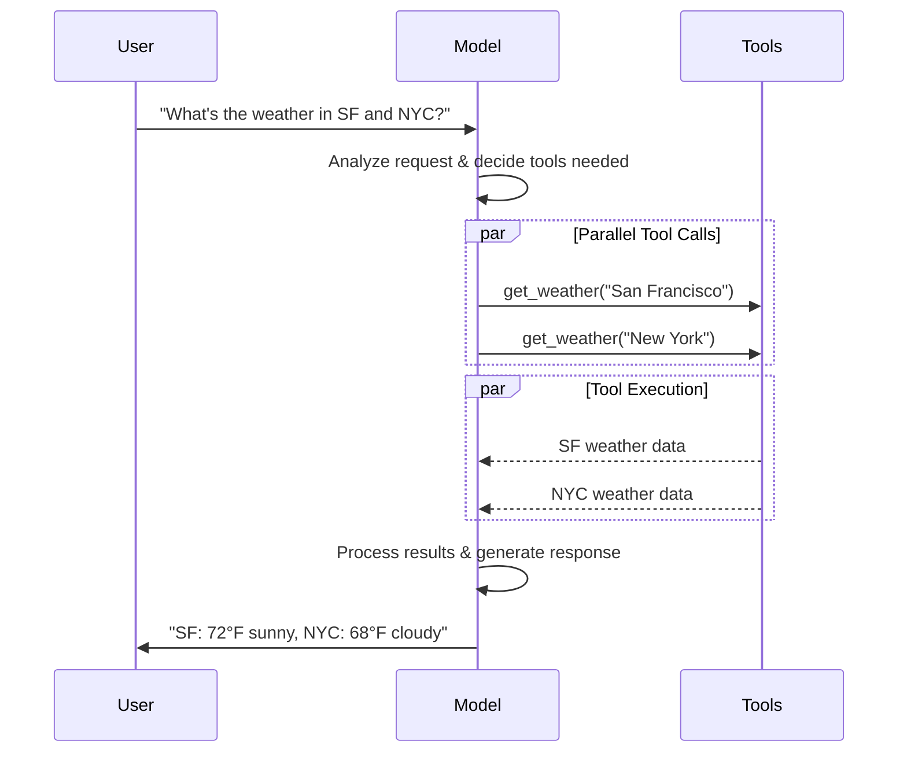

# Models

LLM 是强大的 AI 工具，可以像人类一样理解和生成文本。它们用途广泛，能够编写内容、翻译语言、总结和回答问题，而无需为每个任务进行专门的训练。

除了文本生成，许多模型还支持：

*   **Tool calling** – 调用外部工具（如数据库查询或 API 调用）并在响应中使用结果。
*   **Structured output** – 模型的响应被约束为遵循定义的格式。
*   **Multimodality** – 处理并返回文本以外的数据，例如图像、音频和视频。
*   **Reasoning** – 模型执行多步推理以得出结论。

Models 是 agent 的推理引擎。它们驱动 agent 的决策过程，决定调用哪些 tools、如何解释结果以及何时提供最终答案。

您所选 model 的质量和功能直接影响 agent 的基线可靠性和性能。不同的 model 擅长不同的任务——有些更擅长遵循复杂指令，有些擅长结构化推理，还有一些支持更大的上下文窗口以处理更多信息。

LangChain 的标准 model 接口使您可以访问许多不同的 provider 集成，从而可以轻松地试验和切换 models，以找到最适合您用例的模型。

有关 provider 特定的集成信息和功能，请参阅该 provider 的 chat model 页面。

## Basic usage

Models 可以通过两种方式使用：

1.  **与 agents 搭配** – 在创建 agent 时可以动态指定 model。
2.  **独立使用** – 对于文本生成、分类或提取等无需 agent 框架的任务，可以直接调用 model（在 agent 循环之外）。

相同的 model 接口在这两种上下文中都适用，这为您提供了灵活性：从简单开始，根据需要扩展到更复杂的基于 agent 的工作流。

### Initialize a model

在 LangChain 中开始使用独立 model 的最简单方法是使用 `init_chat_model` 从您选择的 chat model provider 初始化一个（以下示例）：

👉 阅读 OpenAI chat model 集成文档

```shell
pip install -U "langchain[openai]"
```

```python
import os
from langchain.chat_models import init_chat_model

os.environ["OPENAI_API_KEY"] = "sk-..."

model = init_chat_model("gpt-5.4")
```

配置模型参数
```python
import os
from langchain_openai import ChatOpenAI

os.environ["OPENAI_API_KEY"] = "sk-..."

model = ChatOpenAI(model="gpt-5.4")
```

有关更多细节，包括如何传递 model 参数，请参阅 `init_chat_model`。

### 支持的 providers 和 models

LangChain 通过专用的集成包支持所有主流的 model providers。每个 provider 包都实现了相同的标准接口，因此您可以交换 providers 而无需重写应用逻辑。新的 model 名称可以立即使用——无需 LangChain 更新——因为 provider 包直接将 model 名称传递给 provider 的 API。

浏览完整的支持 providers 列表，或参阅 Providers and models 了解 providers、packages 和 model names 如何在 LangChain 中协同工作的概念性概述。

### Key methods

Model 接收消息作为输入，并在生成完整响应后输出消息。

使用 `invoke()` 调用 model，等待完整响应。

调用 `stream()` 实时流式生成输出。

使用 `batch()` 批量向 model 发送多个请求以更高效地处理。

除了 chat models，LangChain 还支持其他相关技术，例如 embedding models 和 vector stores。有关详细信息，请参阅 integrations 页面。

## Parameters

Chat model 接受可用于配置其行为的参数。支持的参数集因 model 和 provider 而异，但标准参数包括：

`model`  
您想要与 provider 一起使用的特定 model 的名称或标识符。您也可以使用 `'{model_provider}:{model}'` 格式在单个参数中同时指定 model 和其 provider，例如 `'openai:o1'`。

`api_key`  
向 model 的 provider 进行身份验证所需的密钥。通常在您注册访问 model 时发放。通常通过设置环境变量来访问。

`temperature`  
控制 model 输出的随机性。较高的数字使响应更具创造性；较低的数字使响应更确定。

`max_tokens`  
限制响应中的总 token 数量，有效控制输出的长度。

`timeout`  
取消请求之前等待 model 响应的最长时间（以秒为单位）。

`max_retries`  
如果请求因网络超时或速率限制等问题失败，系统将重新发送请求的最大尝试次数。重试使用带有抖动的指数退避。网络错误、速率限制（429）和服务器错误（5xx）会自动重试。客户端错误（如 401 未授权或 404）不会重试。对于不可靠网络上的长时间 agent 任务，考虑将其增加到 10-15。

使用 `init_chat_model` 时，将这些参数作为内联 `**kwargs` 传递：

```python
model = init_chat_model(
	"claude-sonnet-4-6",
	# 传递给 model 的 kwargs：
	temperature=0.7,
	timeout=30,
	max_tokens=1000,
	max_retries=6,  # 默认值；对于不可靠的网络请增加
	)
```

每个 chat model 集成可能具有用于控制 provider 特定功能的附加参数。

例如，`ChatOpenAI` 具有 `use_responses_api` 参数来指示是使用 OpenAI Responses 还是 Completions API。

要查找给定 chat model 支持的所有参数，请访问 chat model integrations 页面。

***

## Invocation

必须调用 chat model 才能生成输出。有三种主要的调用方法，每种方法适用于不同的用例。

### Invoke

调用 model 最直接的方法是使用 `invoke()` 并传递单个消息或消息列表。

```python
response = model.invoke("Why do parrots have colorful feathers?")
print(response)
```

可以将消息列表传递给 chat model 以表示对话历史。每条消息都有一个 role，model 使用它来指示对话中消息的发送者。

有关角色、类型和内容的更多详细信息，请参阅 messages guide。

```python
conversation = [
    {"role": "system", "content": "You are a helpful assistant that translates English to French."},
    {"role": "user", "content": "Translate: I love programming."},
    {"role": "assistant", "content": "J'adore la programmation."},
    {"role": "user", "content": "Translate: I love building applications."}
]

response = model.invoke(conversation)
print(response)  # AIMessage("J'adore créer des applications.")
```

```python
from langchain.messages import HumanMessage, AIMessage, SystemMessage

conversation = [
    SystemMessage("You are a helpful assistant that translates English to French."),
    HumanMessage("Translate: I love programming."),
    AIMessage("J'adore la programmation."),
    HumanMessage("Translate: I love building applications.")
]

response = model.invoke(conversation)
print(response)  # AIMessage("J'adore créer des applications.")
```

如果您的调用返回类型是字符串，请确保您使用的是 chat model 而不是 LLM。传统的文本补全 LLM 直接返回字符串。LangChain chat models 以 "Chat" 为前缀，例如 `ChatOpenAI`(/oss/integrations/chat/openai)。

### Stream

大多数 model 可以在生成输出内容的同时进行流式传输。通过逐步显示输出，流式传输显著改善了用户体验，尤其是对于较长的响应。

调用 `stream()` 返回一个迭代器，该迭代器在生成输出块时产出它们。您可以使用循环实时处理每个块：

```python
for chunk in model.stream("Why do parrots have colorful feathers?"):
  print(chunk.text, end="|", flush=True)
```

```python
for chunk in model.stream("What color is the sky?"):
  for block in chunk.content_blocks:
	  if block["type"] == "reasoning" and (reasoning := block.get("reasoning")):
		  print(f"Reasoning: {reasoning}")
	  elif block["type"] == "tool_call_chunk":
		  print(f"Tool call chunk: {block}")
	  elif block["type"] == "text":
		  print(block["text"])
	  else:
		  ...
```

与 `invoke()`（在 model 完成生成完整响应后返回单个 `AIMessage`）不同，`stream()` 返回多个 `AIMessageChunk` 对象，每个对象包含输出文本的一部分。重要的是，流中的每个 chunk 都设计为通过求和聚合成一条完整消息：

```python
full = None  # None | AIMessageChunk
for chunk in model.stream("What color is the sky?"):
    full = chunk if full is None else full + chunk
    print(full.text)

# The
# The sky
# The sky is
# The sky is typically
# The sky is typically blue
# ...

print(full.content_blocks)
# [{"type": "text", "text": "The sky is typically blue..."}]
```

生成的消息可以与使用 `invoke()` 生成的消息一样处理——例如，它可以聚合到消息历史中，并作为对话上下文传递回 model。

流式传输仅在程序中的所有步骤都知道如何处理 chunk 流时才有效。例如，一个需要在处理之前将整个输出存储在内存中的应用程序就不具备流式传输能力。

LangChain chat models 还可以使用 `astream_events()` 流式传输语义事件。

这简化了基于事件类型和其他元数据的过滤，并将在后台聚合完整消息。参见下面的示例。

```python
async for event in model.astream_events("Hello"):

	if event["event"] == "on_chat_model_start":
		print(f"Input: {event['data']['input']}")

	elif event["event"] == "on_chat_model_stream":
		print(f"Token: {event['data']['chunk'].text}")

	elif event["event"] == "on_chat_model_end":
		print(f"Full message: {event['data']['output'].text}")

	else:
		pass
```

```txt
Input: Hello
Token: Hi
Token:  there
Token: !
Token:  How
Token:  can
Token:  I
...
Full message: Hi there! How can I help today?
```

有关事件类型和其他详细信息，请参阅 `astream_events()` 参考。

LangChain 通过在某些情况下自动启用流式模式来简化从 chat models 的流式传输，即使您没有显式调用流式方法。当您使用非流式 invoke 方法但仍希望流式传输整个应用程序（包括来自 chat model 的中间结果）时，这尤其有用。

例如，在 LangGraph agents 中，您可以在 nodes 中调用 `model.invoke()`，但如果以流式模式运行，LangChain 将自动委托给流式传输。

#### 工作原理

当您 `invoke()` 一个 chat model 时，如果 LangChain 检测到您正在尝试流式传输整个应用程序，它将自动切换到内部流式模式。就使用 invoke 的代码而言，调用的结果将相同；然而，当 chat model 被流式传输时，LangChain 将负责在 LangChain 的回调系统中调用 `on_llm_new_token` 事件。

回调事件允许 LangGraph `stream()` 和 `astream_events()` 实时显示 chat model 的输出。

### Batch

对 model 的一组独立请求进行批处理可以显著提高性能并降低成本，因为处理可以并行进行：

```python
responses = model.batch([
    "Why do parrots have colorful feathers?",
    "How do airplanes fly?",
    "What is quantum computing?"
])
for response in responses:
    print(response)
```

本节描述了 chat model 方法 `batch()`，它在客户端并行化 model 调用。

这与 inference providers（如 OpenAI 或 Anthropic）支持的批处理 API 是**不同**的。

默认情况下，`batch()` 仅返回整个批次的最终输出。如果您希望在每个单独输入完成生成时接收其输出，可以使用 `batch_as_completed()` 流式传输结果：

```python
for response in model.batch_as_completed([
    "Why do parrots have colorful feathers?",
    "How do airplanes fly?",
    "What is quantum computing?"
]):
    print(response)
```

当使用 `batch_as_completed()` 时，结果可能乱序到达。每个结果都包含输入索引，以便在需要时重建原始顺序。

当使用 `batch()` 或 `batch_as_completed()` 处理大量输入时，您可能希望控制最大并行调用数。这可以通过在 `RunnableConfig` 字典中设置 `max_concurrency` 属性来实现。

  ```python
  model.batch(
      list_of_inputs,
      config={
          'max_concurrency': 5,  # 限制为 5 个并行调用
      }
  )
  ```

有关支持属性的完整列表，请参阅 `RunnableConfig` 参考。
***
## Tool calling

Models 可以请求调用执行任务的 tools，例如从数据库获取数据、搜索网络或运行代码。Tools 是以下两者的配对：

1.  一个 schema，包括 tool 的名称、描述和/或参数定义（通常是 JSON schema）
2.  一个要执行的函数或协程。

您可能会听到 “function calling” 这个术语。我们这里与 “tool calling” 互换使用。

以下是用户和 model 之间基本的 tool calling 流程：



要使您定义的 tools 可供 model 使用，必须使用 `bind_tools` 绑定它们。在后续调用中，model 可以根据需要选择调用任何绑定的 tools。

一些 model providers 提供了可以通过 model 或调用参数启用的内置 tools（例如 `ChatOpenAI`、`ChatAnthropic`）。有关详细信息，请查阅相应的 provider 参考。

有关详细信息和其他创建 tools 的选项，请参阅 tools guide。

```python
from langchain.tools import tool

@tool
def get_weather(location: str) -> str:
    """Get the weather at a location."""
    return f"It's sunny in {location}."

model_with_tools = model.bind_tools([get_weather])  

response = model_with_tools.invoke("What's the weather like in Boston?")
for tool_call in response.tool_calls:
    # 查看 model 做出的 tool calls
    print(f"Tool: {tool_call['name']}")
    print(f"Args: {tool_call['args']}")
```

当绑定用户定义的 tools 时，model 的响应包括一个**请求**来执行 tool。当与 agent 分开使用 model 时，需要由您执行请求的 tool 并将结果返回给 model，以便在后续推理中使用。当使用 agent 时，agent 循环将为您处理 tool 执行循环。

下面，我们展示了一些使用 tool calling 的常见方式。

当 model 返回 tool calls 时，您需要执行 tools 并将结果传递回 model。这将创建一个对话循环，其中 model 可以使用 tool 结果生成最终响应。LangChain 包含了为您处理这种编排的 agent 抽象。

下面是一个简单的示例：

```python
# 将（可能多个）tools 绑定到 model
model_with_tools = model.bind_tools([get_weather])

# 第 1 步：Model 生成 tool calls
messages = [{"role": "user", "content": "What's the weather in Boston?"}]
ai_msg = model_with_tools.invoke(messages)
messages.append(ai_msg)

# 第 2 步：执行 tools 并收集结果
for tool_call in ai_msg.tool_calls:
	# 使用生成的参数执行 tool
	tool_result = get_weather.invoke(tool_call)
	messages.append(tool_result)

# 第 3 步：将结果传递回 model 以获取最终响应
final_response = model_with_tools.invoke(messages)
print(final_response.text)
# "The current weather in Boston is 72°F and sunny."
```

每个由 tool 返回的 `ToolMessage` 都包含一个 `tool_call_id`，它与原始 tool call 匹配，帮助 model 将结果与请求关联起来。

默认情况下，model 可以根据用户的输入自由选择使用哪个绑定的 tool。但是，您可能希望强制选择一个 tool，确保 model 使用特定的 tool 或给定列表中的**任何** tool：

```python
model_with_tools = model.bind_tools([tool_1], tool_choice="any")
```

```python
model_with_tools = model.bind_tools([tool_1], tool_choice="tool_1")
```

许多 model 在适当时支持并行调用多个 tools。这允许 model 同时从不同来源收集信息。

```python
model_with_tools = model.bind_tools([get_weather])

response = model_with_tools.invoke(
	"What's the weather in Boston and Tokyo?"
)

# model 可能生成多个 tool calls
print(response.tool_calls)
# [
#   {'name': 'get_weather', 'args': {'location': 'Boston'}, 'id': 'call_1'},
#   {'name': 'get_weather', 'args': {'location': 'Tokyo'}, 'id': 'call_2'},
# ]

# 执行所有 tools（可以使用异步并行完成）
results = []
for tool_call in response.tool_calls:
	if tool_call['name'] == 'get_weather':
		result = get_weather.invoke(tool_call)
	...
	results.append(result)
```

Model 根据请求操作的独立性智能地判断何时适合并行执行。

大多数支持 tool calling 的 model 默认启用并行 tool calls。有些（包括 OpenAI 和 Anthropic）允许您禁用此功能。为此，设置 `parallel_tool_calls=False`：

```python
model.bind_tools([get_weather], parallel_tool_calls=False)
```

在流式传输响应时，tool calls 会通过 `ToolCallChunk` 逐步构建。这使您能够在 tool calls 生成时就看到它们，而无需等待完整响应。

```python
for chunk in model_with_tools.stream(
	"What's the weather in Boston and Tokyo?"
):
	# Tool call chunks 逐步到达
	for tool_chunk in chunk.tool_call_chunks:
		if name := tool_chunk.get("name"):
			print(f"Tool: {name}")
		if id_ := tool_chunk.get("id"):
			print(f"ID: {id_}")
		if args := tool_chunk.get("args"):
			print(f"Args: {args}")

# 输出：
# Tool: get_weather
# ID: call_SvMlU1TVIZugrFLckFE2ceRE
# Args: {"lo
# Args: catio
# Args: n": "B
# Args: osto
# Args: n"}
# Tool: get_weather
# ID: call_QMZdy6qInx13oWKE7KhuhOLR
# Args: {"lo
# Args: catio
# Args: n": "T
# Args: okyo
# Args: "}
```

您可以累积 chunks 来构建完整的 tool calls：

```python
gathered = None
for chunk in model_with_tools.stream("What's the weather in Boston?"):
	gathered = chunk if gathered is None else gathered + chunk
	print(gathered.tool_calls)
```

***

## Structured output

可以要求 model 以匹配给定 schema 的格式提供其响应。这对于确保输出能够轻松解析并在后续处理中使用非常有用。LangChain 支持多种 schema 类型和强制执行结构化输出的方法。

要了解结构化输出，请参阅 Structured output。

Pydantic models 提供了最丰富的功能集，包括字段验证、描述和嵌套结构。

```python
from pydantic import BaseModel, Field

class Movie(BaseModel):
	"""A movie with details."""
	title: str = Field(description="The title of the movie")
	year: int = Field(description="The year the movie was released")
	director: str = Field(description="The director of the movie")
	rating: float = Field(description="The movie's rating out of 10")

model_with_structure = model.with_structured_output(Movie)
response = model_with_structure.invoke("Provide details about the movie Inception")
print(response)  # Movie(title="Inception", year=2010, director="Christopher Nolan", rating=8.8)
```

Python 的 `TypedDict` 提供了比 Pydantic models 更简单的替代方案，当您不需要运行时验证时非常理想。

```python
from typing_extensions import TypedDict, Annotated

class MovieDict(TypedDict):
	"""A movie with details."""
	title: Annotated[str, ..., "The title of the movie"]
	year: Annotated[int, ..., "The year the movie was released"]
	director: Annotated[str, ..., "The director of the movie"]
	rating: Annotated[float, ..., "The movie's rating out of 10"]

model_with_structure = model.with_structured_output(MovieDict)
response = model_with_structure.invoke("Provide details about the movie Inception")
print(response)  # {'title': 'Inception', 'year': 2010, 'director': 'Christopher Nolan', 'rating': 8.8}
```

提供 JSON Schema 以获得最大的控制和互操作性。

```python
import json

json_schema = {
	"title": "Movie",
	"description": "A movie with details",
	"type": "object",
	"properties": {
		"title": {
			"type": "string",
			"description": "The title of the movie"
		},
		"year": {
			"type": "integer",
			"description": "The year the movie was released"
		},
		"director": {
			"type": "string",
			"description": "The director of the movie"
		},
		"rating": {
			"type": "number",
			"description": "The movie's rating out of 10"
		}
	},
	"required": ["title", "year", "director", "rating"]
}

model_with_structure = model.with_structured_output(
	json_schema,
	method="json_schema",
)
response = model_with_structure.invoke("Provide details about the movie Inception")
print(response)  # {'title': 'Inception', 'year': 2010, ...}
```

**结构化输出的关键考虑因素**

  * **Method 参数**：某些 providers 支持不同的结构化输出方法：
    * `'json_schema'`：使用 provider 提供的专用结构化输出功能。
    * `'function_calling'`：通过强制遵循给定 schema 的 tool call 来导出结构化输出。
    * `'json_mode'`：某些 providers 提供的 `'json_schema'` 的前身。生成有效的 JSON，但 schema 必须在提示中描述。
  * **Include raw**：设置 `include_raw=True` 以同时获取解析后的输出和原始 AI message。
  * **Validation**：Pydantic models 提供自动验证。`TypedDict` 和 JSON Schema 需要手动验证。

有关支持的方法和配置选项，请参阅您的 provider 的集成页面。

有时需要将原始 `AIMessage` 对象与解析后的表示一起返回，以访问 token 计数等响应元数据。为此，请在调用 `with_structured_output` 时设置 `include_raw=True`：

```python
from pydantic import BaseModel, Field

class Movie(BaseModel):
  """A movie with details."""
  title: str = Field(description="The title of the movie")
  year: int = Field(description="The year the movie was released")
  director: str = Field(description="The director of the movie")
  rating: float = Field(description="The movie's rating out of 10")

model_with_structure = model.with_structured_output(Movie, include_raw=True)  
response = model_with_structure.invoke("Provide details about the movie Inception")
response
# {
#     "raw": AIMessage(...),
#     "parsed": Movie(title=..., year=..., ...),
#     "parsing_error": None,
# }
```

Schemas 可以嵌套：

```python
from pydantic import BaseModel, Field

class Actor(BaseModel):
	name: str
	role: str

class MovieDetails(BaseModel):
	title: str
	year: int
	cast: list[Actor]
	genres: list[str]
	budget: float | None = Field(None, description="Budget in millions USD")

model_with_structure = model.with_structured_output(MovieDetails)
```

```python
from typing_extensions import Annotated, TypedDict

class Actor(TypedDict):
	name: str
	role: str

class MovieDetails(TypedDict):
	title: str
	year: int
	cast: list[Actor]
	genres: list[str]
	budget: Annotated[float | None, ..., "Budget in millions USD"]

model_with_structure = model.with_structured_output(MovieDetails)
```

***

## Advanced topics

### Model profiles

Model profiles 需要 `langchain>=1.1`。

LangChain chat models 可以通过 `profile` 属性公开支持的功能和能力的字典：

```python
model.profile
# {
#   "max_input_tokens": 400000,
#   "image_inputs": True,
#   "reasoning_output": True,
#   "tool_calling": True,
#   ...
# }
```

请参阅 API 参考中的完整字段集。

大部分 model profile 数据由 models.dev 项目提供，这是一个提供 model 能力数据的开源项目。这些数据通过额外的字段进行扩充，以便与 LangChain 一起使用。这些扩充随着上游项目的发展而保持对齐。

Model profile 数据允许应用程序动态适配 model 能力。例如：

1.  摘要 middleware 可以根据 model 的上下文窗口大小触发摘要。
2.  `create_agent` 中的结构化输出策略可以自动推断（例如，通过检查对原生结构化输出功能的支持）。
3.  可以根据支持的模态和最大输入 token 数对 model 输入进行门控。
4.  Deep Agents CLI 会过滤交互式 model 选择器，仅显示 profiles 报告支持 `tool_calling` 和文本 I/O 的 models，并在选择器详细信息视图中显示上下文窗口大小和能力标志。

如果 model profile 数据缺失、过时或不正确，可以进行更改。

  **选项 1（快速修复）**

  您可以使用任何有效的 profile 实例化 chat model：

  ```python
  custom_profile = {
      "max_input_tokens": 100_000,
      "tool_calling": True,
      "structured_output": True,
      # ...
  }
  model = init_chat_model("...", profile=custom_profile)
  ```

`profile` 也是一个常规的 `dict`，可以就地更新。如果 model 实例被共享，请考虑使用 `model_copy` 以避免改变共享状态。

  ```python
  new_profile = model.profile | {"key": "value"}
  model.model_copy(update={"profile": new_profile})
  ```

  **选项 2（上游修复数据）**

  数据的主要来源是 models.dev 项目。这些数据与 LangChain 集成包中的附加字段和覆盖合并，并与这些包一起发布。

  可以通过以下过程更新 model profile 数据：

  1.  （如果需要）通过向 GitHub 上的其仓库提交 pull request 来更新 models.dev 的源数据。
  2.  （如果需要）通过向 LangChain 集成包提交 pull request 来更新 `langchain_<provider>/data/profile_augmentations.toml` 中的附加字段和覆盖。
  3.  使用 `langchain-model-profiles` CLI 工具从 models.dev 拉取最新数据，合并扩充并更新 profile 数据：

  ```bash
  pip install langchain-model-profiles
  ```

  ```bash
  langchain-profiles refresh --provider <provider> --data-dir <path>
  ```

  此命令：

  * 从 models.dev 下载 `<provider>` 的最新数据
  * 合并 `<data-dir>` 中 `profile_augmentations.toml` 的扩充
  * 将合并后的 profiles 写入 `<data-dir>` 中的 `profiles.py`

  例如：在 LangChain monorepo 的 `libs/partners/anthropic` 中：

  ```bash
  uv run --with langchain-model-profiles --provider anthropic --data-dir langchain_anthropic/data
  ```

Model profiles 是 beta 功能。profile 的格式可能会发生变化。

### Multimodal

某些 model 可以处理和返回非文本数据，例如图像、音频和视频。您可以通过提供 content blocks 将非文本数据传递给 model。

所有具有底层多模态能力的 LangChain chat models 都支持：

  1.  跨 provider 标准格式的数据（参见我们的 messages guide）
  2.  OpenAI chat completions 格式
  3.  该特定 provider 原生的任何格式（例如，Anthropic models 接受 Anthropic 原生格式）

有关详细信息，请参阅 messages guide 的多模态部分。

某些 model 可以返回多模态数据作为其响应的一部分。如果这样调用，生成的 `AIMessage` 将包含具有多模态类型的 content blocks。

```python
response = model.invoke("Create a picture of a cat")
print(response.content_blocks)
# [
#     {"type": "text", "text": "Here's a picture of a cat"},
#     {"type": "image", "base64": "...", "mime_type": "image/jpeg"},
# ]
```

有关特定 providers 的详细信息，请参阅 integrations 页面。

### Reasoning

许多 model 能够执行多步推理以得出结论。这涉及将复杂问题分解为更小、更易管理的步骤。

**如果底层 model 支持**，您可以呈现此推理过程，以更好地理解 model 是如何得出最终答案的。

```python
  for chunk in model.stream("Why do parrots have colorful feathers?"):
      reasoning_steps = [r for r in chunk.content_blocks if r["type"] == "reasoning"]
      print(reasoning_steps if reasoning_steps else chunk.text)
  ```

  ```python
  response = model.invoke("Why do parrots have colorful feathers?")
  reasoning_steps = [b for b in response.content_blocks if b["type"] == "reasoning"]
  print(" ".join(step["reasoning"] for step in reasoning_steps))
```

根据 model 的不同，有时您可以指定它应该投入的推理努力程度。同样，您可以要求 model 完全关闭推理。这可能表现为推理的分类“层级”（例如 `'low'` 或 `'high'`）或整数 token 预算。

有关详细信息，请参阅相应 chat model 的 integrations 页面或参考。

### Local models

LangChain 支持在您自己的硬件上本地运行 models。这对于数据隐私至关重要、您想调用自定义模型或想避免使用基于云的 model 所产生的成本的情况非常有用。

Ollama 是在本地运行 chat 和 embedding models 的最简单方法之一。

### Prompt caching

许多 providers 提供提示缓存功能，以减少重复处理相同 token 的延迟和成本。这些功能可以是**隐式**或**显式**的：

*   **隐式提示缓存**：如果请求命中缓存，providers 会自动传递成本节省。示例：OpenAI 和 Gemini。
*   **显式缓存**：providers 允许您手动指示缓存点以获得更好的控制或保证成本节省。示例：
    *   `ChatOpenAI`（通过 `prompt_cache_key`）
    *   Anthropic 的 `AnthropicPromptCachingMiddleware`
    *   Gemini
    *   AWS Bedrock

提示缓存通常仅在超过最小输入 token 阈值时才会启用。请参阅 provider 页面了解详情。

缓存使用情况将反映在 model 响应的 usage metadata 中。

### Server-side tool use

某些 providers 支持服务端 tool-calling 循环：models 可以在单次对话回合中与网络搜索、代码解释器和其他 tools 交互并分析结果。

如果 model 在服务端调用了 tool，响应消息的内容将包含表示 tool 调用和结果的 content。访问响应的 content blocks 将以 provider 无关的格式返回服务端 tool calls 和结果：

```python
from langchain.chat_models import init_chat_model

model = init_chat_model("gpt-5.4-mini")

tool = {"type": "web_search"}
model_with_tools = model.bind_tools([tool])

response = model_with_tools.invoke("What was a positive news story from today?")
print(response.content_blocks)
```

```python
[
    {
        "type": "server_tool_call",
        "name": "web_search",
        "args": {
            "query": "positive news stories today",
            "type": "search"
        },
        "id": "ws_abc123"
    },
    {
        "type": "server_tool_result",
        "tool_call_id": "ws_abc123",
        "status": "success"
    },
    {
        "type": "text",
        "text": "Here are some positive news stories from today...",
        "annotations": [
            {
                "end_index": 410,
                "start_index": 337,
                "title": "article title",
                "type": "citation",
                "url": "..."
            }
        ]
    }
]
```

这代表一个对话回合；与客户端 tool calling 不同，这里没有需要传入的关联 `ToolMessage` 对象。

有关可用 tools 和使用细节，请参阅您所用 provider 的集成页面。

### Rate limiting

许多 chat model providers 对在给定时间段内可以进行的调用次数施加了限制。如果达到速率限制，您通常会收到来自 provider 的速率限制错误响应，并且需要等待才能发出更多请求。

为了帮助管理速率限制，chat model 集成接受一个 `rate_limiter` 参数，可以在初始化时提供该参数以控制发出请求的速率。

LangChain 自带一个（可选的）内置 `InMemoryRateLimiter`。此限流器是线程安全的，可由同一进程中的多个线程共享。

```python
from langchain_core.rate_limiters import InMemoryRateLimiter

rate_limiter = InMemoryRateLimiter(
  requests_per_second=0.1,  # 每 10 秒 1 个请求
  check_every_n_seconds=0.1,  # 每 100 毫秒检查是否允许发出请求
  max_bucket_size=10,  # 控制最大突发大小。
)

model = init_chat_model(
  model="gpt-5.4",
  model_provider="openai",
  rate_limiter=rate_limiter  
)
```

所提供的限流器只能限制单位时间内的请求数量。如果您还需要根据请求大小进行限制，它将无能为力。

### Base URL and proxy settings

您可以为实现 OpenAI Chat Completions API 的 providers 配置自定义 base URL。

`model_provider="openai"`（或直接使用 `ChatOpenAI`）以官方 OpenAI API 规范为目标。来自路由器和代理的 provider 特定字段可能不会被提取或保留。

  对于 OpenRouter 和 LiteLLM，优先使用专用集成：

  *   OpenRouter 通过 `ChatOpenRouter`（`langchain-openrouter`）
  *   LiteLLM 通过 `ChatLiteLLM` / `ChatLiteLLMRouter`（`langchain-litellm`）

许多 model providers 提供与 OpenAI 兼容的 API（例如 Together AI、vLLM）。您可以通过指定适当的 `base_url` 参数将 `init_chat_model` 与这些 providers 一起使用：

  ```python
  model = init_chat_model(
      model="MODEL_NAME",
      model_provider="openai",
      base_url="BASE_URL",
      api_key="YOUR_API_KEY",
  )
  ```

当直接使用 chat model 类实例化时，参数名称可能因 provider 而异。请查阅相应的参考文档。

对于需要 HTTP 代理的部署，某些 model 集成支持代理配置：

  ```python
  from langchain_openai import ChatOpenAI

  model = ChatOpenAI(
      model="gpt-5.4",
      openai_proxy="http://proxy.example.com:8080"
  )
  ```

代理支持因集成而异。请查阅特定 model provider 的参考文档以了解代理配置选项。

### Log probabilities

某些 model 可以通过在初始化 model 时设置 `logprobs` 参数来配置返回 token 级别的对数概率，表示给定 token 的可能性：

```python
model = init_chat_model(
    model="gpt-5.4",
    model_provider="openai"
).bind(logprobs=True)

response = model.invoke("Why do parrots talk?")
print(response.response_metadata["logprobs"])
```

### Token usage

许多 model providers 会作为调用响应的一部分返回 token 使用信息。当可用时，此信息将包含在相应 model 生成的 `AIMessage` 对象上。有关更多详细信息，请参阅 messages guide。

某些 provider API，特别是 OpenAI 和 Azure OpenAI chat completions，要求用户选择加入才能在流式上下文中接收 token 使用数据。有关详细信息，请参阅集成指南的流式使用元数据部分。

您可以使用回调或上下文管理器跟踪应用程序中跨 models 的聚合 token 计数，如下所示：

```python
from langchain.chat_models import init_chat_model
from langchain_core.callbacks import UsageMetadataCallbackHandler

model_1 = init_chat_model(model="gpt-5.4-mini")
model_2 = init_chat_model(model="claude-haiku-4-5-20251001")

callback = UsageMetadataCallbackHandler()
result_1 = model_1.invoke("Hello", config={"callbacks": [callback]})
result_2 = model_2.invoke("Hello", config={"callbacks": [callback]})
print(callback.usage_metadata)
```

```python
{
	'gpt-5.4-mini': {
		'input_tokens': 8,
		'output_tokens': 10,
		'total_tokens': 18,
		'input_token_details': {'audio': 0, 'cache_read': 0},
		'output_token_details': {'audio': 0, 'reasoning': 0}
	},
	'claude-haiku-4-5-20251001': {
		'input_tokens': 8,
		'output_tokens': 21,
		'total_tokens': 29,
		'input_token_details': {'cache_read': 0, 'cache_creation': 0}
	}
}
```

```python
from langchain.chat_models import init_chat_model
from langchain_core.callbacks import get_usage_metadata_callback

model_1 = init_chat_model(model="gpt-5.4-mini")
model_2 = init_chat_model(model="claude-haiku-4-5-20251001")

with get_usage_metadata_callback() as cb:
	model_1.invoke("Hello")
	model_2.invoke("Hello")
	print(cb.usage_metadata)
```

```python
{
	'gpt-5.4-mini': {
		'input_tokens': 8,
		'output_tokens': 10,
		'total_tokens': 18,
		'input_token_details': {'audio': 0, 'cache_read': 0},
		'output_token_details': {'audio': 0, 'reasoning': 0}
	},
	'claude-haiku-4-5-20251001': {
		'input_tokens': 8,
		'output_tokens': 21,
		'total_tokens': 29,
		'input_token_details': {'cache_read': 0, 'cache_creation': 0}
	}
}
```

### Invocation config

在调用 model 时，您可以通过 `config` 参数使用 `RunnableConfig` 字典传递额外的配置。这提供了对执行行为、回调和元数据跟踪的运行时控制。

常见的配置选项包括：

`run_name`  
为此调用在日志和跟踪中使用的自定义名称。不会被子调用继承。

`tags`  
可选的标签列表，用于分类和筛选。会被子调用继承。

`metadata`  
可选的键值对字典，用于跟踪额外上下文。会被子调用继承。

`max_concurrency`  
使用 `batch()` 或 `batch_as_completed()` 时控制最大并行调用数。

`callbacks`  
用于在执行期间监视和响应事件的处理程序。

`recursion_limit`  
链的最大递归深度，防止复杂管道中出现无限循环。

```python
response = model.invoke(
    "Tell me a joke",
    config={
        "run_name": "joke_generation",      # 此运行的自定义名称
        "tags": ["humor", "demo"],          # 用于分类的标签
        "metadata": {"user_id": "123"},     # 自定义元数据
        "callbacks": [my_callback_handler], # 回调处理程序
    }
)
```

这些配置值在以下场景中特别有用：

*   使用 LangSmith 跟踪进行调试
*   实现自定义日志记录或监控
*   在生产环境中控制资源使用
*   跟踪复杂管道中的调用

请参阅完整的 `RunnableConfig` 参考以了解所有支持的属性。

### Configurable models

您还可以通过指定 `configurable_fields` 来创建运行时可配置的 model。如果您未指定 model 值，则默认 `'model'` 和 `'model_provider'` 将是可配置的。

```python
from langchain.chat_models import init_chat_model

configurable_model = init_chat_model(temperature=0)

configurable_model.invoke(
    "what's your name",
    config={"configurable": {"model": "gpt-5-nano"}},  # 使用 GPT-5-Nano 运行
)
configurable_model.invoke(
    "what's your name",
    config={"configurable": {"model": "claude-sonnet-4-6"}},  # 使用 Claude 运行
)
```

我们可以使用默认 model 值创建可配置 model，指定哪些参数是可配置的，并为可配置参数添加前缀：

```python
first_model = init_chat_model(
	  model="gpt-5.4-mini",
	  temperature=0,
	  configurable_fields=("model", "model_provider", "temperature", "max_tokens"),
	  config_prefix="first",  # 当链中有多个 model 时很有用
)

first_model.invoke("what's your name")
```

```python
first_model.invoke(
  "what's your name",
  config={
	  "configurable": {
		  "first_model": "claude-sonnet-4-6",
		  "first_temperature": 0.5,
		  "first_max_tokens": 100,
	  }
  },
)
```

  有关 `configurable_fields` 和 `config_prefix` 的更多详细信息，请参阅 `init_chat_model` 参考。

我们可以在可配置 model 上调用声明性操作，如 `bind_tools`、`with_structured_output`、`with_configurable` 等，并以与常规实例化的 chat model 对象相同的方式链式调用可配置 model。

```python
from pydantic import BaseModel, Field

class GetWeather(BaseModel):
  """Get the current weather in a given location"""

	  location: str = Field(description="The city and state, e.g. San Francisco, CA")

class GetPopulation(BaseModel):
  """Get the current population in a given location"""

	  location: str = Field(description="The city and state, e.g. San Francisco, CA")

model = init_chat_model(temperature=0)
model_with_tools = model.bind_tools([GetWeather, GetPopulation])

model_with_tools.invoke(
  "what's bigger in 2024 LA or NYC", config={"configurable": {"model": "gpt-5.4-mini"}}
).tool_calls
```

```
[
  {
	  'name': 'GetPopulation',
	  'args': {'location': 'Los Angeles, CA'},
	  'id': 'call_Ga9m8FAArIyEjItHmztPYA22',
	  'type': 'tool_call'
  },
  {
	  'name': 'GetPopulation',
	  'args': {'location': 'New York, NY'},
	  'id': 'call_jh2dEvBaAHRaw5JUDthOs7rt',
	  'type': 'tool_call'
  }
]
```

```python
model_with_tools.invoke(
  "what's bigger in 2024 LA or NYC",
  config={"configurable": {"model": "claude-sonnet-4-6"}},
).tool_calls
```

```
[
  {
	  'name': 'GetPopulation',
	  'args': {'location': 'Los Angeles, CA'},
	  'id': 'toolu_01JMufPf4F4t2zLj7miFeqXp',
	  'type': 'tool_call'
  },
  {
	  'name': 'GetPopulation',
	  'args': {'location': 'New York City, NY'},
	  'id': 'toolu_01RQBHcE8kEEbYTuuS8WqY1u',
	  'type': 'tool_call'
  }
]
```
