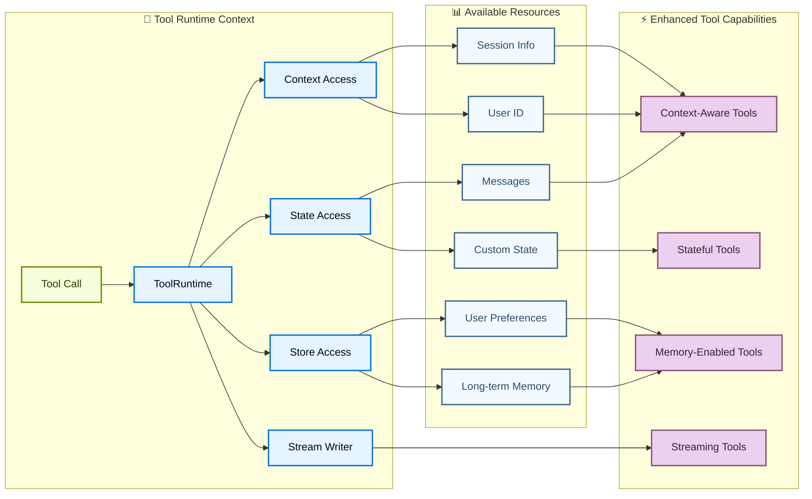

# Tools

Tools 扩展了 agent 的能力——让它们能够获取实时数据、执行代码、查询外部数据库以及在现实世界中采取行动。

本质上，tools 是具有明确输入和输出的可调用函数，这些函数会被传递给聊天模型。模型会根据对话上下文决定何时调用 tool，以及提供什么输入参数。

有关模型如何处理 tool calls 的详细信息，请参阅 Tool calling。

## 创建 tools

### 基本 tool 定义

创建 tool 最简单的方法是使用 `@tool` 装饰器。默认情况下，函数的文档字符串会成为 tool 的描述，帮助模型理解何时使用它：

```python
from langchain.tools import tool

@tool
def search_database(query: str, limit: int = 10) -> str:
    """Search the customer database for records matching the query.

    Args:
        query: Search terms to look for
        limit: Maximum number of results to return
    """
    return f"Found {limit} results for '{query}'"
```

**必须**提供类型提示，因为它们定义了 tool 的输入模式。文档字符串应该信息丰富且简洁，以帮助模型理解 tool 的用途。

**服务端 tool 使用：** 一些聊天模型具有内置的 tools（网络搜索、代码解释器），它们在服务端执行。有关详细信息，请参阅 Server-side tool use。

tool 名称建议使用 `snake_case`（例如 `web_search` 而非 `Web Search`）。某些模型 provider 会拒绝或报错包含空格或特殊字符的名称。坚持使用字母数字字符、下划线和连字符有助于提高跨 provider 的兼容性。

### 自定义 tool 属性

#### 自定义 tool 名称

默认情况下，tool 名称来自函数名称。当您需要更具描述性的名称时可以覆盖它：

```python
@tool("web_search")  # 自定义名称
def search(query: str) -> str:
    """Search the web for information."""
    return f"Results for: {query}"

print(search.name)  # web_search
```

#### 自定义 tool 描述

覆盖自动生成的 tool 描述以获得更清晰的模型指导：

```python
@tool("calculator", description="Performs arithmetic calculations. Use this for any math problems.")
def calc(expression: str) -> str:
    """Evaluate mathematical expressions."""
    return str(eval(expression))
```

### 高级模式定义

使用 Pydantic models 或 JSON schemas 定义复杂输入：

```python
  from pydantic import BaseModel, Field
  from typing import Literal

  class WeatherInput(BaseModel):
      """Input for weather queries."""
      location: str = Field(description="City name or coordinates")
      units: Literal["celsius", "fahrenheit"] = Field(
          default="celsius",
          description="Temperature unit preference"
      )
      include_forecast: bool = Field(
          default=False,
          description="Include 5-day forecast"
      )

  @tool(args_schema=WeatherInput)
  def get_weather(location: str, units: str = "celsius", include_forecast: bool = False) -> str:
      """Get current weather and optional forecast."""
      temp = 22 if units == "celsius" else 72
      result = f"Current weather in {location}: {temp} degrees {units[0].upper()}"
      if include_forecast:
          result += "\nNext 5 days: Sunny"
      return result
```

```python
  weather_schema = {
      "type": "object",
      "properties": {
          "location": {"type": "string"},
          "units": {"type": "string"},
          "include_forecast": {"type": "boolean"}
      },
      "required": ["location", "units", "include_forecast"]
  }

  @tool(args_schema=weather_schema)
  def get_weather(location: str, units: str = "celsius", include_forecast: bool = False) -> str:
      """Get current weather and optional forecast."""
      temp = 22 if units == "celsius" else 72
      result = f"Current weather in {location}: {temp} degrees {units[0].upper()}"
      if include_forecast:
          result += "\nNext 5 days: Sunny"
      return result
      
```

### 保留的参数名称

以下参数名称被保留，不能用作 tool 参数。使用这些名称会导致运行时错误。

| 参数名        | 用途                                                             |
| ------------- | ---------------------------------------------------------------- |
| `config`      | 保留用于在内部传递 `RunnableConfig` 给工具                       |
| `runtime`     | 保留用于 `ToolRuntime` 参数（访问 state、context、store）        |

要访问运行时信息，请使用 `ToolRuntime` 参数，而不是将自己的参数命名为 `config` 或 `runtime`。

## 访问上下文

当 tools 可以访问运行时信息（如对话历史、用户数据和持久化记忆）时，它们最为强大。本节介绍如何在 tools 内部访问和更新这些信息。

Tools 可以通过 `ToolRuntime` 参数访问运行时信息，该参数提供：

| 组件                | 描述                                                                                             | 用例                                                   |
| ------------------- | ------------------------------------------------------------------------------------------------ | ------------------------------------------------------ |
| **State**           | 短期记忆——当前对话期间存在的可变数据（messages、计数器、自定义字段）                               | 访问对话历史、跟踪 tool 调用计数                       |
| **Context**         | 在调用时传递的不可变配置（用户 ID、会话信息）                                                     | 基于用户身份个性化响应                                 |
| **Store**           | 长期记忆——跨对话持续存在的持久化数据                                                             | 保存用户偏好、维护知识库                               |
| **Stream Writer**   | 在 tool 执行期间发出实时更新                                                                     | 显示长时间运行操作的进度                               |
| **Execution Info**  | 当前执行的身份和重试信息（thread ID、run ID、attempt number）                                    | 访问 thread/run ID、根据重试状态调整行为               |
| **Server Info**     | 在 LangGraph Server 上运行时的服务器特定元数据（assistant ID、graph ID、authenticated user）     | 访问 assistant ID、graph ID 或已认证用户信息           |
| **Config**          | 执行的 `RunnableConfig`                                                                          | 访问回调、标签和元数据                                 |
| **Tool Call ID**    | 当前 tool 调用的唯一标识符                                                                       | 关联 tool calls 用于日志和模型调用                     |



### 短期记忆 (State)

State 代表对话期间存在的短期记忆。它包含消息历史以及您在 graph state 中定义的任何自定义字段。

将 `runtime: ToolRuntime` 添加到您的 tool 签名中以访问 state。此参数会自动注入并对 LLM 隐藏——它不会出现在 tool 的模式中。

#### 访问 state

Tools 可以使用 `runtime.state` 访问当前对话状态：

```python
from langchain.tools import tool, ToolRuntime
from langchain.messages import HumanMessage

@tool
def get_last_user_message(runtime: ToolRuntime) -> str:
    """Get the most recent message from the user."""
    messages = runtime.state["messages"]

    # 找到最后一条 human message
    for message in reversed(messages):
        if isinstance(message, HumanMessage):
            return message.content

    return "No user messages found"

# 访问自定义 state 字段
@tool
def get_user_preference(
    pref_name: str,
    runtime: ToolRuntime
) -> str:
    """Get a user preference value."""
    preferences = runtime.state.get("user_preferences", {})
    return preferences.get(pref_name, "Not set")
```

`runtime` 参数对模型是隐藏的。对于上面的例子，模型在 tool schema 中只看到 `pref_name`。

#### 更新 state

使用 `Command` 来更新 agent 的状态。这对于需要更新自定义 state 字段的 tools 非常有用。
在更新中包含一个 `ToolMessage`，以便模型可以看到 tool 调用的结果：

```python
from langchain.agents import AgentState
from langchain.messages import ToolMessage
from langchain.tools import ToolRuntime, tool
from langgraph.types import Command

class CustomState(AgentState):
    user_name: str

@tool
def set_user_name(new_name: str, runtime: ToolRuntime[None, CustomState]) -> Command:
    """Set the user's name in the conversation state."""
    return Command(
        update={
            "user_name": new_name,
            "messages": [
                ToolMessage(
                    content=f"User name set to {new_name}.",
                    tool_call_id=runtime.tool_call_id,
                )
            ],
        }
    )
```

当 tools 更新 state 变量时，请考虑为这些字段定义 reducer。由于 LLM 可以并行调用多个 tools，reducer 决定了当同一 state 字段被并发 tool calls 更新时如何解决冲突。

### Context

Context 提供在调用时传递的不可变配置数据。用于用户 ID、会话详细信息或应用程序特定设置，这些在对话期间不应更改。

通过 `runtime.context` 访问 context：

```python
from dataclasses import dataclass
from langchain_openai import ChatOpenAI
from langchain.agents import create_agent
from langchain.tools import tool, ToolRuntime

USER_DATABASE = {
    "user123": {
        "name": "Alice Johnson",
        "account_type": "Premium",
        "balance": 5000,
        "email": "alice@example.com"
    },
    "user456": {
        "name": "Bob Smith",
        "account_type": "Standard",
        "balance": 1200,
        "email": "bob@example.com"
    }
}

@dataclass
class UserContext:
    user_id: str

@tool
def get_account_info(runtime: ToolRuntime[UserContext]) -> str:
    """Get the current user's account information."""
    user_id = runtime.context.user_id

    if user_id in USER_DATABASE:
        user = USER_DATABASE[user_id]
        return f"Account holder: {user['name']}\nType: {user['account_type']}\nBalance: ${user['balance']}"
    return "User not found"

model = ChatOpenAI(model="gpt-5.4")
agent = create_agent(
    model,
    tools=[get_account_info],
    context_schema=UserContext,
    system_prompt="You are a financial assistant."
)

result = agent.invoke(
    {"messages": [{"role": "user", "content": "What's my current balance?"}]},
    context=UserContext(user_id="user123")
)
```

### 长期记忆 (Store)

`BaseStore` 提供跨对话持久化的存储。与 state（短期记忆）不同，保存到 store 的数据在未来的会话中仍然可用。

通过 `runtime.store` 访问 store。Store 使用命名空间/键模式来组织数据：

对于生产部署，请使用持久化 store 实现（如 `PostgresStore`）而不是 `InMemoryStore`。有关设置详细信息，请参阅 memory 文档。

```python
from typing import Any
from langgraph.store.memory import InMemoryStore
from langchain.agents import create_agent
from langchain.tools import tool, ToolRuntime
from langchain_openai import ChatOpenAI

# 访问记忆
@tool
def get_user_info(user_id: str, runtime: ToolRuntime) -> str:
    """Look up user info."""
    store = runtime.store
    user_info = store.get(("users",), user_id)
    return str(user_info.value) if user_info else "Unknown user"

# 更新记忆
@tool
def save_user_info(user_id: str, user_info: dict[str, Any], runtime: ToolRuntime) -> str:
    """Save user info."""
    store = runtime.store
    store.put(("users",), user_id, user_info)
    return "Successfully saved user info."

model = ChatOpenAI(model="gpt-5.4")

store = InMemoryStore()
agent = create_agent(
    model,
    tools=[get_user_info, save_user_info],
    store=store
)

# 第一次会话：保存用户信息
agent.invoke({
    "messages": [{"role": "user", "content": "Save the following user: userid: abc123, name: Foo, age: 25, email: foo@langchain.dev"}]
})

# 第二次会话：获取用户信息
agent.invoke({
    "messages": [{"role": "user", "content": "Get user info for user with id 'abc123'"}]
})
# 以下是用户 ID 为 "abc123" 的用户信息：
# - Name: Foo
# - Age: 25
# - Email: foo@langchain.dev
```

### Stream writer

在 tool 执行期间流式传输实时更新。这对于在长时间运行的操作中向用户提供进度反馈非常有用。

使用 `runtime.stream_writer` 发出自定义更新：

```python
from langchain.tools import tool, ToolRuntime

@tool
def get_weather(city: str, runtime: ToolRuntime) -> str:
    """Get weather for a given city."""
    writer = runtime.stream_writer

    # 在 tool 执行时流式传输自定义更新
    writer(f"Looking up data for city: {city}")
    writer(f"Acquired data for city: {city}")

    return f"It's always sunny in {city}!"
```

如果您在 tool 内部使用 `runtime.stream_writer`，则该 tool 必须在 LangGraph 执行上下文中调用。有关更多详细信息，请参阅 Streaming。

### Execution info

通过 `runtime.execution_info` 在 tool 内部访问 thread ID、run ID 和重试状态：

```python
from langchain.tools import tool, ToolRuntime

@tool
def log_execution_context(runtime: ToolRuntime) -> str:
    """Log execution identity information."""
    info = runtime.execution_info
    print(f"Thread: {info.thread_id}, Run: {info.run_id}")  
    print(f"Attempt: {info.node_attempt}")
    return "done"
```

需要 `deepagents>=0.5.0`（或 `langgraph>=1.1.5`）。

### Server info

当您的 tool 在 LangGraph Server 上运行时，可以通过 `runtime.server_info` 访问 assistant ID、graph ID 和已认证用户：

```python
from langchain.tools import tool, ToolRuntime

@tool
def get_assistant_scoped_data(runtime: ToolRuntime) -> str:
    """Fetch data scoped to the current assistant."""
    server = runtime.server_info
    if server is not None:
        print(f"Assistant: {server.assistant_id}, Graph: {server.graph_id}")  
        if server.user is not None:
            print(f"User: {server.user.identity}")  
    return "done"
```

当 tool 不在 LangGraph Server 上运行时（例如在本地开发或测试期间），`server_info` 为 `None`。

需要 `deepagents>=0.5.0`（或 `langgraph>=1.1.5`）。

## ToolNode

`ToolNode` 是一个预构建的节点，用于在 LangGraph 工作流中执行 tools。它会自动处理并行 tool 执行、错误处理和状态注入。

对于需要精细控制 tool 执行模式的自定义工作流，请使用 `ToolNode` 而不是 `create_agent`。它是驱动 agent tool 执行的基础构建块。

### 基本用法

```python
from langchain.tools import tool
from langgraph.prebuilt import ToolNode
from langgraph.graph import StateGraph, MessagesState, START, END

@tool
def search(query: str) -> str:
    """Search for information."""
    return f"Results for: {query}"

@tool
def calculator(expression: str) -> str:
    """Evaluate a math expression."""
    return str(eval(expression))

# 使用您的 tools 创建 ToolNode
tool_node = ToolNode([search, calculator])

# 在 graph 中使用
builder = StateGraph(MessagesState)
builder.add_node("tools", tool_node)
# ... 添加其他节点和边
```

### Tool 返回值

您可以为 tools 选择不同的返回值：

* 返回 `string` 用于人类可读的结果。
* 返回 `object` 用于模型应解析的结构化结果。
* 返回 `Command`（可选包含消息）当您需要写入状态时。

#### 返回字符串

当 tool 应提供纯文本供模型阅读并在下一个响应中使用时，返回字符串。

```python
from langchain.tools import tool

@tool
def get_weather(city: str) -> str:
    """Get weather for a city."""
    return f"It is currently sunny in {city}."
```

行为：

* 返回值被转换为 `ToolMessage`。
* 模型看到该文本并决定下一步做什么。
* 除非模型或其他 tool 稍后更改，否则不会更改 agent 状态字段。

当结果本质上是人类可读的文本时使用此方法。

#### 返回对象

当您的 tool 生成模型应该检查的结构化数据时，返回对象（例如 `dict`）。

```python
from langchain.tools import tool

@tool
def get_weather_data(city: str) -> dict:
    """Get structured weather data for a city."""
    return {
        "city": city,
        "temperature_c": 22,
        "conditions": "sunny",
    }
```

行为：

* 对象被序列化并作为 tool 输出发送回去。
* 模型可以读取特定字段并基于它们进行推理。
* 与返回字符串一样，这不会直接更新 graph 状态。

当下游推理受益于显式字段而不是自由格式文本时使用此方法。

#### 返回 Command

当 tool 需要更新 graph 状态（例如设置用户偏好或应用状态）时，返回 `Command`。
您可以选择在 `Command` 中包含或不包含 `ToolMessage`。
如果模型需要看到 tool 成功（例如，确认偏好更改），请在更新中包含一个 `ToolMessage`，使用 `runtime.tool_call_id` 作为 `tool_call_id` 参数。

```python
from langchain.messages import ToolMessage
from langchain.tools import ToolRuntime, tool
from langgraph.types import Command

@tool
def set_language(language: str, runtime: ToolRuntime) -> Command:
    """Set the preferred response language."""
    return Command(
        update={
            "preferred_language": language,
            "messages": [
                ToolMessage(
                    content=f"Language set to {language}.",
                    tool_call_id=runtime.tool_call_id,
                )
            ],
        }
    )
```

行为：

* Command 使用 `update` 更新状态。
* 更新后的状态在同一运行中的后续步骤中可用。
* 对于可能被并行 tool calls 更新的字段，请使用 reducers。

当 tool 不仅仅是返回数据，而且还改变 agent 状态时使用此方法。

### 错误处理

配置 tool 错误的处理方式。有关所有选项，请参阅 `ToolNode` API 参考。

```python
from langgraph.prebuilt import ToolNode

# 默认：捕获调用错误，重新抛出执行错误
tool_node = ToolNode(tools)

# 捕获所有错误并向 LLM 返回错误消息
tool_node = ToolNode(tools, handle_tool_errors=True)

# 自定义错误消息
tool_node = ToolNode(tools, handle_tool_errors="Something went wrong, please try again.")

# 自定义错误处理器
def handle_error(e: ValueError) -> str:
    return f"Invalid input: {e}"

tool_node = ToolNode(tools, handle_tool_errors=handle_error)

# 仅捕获特定异常类型
tool_node = ToolNode(tools, handle_tool_errors=(ValueError, TypeError))
```

### 使用 tools\_condition 进行路由

使用 `tools_condition` 根据 LLM 是否进行了 tool calls 进行条件路由：

```python
from langgraph.prebuilt import ToolNode, tools_condition
from langgraph.graph import StateGraph, MessagesState, START, END

builder = StateGraph(MessagesState)
builder.add_node("llm", call_llm)
builder.add_node("tools", ToolNode(tools))

builder.add_edge(START, "llm")
builder.add_conditional_edges("llm", tools_condition)  # 路由到 "tools" 或 END
builder.add_edge("tools", "llm")

graph = builder.compile()
```

### 状态注入

Tools 可以通过 `ToolRuntime` 访问当前的 graph 状态：

```python
from langchain.tools import tool, ToolRuntime
from langgraph.prebuilt import ToolNode

@tool
def get_message_count(runtime: ToolRuntime) -> str:
    """Get the number of messages in the conversation."""
    messages = runtime.state["messages"]
    return f"There are {len(messages)} messages."

tool_node = ToolNode([get_message_count])
```

有关从 tools 访问状态、上下文和长期记忆的更多详细信息，请参阅 Access context。

## 预置 tools

LangChain 为常见任务提供了大量预置 tools 和工具包，例如网络搜索、代码解释、数据库访问等。这些即用型 tools 可以直接集成到您的 agents 中，无需编写自定义代码。

请参阅 tools and toolkits integration 页面，获取按类别组织的完整可用 tools 列表。

## 服务端 tool 使用

一些聊天模型具有内置的 tools，这些 tools 由模型 provider 在服务端执行。这些包括网络搜索和代码解释器等功能，您无需定义或托管 tool 逻辑。

请参阅各个聊天模型集成页面和 tool calling 文档，了解启用和使用这些内置 tools 的详细信息。