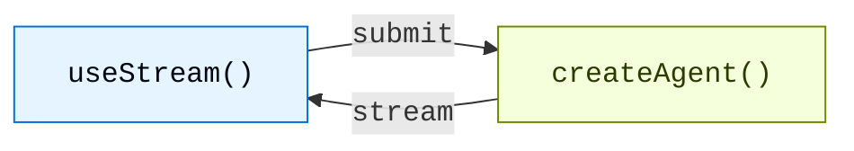

# 概述

> 通过来自 LangChain Agent 的实时流式传输，构建生成式 UI

为使用 `createAgent` 创建的 Agent 构建丰富、交互式的前端。这些模式涵盖了从基础消息渲染到高级工作流（如人机协同的审批与时间旅行调试）的全部内容。

## 架构

每种模式都遵循相同的架构：`createAgent` 后端通过 `useStream` Hook 将状态流式传输到前端。



在后端，`createAgent` 会生成一个编译好的 LangGraph 图（graph），该图暴露了一个流式 API。在前端，`useStream` Hook 连接到该 API，并提供响应式状态（reactive state）——包括 messages、tool calls、interrupts、history 等——你可以使用任意框架渲染这些状态。

```python
from langchain import create_agent
from langgraph.checkpoint.memory import MemorySaver

agent = create_agent(
    model="openai:gpt-5.4",
    tools=[get_weather, search_web],
    checkpointer=MemorySaver(),
)
```

`useStream` 适用于 React、Vue、Svelte 和 Angular：

```ts
import { useStream } from "@langchain/react";   // React
import { useStream } from "@langchain/vue";      // Vue
import { useStream } from "@langchain/svelte";   // Svelte
import { useStream } from "@langchain/angular";  // Angular
```

## 模式

### 渲染消息与输出

解析并渲染流式传输的 Markdown，支持正确的格式化和代码高亮。

将结构化的 Agent 响应渲染为自定义 UI 组件，而不是纯文本。

在可折叠区块中展示模型的思考过程。

基于自然语言提示，使用 json-render 渲染 AI 生成的用户界面。

### 展示 Agent 动作

将工具调用（tool calls）呈现为丰富、类型安全的 UI 卡片，包含加载和错误状态。

暂停 Agent 以进行人工审核，支持批准、拒绝和编辑工作流。

### 对话管理

编辑消息、重新生成响应，并在对话分支中导航。

在 Agent 按顺序处理消息时，支持多个消息排队。

### 高级流式处理

断开或重新连接到正在运行的 Agent 流，不会丢失进度。

检查、导航并恢复对话历史中的任意检查点（checkpoint）。

## 集成

`useStream` 与 UI 框架无关。你可以将其与任何组件库或生成式 UI 框架结合使用。

为 AI 聊天提供的可组合 shadcn/ui 组件：`Conversation`、`Message`、`Tool`、`Reasoning`。

内置线程管理、分支和附件支持的无头（headless）React 框架。

使用 openui-lang 组件 DSL，为数据丰富的报表和仪表板提供生成式 UI 库。