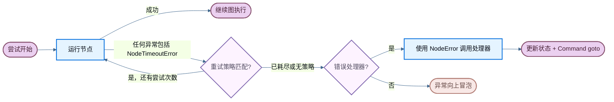

# 容错 (Fault tolerance)

> 在 LangGraph 中配置每个节点的超时、重试和错误处理器。

当节点失败时——无论是由于外部 API 缓慢、瞬时网络错误还是未处理的异常——LangGraph 为您提供了三种可组合的机制来响应：

* **重试 (Retries)** — 基于异常类型和退避设置自动重新运行失败的尝试。
* **超时 (Timeouts)** — 限制单次尝试可以运行的最长时间。
* **错误处理 (Error handling)** — 在所有重试耗尽后运行恢复函数。

这些机制按固定顺序组合：当节点尝试引发任何异常（包括由超时引发的 `NodeTimeoutError`）时，重试策略决定是否重试。只有在重试耗尽后，错误处理器才会运行。

有关在超级步骤边界处干净地停止运行并稍后恢复的信息，请参阅优雅关闭。

每节点超时和节点级错误处理器需要 `langgraph>=1.2`，目前处于 alpha 阶段。



## 重试 (Retries)

重试策略基于异常类型和退避设置自动重新运行失败的节点尝试。将 `retry_policy=` 传递给 `add_node`：

```python
from langgraph.types import RetryPolicy

builder.add_node(
    "call_api",
    call_api,
    retry_policy=RetryPolicy(max_attempts=3),
)
```

### 默认行为

默认情况下，`retry_on` 使用 `default_retry_on`，它会重试**任何**除以下异常（及其子类）以外的异常：

* `ValueError`
* `TypeError`
* `ArithmeticError`
* `ImportError`
* `LookupError`
* `NameError`
* `SyntaxError`
* `RuntimeError`
* `ReferenceError`
* `StopIteration`
* `StopAsyncIteration`
* `OSError`

对于来自流行 HTTP 库（如 `requests` 和 `httpx`）的异常，它仅重试 5xx 状态码。`NodeTimeoutError` 默认是可重试的。

### 参数

| 参数               | 类型                                                                          | 默认值             | 描述                                                                 |
| ------------------ | ----------------------------------------------------------------------------- | ------------------ | -------------------------------------------------------------------- |
| `max_attempts`     | `int`                                                                         | `3`                | 最大尝试次数，包括第一次。                                           |
| `initial_interval` | `float`                                                                       | `0.5`              | 第一次重试前的秒数。                                                 |
| `backoff_factor`   | `float`                                                                       | `2.0`              | 每次重试后应用于间隔的乘数。                                         |
| `max_interval`     | `float`                                                                       | `128.0`            | 重试之间的最大秒数。                                                 |
| `jitter`           | `bool`                                                                        | `True`             | 向间隔添加随机抖动。                                                 |
| `retry_on`         | `type[Exception] \| Sequence[type[Exception]] \| Callable[[Exception], bool]` | `default_retry_on` | 要重试的异常类型，或一个返回 `True` 表示可重试异常的可调用对象。      |

### 自定义重试逻辑

传递一个可调用对象或异常类型给 `retry_on`。导入 `default_retry_on` 以扩展默认行为：

```python
from langgraph.types import RetryPolicy, default_retry_on

def custom_retry_on(exc: BaseException) -> bool:
    if isinstance(exc, MyCustomError):
        return False
    return default_retry_on(exc)

builder.add_node(
    "call_api",
    call_api,
    retry_policy=RetryPolicy(max_attempts=3, retry_on=custom_retry_on),
)
```

### 检查重试状态

在节点内部使用 `runtime.execution_info` 来检查当前的尝试次数。这对于在主调用持续失败时切换到后备方案很有用：

```python
from langgraph.graph import StateGraph, START, END
from langgraph.runtime import Runtime
from langgraph.types import RetryPolicy
from typing_extensions import TypedDict

class State(TypedDict):
    result: str

def my_node(state: State, runtime: Runtime) -> State:
    if runtime.execution_info.node_attempt > 1:  
        return {"result": call_fallback_api()}
    return {"result": call_primary_api()}

builder = StateGraph(State)
builder.add_node("my_node", my_node, retry_policy=RetryPolicy(max_attempts=3))
builder.add_edge(START, "my_node")
builder.add_edge("my_node", END)
```

`execution_info` 暴露以下字段：

| 属性                      | 类型               | 描述                                                                             |
| ------------------------- | ------------------ | -------------------------------------------------------------------------------- |
| `node_attempt`            | `int`              | 当前尝试次数（从1开始）。第一次尝试为 `1`，第一次重试为 `2`，依此类推。           |
| `node_first_attempt_time` | `float \| None`    | 第一次尝试开始时的 Unix 时间戳。在重试期间保持不变。                             |
| `thread_id`               | `str \| None`      | 当前执行的线程 ID。如果没有 checkpointer，则为 `None`。                          |
| `run_id`                  | `str \| None`      | 当前执行的运行 ID。如果配置中未提供，则为 `None`。                               |
| `checkpoint_id`           | `str`              | 当前执行的检查点 ID。                                                            |
| `task_id`                 | `str`              | 当前执行的任务 ID。                                                              |

即使没有重试策略，`execution_info` 也可用——`node_attempt` 默认为 `1`。

## 超时 (Timeouts)

需要 `langgraph>=1.2`，目前处于 alpha 阶段。

`add_node` 上的 `timeout=` 参数限制了单次节点尝试可以运行的时间。传递一个数字（秒）、一个 `timedelta`，或一个用于分别设置运行时间和空闲限制的 `TimeoutPolicy`：

```python
from datetime import timedelta
from langgraph.types import TimeoutPolicy

# 简单的墙上时钟限制
builder.add_node("call_model", call_model, timeout=60)
builder.add_node("call_model", call_model, timeout=timedelta(minutes=2))

# 分离的运行时间和空闲限制
builder.add_node(
    "call_model",
    call_model,
    timeout=TimeoutPolicy(run_timeout=120, idle_timeout=30),
)
```

节点超时仅适用于**异步 (async)** 节点。带有 `timeout` 的同步节点在编译时会被拒绝。要包装阻塞 I/O，请在异步节点内部使用 `asyncio.to_thread`。

### 运行超时 (Run timeout)

`run_timeout` 是对单次尝试的硬性墙上时钟限制。无论节点活动如何，它都不会刷新：

```python
from langgraph.types import TimeoutPolicy

builder.add_node(
    "call_model",
    call_model,
    timeout=TimeoutPolicy(run_timeout=120),
)
```

当超过限制时，LangGraph 会引发 `NodeTimeoutError`，清除失败尝试的任何写入，并让重试策略决定是否重试。

### 空闲超时 (Idle timeout)

`idle_timeout` 是一种进度重置的限制。它仅在节点在指定的持续时间内停止产生可观察的进度时触发——与 `run_timeout` 不同，每当节点产生进度信号时，时钟就会重置：

```python
builder.add_node(
    "call_model",
    call_model,
    timeout=TimeoutPolicy(idle_timeout=30),
)
```

您可以同时设置 `run_timeout` 和 `idle_timeout`。无论哪个先触发，都会取消尝试。

#### 进度信号

在默认的 `refresh_on="auto"` 下，空闲时钟在以下任何情况下重置：

* 通过 `CONFIG_KEY_SEND` 写入状态
* 流输出（yield 的异步流块）
* 子任务调度
* 运行时流写入器调用
* 来自节点或其子节点的任何 LangChain 回调事件（LLM 令牌、工具调用、链开始/结束等）

#### 心跳模式

设置 `refresh_on="heartbeat"` 将刷新源限制为仅显式的 `runtime.heartbeat()` 调用。当您想要一个不被健谈的下属重置的严格空闲定义时，这很有用：

```python
builder.add_node(
    "call_model",
    call_model,
    timeout=TimeoutPolicy(idle_timeout=30, refresh_on="heartbeat"),
)
```

#### 手动心跳

对于不会自然发出进度信号的长时间运行的异步工作，请调用 `runtime.heartbeat()` 来手动重置空闲时钟：

```python
from langgraph.graph import StateGraph, START, END
from langgraph.runtime import Runtime
from langgraph.types import TimeoutPolicy
from typing_extensions import TypedDict

class State(TypedDict):
    result: str

async def long_running_node(state: State, runtime: Runtime) -> State:
    for batch in fetch_batches():
        process(batch)
        runtime.heartbeat()  
    return {"result": "done"}

builder = StateGraph(State)
builder.add_node(
    "long_running_node",
    long_running_node,
    timeout=TimeoutPolicy(idle_timeout=30, refresh_on="heartbeat"),
)
builder.add_edge(START, "long_running_node")
builder.add_edge("long_running_node", END)
```

`runtime.heartbeat()` 在没有空闲计时尝试时是无操作的，因此您可以无条件调用它。

### NodeTimeoutError

当超时触发时，LangGraph 会引发 `NodeTimeoutError`，并附带关于触发了哪个限制的结构化上下文：

| 属性           | 类型                       | 描述                                            |
| -------------- | -------------------------- | ----------------------------------------------- |
| `node`         | `str`                      | 执行超时的节点名称。                            |
| `elapsed`      | `float`                    | 超时触发前经过的秒数。                          |
| `kind`         | `Literal["idle", "run"]`   | 哪个超时触发了。                                |
| `idle_timeout` | `float \| None`            | 配置的空闲超时（秒），如果有的话。              |
| `run_timeout`  | `float \| None`            | 配置的运行超时（秒），如果有的话。              |

`NodeTimeoutError` 默认可重试。将 `timeout=` 与 `retry_policy=` 结合使用开箱即用——每次新尝试时超时时钟都会重置，并且在下次重试之前会清除超时尝试的写入：

```python
from langgraph.types import RetryPolicy, TimeoutPolicy

builder.add_node(
    "call_model",
    call_model,
    timeout=TimeoutPolicy(idle_timeout=30),
    retry_policy=RetryPolicy(max_attempts=3),
)
```

### 使用 Send 实现动态超时

当使用 `Send` 动态分发节点时（例如，在 map-reduce 模式中），您可以直接在 `Send` 上传递 `timeout=`，以覆盖目标节点针对该特定推送的静态超时：

```python
from langgraph.types import Send, TimeoutPolicy

def fan_out(state: OverallState):
    return [
        Send("process_item", {"item": item}, timeout=TimeoutPolicy(idle_timeout=15))
        for item in state["items"]
    ]
```

如果在 `Send` 上省略了 `timeout=`，则应用目标节点的超时（在 `add_node` 时设置）。这允许您在节点上设置默认超时，并为单个调用收紧它。

## 错误处理 (Error handling)

需要 `langgraph>=1.2`，目前处于 alpha 阶段。

错误处理器在节点失败且所有重试耗尽后运行。它接收当前状态，并可以使用 `Command` 更新状态或路由到不同的节点。这对于补偿流程（Saga 模式）很有用，您希望优雅地恢复而不是中止整个图。

将 `error_handler=` 传递给 `add_node`：

```python
from langgraph.errors import NodeError
from langgraph.types import Command, RetryPolicy
from langgraph.graph import StateGraph, START
from typing_extensions import TypedDict

class State(TypedDict):
    status: str

def charge_payment(state: State) -> State:
    raise RuntimeError("payment gateway timeout")

def payment_error_handler(state: State, error: NodeError) -> Command:
    return Command(
        update={"status": f"compensated: {error.error}"},
        goto="finalize",
    )

def finalize(state: State) -> State:
    return state

graph = (
    StateGraph(State)
    .add_node(
        "charge_payment",
        charge_payment,
        retry_policy=RetryPolicy(max_attempts=3, retry_on=ConnectionError),
        error_handler=payment_error_handler,
    )
    .add_node("finalize", finalize)
    .add_edge(START, "charge_payment")
    .compile()
)
```

处理器仅在 `retry_policy` 耗尽后触发，如果没有配置重试策略，则立即触发。重试策略和错误处理器保持解耦：独立配置何时重试以及何时进行补偿。

### NodeError

错误处理器通过类型注解注入的 `error: NodeError` 参数接收失败上下文（与 `runtime: Runtime` 模式相同）：

```python
from langgraph.errors import NodeError

def my_handler(state: State, error: NodeError) -> Command:
    print(f"Node {error.node} failed with: {error.error}")
    return Command(update={"status": "recovered"}, goto="next_step")
```

`NodeError` 是一个冻结的数据类，包含两个字段：

| 属性    | 类型            | 描述                              |
| ------- | --------------- | --------------------------------- |
| `node`  | `str`           | 执行失败的节点名称。              |
| `error` | `BaseException` | 失败节点引发的异常。              |

`error: NodeError` 参数是可选的。不需要失败上下文的处理器可以使用更简单的签名，如 `(state)` 或 `(state, runtime)`。

### 使用 Command 路由

错误处理器可以返回 `Command` 来更新状态并路由到特定节点，从而启用 Saga / 补偿模式：

```python
from langgraph.errors import NodeError
from langgraph.types import Command, RetryPolicy
from langgraph.graph import StateGraph, START
from typing_extensions import TypedDict

class State(TypedDict):
    status: str

def reserve_inventory(state: State) -> State:
    return {"status": "reserved"}

def charge_payment(state: State) -> State:
    raise RuntimeError("payment timeout")

def payment_error_handler(state: State, error: NodeError) -> Command:
    return Command(
        update={"status": f"compensated_after_{error.node}: {error.error}"},
        goto="finalize",
    )

def finalize(state: State) -> State:
    return state

graph = (
    StateGraph(State)
    .add_node("reserve_inventory", reserve_inventory)
    .add_node(
        "charge_payment",
        charge_payment,
        retry_policy=RetryPolicy(max_attempts=3, retry_on=ConnectionError),
        error_handler=payment_error_handler,
    )
    .add_node("finalize", finalize)
    .add_edge(START, "reserve_inventory")
    .add_edge("reserve_inventory", "charge_payment")
    .compile()
)
```

`charge_payment` 在 `ConnectionError` 上最多重试 3 次。如果重试耗尽（或者错误不是 `ConnectionError`），处理器通过更新状态并路由到 `finalize` 来进行补偿，而不是中止图。

### 可恢复的故障

失败来源会被检查点记录。如果在节点失败后、处理器完成之前图被中断或进程崩溃，当图从其检查点恢复时，处理器将看到相同的 `NodeError` 上下文。

### 与 `interrupt()` 的行为

在节点内部引发的 `interrupt()` **不会**被路由到错误处理器。中断使用 `GraphBubbleUp` 机制来暂停图执行以进行人机交互工作流，绕过重试策略和错误处理器。图照常暂停。

### 子图失败

如果某个节点包装了一个子图，并且子图引发了未处理的异常，则该异常会向上传播到父节点。如果父节点有 `error_handler`，则处理器将使用子图的异常在 `error.error` 中触发。

## 功能 API (Functional API)

相同的 `timeout=` 和 `retry_policy=` 参数在功能 API 中的 `@task` 和 `@entrypoint` 上可用：

```python
from langgraph.func import entrypoint, task
from langgraph.types import RetryPolicy, TimeoutPolicy

@task(
    timeout=TimeoutPolicy(idle_timeout=30),
    retry_policy=RetryPolicy(max_attempts=3),
)
async def call_api(url: str) -> str:
    response = await fetch(url)
    return response.text

@entrypoint(timeout=60)
async def my_workflow(inputs: dict) -> str:
    result = await call_api("https://api.example.com/data")
    return result
```

行为与 `add_node` 相同：超时时引发 `NodeTimeoutError`，缓冲写入被清除，重试策略决定是否重试。

## 限制 (Limitations)

* **仅限 Python**：超时和错误处理器在 JavaScript/TypeScript SDK 中不可用。重试策略在 Python 和 TypeScript 中均可工作。
* **超时仅限异步**：带有 `timeout` 的同步节点在编译时会被拒绝。
* **每个节点一个处理器**：每个节点最多可以有一个 `error_handler`。
* **处理器失败会向上冒泡**：如果错误处理器本身引发异常，则该异常会传播，就好像该节点没有处理器一样。