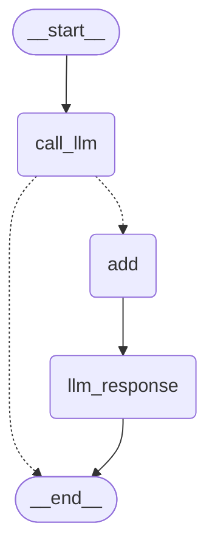

```mermaid
graph TD;
        __start__([<p>__start__</p>]):::first
        call_llm(call_llm)
        llm_response(llm_response)
        add(add)
        __end__([<p>__end__</p>]):::last
        __start__ --> call_llm;
        add --> llm_response;
        call_llm -.-> __end__;
        call_llm -.-> add;
        llm_response --> __end__;
```