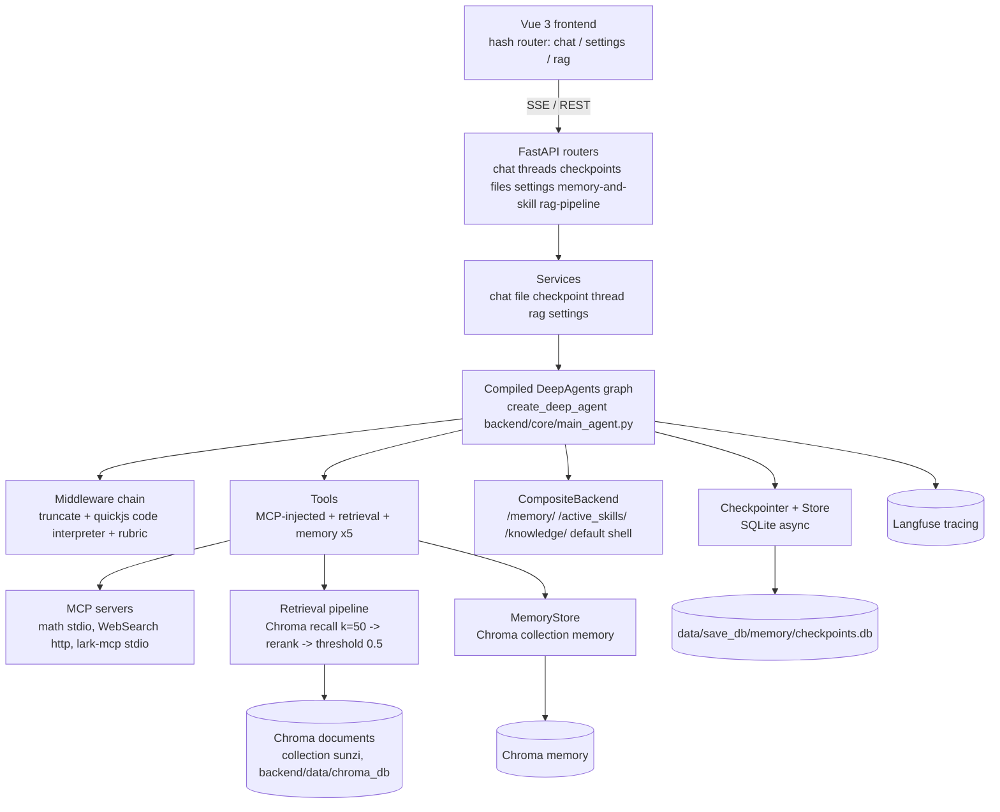

# System Architecture

Index RAG is a deep knowledge-retrieval agent ("深度智能体") built on **DeepAgents + LangGraph** with a **two-stage RAG** retrieval pipeline (Chroma vector recall + DashScope rerank), long-term memory, a runtime skills system, HITL interrupts (currently disabled in config), Loop Engineering rubric evaluation, and checkpoint-based conversation branching. It is a single-user, locally-run application (latest commit message: 单用户，本地, 2026-07-31).

## Component map

<!-- openwiki: mermaid parse failed and this diagram was converted to a text fence so it does not break rendering. Fix the diagram source and restore the mermaid fence. Parser error: Heuristic: an unescaped angle bracket inside a label breaks rendering; rephrase the label. -->

*System map: every request path funnels through one compiled agent graph; tools are injected via MCP at graph build time.*

## Runtimes

All runtimes share the same `init_graph()` async context manager from `backend/core/main_agent.py` (it compiles the graph and owns the SQLite connections):

| Runtime | Entrypoint | Transport |
|---|---|---|
| Web | `backend/main.py` (FastAPI) + `frontend/` (Vue 3, Vite) | REST + SSE |
| CLI | `backend/cli/interact.py` (`main()` via `python -m backend.cli.interact`) | terminal stdin/stdout |
| WeChat bot | `backend/wechat_bot.py` | wechatbot-sdk long polling |
| Desktop shell | `desktop/main.js` (Electron) spawns backend + frontend as subprocesses | local HTTP |

The graph itself is named `index_agent` and compiled with `recursion_limit=9999` (set inside the vendored DeepAgents `create_deep_agent` in `backend/core/subagent/rag_subagent/rag_factory.py`; the repo's `main_agent.py` passes the remaining configuration).

## Layered backend

1. **API layer** `backend/api/routers/` — 7 routers, Pydantic schemas, centralized error handling (`ErrorCode` enum + `AppException` in `backend/api/utils/exceptions.py`, global handlers in `error_handlers.py`).
2. **Service layer** `backend/api/services/` — chat, files, checkpoints, threads, RAG pipeline, settings, memory-and-skill file management. `graph.py` owns the compiled-graph singleton and hot reload.
3. **Agent core** `backend/core/` — `main_agent.py` (assembly), `models/model_factory.py` (LLM/embedding/rerank), `custom_middleware/` (model switcher, tool-message truncation), `prompts/system_prompt.txt`, `mcp/` (tool injection), `rag_tool/` (retrieval + memory tools), `skill_manager/`, `subagent/`.
4. **Data layer** — Chroma (documents + memory), SQLite (checkpoint + store), filesystem (knowledge-base, uploads, summarization), MCP servers.

## Data stores

| Store | Path (defaults from `.env.example` / `rag_config.yaml`) | Owned by |
|---|---|---|
| Chroma documents | `backend/data/chroma_db`, collection `sunzi` (from `backend/api/markdown_rag/rag_config.yaml`) | retrieval tool + RAG pipeline |
| Chroma memory | same persist dir, collection `memory` (`RAG_MEMORY_NAME`) | `MemoryStore` (5 memory tools) |
| SQLite checkpoints | `data/save_db/memory/checkpoints.db` (`CHECKPOINT_DB`) | `AsyncSqliteSaver` |
| SQLite store | `data/save_db/store/store.db` (`STORE_DB`) | `AsyncSqliteStore` (long-term store) |
| Knowledge base | `knowledge-base/` (Obsidian vault content, `DOC_INDEX`) | file service + `/knowledge/` backend route |
| Workspace/uploads | `knowledge-base/workspace`, `knowledge-base/uploads` | CLI/WeChat/file handlers |

Note: Chroma clients are opened **at import time** in `backend/core/rag_tool/retrieve_tool.py` (module-level `Chroma(...)`), so backend startup requires the Ollama embedding service (`http://localhost:11434`) to be reachable. There is no first-party test suite in the repo (see [operations](../operations.md) for validation strategy).

## Configuration & hot reload

- `model_config.yaml` (repo root) — active provider + per-provider model/base_url; read via `backend/core/models/llm_settings.py` (`reload_model_config()`).
- `backend/api/markdown_rag/rag_config.yaml` — RAG splitter + HNSW + collection settings (`reload_rag_config()`).
- `backend/core/mcp/mcp_server.json` — MCP server registry with `{VAR}` placeholder substitution.
- `backend/memory_skill/skill/subagents/scripts/subagents_config.py` — subagent definitions, hot-reloaded via `subagent_loader.load_subagents()`.
- `backend/core/skill_manager/skills_config.yaml` — enabled skills list.
- Rebuild endpoint: `POST /settings/rebuild` → `rebuild_graph()` re-runs `init_graph()` (see [backend overview](../backend/overview.md) and [config](../backend/config.md)).

## Observability

- **Langfuse** (repo runtime): initialized in `backend/config/observability.py`; the `CallbackHandler` is woven into every `graph.ainvoke`/`astream` call via `build_langfuse_config(thread_id, ...)`. This traces the *application's* agent runs.
- **LangSmith** (OpenWiki tool runtime): the scheduled `.github/workflows/openwiki-update.yml` workflow traces OpenWiki's own runs to LangSmith under project `openwiki`; that telemetry is analyzed in [runtime behavior](../runtime-behavior.md). The two observability backends are separate and must not be conflated.

## Scope boundaries / deferrals

- `knowledge-base/` is an Obsidian vault (`.obsidian/` present): user content, not code. Only the directory roles are documented here.
- `my-tools/` is a sibling, standalone LangGraph agent experiment not imported by `backend/` — see [my-tools](../my-tools.md).
- `view_db/view_sql.py` is a standalone Streamlit SQLite viewer — see [operations](../operations.md).
- `backend/api/scheduled_tasks/` exists but contains no tasks (only `__pycache__`).

## Related pages

- [Backend overview](../backend/overview.md) — composition root and graph lifecycle
- [Agent core](../backend/agent-core.md) — graph assembly, middleware, models
- [Tools](../backend/tools.md) — MCP injection and retrieval/memory tools
- [RAG pipeline](../backend/rag-pipeline.md) — ingestion
- [Frontend overview](../frontend/overview.md) — UI architecture
- [Runtime behavior](../runtime-behavior.md) — production runtime evidence
