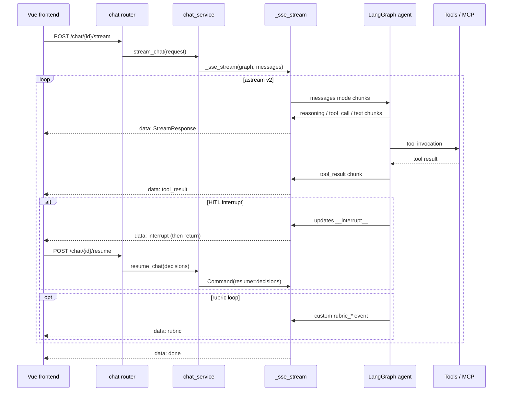

# Backend Chat Flow

## Service layer — `backend/api/services/chat_service.py`

Public entrypoints consumed by the chat router:

| Function | Behavior |
|---|---|
| `invoke_chat(chat_request, thread_id)` | `graph.ainvoke({"messages": ...})` with optional `checkpoint_id`/`checkpoint_ns`; adds Langfuse config; supports `rubric` input; returns `ChatResponse` |
| `stream_chat(chat_request, thread_id)` | delegates to the shared `_sse_stream(graph, input_data, thread_id, checkpoint_id, checkpoint_ns)` |
| `resume_chat(resume_request, thread_id)` | streams `Command(resume={"decisions": [...]})` into the graph — the HITL continuation |
| `invoke_chat_with_files` / `stream_chat_with_files` | attachment variants; build multimodal `content_blocks`, save extracted text to uploads asynchronously (`asyncio.create_task`) |

Message conversion: `dump_messages()` (in `backend/api/utils/dict2json.py`) normalizes client messages to LangChain objects; `langchain_result_to_response()` maps the final state back to `ChatResponse`.

## Two message-normalization paths (dict2json vs message2json)

The repository has **two independent converters** that render LangGraph state messages as API responses, and they deliberately differ:

| Aspect | `dict2json.langchain_result_to_response` | `message2json.message_to_response` |
|---|---|---|
| Used by | `chat_service.invoke_chat` (live one-shot chat response) | `thread_service.get_thread_history` (persisted thread history, per message) |
| Role strings | `human` / `ai` / `tool` | `user` / `assistant` / `tool` |
| Reasoning source | `msg.additional_kwargs["reasoning_content"]` only | `additional_kwargs` first, then `response_metadata["reasoning_content"]` fallback |
| LangChain message id | dropped (never passed to `MessageResponse`) | preserved (`id=getattr(msg, "id", None)`) |
| Content normalization | `_normalize_content`: single-text-block lists collapse to a string; lists containing non-text blocks (images) returned unchanged | `_extract_text_blocks`: **user messages keep only the first text block** (drops attachment content that would fill the page); other roles join blocks with `\n` |
| Role filtering | skips any type outside `human`/`ai`/`tool` (system silently dropped) | allowlist `{user, assistant, tool}` → returns `None` for others (system dropped) |
| Reasoning-only assistant | kept with `content=""` + `reason_content` | kept only when the assistant role and reasoning exists; otherwise `None` |

`message_to_response` is applied per message in `get_thread_history`, which then derives `head_checkpoint_id` from `state.config["configurable"]["checkpoint_id"]` (the branch head the frontend uses to restore `_leafCheckpointId` after refresh). Because the two converters differ, the live chat response and the persisted thread history can render differently for the same conversation (e.g. attachment blocks and reasoning text).

## Attachment handling — `_extract_and_build_content`

- Images (`.jpg/.jpeg/.png/.gif/.webp`): compressed by `compress_image()` (`backend/api/utils/file_handler.py`; max edge 1024 px, JPEG quality 75) then base64 data-URL `image_url` content blocks.
- `.pdf` → `pdfplumber` (`pdf_to_text`); `.docx` → `MarkItDown` singleton (`docx_to_text`). Extracted text is appended as `[附件 N: name]` text blocks and saved to `UPLOADS_DIR` as `.md` via `save_extracted_text()` (async, non-blocking).
- Unsupported extensions are skipped with a warning (chat) or rejected 400 in the router's `_read_upload_files` when outside `SUPPORTED_EXTENSIONS`.

## SSE stream processor — `backend/api/utils/stream.py`

`_sse_stream()` is the single streaming path for chat, resume, replay, and fork. It drives:

```python
graph.astream(input_data, config=config, version="v2",
              stream_mode=["messages", "checkpoints", "updates", "custom"],
              subgraphs=True)
```

and yields `data: <StreamResponse JSON>` lines. `StreamProcessor` classifies each chunk:

| SSE `type` | Source | Meaning |
|---|---|---|
| `reasoning` | AIMessageChunk `reasoning_content` | model chain-of-thought |
| `tool_call` | token tool_calls (incremental) | tool name + partial args JSON |
| `tool_result` | non-AI message content | tool output |
| `text` | token content (incl. multimodal) | answer text |
| `image` | extra push for `image_url` blocks | multimodal images |
| `checkpoint` | checkpoints mode | `checkpoint_id`, `parent_checkpoint_id`, `kind` input/leaf |
| `interrupt` | updates `__interrupt__` | HITL pause payload; stream **returns** after emitting |
| `rubric` | custom events starting `rubric_` | Loop Engineering evaluation events (with `iteration`) |
| `error` | exceptions | `error_code` + detail, `done=true` |
| `done` | end of stream | final event |

Checkpoint classification (`_handle_checkpoint_chunk`): `source == "input"` → `input` kind (retry/fork anchor, bound to the user message); `next == []` → `leaf` kind (branch-navigation anchor bound to the assistant message); otherwise ignored.

At stream end the processor also inspects the final state (`graph.aget_state`) and re-emits images from the last AI message (multimodal completion), then emits `done`.



*Chat request flow: one astream drives every SSE event family; interrupts and rubric loops are streamed as events, never as separate requests except HITL resume.*

## HITL resume semantics

The `interrupt_on` config in `main_agent.py` is currently **empty**, so no tool triggers an interrupt by default. When an interrupt does occur, the frontend receives `type=interrupt` and then calls `POST /chat/{thread_id}/resume` with `ResumeRequest.decisions` (`approve`/`reject`/`edit`; `edit` carries `edited_action`). The resume path streams a `Command` — LangGraph continues from the interrupt using the recorded decision for each pending tool call.

## Loop Engineering (rubric) semantics

`ChatRequest.rubric` (a free-text completion condition) is passed into the graph input as `{"messages": ..., "rubric": ...}`. The `RubricMiddleware` (see [agent core](agent-core.md)) runs an independent evaluator after the agent stops, and emits `custom` events named `rubric_*` which the SSE processor forwards as `type=rubric` (with `iteration`). Without `rubric`, the middleware is a no-op — plain chat is unchanged.

## Related pages

- [Agent core](agent-core.md) — the middleware chain that produces reasoning/tool/rubric behavior
- [API layer](api.md) — endpoint table and schemas
- [Frontend chat](../frontend/chat.md) — how the browser consumes these events
- [Checkpoints](checkpoints.md) — replay/fork reuse the same `_sse_stream`
