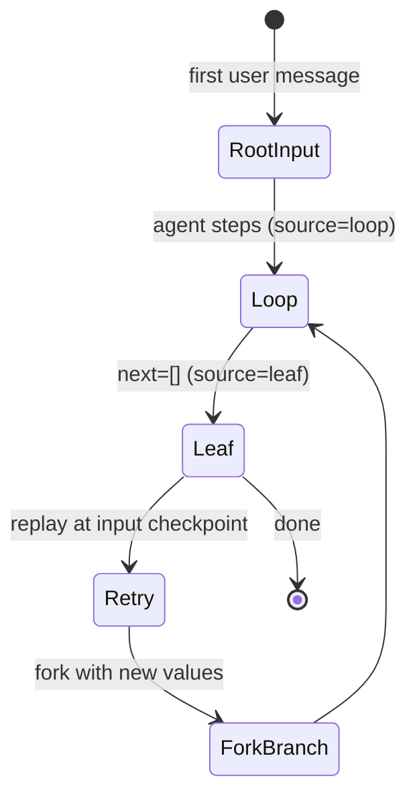

# Checkpoints and Threads

## Persistence model

Every conversation lives under a `thread_id`; the LangGraph graph is compiled with `AsyncSqliteSaver` (checkpointer) and `AsyncSqliteStore` (store) over two SQLite files (`CHECKPOINT_DB`, `STORE_DB`). Each user message creates an **input checkpoint** (`metadata.source == "input"`); intermediate steps create `loop` checkpoints; branches created by fork/replay create `fork` checkpoints. The frontend treats input checkpoints as retry/fork anchors and leaf checkpoints (`next == []`) as branch-navigation anchors — see [SSE checkpoint events](chat-flow.md) and [frontend checkpoints](../frontend/chat.md).

## Services — `backend/api/services/checkpoint_service.py`

### List input checkpoints — `list_input_checkpoints(thread_id, limit, offset)`

1. Walks `graph.aget_state_history(config)` collecting all snapshots.
2. Filters to `source in ("input", "fork")` (loop snapshots dropped).
3. Computes a leaf map with `_compute_leaf_for_inputs()`: builds `cid → snapshot` and `child → parent` indexes, then walks from each input checkpoint down the first-child chain until a node with no children — the resulting node is the input's leaf checkpoint.
4. Extracts `input_preview` (first human message text, ≤80 chars) and `trigger_message_id` from the checkpoint's first task result.
5. Returns `CheckpointHistoryResponse` with `CheckpointSummary` rows (config, next_nodes, input_preview, parent_checkpoint_id, source, leaf_checkpoint_id, trigger_message_id).

### Replay — `replay_from_checkpoint(thread_id, checkpoint_id, checkpoint_ns, messages)`

Resumes execution from a recorded checkpoint: nodes before it are cached and not re-run; interrupts still trigger; when `messages` is provided they are injected to force regeneration. Streams via `_sse_stream(graph, input_data, thread_id, checkpoint_id=...)`.

### Fork — `fork_from_checkpoint(thread_id, checkpoint_id, checkpoint_ns, values)`

Creates a **new branch** from the checkpoint by overriding state `values` (e.g. new messages); the original chain is preserved and the branch evolves independently. Also streamed via `_sse_stream`.

### Existence check — `_check_checkpoint_exists`

`graph.aget_state` with `checkpoint_id`; missing checkpoint → `NotFoundException(CHECKPOINT_NOT_FOUND)`.

## Thread service — `backend/api/services/thread_service.py`

- `get_thread_history(thread_id, checkpoint_id=None)` → runs **inside the graph lifecycle**: `graph.aget_state(config)` via `get_graph()` (with `checkpoint_id` returns that branch's messages for tree navigation); maps messages via `message_to_response()`; derives `head_checkpoint_id` from `state.config["configurable"]["checkpoint_id"]` (the branch head the frontend uses to restore `_leafCheckpointId` after refresh).
- `delete_thread_history(thread_id)` → **direct SQL outside the graph**: `backend/api/sql/dele_sql.py` `delete_thread_messages_history` opens its own `sqlite3.connect(CHECKPOINT_DB)`, runs `DELETE FROM checkpoints WHERE thread_id = ?` and `DELETE FROM writes WHERE thread_id = ?` (commit/rollback, then close). It never touches `AsyncSqliteSaver`, so it can delete rows the graph has open connections to.
- `list_threads()` → **direct SQL outside the graph**: `backend/api/sql/list_threads.py` `list_all_threads` opens its own `sqlite3` connection and runs `SELECT thread_id, COUNT(*) AS cnt FROM checkpoints GROUP BY thread_id ORDER BY MIN(rowid) DESC` — newest thread first by first-row insertion order, with per-thread message counts.

### Direct-SQL vs live-graph risk (WAL caveat)

The direct helpers above bypass LangGraph's `AsyncSqliteSaver`, which holds its own open connections to the same `CHECKPOINT_DB` while the app runs (see [backend overview](overview.md)). The system prompt's hard rules reflect this: the agent must clean `WAL`/`SHM`/`journal` lock files and fail fast on lock errors, must never bypass the CLI with custom scripts, and must never write to SQLite directly (see [agent core](agent-core.md)). The same reasoning applies to `dele_sql.py`/`list_threads.py`: running raw `sqlite3` against a DB the async saver has open can hit lock contention or read a mid-WAL state, so these endpoints are safe for diagnostics but should not be extended into concurrent writers while a stream is active.

## Branch navigation state machine

*Checkpoint lifecycle: input checkpoints anchor user turns; leaf checkpoints anchor branch heads; replay and fork create new branches from recorded states.*

## Validation

No automated tests. Exercise via the checkpoints endpoints against a real thread: send a message, `GET /checkpoints/{id}/inputs`, replay, fork, then `GET /chat/{id}/get-messages-history?checkpoint_id=...` to verify branch isolation. The SSE `checkpoint` events (input/leaf kinds) are emitted live during any chat stream.

## Related pages

- [Chat flow](chat-flow.md) — SSE checkpoint events and resume
- [API layer](api.md) — endpoint table
- [Frontend chat](../frontend/chat.md) — useCheckpoints and branch UI
