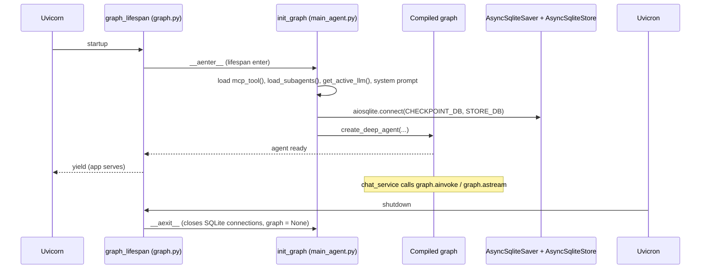

# Backend Overview — Composition Root and Graph Lifecycle

## Responsibilities

The backend is a FastAPI application that (1) exposes REST + SSE endpoints for chat, threads, checkpoints, files, settings, memory/skills, and RAG pipeline; (2) owns a single compiled DeepAgents graph (`index_agent`) built from config files at startup; and (3) persists conversation state to SQLite checkpoints and long-term state to a SQLite store. It is the only process that compiles the agent — the frontend, CLI, and WeChat bot all talk to the same graph instance (CLI/WeChat call `init_graph()` in-process; the web frontend goes through HTTP).

## Composition root — `backend/main.py`

Order of operations:

1. `setup_logging()` — creates `backend/logs/<date>/app.log` + per-run `run_<time>_<pid>.log` (see [config](config.md)).
2. `langfuse_init()` — validates the Langfuse connection if `LANGFUSE_TRACING_ENABLED` is truthy (default `true`); failures are logged, not fatal.
3. `app = FastAPI(lifespan=graph_lifespan)` — the graph is built inside the lifespan, not at import.
4. `register_exception_handlers(app)` — maps `AppException`/`ErrorCode` and framework errors to structured JSON.
5. CORS middleware — origins from `CORS_ORIGINS` env or defaults `http://localhost:5173,5174,3000`.
6. Registers 7 routers: `chat`, `threads`, `checkpoints`, `files`, `settings`, `memory_and_skill`, `rag_pipeline` (full endpoint tables in [API layer](api.md)).

## Graph lifecycle — `backend/api/services/graph.py`



*Graph lifecycle: everything is built inside the lifespan context; `rebuild_graph()` performs the same enter/exit cycle on demand.*

Key invariants:

- `graph.py` owns **two** module-level globals: `_graph` (the compiled agent) and `_agent_ctx` (the live `init_graph()` async-context object). `get_graph()` raises `RuntimeError("Graph 尚未初始化...")` if `_graph is None` — i.e. when called before the lifespan enters or after it exits. Both globals are only assigned inside `graph_lifespan`/`rebuild_graph`.
- `rebuild_graph()` (used by `POST /settings/rebuild` and automatically after `PUT /settings/skills`) calls `_agent_ctx.__aexit__` on the old context (closing the SQLite connections), re-enters `init_graph()` via `__aenter__`, and swaps both globals. Config files are re-read on every entry, which is the "hot reload" mechanism.
- SQLite connections are created with `check_same_thread=False` and passed to `AsyncSqliteSaver`/`AsyncSqliteStore`.

## Agent assembly — `backend/core/main_agent.py`

`init_graph()` builds the tool list and calls `create_deep_agent`:

```python
tools_list = [*mcp_tools, retriever_row_doc_tool,
              save_memory, delete_memory, search_memory, get_memory, list_memory_keys]
agent = create_deep_agent(
    name="index_agent",
    model=get_active_llm(),                 # from model_config.yaml, hot-reloaded
    system_prompt=load_system_prompt(),     # backend/core/prompts/system_prompt.txt
    tools=tools_list,
    interrupt_on=interrupt_on,              # EMPTY dict — HITL effectively disabled
    backend=backend,                        # CompositeBackend (see agent-core.md)
    middleware=add_middleware,              # truncate + quickjs + rubric
    memory=["/AGENT.md"],                   # memory rule file (empty file)
    skills=["/active_skills/"],             # filtered skills backend route
    context_schema=ModelContext,            # runtime model switching
    subagents=subagents_config,             # from subagents_config.py (currently fails to import)
    checkpointer=checkpointer_sql,
    store=store_sql,
)
```

Notable facts (source-grounded):

- `interrupt_on` is `{}` — every entry is commented out (`# "read_file": {"allowed_decisions": ["approve", "reject", "edit"]}`), so `HumanInTheLoopMiddleware(interrupt_on={})` never interrupts. The HITL UI plumbing still exists (see [chat flow](chat-flow.md)) but no tool triggers it by default.
- `memory_config = ["/AGENT.md"]` points at `backend/memory_skill/memory/AGENT.md`, which is **empty** (0 bytes) — the agent loads it but gets no memory rules from it.
- Subagent loading: `load_subagents()` catches exceptions and returns `[]` on failure; `subagents_config.py` currently imports a nonexistent module, so the agent effectively runs with **zero subagents** (details in [subagents](subagents.md)).
- The DeepAgents layer appends its own `FilesystemMiddleware` and BASE_AGENT_PROMPT around the configured pieces; `recursion_limit` is set to 9999 by the vendored `create_deep_agent`.

## Layered structure

| Layer | Location | Owns |
|---|---|---|
| Routers | `backend/api/routers/` | HTTP mapping + validation |
| Services | `backend/api/services/` | orchestration (chat, files, checkpoints, threads, rag, settings) |
| Agent core | `backend/core/` | graph assembly, models, middleware, prompts, tools, skills, subagents |
| Utilities | `backend/api/utils/` | SSE stream processor, error handling, file extraction, message conversion |
| Data | Chroma / SQLite / filesystem / MCP | persistence and external tools |

## Related pages

- [API layer](api.md) — endpoint tables and schemas
- [Agent core](agent-core.md) — assembly details, middleware chain, model factory
- [Config](config.md) — env/file configuration and known setup gaps
- [Chat flow](chat-flow.md) — how a request reaches the graph and streams back
