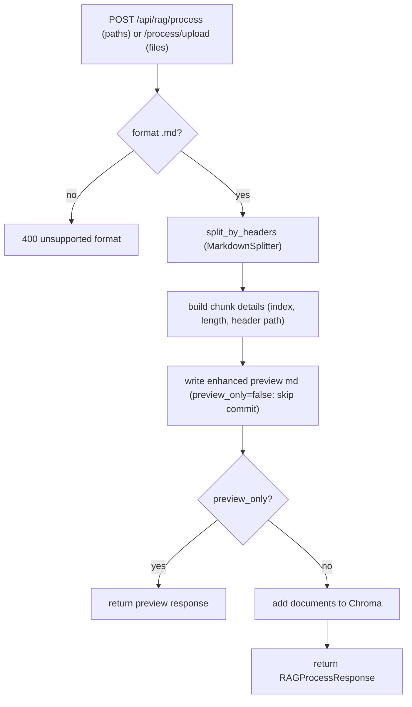

# RAG Pipeline

## Two pipeline halves

The repository has two related but distinct Chroma pipelines:

1. **Ingestion** (this page): `backend/api/markdown_rag/` + `backend/api/services/rag_service.py` — the documented "preview → confirm" ingestion path driven by the frontend RAG page and the `/api/rag/*` endpoints.
2. **Retrieval at runtime**: `backend/core/rag_tool/retrieve_tool.py` — the agent's `retriever_row_doc_tool` (see [tools](tools.md)). Both read the same `rag_config.yaml` collection (`sunzi`) and persist dir (`backend/data/chroma_db`).

`backend/rag_pipeline/` additionally holds standalone tools: `clean_file.py` (Markdown cleaner: strips HTML tags, link URLs, code-block decorations, `[!code ...]` comments; compresses newlines) and `pdf-load.py`; their `vectorstore/raw` and `vectorstore/cleaned` directories are staging areas for docs.

## Ingestion flow — `rag_service.py`

Entry functions: `process_files_by_path(file_paths, preview_dir, preview_only)` (local-path mode, reads `.md` from disk) and `process_uploaded_files(files, preview_dir, preview_only)` (multipart mode); both build `(filename, md_text, file_size)` items and delegate to the shared `_process_batch` → `_process_one_file` pipeline. `_process_one_file` enforces the `.md`-only extension check, splits, builds chunk details, writes the enhanced preview (unless `preview_only`, which also skips the Chroma `add_documents` commit).

*Ingestion: preview and commit are the same pipeline, distinguished only by `preview_only`.*

- `MarkdownSplitter` (`backend/api/markdown_rag/save_VectorStore.py`): level 1 = `ExperimentalMarkdownSyntaxTextSplitter` on `#`/`##`/`###` headers; level 2 (only when `enable_char_split=true`) = `RecursiveCharacterTextSplitter(chunk_size=1000, overlap=200, separators ["\n\n","\n","。","，"," ",""])`. A fresh `MarkdownSplitter()` is constructed per batch, so splitter changes from `rag_config.yaml` apply to the next ingestion.
- `_extract_header_path` reconstructs a breadcrumb like `# 概述 > ## 背景` from `Header N` metadata for preview display.
- `_build_chunk_details` sets `is_char_split = bool(RAG_ENABLE_CHAR_SPLIT and len(content) <= RAG_CHUNK_SIZE)` — note the **inverted semantics**: the char splitter only re-splits chunks *longer* than `chunk_size`, and no metadata marks the fragments it produced, so this flag actually fires on every small chunk (including ones that never passed through the char splitter) and is therefore not a reliable indicator that a chunk came from level-2 splitting.
- `_write_enhanced_preview` writes `preview/<name>_chunks_preview.md` (used by the `/rag` frontend tab and by `preview/1-计篇_chunks_preview.md` in the repo root).
- `VectorStoreCreator` builds `Chroma(collection_name, embedding_function=OllamaEmbeddings(model, base_url), persist_directory, collection_configuration={"hnsw": dict(RAG_HNSW_CONFIG)})`. The vectorstore is a module-level singleton in `rag_service` (`_get_vectorstore()`).
- `delete_documents(ids)` removes docs by ID from the singleton store.

## Config management

- `GET /api/rag/config` returns the loaded `rag_config.yaml` (deep copy); `PUT /api/rag/config` overwrites the file and calls `reload_rag_config()` so the *splitter and module-level settings* for subsequent ingestions change without a restart. Caveat: `reload_rag_config()` does **not** invalidate the existing `_vectorstore` singleton — the already-open `Chroma` client keeps its original collection configuration and embedding function, so HNSW/collection-name changes require a process restart to affect the store.
- Health: `GET /api/rag/health` (`health_check()`) verifies the collection exists and reports doc count, embed model/url, persist dir; the frontend health panel polls it every 10 s.

## Independent Chroma clients

Three module-level clients target the same `RAG_COLLECTION_NAME`/`RAG_PERSIST_DIR` from `rag_setting`, but are separately initialized and do not share a handle:

1. `rag_service._get_vectorstore()` — the ingestion singleton (`VectorStoreCreator`), created lazily on first process request.
2. `backend/core/rag_tool/retrieve_tool.py` — the agent's runtime `retriever_row_doc_tool` initializes its own `Chroma` at module import time (embedding function = `model_factory.embeddings`).
3. `backend/core/mcp/retrieve_tool.py` — an **orphaned duplicate** (FastMCP variant with its own module-level Chroma) that is never imported by any module (`rg` finds no `backend.core.mcp.retrieve_tool` import; the agent imports `core.rag_tool.retrieve_tool` via `backend/core/rag_tool/__init__.py`).

`save_VectorStore.py` doubles as a **CLI entry**: `python save_VectorStore.py <file1> [file2 ...]` (its `__main__` block) POSTs `{"files": [...], "preview_only": false}` to `RAG_API_URL` (default `http://localhost:8000/api/rag/process`) via `urllib` — i.e. it drives ingestion through the running FastAPI service rather than calling `rag_service` in-process.

## Collection browsing (ChromaDB admin)

- `GET /api/rag/collections` — list collections (`list_collections`).
- `GET /api/rag/collection/{name}/stats?sample_limit=` — count, non-empty rate, average content length, vector dimension, metadata coverage (sampled).
- `GET /api/rag/collection/{name}/documents?page=&page_size=` — paginated docs (id/content/metadata).
- `POST /api/rag/collection/{name}/delete-docs` — batch delete; `POST /api/rag/collection/{name}/clear` — wipe collection; `DELETE /api/rag/collection/{name}` — drop collection.

These are the surfaces used by the frontend RAG management tabs (browse/process/config/health) — see [frontend rag](../frontend/rag.md).

## Configuration file (`rag_config.yaml`)

| Key | Default in repo | Effect |
|---|---|---|
| `embedding.model/base_url` | `my-qwen3-embed:latest` / localhost:11434 | ingestion + retrieval embeddings (Ollama must be running) |
| `rag.splitter.headers` | `#`,`##`,`###` | header levels |
| `rag.splitter.chunk_size/chunk_overlap` | 1000 / 200 | char-level split |
| `rag.splitter.enable_char_split` | false | level-2 splitting |
| `rag.hnsw.*` | cosine, ef 200, neighbors 32, ef_search 200 | Chroma index |
| `rag.processing.preview_output_dir` | `preview` | preview file location |
| `rag.collection.name` | `sunzi` | document collection |
| `rag.collection.persist_directory` | `backend/data/chroma_db` | Chroma persist dir (shared with memory collection) |

## Validation

No automated tests exist for this pipeline. The narrowest manual validation is `POST /api/rag/process` with `preview_only=true` on a small `.md`, then inspect the response `chunks` and the generated preview file; retrieval can be exercised by invoking the agent in [CLI](../backend/cli.md) and reading the two-stage timing logs (`[步骤1/2] 向量检索`, `[步骤2/2] 重排序+过滤`) in `backend/logs/<date>/app.log`.

## Related pages

- [Tools](tools.md) — the runtime retrieval tool consuming this store
- [Frontend RAG](../frontend/rag.md) — the management UI
- [Config](config.md) — env keys vs rag_config.yaml ownership
